---

sidebar_position: 1
title: "Visual Guides & Maps"
description: "Visual relationship maps, reading guides, and cross-cutting views to help navigate the ecosystem"
tags: [guide, reference, index]
custom_status: active
custom_owner: Andrew Leo
custom_last_review: 2026-03-01
custom_next_review: 2026-06-01
---

# Visual Guides & Maps

The AINEFF Ecosystem spans 88+ documentation pages across 8 sections, covering everything from constitutional philosophy to day-by-day execution plans. This guides section provides **visual relationship maps, reading paths, and cross-cutting views** that help you see the complete picture -- not just individual pieces.

---

## Why This Section Exists

Each documentation section answers a specific question:

| Section | Question Answered |
|---|---|
| **Vision** | Why does this exist? |
| **Blueprint** | How is it structured? |
| **Entities** | What are the pieces? |
| **Systems** | What mechanisms make it work? |
| **Products** | What does it sell? |
| **Execution** | How does it get built? |
| **Architecture** | How is it engineered? |
| **Knowledge** | What does it think with? |

But none of these sections answer the **cross-cutting questions**:

- How do all 8 entities relate to all 74 systems relate to all 25+ products?
- Where should I start reading if I am an investor? A regulator? A technical architect?
- What does the complete timeline look like when you merge all the timelines?
- How do decisions actually flow through the ecosystem?
- Where did each documentation page come from?

This section answers those questions.

---

## Guide Directory

| Guide | Purpose | Best For |
|---|---|---|
| [Complete Ecosystem Map](./ecosystem-map) | Master visual guide showing how everything connects -- entities, data flow, money flow, talent flow, governance flow, and technology stack | Anyone who wants to see the big picture in one place |
| [Reading Guide -- Where to Start](./reading-guide) | Guided reading paths for 8 different audiences, from investors to technical architects | First-time readers who need a structured path through 88+ pages |
| [Decision Trees & Flowcharts](./decision-trees) | Key decision trees visualized as flowcharts -- what to build, what to kill, which market to enter, which product to offer | Operators and founders making recurring strategic decisions |
| [Master Timeline & Milestones](./timeline) | Every timeline in the ecosystem merged into one master view, from Day 1 through Year 20 | Anyone planning execution or evaluating progress |
| [Visual Glossary](./glossary-visual) | Visual companion to the text glossary -- relationship diagrams for entities, systems, products, and revenue streams | Readers who think visually and want to see how concepts connect |
| [Source Document Map](./source-map) | Maps every documentation page back to its original source documents | Anyone who wants to trace a claim back to its source material |
| [Escalation & Authority Matrix](./escalation-matrix) | Visual reference showing decision authority limits by role and operator stage -- spending, technical, client, and governance decisions | Operators who need to know whether they can decide, must escalate, or must not touch a decision |
| [Incident Classification & Response Matrix](./incident-classification) | Quick-reference for classifying incidents by type and severity, with SOP activation, role activation, and response timelines | Anyone responding to an incident who needs to know what to do and who to notify |
| [Role-Based SOP Navigation Guide](./role-sop-navigator) | Maps each operator stage to the SOPs they must master, with graduation criteria and learning paths | New operators who need to know exactly which playbooks apply to them |
| [System Integration Topology Map](./integration-topology) | Visual maps of how all AINEFF systems connect -- data flows, dependency maps, failure propagation, and monitoring points | Technical operators and architects who need to understand system connections and failure paths |
| [Operator Capability Maturity Checklist](./capability-maturity) | Comprehensive checklists for each stage with assessment rubrics, self-assessment templates, and peer validation requirements | Operators preparing for stage progression and mentors assessing readiness |

---

## How to Use These Guides

1. **Start with the [Reading Guide](./reading-guide)** to find your recommended reading path based on your role and goals.
2. **Reference the [Ecosystem Map](./ecosystem-map)** whenever you need to understand how a concept you are reading about connects to the rest of the system.
3. **Use the [Decision Trees](./decision-trees)** when you face a recurring decision that the ecosystem has already formalized.
4. **Check the [Timeline](./timeline)** to understand when things happen and how different timelines interleave.
5. **Consult the [Visual Glossary](./glossary-visual)** when you want to see relationships that the text glossary only describes.
6. **Reference the [Source Map](./source-map)** when you need to verify a claim or understand the provenance of a documentation page.
7. **Check the [Escalation Matrix](./escalation-matrix)** before any decision to confirm whether you can act, must escalate, or must not touch it.
8. **Use the [Incident Classification](./incident-classification)** matrix the moment an incident is detected to determine the right SOP and response protocol.
9. **Follow the [Role-Based SOP Navigator](./role-sop-navigator)** to build your SOP knowledge systematically as you progress through operator stages.
10. **Review the [Integration Topology](./integration-topology)** when you need to understand system dependencies, data flows, or failure propagation paths.
11. **Complete the [Capability Maturity Checklist](./capability-maturity)** quarterly for self-assessment and before requesting stage progression.

---

## Relationship to Other Sections

These guides do not introduce new concepts. They **re-present existing concepts** in visual, cross-cutting formats that reveal connections invisible when reading individual pages sequentially. Every diagram, table, and flowchart in this section references content that lives in one of the eight primary documentation sections.

```mermaid
graph TB
    subgraph PRIMARY["Primary Documentation"]
        V["Vision"]
        B["Blueprint"]
        E["Entities"]
        S["Systems"]
        P["Products"]
        X["Execution"]
        A["Architecture"]
        K["Knowledge"]
    end

    subgraph GUIDES["Visual Guides (This Section)"]
        MAP["Ecosystem Map"]
        RG["Reading Guide"]
        DT["Decision Trees"]
        TL["Timeline"]
        VG["Visual Glossary"]
        SM["Source Map"]
        EM["Escalation Matrix"]
        IC["Incident Classification"]
        RSN["Role-SOP Navigator"]
        IT["Integration Topology"]
        CMC["Capability Maturity"]
    end

    V & B & E & S & P & X & A & K -->|"cross-cutting views"| MAP
    V & B & E & S & P & X & A & K -->|"reading paths"| RG
    X & P & S -->|"decision logic"| DT
    X & P -->|"merged timelines"| TL
    E & S & P -->|"relationship diagrams"| VG
    V & B & E & S & P & X & A & K -->|"provenance tracking"| SM
    X & S -->|"authority mapping"| EM
    X & S -->|"incident routing"| IC
    X & K -->|"SOP mapping"| RSN
    A & S -->|"system connections"| IT
    X & K -->|"competency assessment"| CMC

    style PRIMARY fill:#1a1a2e,stroke:#4a9aba,color:#fff
    style GUIDES fill:#1a2e1a,stroke:#4aba6a,color:#fff
```

