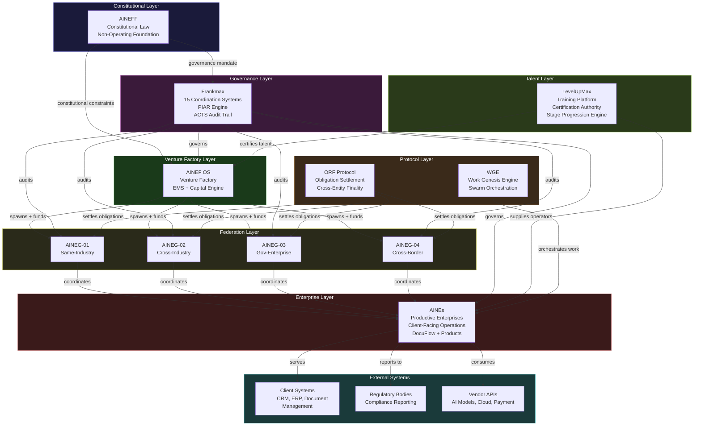
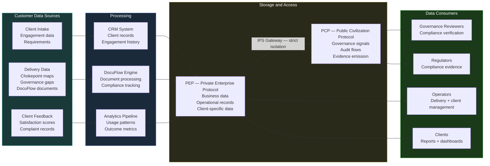
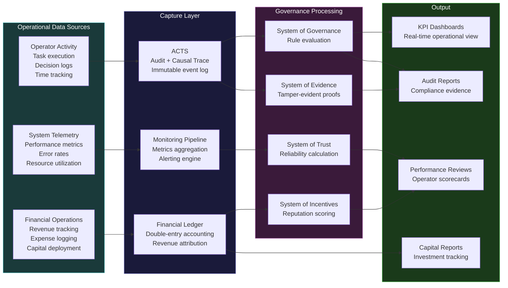
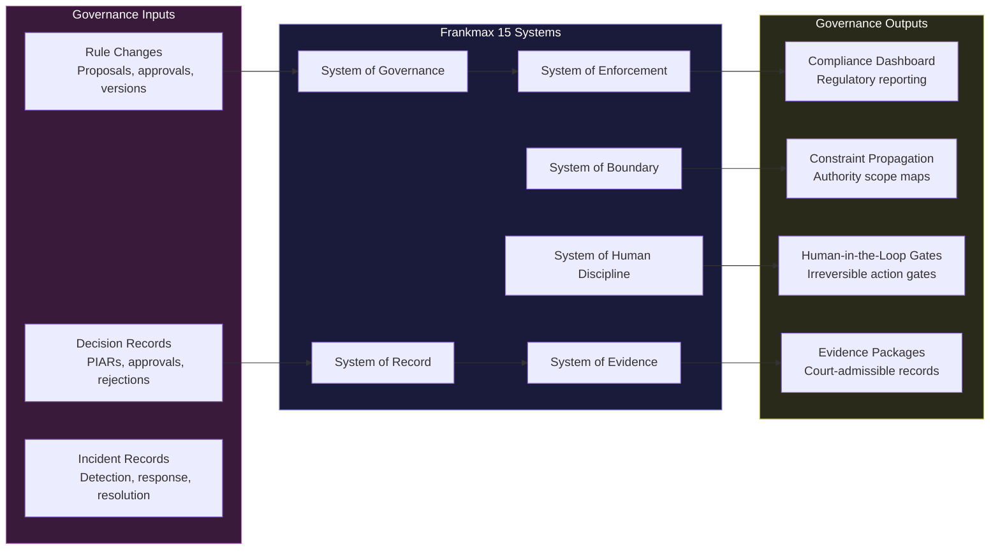
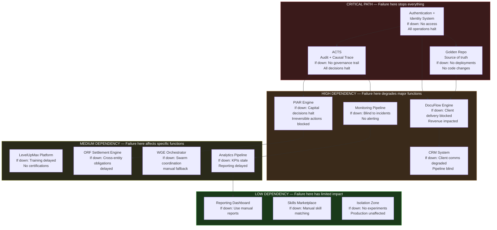
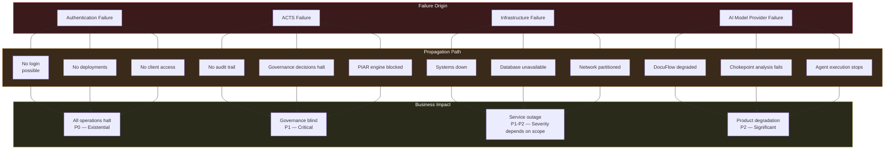
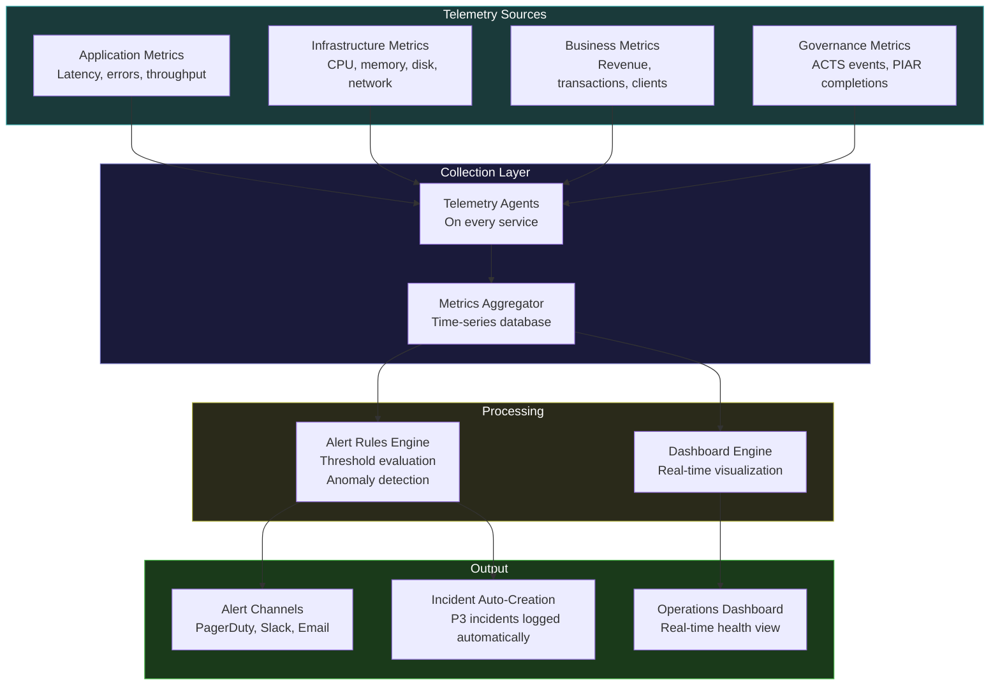
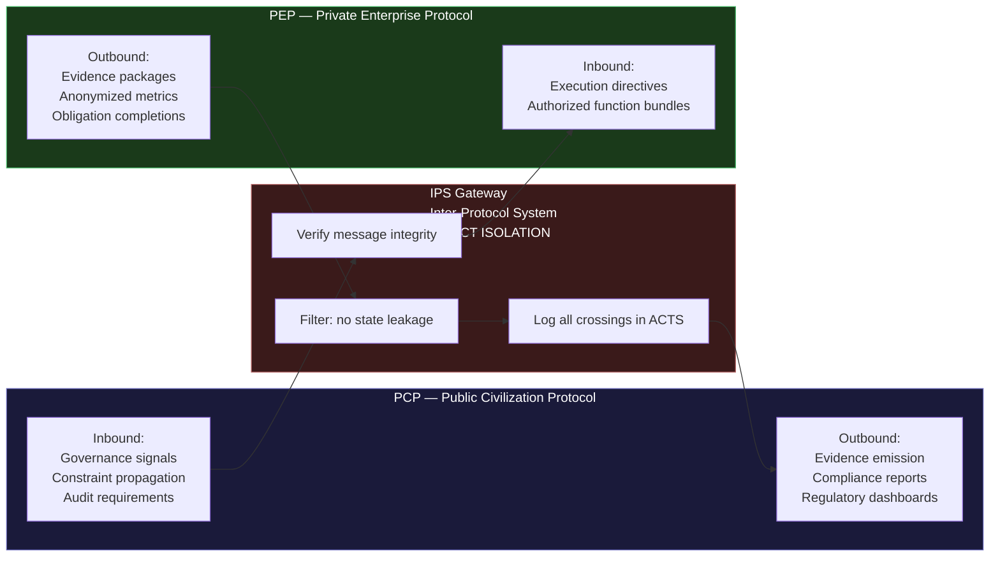

# System Integration Topology Map

This reference document provides visual maps of **how all AINEFF Ecosystem systems connect**. Use it to understand data flow paths, identify critical dependencies, trace failure propagation, and locate integration health monitoring points.

---

## 1. High-Level System Topology

The complete system landscape showing all 8 entity types and their primary integration paths.

---

## 2. Data Flow Diagram

How the four categories of data move through the ecosystem -- from source to consumer.

### 2a. Customer Data Flow

### 2b. Operational Data Flow

### 2c. Governance Data Flow

---

## 3. Critical Path Dependency Map

This diagram shows which systems are **single points of failure** and which dependencies are critical path.

### Dependency Table

| System | Depends On | Depended On By | Single Point of Failure? | Redundancy Strategy |
|---|---|---|---|---|
| ACTS (Audit Trace) | Authentication | PIAR, Monitoring, all governance systems | Yes | Multi-region replication, append-only store |
| Golden Repo | Authentication | All deployments, DocuFlow | Yes | Git mirroring, offline backup |
| Authentication | Infrastructure | Everything | Yes | Multi-provider, failover, cached tokens |
| PIAR Engine | ACTS, Authentication | Capital decisions, governance reviews | No (manual fallback) | Manual PIAR process documented |
| DocuFlow | Golden Repo, Authentication | Client delivery, revenue | No (manual fallback) | Manual document processing SOP |
| CRM | Authentication | Client communications, pipeline | No (manual fallback) | Spreadsheet fallback, export schedule |
| Monitoring | ACTS, Infrastructure | Alerting, incident detection | No (manual checks) | Multiple monitoring layers, external pings |

---

## 4. Failure Propagation Paths

When a system fails, failures can propagate through connected systems. This diagram shows the most dangerous propagation paths.

### Failure Containment Mechanisms

| Failure Type | Containment Mechanism | Activation | Recovery Time Target |
|---|---|---|---|
| Authentication failure | Cached token fallback, multi-provider failover | Automatic | &lt; 5 minutes |
| ACTS failure | Write-ahead log, local buffer, async replication | Automatic | &lt; 15 minutes |
| Infrastructure failure | Multi-region failover, auto-scaling, health checks | Automatic | &lt; 10 minutes |
| AI model provider failure | UMAL abstraction layer, provider fallback chain | Automatic | &lt; 5 minutes (warm standby) |
| Database failure | Read replicas, automatic failover, point-in-time recovery | Automatic | &lt; 15 minutes |
| Network partition | Circuit breaker pattern, graceful degradation | Automatic | Duration of partition |
| Single AINE failure | Failure Contagion Firewall, entity isolation | Automatic | Contained -- no propagation |
| Cross-entity contagion | AINEG-level firewall, federation isolation | Automatic trigger, manual escalation | &lt; 30 minutes containment |

---

## 5. Integration Health Monitoring Points

Where to monitor integration health across the ecosystem.

| Integration Point | What to Monitor | Alert Threshold | Check Frequency |
|---|---|---|---|
| AINEFF &rarr; AINEF (constitutional constraints) | Constraint propagation latency | &gt; 5 seconds | Every 60 seconds |
| AINEF &rarr; AINEGs (funding + coordination) | Capital allocation pipeline health | Any queue backlog &gt; 1 hour | Every 5 minutes |
| AINEGs &rarr; AINEs (coordination signals) | Signal delivery latency | &gt; 10 seconds | Every 30 seconds |
| Frankmax &rarr; All entities (governance) | ACTS write throughput | &lt; 99.9% success rate | Continuous |
| LevelUpMax &rarr; AINEs (talent supply) | Certification pipeline status | Any blocked certification &gt; 48 hours | Every hour |
| ORF &rarr; AINEGs (obligation settlement) | Settlement finality latency | &gt; 30 seconds | Every 60 seconds |
| WGE &rarr; AINEs (work orchestration) | Task queue depth + processing rate | Queue depth &gt; 100 or processing &lt; 90% | Every 30 seconds |
| AINEs &rarr; Clients (service delivery) | API availability + response time | Availability &lt; 99.5% or P99 &gt; 2 seconds | Every 30 seconds |
| AINEs &rarr; Vendors (external APIs) | Vendor API availability | Availability &lt; 99% | Every 60 seconds |
| PEP &harr; PCP (IPS Gateway) | Gateway throughput + integrity verification | Any integrity failure | Continuous |
| Golden Repo &rarr; CI/CD | Pipeline success rate | &lt; 95% success rate | Per deployment |
| Monitoring &rarr; Alerting | Alert delivery latency | &gt; 60 seconds | Every 30 seconds |

### Monitoring Architecture

---

## 6. Protocol Boundary: PCP / PEP Isolation

The most critical architectural boundary in the ecosystem is the isolation between the Public Civilization Protocol (PCP) and Private Enterprise Protocol (PEP).

### IPS Gateway Rules

| Rule | Enforcement |
|---|---|
| No raw business data crosses from PEP to PCP | Automated filtering at IPS Gateway |
| No PCP governance data is modified by PEP systems | Read-only access, cryptographic verification |
| Every crossing is logged in ACTS | Automated, immutable |
| Gateway failure defaults to closed (no crossings) | Fail-closed design |
| Gateway throughput is monitored continuously | Alert if &lt; 99.99% availability |

---

## Related Documents

- [Deployment SOP](/docs/processes/deployment-sop) -- Deployment pipeline and architecture zones
- [Incident Response SOP](/docs/processes/incident-response-sop) -- Response protocols for system failures
- [Complete Ecosystem Map](/docs/guides/ecosystem-map) -- Entity relationships and data flow diagrams
- [Architecture Overview](/docs/architecture/) -- Technical architecture documentation
- [Protocol Architecture](/docs/architecture/protocol-architecture) -- PCP / PEP protocol design
