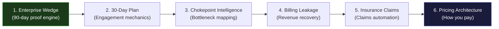
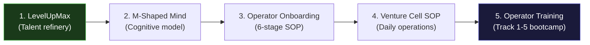
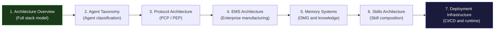
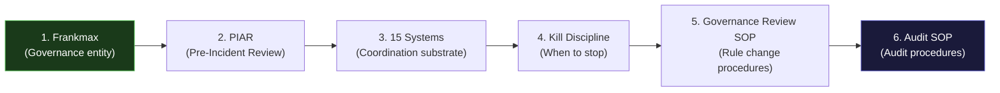
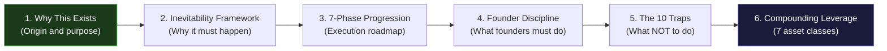

```mermaid
flowchart LR
    R1["1. Regulator Brief
    (Executive summary)"] --> R2["2. Atomic Constraint
    (Core principle)"]
    R2 --> R3["3. Core DNA
    (18 principles)"]
    R3 --> R4["4. AINEFF
    (Constitutional layer)"]
    R4 --> R5["5. Anti-ASI Clause
    (Power concentration limits)"]
    R5 --> R6["6. Audit & Evidence
    (Evidence architecture)"]
    R6 --> R7["7. External Oversight
    (Regulator interfaces)"]

    style R1 fill:#1a3a1a,stroke:#4aba4a,color:#fff
    style R7 fill:#1a1a3a,stroke:#4a4aba,color:#fff
```

---

sidebar_position: 3
title: "Reading Guide — Where to Start"
description: "Guided reading paths for 8 different audiences — investors, regulators, enterprise buyers, operators, technical architects, governance professionals, founders, and full deep-dive readers."
tags: [guide, reference]
custom_status: active
custom_owner: Andrew Leo
custom_last_review: 2026-03-01
custom_next_review: 2026-06-01
---

# Reading Guide -- Where to Start

The AINEFF Ecosystem documentation spans **88+ pages** across 8 sections. Reading everything sequentially would take days. This guide provides **purpose-built reading paths** for 8 different audiences, each designed to give you the information you need in the order that makes the most sense.

---

## How to Use This Guide

1. Find your audience profile below
2. Follow the numbered reading path in order
3. Each step links to a specific page with a note on what to focus on
4. Optional pages are marked with "(Optional)" -- read them if you want deeper context
5. Estimated reading time is provided for each path

---

## Path 1: Investor

**Goal:** Understand the vision, validate the financial thesis, evaluate the business model.

**Estimated reading time:** 2-3 hours

| Step | Page | Focus On |
|---|---|---|
| 1 | [The Grand Vision](/docs/vision/) | The TCP/IP analogy, terrain test, three phases of evolution |
| 2 | [Centi-Trillion Thesis](/docs/vision/centi-trillion-thesis) | $1T cumulative obligations target, GDP-scale infrastructure argument |
| 3 | [Financial Model](/docs/execution/financial-model) | 3-year revenue projections, margin analysis, break-even timeline |
| 4 | [Revenue Streams](/docs/products/revenue-streams) | Full catalog of 25+ revenue streams with pricing and confidence scores |
| 5 | [Unit Economics](/docs/products/unit-economics) | Venture cell economics, operator leverage model, CLV waterfall |
| 6 | [Capital Strategy](/docs/execution/capital-strategy) | Bootstrapped start, funding stages, capital allocation principles |
| 7 | [7-Phase Progression](/docs/execution/7-phases) | Phase gates, kill triggers, success probabilities per phase |
| 8 | [Compounding Leverage](/docs/execution/compounding-leverage) | 7 compounding asset classes, infrastructure activation timeline |
| (Optional) | [Deployment & Rollout](/docs/execution/deployment-sequencing) | Country rollout order, Big-4 disruption timeline |
| (Optional) | [Risk Register](/docs/execution/risk-register) | Categorized risk assessment |

---

## Path 2: Regulator

**Goal:** Understand governance architecture, accountability mechanisms, and compliance infrastructure.

**Estimated reading time:** 3-4 hours

| Step | Page | Focus On |
|---|---|---|
| 1 | [Regulator Brief](/docs/entities/regulator-brief) | Executive summary designed for regulatory audiences |
| 2 | [Atomic Constraint](/docs/vision/atomic-constraint) | "Every obligation must have a traceable, finite, non-deferrable human accountability endpoint" |
| 3 | [Core DNA](/docs/vision/core-dna) | 18 non-negotiable principles governing all ecosystem behavior |
| 4 | [AINEFF](/docs/entities/aineff) | Constitutional law layer, 9 framework components, Anti-ASI clause |
| 5 | [AINEFF -- Anti-ASI detail](/docs/entities/aineff#the-anti-asi-clause--in-detail) | Decision authority, information access, and resource control limits |
| 6 | [Audit & Evidence Architecture](/docs/architecture/audit-evidence) | ACTS, evidence standards, tamper-evident logs, chain of custody |
| 7 | [External Oversight Systems](/docs/systems/external-oversight) | Court verification, regulatory review, insurance pricing, public transparency |
| (Optional) | [15 Systems of Coordination](/docs/blueprint/15-systems-coordination) | Complete governance substrate including enforcement and legibility |
| (Optional) | [Governance Enforcement Architecture](/docs/architecture/governance-enforcement) | Technical enforcement mechanisms |

---

## Path 3: Enterprise Buyer (COO/CFO)

**Goal:** Understand what the ecosystem sells, how it delivers value, and what engagement looks like.

**Estimated reading time:** 1.5-2 hours

| Step | Page | Focus On |
|---|---|---|
| 1 | [Enterprise Wedge Strategy](/docs/products/enterprise-wedge) | 90-day corporate proof engine, diagnostic-to-deployment path |
| 2 | [30-Day Action Plan](/docs/execution/30-day-plan) | Week-by-week engagement mechanics and deliverables |
| 3 | [Chokepoint Intelligence Map](/docs/products/offerings/chokepoint-intelligence) | Workflow visualization, bottleneck costing, 5-10 day delivery |
| 4 | [Billing Leakage Scanner](/docs/products/offerings/billing-leakage) | Invoice analysis, undercharge detection, revenue recovery |
| 5 | [Insurance Claims Automation](/docs/products/offerings/insurance-claims) | AI claims automation sprint, turnaround improvement |
| 6 | [Pricing Architecture](/docs/products/pricing-architecture) | Cross-product pricing strategy, upsell mechanics |
| (Optional) | [6 Market Wedges](/docs/products/market-wedges) | Vertical-specific analysis for your industry |
| (Optional) | [Governance Gap Analyzer](/docs/products/offerings/governance-gap) | Free 5-question governance maturity assessment |

---

## Path 4: Operator / Talent

**Goal:** Understand what being an operator means, how to develop, and where you fit.

**Estimated reading time:** 2-3 hours

| Step | Page | Focus On |
|---|---|---|
| 1 | [LevelUpMax](/docs/entities/levelupmax) | Talent refinery model, 6-stage progression, certification authority |
| 2 | [The M-Shaped Mind](/docs/knowledge/m-shaped-mind) | Governance breadth + deep execution spikes cognitive architecture |
| 3 | [Operator Onboarding SOP](/docs/processes/operator-onboarding-sop) | Application through capital allocation authority, 6-24 month progression |
| 4 | [Venture Cell Operations SOP](/docs/processes/venture-cell-sop) | Daily, weekly, monthly, quarterly rhythms for running a venture cell |
| 5 | [Operator Training & Certification](/docs/products/offerings/operator-track) | Track 1-5 bootcamp and certification paths |
| (Optional) | [E2E Human Progression Model](/docs/knowledge/e2e-human-progression) | 16-phase developmental model from ignorance to institutional permanence |
| (Optional) | [Learning Domain Categories](/docs/knowledge/learning-categories) | Complete taxonomy of learning domains |
| (Optional) | [Thinking Tools](/docs/knowledge/thinking-tools) | 60+ thinking tools inventory |

---

## Path 5: Technical Architect

**Goal:** Understand the complete technical architecture from protocols to deployment.

**Estimated reading time:** 4-6 hours

| Step | Page | Focus On |
|---|---|---|
| 1 | [Architecture Overview](/docs/architecture/) | Full-stack layer model (L1-L8), cross-cutting systems, constraint flow |
| 2 | [Agent Taxonomy](/docs/architecture/agent-taxonomy) | Agent classification, lifecycle, capability model |
| 3 | [Protocol Architecture](/docs/architecture/protocol-architecture) | PCP vs PEP, IPS boundary, protocol isolation |
| 4 | [EMS Architecture](/docs/architecture/ems-architecture) | Enterprise Manufacturing System, genome validation, assembly pipeline |
| 5 | [Memory Systems](/docs/architecture/memory-systems) | OMG, knowledge graphs, memory persistence, decay |
| 6 | [Skills Architecture](/docs/architecture/skills-architecture) | Primitive/Capability/Composite roles, skill composition, marketplace |
| 7 | [Deployment Infrastructure](/docs/architecture/deployment-infrastructure) | CI/CD, canary deployment, infrastructure provisioning |
| (Optional) | [Agent Design Patterns](/docs/architecture/agent-design-patterns) | 80+ agent patterns |
| (Optional) | [AI Taxonomy](/docs/architecture/ai-taxonomy) | Model classification and abstraction layers |
| (Optional) | [Application Architecture](/docs/architecture/application-architecture) | Full application catalog and surface model |
| (Optional) | [Signal Harvesters](/docs/architecture/signal-harvesters) | Signal collection and processing architecture |
| (Optional) | [Governance Enforcement](/docs/architecture/governance-enforcement) | Technical enforcement mechanisms |

---

## Path 6: Governance Professional

**Goal:** Understand the governance model, coordination systems, and oversight mechanisms.

**Estimated reading time:** 3-4 hours

| Step | Page | Focus On |
|---|---|---|
| 1 | [Frankmax](/docs/entities/frankmax) | Pre-incident governance system, accountability architecture |
| 2 | [PIAR](/docs/products/offerings/piar) | Pre-Incident Accountability Review, mandatory governance entry point |
| 3 | [15 Systems of Coordination](/docs/blueprint/15-systems-coordination) | Complete governance substrate: record, execution, trust, meaning, silence |
| 4 | [Kill Discipline](/docs/execution/kill-criteria) | Kill criteria by phase, mandatory triggers, exit orchestration |
| 5 | [Governance Review SOP](/docs/processes/governance-review-sop) | Rule change procedures: operational, capital, constitutional tiers |
| 6 | [Audit & Compliance SOP](/docs/processes/audit-sop) | Internal, external, and regulatory audit procedures |
| (Optional) | [21 Core Systems](/docs/systems/21-core-systems) | Detailed specifications for the 21 core structural systems |
| (Optional) | [External Oversight](/docs/systems/external-oversight) | Court, regulatory, insurance, and public oversight interfaces |
| (Optional) | [Entity Hierarchy](/docs/blueprint/entity-hierarchy) | Constitutional ontology: what kinds of things can exist |

---

## Path 7: Founder / Strategic Thinker

**Goal:** Understand the strategic logic, competitive moats, and compounding engine.

**Estimated reading time:** 3-4 hours

| Step | Page | Focus On |
|---|---|---|
| 1 | [Why This Exists](/docs/vision/why) | The philosophical and strategic origin of the ecosystem |
| 2 | [Inevitability Framework](/docs/vision/inevitability) | Why constitutional coordination infrastructure is inevitable |
| 3 | [7-Phase Progression](/docs/execution/7-phases) | Phase gates, revenue targets, success probabilities |
| 4 | [Founder Discipline](/docs/execution/founder-discipline) | The disciplines required to execute, not just plan |
| 5 | [The 10 Traps](/docs/execution/10-traps) | The 10 most seductive forms of productive procrastination |
| 6 | [Compounding Leverage](/docs/execution/compounding-leverage) | How 7 asset classes compound monthly to create structural irreversibility |
| (Optional) | [Compounding Thesis](/docs/vision/compounding-thesis) | The philosophical argument for compound growth |
| (Optional) | [5-Layer Monopoly Blueprint](/docs/blueprint/5-layer-monopoly) | Where defensible moats form in the tech and governance stack |
| (Optional) | [Deployment & Rollout](/docs/execution/deployment-sequencing) | Country sequencing, Big-4 counter-moves, transition window |

---

## Path 8: Full Deep Dive (Everything)

**Goal:** Read the entire ecosystem documentation in the most coherent order.

**Estimated reading time:** 15-25 hours

This path reads all 88+ pages in the order that builds understanding most efficiently -- each page assumes knowledge only from previous pages.

### Full Deep Dive Reading Order

| Phase | Section | Pages | Time |
|---|---|---|---|
| 1 | Vision & Philosophy | Vision Overview, Why, Atomic Constraint, Core DNA, Inevitability, Centi-Trillion Thesis, Compounding Thesis | 2-3 hrs |
| 2 | Blueprint & Structure | Blueprint Overview, Entity Hierarchy, Three Domains, 15 Systems, 7-Layer Control, 5-Layer Monopoly, 22 Platforms, Energy-Capital-Information | 2-3 hrs |
| 3 | Entities & Platforms | Entities Overview, AINEFF, AINEF OS, AINEG, AINE, WGE, Frankmax, LevelUpMax, ORF Protocol, Ecosystem Brands, Regulator Brief | 2-3 hrs |
| 4 | Systems & Modules | Systems Overview, 21 Core Systems, Framework Systems, Factory Systems, Group Systems, Enterprise Systems, External Oversight, Skills Systems, Frankmax 15 Systems, Factory Byproducts | 3-4 hrs |
| 5 | Products & Revenue | Products Overview, Revenue Streams, Market Wedges, All 8 Product Offerings, Insurance Vertical, Pricing Architecture, Unit Economics, Enterprise Wedge, Monetization Boundaries | 2-3 hrs |
| 6 | Execution | 7 Phases, 30-Day Plan, 90-Day Sprint, Kill Discipline, Financial Model, Capital Strategy, Compounding Leverage, Founder Discipline, 10 Traps, Deployment, KPIs, Risk, Conversations | 2-3 hrs |
| 7 | Architecture | Architecture Overview, Agent Taxonomy, Agent Patterns, Protocol Architecture, EMS, Memory, Skills, Audit, Governance Enforcement, Application, Signals, AI Taxonomy, Deployment Infrastructure | 3-4 hrs |
| 8 | Knowledge & Processes | Knowledge Overview, M-Shaped Mind, E2E Progression, Learning Categories, Knowledge Containers, Thinking Tools, Agentic UX, Belief Systems, Processes Overview, All SOPs | 2-3 hrs |
| **Total** | | **88+ pages** | **15-25 hrs** |

---

## Quick-Start Matrix

Not sure which path to take? Use this matrix:

| If You... | Start With Path | Then Add |
|---|---|---|
| Want to invest money | Path 1 (Investor) | Path 7 (Founder) for risk assessment |
| Need to evaluate compliance | Path 2 (Regulator) | Path 6 (Governance) for operational detail |
| Want to buy services | Path 3 (Enterprise Buyer) | Path 5 (Technical) if you need architecture detail |
| Want to become an operator | Path 4 (Operator) | Path 7 (Founder) if you want to run your own cell |
| Need to evaluate the tech stack | Path 5 (Technical Architect) | Path 6 (Governance) for governance-tech intersection |
| Oversee governance processes | Path 6 (Governance Professional) | Path 2 (Regulator) for constitutional foundation |
| Are building something similar | Path 7 (Founder) | Path 8 (Full Deep Dive) for complete understanding |
| Want to understand everything | Path 8 (Full Deep Dive) | The [Glossary](/docs/glossary) as a constant companion |
