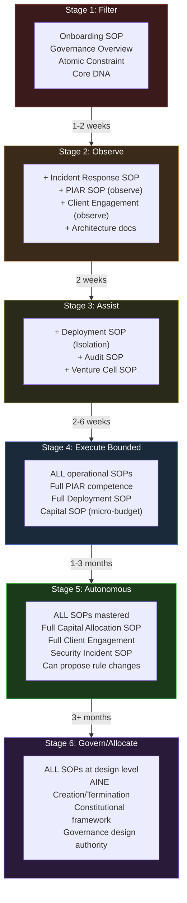

# Role-Based SOP Navigation Guide

This reference document answers one question: **"Given my operator stage, which SOPs do I need to know?"** Use it to find your mandatory reading, understand your decision boundaries, and know what you need to demonstrate to progress to the next stage.

---

## Operator Stage Progression with SOP Requirements

```mermaid
stateDiagram-v2
    [*] --> S1_Filter: Application

    state S1_Filter {
        [*] --> S1_SOPs: Mandatory SOPs
        S1_SOPs: Read Only --
        S1_SOPs: Operator Onboarding SOP
        S1_SOPs: Governance Review SOP (overview)
    }

    S1_Filter --> S2_Observe: Passes screening

    state S2_Observe {
        [*] --> S2_SOPs: Mandatory SOPs
        S2_SOPs: All Stage 1 SOPs PLUS --
        S2_SOPs: Incident Response SOP
        S2_SOPs: PIAR SOP (observe only)
        S2_SOPs: Client Engagement SOP (observe only)
    }

    S2_Observe --> S3_Assist: Demonstrates awareness

    state S3_Assist {
        [*] --> S3_SOPs: Mandatory SOPs
        S3_SOPs: All Stage 2 SOPs PLUS --
        S3_SOPs: Deployment SOP (Isolation Zone)
        S3_SOPs: Audit SOP (understand audit trail)
        S3_SOPs: Venture Cell SOP (context)
    }

    S3_Assist --> S4_Execute: Meets execution criteria

    state S4_Execute {
        [*] --> S4_SOPs: Mandatory SOPs
        S4_SOPs: ALL operational SOPs --
        S4_SOPs: Full PIAR competence
        S4_SOPs: Full Deployment SOP
        S4_SOPs: Capital Allocation SOP (micro-budget)
    }

    S4_Execute --> S5_Autonomous: Consistent performance

    state S5_Autonomous {
        [*] --> S5_SOPs: Mandatory SOPs
        S5_SOPs: ALL SOPs in ecosystem --
        S5_SOPs: Full Capital Allocation SOP
        S5_SOPs: Full Client Engagement SOP
        S5_SOPs: Governance Review SOP (can propose)
    }

    S5_Autonomous --> S6_Govern: Leadership demonstrated

    state S6_Govern {
        [*] --> S6_SOPs: Mandatory SOPs
        S6_SOPs: ALL SOPs -- mastery level
        S6_SOPs: AINE Creation/Termination SOPs
        S6_SOPs: Governance design authority
        S6_SOPs: Constitutional framework
    }
```

---

## Stage-by-Stage SOP Matrix

### Legend

- **R** = Required -- must demonstrate mastery
- **A** = Awareness -- must understand at a conceptual level
- **O** = Observe -- must have observed in practice
- **N/A** = Not applicable at this stage

| SOP | Stage 1 (Filter) | Stage 2 (Observe) | Stage 3 (Assist) | Stage 4 (Bounded) | Stage 5 (Autonomous) | Stage 6 (Govern) |
|---|---|---|---|---|---|---|
| [Operator Onboarding SOP](/docs/processes/operator-onboarding-sop) | R | R | R | R | R | R |
| [Governance Review SOP](/docs/processes/governance-review-sop) | A | A | A | R | R | R |
| [Incident Response SOP](/docs/processes/incident-response-sop) | N/A | A | A | R | R | R |
| [PIAR SOP](/docs/processes/piar-sop) | N/A | O | A | R | R | R |
| [Client Engagement SOP](/docs/processes/client-engagement-sop) | N/A | O | A | R | R | R |
| [Deployment SOP](/docs/processes/deployment-sop) | N/A | N/A | A (Isolation only) | R | R | R |
| [Capital Allocation SOP](/docs/processes/capital-allocation-sop) | N/A | N/A | A | R (micro-budget) | R | R |
| [Audit SOP](/docs/processes/audit-sop) | N/A | N/A | A | R | R | R |
| [Venture Cell SOP](/docs/processes/venture-cell-sop) | N/A | N/A | A | R | R | R |
| [Security Incident SOP](/docs/processes/security-incident-sop) | N/A | N/A | N/A | A | R | R |
| [AINE Creation SOP](/docs/processes/aine-creation-sop) | N/A | N/A | N/A | A | A | R |
| [AINE Termination SOP](/docs/processes/aine-termination-sop) | N/A | N/A | N/A | A | A | R |

---

## Stage 1: Filter -- What You Need to Know

**Duration:** 1-2 weeks | **Authority:** None | **Income:** None

### Mandatory Reading

| Document | Why You Need It |
|---|---|
| Operator Onboarding SOP | Understand the full lifecycle you are entering |
| Governance Review SOP (overview) | Understand that rules exist, why they exist, and how they change |
| Atomic Constraint | The constitutional foundation -- "every obligation must have a traceable, finite, non-deferrable human accountability endpoint" |
| Core DNA -- 18 Principles | The belief system governing the ecosystem |

### Decision Authority

None. You are being evaluated, not operating.

### Escalation Requirements

All questions go to your screening coordinator. You have no operational decisions to escalate.

### Graduation Criteria to Stage 2

| Criterion | Threshold |
|---|---|
| Cognitive assessment score | Above 70th percentile |
| Governance awareness score | Above 60th percentile |
| Communication quality | "Clear and honest" by 2+ reviewers |
| Cultural signal | No disqualifying indicators |

---

## Stage 2: Observe -- What You Need to Know

**Duration:** 2 weeks | **Authority:** None (observation only) | **Income:** Stipend

### Mandatory Reading (in addition to Stage 1)

| Document | Why You Need It |
|---|---|
| Incident Response SOP | Understand severity levels and response protocols you will observe |
| PIAR SOP (overview) | You will observe live PIAR sessions -- understand what you are watching |
| Client Engagement SOP (overview) | You will observe client interactions -- understand the framework |
| All architecture and product documentation | Build contextual understanding of the ecosystem |

### Decision Authority

None. Observation only. Do not offer operational opinions unless asked by your mentor.

### Escalation Requirements

All observations and questions go through your assigned mentor. Maintain a daily observation journal.

### Graduation Criteria to Stage 3

| Criterion | Threshold |
|---|---|
| Observation journal quality | Demonstrates clear understanding of operations and governance |
| Mentor assessment | "Ready for supervised tasks" recommendation |
| Governance quiz | Above 80% on ecosystem governance fundamentals |
| Peer feedback | No red flags from operators who interacted with candidate |

---

## Stage 3: Assist -- What You Need to Know

**Duration:** 2-6 weeks | **Authority:** Bounded assistance under direct supervision | **Income:** Below-market base + small bonus

### Mandatory Reading (in addition to Stage 2)

| Document | Why You Need It |
|---|---|
| Deployment SOP (Isolation Zone section) | You can deploy to Isolation Zone -- understand the rules |
| Audit SOP | Your work creates audit trails -- understand what is being recorded |
| Venture Cell SOP | Understand the cell structure you are operating within |

### Decision Authority

- Execute bounded tasks assigned by Cell Lead or Senior Operator
- All work reviewed before it has impact
- Can deploy to Isolation Zone (self-review permitted)

### Escalation Requirements

Escalate everything that is not an explicitly assigned, bounded task. Your supervisor reviews all work.

### Graduation Criteria to Stage 4

| Criterion | Threshold |
|---|---|
| Evaluation rubric composite score | Above 70% for 3 consecutive weeks |
| Supervisor recommendation | "Ready for bounded independent execution" |
| Zero governance violations | No SOP violations or unauthorized actions |
| Completed first supervised PIAR | Assessed as "competent" by Governance Reviewer |

---

## Stage 4: Execute (Bounded) -- What You Need to Know

**Duration:** 1-3 months | **Authority:** Independent execution with guardrails | **Income:** Market-rate base + performance bonus

### Mandatory Reading

All operational SOPs. At this stage you must have working knowledge of every SOP in the ecosystem.

| SOP Category | Mastery Level Required |
|---|---|
| Operator Onboarding SOP | Full mastery -- understand your authority boundaries |
| Governance Review SOP | Full mastery -- can identify rule change tiers |
| Incident Response SOP | Full mastery -- can classify severity, know response protocols |
| PIAR SOP | Full mastery -- can initiate and participate in PIARs |
| Client Engagement SOP | Full mastery -- can communicate with clients (CC Cell Lead) |
| Deployment SOP | Full mastery -- can deploy to Extension + Isolation Zones |
| Capital Allocation SOP | Working knowledge -- understand micro-budget (&lt; $500) authority |
| Audit SOP | Full mastery -- understand audit trail requirements |
| Security Incident SOP | Awareness -- know when to escalate security issues |

### Decision Authority

| Area | Scope |
|---|---|
| Task execution | Independent, within assigned scope |
| Client communication | With Cell Lead awareness (CC required) |
| Spending | Up to &lt; $500 per decision |
| Technical decisions | Within established architecture, no novel patterns |
| PIAR | Can initiate, cannot be sole Decision Maker on capital decisions |

### Escalation Requirements

Escalate to Cell Lead for: spending &gt; $500, client issues, technical decisions outside established patterns, any governance ambiguity.

### Graduation Criteria to Stage 5

| Criterion | Threshold |
|---|---|
| Consistent performance | Above 75% evaluation score for 2 consecutive months |
| Zero governance violations | No unauthorized actions or SOP violations |
| Client feedback | Positive feedback from at least 2 clients |
| Revenue contribution | Measurable contribution to cell revenue |
| PIAR competence | Successfully led at least 3 PIARs |

---

## Stage 5: Execute (Autonomous) -- What You Need to Know

**Duration:** Ongoing (3+ months before Stage 6 eligibility) | **Authority:** Full execution within cell mandate | **Income:** Above-market base + bonus + revenue share

### Mandatory Reading

All SOPs at mastery level, plus strategic and governance design documents.

| SOP Category | Mastery Level Required |
|---|---|
| All operational SOPs | Full mastery |
| Capital Allocation SOP | Full mastery -- can submit requests up to $10,000 |
| Client Engagement SOP | Full mastery -- direct client relationships |
| Governance Review SOP | Full mastery -- can propose Tier 1 and Tier 2 rule changes |
| AINE Creation/Termination SOPs | Awareness -- understand entity lifecycle |
| Security Incident SOP | Full mastery |

### Decision Authority

| Area | Scope |
|---|---|
| Task execution | Full autonomy within cell mandate |
| Client management | Direct relationships, independent communication |
| Spending | Up to &lt; $5,000 per decision |
| Technical decisions | Can introduce new patterns with peer consultation |
| PIAR | Full authority as Decision Maker |
| Mentoring | Expected to mentor Stage 2-3 operators |
| Revenue | Directly accountable for revenue targets |

### Escalation Requirements

Escalate to Cell Lead / CAC for: spending &gt; $5,000, material contract modifications, architecture changes, governance rule proposals.

### Graduation Criteria to Stage 6

| Criterion | Threshold |
|---|---|
| Revenue track record | Exceeded targets for 4+ consecutive months |
| Governance excellence | Zero violations, exemplary PIAR quality |
| Mentoring impact | At least 1 mentee progressed to Stage 4+ |
| Strategic contribution | Demonstrated ability to shape cell strategy |
| Leadership assessment | Recommended by Cell Lead + AINEG representative |

---

## Stage 6: Govern / Allocate Capital -- What You Need to Know

**Duration:** Ongoing | **Authority:** Capital allocation + governance design | **Income:** Premium base + bonus + revenue share + capital bonus

### Mandatory Reading

Complete mastery of all ecosystem documentation, including constitutional framework and entity architecture.

| SOP Category | Mastery Level Required |
|---|---|
| All SOPs | Complete mastery |
| AINE Creation SOP | Full mastery -- can lead entity creation |
| AINE Termination SOP | Full mastery -- can lead entity wind-down |
| Constitutional Framework | Deep understanding of authority hierarchies and constraints |
| Governance Review SOP | Can design governance rules, not just follow them |

### Decision Authority

| Area | Scope |
|---|---|
| Capital allocation | Approve requests within defined limits |
| Governance design | Propose and implement governance rule changes |
| Cell leadership | Lead venture cells, including setup and termination |
| Strategy | Direct input to AINEG portfolio strategy |
| Hiring authority | Approve operator progression to Stage 4+ |
| Constitutional input | Can propose constitutional amendments (not approve) |

### Escalation Requirements

Escalate to AINEG / AINEFF Board for: capital requests above delegation limit, constitutional amendments, cross-entity governance changes, entity creation/termination decisions.

---

## SOP Learning Path Visualization

---

## Quick Lookup: "Can I Do This?"

| Action | Minimum Stage Required |
|---|---|
| Read SOPs and documentation | Stage 1 |
| Observe live operations | Stage 2 |
| Execute assigned tasks (supervised) | Stage 3 |
| Deploy to Isolation Zone | Stage 3 |
| Communicate with clients (CC Cell Lead) | Stage 4 |
| Initiate a PIAR | Stage 4 |
| Deploy to Extension Zone | Stage 4 |
| Spend up to $500 | Stage 4 |
| Communicate with clients independently | Stage 5 |
| Spend up to $5,000 | Stage 5 |
| Lead PIARs as Decision Maker | Stage 5 |
| Introduce new technical patterns | Stage 5 |
| Propose governance rule changes | Stage 5 (Tier 1-2), Stage 6 (Tier 3) |
| Mentor junior operators | Stage 5 |
| Allocate capital | Stage 6 |
| Design governance rules | Stage 6 |
| Lead venture cell creation | Stage 6 |
| Approve operator progression | Stage 6 |
| Deploy to Core Zone | Stage 6 (with 2 senior reviewers + PIAR) |

---

## Related Documents

- [Operator Onboarding SOP](/docs/processes/operator-onboarding-sop) -- Full stage definitions, gate criteria, and demotion triggers
- [Escalation & Authority Matrix](/docs/guides/escalation-matrix) -- Detailed authority limits by decision type
- [Capability Maturity Checklist](/docs/guides/capability-maturity) -- Assessment rubrics for each stage
- [Decision Trees](/docs/guides/decision-trees) -- Formalized decision flowcharts
