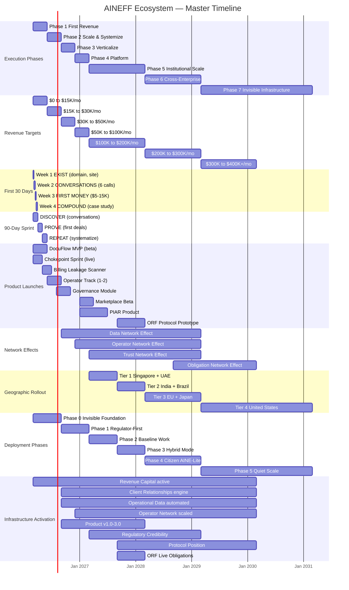
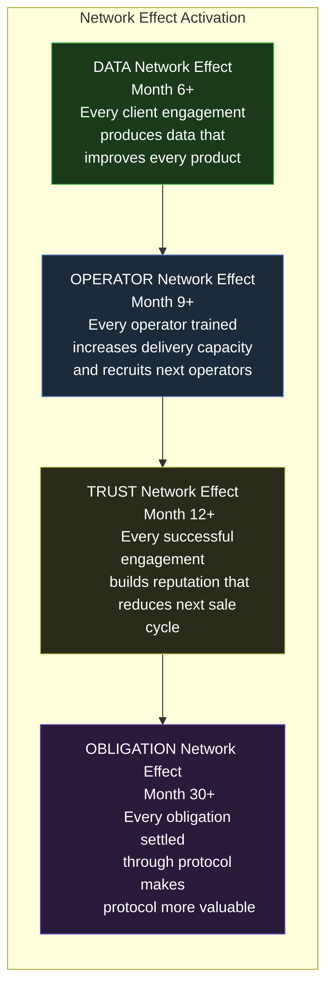
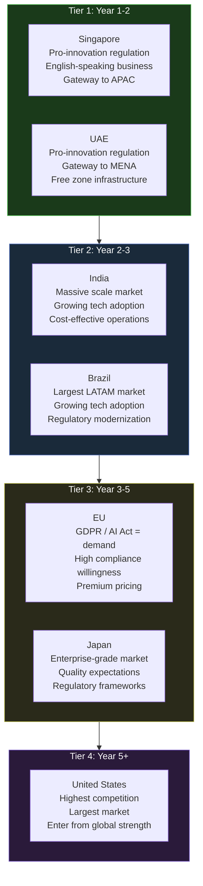

# Master Timeline & Milestones

This page merges every timeline in the AINEFF Ecosystem into one unified view. Individual timelines are scattered across the execution, products, deployment, and compounding leverage pages. This master timeline shows how they all interleave.

---

## Master Gantt Chart

---

## Phase-by-Phase Detail

### Day 1-30: First Revenue Sprint

**Source:** [30-Day Action Plan](/docs/execution/30-day-plan)

| Day | Milestone | Revenue | Conversations | Capital Spent |
|---|---|---|---|---|
| 1 | Domain registered | $0 | 0 | $10 |
| 2 | Landing page live | $0 | 0 | $12 |
| 3 | LinkedIn optimized, 25 prospects identified | $0 | 0 | $12 |
| 7 | 25 outbound messages sent | $0 | 0 | $12 |
| 9 | First discovery call | $0 | 1 | $12 |
| 12 | 6 discovery calls complete, 2 proposals sent | $0 | 6 | $12 |
| 19 | **First deal closed** | $5-15K | 10 | $12 |
| 23 | **Second deal closed** | $10-25K | 12 | $12 |
| 25 | First engagement delivered, case study written | $10-30K | 13 | $12 |
| 28 | First retainer proposed | $10-30K | 15 | $12 |
| 30 | Month 1 complete | $10-30K | 15+ | $12 |

---

### Day 31-90: 90-Day Sprint

**Source:** [90-Day Sprint](/docs/execution/90-day-sprint)

| Month | Phase | Activities | Revenue Target |
|---|---|---|---|
| 1 | DISCOVER | Conversations, pain mapping, first proposals | $5-15K |
| 2 | PROVE | Close deals, deliver engagements, collect payment | $10-20K |
| 3 | REPEAT | Systematize delivery, case studies, referral engine | $13-15K (recurring) |

---

### Month 4-6: Phase 2 Scale & Systemize

**Source:** [7-Phase Progression](/docs/execution/7-phases)

| Month | Key Milestone | Revenue Target |
|---|---|---|
| 4 | DocuFlow to 50+ users, first enterprise conversation | $16.5K |
| 5 | First operator delivering independently | $23K |
| 6 | 100+ DocuFlow users, $30K/mo revenue | $27K |

**Exit criteria:** $15K+ MRR, 100+ DocuFlow users, 1+ operator independent, 1+ enterprise client, 70%+ gross margin.

---

### Month 7-9: Phase 3 Verticalize

| Month | Key Milestone | Revenue Target |
|---|---|---|
| 7 | Vertical deep-dive (insurance claims), vertical product variant | $27K |
| 8 | Copilot integration, governance module deployment | $35K |
| 9 | Vertical case studies, conference presence, recognized authority | $40K |

**Exit criteria:** $30K+ MRR, 60%+ revenue from primary vertical, 3+ enterprise clients in vertical.

---

### Month 10-12: Phase 4 Platform

| Month | Key Milestone | Revenue Target |
|---|---|---|
| 10 | Marketplace architecture, identity system design | $44K |
| 11 | PIAR prototype, agent-to-agent communication | $46K |
| 12 | Platform beta launch, first third-party integrations | $50K |

**Exit criteria:** $50K+ MRR, marketplace live, platform revenue >10%, 5+ operators active.

---

### Network Effect Activation Timeline

The ecosystem's four network effects activate at different times:

| Network Effect | Activation | Mechanism | Compounding Rate |
|---|---|---|---|
| **Data** | Month 6+ | Every engagement produces operational data that improves product accuracy | 20-30% monthly growth in data points |
| **Operator** | Month 9+ | Each trained operator multiplies delivery capacity 3-5x and recruits next generation | 5-15% monthly growth in operators |
| **Trust** | Month 12+ | Case studies + regulatory contacts + client references create self-reinforcing credibility | 3-8% monthly growth in regulatory credibility |
| **Obligation** | Month 30+ | Every obligation settled through ORF makes the protocol more valuable | 1-5% monthly, accelerating |

---

### Year 2: Phase 5 Institutional Scale

| Quarter | Key Milestones | Revenue Target |
|---|---|---|
| Q1 (Month 13-15) | Enterprise contracts ($50-200K each), Tier 1 geographic entry (Singapore/UAE) | $75K/mo |
| Q2 (Month 16-18) | Insurance carrier partnerships, ORF prototype begins, 10+ operators | $100K/mo |
| Q3 (Month 19-21) | Regulatory body engagement, cross-vertical expansion | $150K/mo |
| Q4 (Month 22-24) | Institutional contracts locked, Tier 2 geographic entry (India/Brazil) | $200K/mo |

---

### Year 3: Phase 6-7

| Quarter | Key Milestones | Revenue Target |
|---|---|---|
| Q1-Q2 (Month 25-30) | Cross-enterprise obligation routing, ORF live obligations, standards body participation | $250-300K/mo |
| Q3-Q4 (Month 31-36) | Tier 3 geographic entry (EU/Japan), regulatory mandates emerging, infrastructure status | $300-400K+/mo |

---

### Geographic Deployment Timeline

---

### Long-Horizon Milestones

| Timeframe | Milestone | Revenue Scale | Ecosystem Status |
|---|---|---|---|
| Year 1 | First $228K revenue, 40 clients, 7 operators | $228K/year | Services company |
| Year 2 | $909K revenue, 200 clients, 22 operators, Tier 1 markets | $909K/year | Product-led company |
| Year 3 | $3.4M revenue, 650 clients, 50 operators, Tier 2-3 markets | $3.4M/year | Platform company |
| Year 5 | $50M+ revenue, 5,000+ clients, 300+ operators, global | $50M+/year | Protocol company |
| Year 10 | $10B revenue target | $10B/year | Infrastructure |
| Year 20 | Centi-trillion scale: $1T cumulative obligations governed | GDP-scale | Terrain |

---

## Critical Path Dependencies

The timeline has several hard dependencies -- items that gate everything downstream:

```mermaid
flowchart LR
    CONV["First 10
    conversations
    (Day 9-12)"] -->|"gates"| DEAL["First deal
    closed
    (Day 19)"]
    DEAL -->|"gates"| CASE["First case
    study
    (Day 25)"]
    CASE -->|"gates"| REFERRAL["Referral
    engine
    (Month 2-3)"]
    REFERRAL -->|"gates"| OPERATOR["First operator
    independent
    (Month 5)"]
    OPERATOR -->|"gates"| SCALE["Scalable
    delivery
    (Month 6+)"]
    SCALE -->|"gates"| ENTERPRISE["Enterprise
    contracts
    (Month 8+)"]
    ENTERPRISE -->|"gates"| VERTICAL["Vertical
    dominance
    (Month 9+)"]
    VERTICAL -->|"gates"| PLATFORM["Platform
    launch
    (Month 12+)"]
    PLATFORM -->|"gates"| PROTOCOL["Protocol
    adoption
    (Month 18+)"]
    PROTOCOL -->|"gates"| INFRA["Infrastructure
    status
    (Month 36+)"]

    style CONV fill:#1a3a1a,stroke:#4aba4a,color:#fff
    style DEAL fill:#1a3a1a,stroke:#4aba4a,color:#fff
    style INFRA fill:#2a1a3a,stroke:#6a4aba,color:#fff
```

**The Iron Law:** You cannot buy your way to a later phase. Raising $10M does not skip Phase 1. Having 535,000 lines of strategy does not skip Phase 1. Phase 1 is conversations and revenue. There are no shortcuts.

---

## Market Window

The deployment window for operational governance infrastructure is approximately 2-5 years (2026-2030):

| Year | Market Status | Window Status |
|---|---|---|
| 2026 | Early adoption, skepticism common | Opening |
| 2027 | Growing acceptance, "interesting" becomes "useful" | Open |
| 2028 | Expectation forming, "useful" becomes "expected" | Wide open |
| 2029 | Mandates emerging, "expected" becomes "required" | Narrowing |
| 2030 | Standards established, competition intensifies | Closing |

The ecosystem must be established infrastructure by 2030. After that, the window narrows dramatically as incumbents respond and new entrants commoditize.
