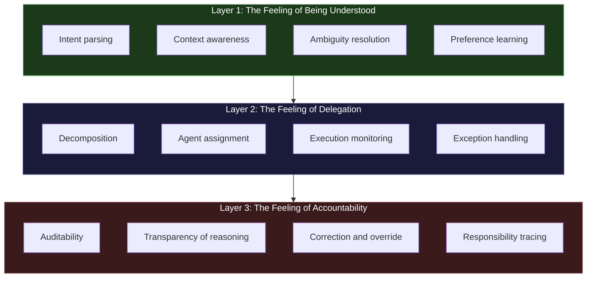
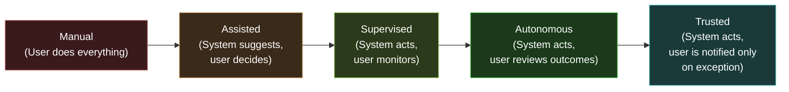
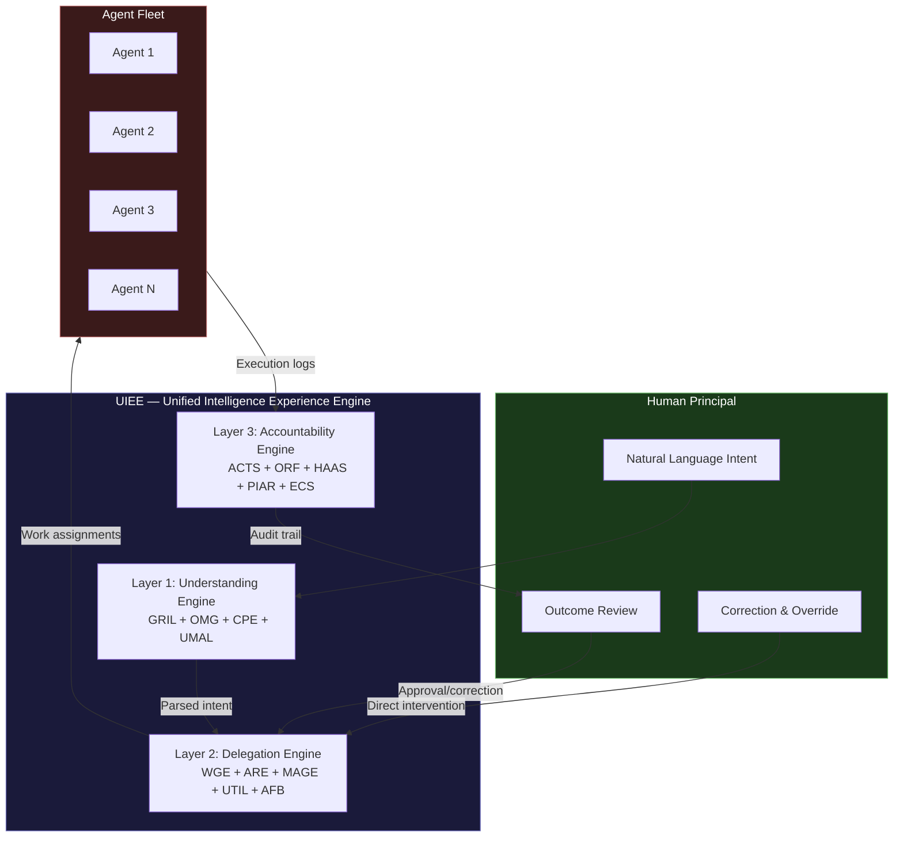

---

sidebar_position: 8
title: "Agentic User Experience"
description: "The three experience layers for autonomous AI interaction — being understood, delegation, and accountability — defining the UX principles for the shift from 'I do this' to 'I approve this.'"
tags: [knowledge, agent]
custom_status: active
custom_owner: Andrew Leo
custom_last_review: 2026-03-01
custom_next_review: 2026-06-01
---

# Agentic User Experience

The user experience of traditional software is transactional: you click a button, the system responds, you evaluate the response. You are the operator. The software is the tool.

The user experience of **agentic AI** is fundamentally different. You express an intent. The system decomposes it, assigns sub-agents, executes across multiple domains, handles exceptions, and returns a result — or a set of results — for your review. You are not the operator. You are the **principal**. The agents are your delegates.

This shift — from "I do this" to "I approve this" — is the most significant UX transformation since the graphical user interface. It requires a completely new design language, a new set of principles, and a new understanding of what "experience" means when the system does the work.

---

## The Three Experience Layers

Agentic UX is not one experience. It is three nested experiences, each building on the one beneath it.

---

## Layer 1: The Feeling of Being Understood

**The experience of expressing intent in natural language and having the system correctly grasp what you mean — including what you did not say.**

This is the foundation. If the system does not understand you, nothing else matters. Delegation is impossible without comprehension. Accountability is meaningless without shared understanding of what was supposed to happen.

### What "Being Understood" Means in Practice

It does **not** mean the system has perfect speech-to-text. It means:

1. **Intent parsing beyond literal words.** "Can you handle the Q3 report?" is not a yes/no question — it is a delegation request. The system must parse pragmatic intent, not just semantic content.

2. **Context awareness across sessions.** The system remembers that "the Q3 report" refers to the specific template used last quarter, that you prefer charts over tables, that the CFO wants the executive summary on the first page, and that the last report had a data error in the revenue section that needs correction.

3. **Ambiguity resolution through clarification, not guessing.** When intent is unclear, the system asks — but it asks **smart questions** that demonstrate it understands the space of possibilities. "Did you mean the Q3 report for the board or the investor version?" shows understanding. "What report?" shows none.

4. **Preference learning over time.** The system builds a model of your communication style, your priorities, your tolerances, and your blind spots. It does not just respond to what you say — it adapts to how you think.

5. **Unstated constraint detection.** You say "schedule a meeting with the Shanghai team." You did not say "account for the 15-hour time zone difference" or "avoid Chinese holidays" — but the system should. Understanding includes understanding what you did not think to specify.

### The UX Signature of Layer 1

When Layer 1 is working, the user feels: **"This system gets me."** Not in a creepy surveillance way. In the way a skilled executive assistant understands their principal — anticipating needs, filling gaps, and requiring less and less explicit instruction over time.

When Layer 1 fails, the user feels: **"I am fighting the system."** Every interaction requires over-specification. The system takes things literally. Context is lost between sessions. The user becomes the translator between their own intent and the system's rigid input requirements.

### AINEFF System Dependencies

| System | Role in Layer 1 |
|---|---|
| **GRIL (Grounded Retrieval Intelligence Layer)** | Provides context from previous interactions, documents, and institutional knowledge |
| **OMG (Orchestrated Memory Graph)** | Maintains persistent memory of user preferences, patterns, and history |
| **CPE (Cognitive Post-Processing Engine)** | Processes raw user input through reasoning tools to extract deep intent |
| **UMAL (Universal Model Abstraction Layer)** | Routes intent parsing to the most appropriate model for the domain and complexity level |

---

## Layer 2: The Feeling of Delegation

**The experience of handing off a complex task and watching (or choosing not to watch) as the system decomposes it, assigns it to capable agents, executes it, and handles exceptions — all without requiring your ongoing intervention.**

This is the core of agentic UX. It is the feeling of **delegation** — the same experience a CEO has when they hand a strategic initiative to a trusted VP and know it will be handled competently.

### What "Delegation" Means in Practice

1. **Decomposition visibility.** The system shows (or can show, on request) how it broke your intent into sub-tasks. "I am handling the Q3 report in four steps: data extraction, analysis, visualization, and narrative drafting. Each step has been assigned to a specialized agent."

2. **Agent assignment transparency.** You can see (or choose to see) which agents are handling which sub-tasks, what their capabilities are, and why they were selected.

3. **Execution monitoring at your preferred granularity.** Some users want real-time updates. Others want to check in at milestones. Others want to be notified only on completion or exception. The system adapts to your monitoring preference.

4. **Exception handling without escalation (when possible).** The data source for Q3 revenue is temporarily unavailable. A competent delegate does not immediately escalate — they check if a cached version exists, try an alternative source, or queue a retry. Only genuine blockers reach the principal.

5. **Progressive delegation.** The system starts with conservative delegation — checking in frequently, asking for confirmation on intermediate decisions. As trust is established, it delegates more autonomously. The user controls the delegation frontier.

### The Delegation Spectrum

Different tasks warrant different positions on this spectrum. A routine data extraction might be fully autonomous. A financial commitment might be assisted. A legal communication might be supervised. The system should intelligently default to the appropriate level and allow the user to adjust.

### The UX Signature of Layer 2

When Layer 2 is working, the user feels: **"I can let go."** The cognitive load of execution transfers from the user to the system. The user's role shifts from doing to directing, and then from directing to reviewing.

When Layer 2 fails, the user feels: **"I am babysitting the system."** Every sub-task requires hand-holding. Exceptions that should be auto-resolved get escalated. The delegation creates more work than doing it yourself. This is the worst possible agentic UX outcome — it combines the loss of control with the burden of supervision.

### AINEFF System Dependencies

| System | Role in Layer 2 |
|---|---|
| **WGE (Work Genesis Engine)** | Decomposes user intent into executable work units with dependencies and constraints |
| **ARE (Agent Runtime Environment)** | Manages the lifecycle of sub-agents: spawning, monitoring, exception handling, termination |
| **MAGE (Meta-Agent Governance Engine)** | Governs inter-agent coordination, preventing conflicts and ensuring constitutional compliance |
| **UTIL (Universal Tool Interface Layer)** | Provides agents with access to the tools they need for execution |
| **AFB (Authorized Function Bundle)** | Defines what each agent is permitted to do, preventing scope creep and unauthorized actions |

---

## Layer 3: The Feeling of Accountability

**The experience of knowing that every action taken on your behalf is traceable, explainable, and correctable — and that responsibility is clearly assigned at every level.**

This is the layer that separates **agentic UX** from **black-box automation**. Without accountability, delegation is just gambling. You hand off a task and hope for the best. With accountability, delegation is **governance** — you hand off a task with confidence that the system's reasoning is transparent, its actions are auditable, and its mistakes are correctable.

### What "Accountability" Means in Practice

1. **Auditability.** Every agent action is logged with full context: what was done, why it was done, what alternatives were considered, what data informed the decision, and what constraints were active. Not just what happened — the complete causal chain.

2. **Transparency of reasoning.** The system can explain its decisions at any level of detail. "I chose data source A over data source B because A had more recent data (updated 2 hours ago vs. 3 days ago) and covered 98% of the required metrics vs. 87%." The explanation is not a post-hoc rationalization — it is the actual reasoning, preserved.

3. **Correction and override.** At any point, the user can intervene: pause execution, change parameters, override a decision, redirect an agent, or cancel entirely. The system respects human authority absolutely. There is no "the system knows better" override of human judgment.

4. **Responsibility tracing.** When something goes wrong, the system can trace the failure to its root cause: which agent made which decision based on which data under which constraints, and where the chain broke. This is not blame assignment — it is diagnostic precision.

5. **Graceful degradation.** When the system cannot complete a task, it fails informatively. Not "Error 500." Not silence. But: "I was unable to complete the revenue analysis because the Q3 data from the Singapore office has not been uploaded. Here is what I completed with available data. The Singapore data gap affects rows 47-62 of the analysis. Shall I proceed with estimated values or wait for the upload?"

### The UX Signature of Layer 3

When Layer 3 is working, the user feels: **"I am in control, even though I am not doing the work."** This is the paradox of good agentic UX: the less you do, the more control you should feel. Control comes not from doing but from understanding, overseeing, and having the power to intervene.

When Layer 3 fails, the user feels: **"I do not know what just happened."** The system produced a result but cannot explain how it got there. Something went wrong but nobody can trace why. The user approved an output they did not fully understand because the system could not articulate its reasoning. This erodes trust, and once trust is gone, delegation collapses back to manual operation.

### AINEFF System Dependencies

| System | Role in Layer 3 |
|---|---|
| **ACTS (Audit & Causal Trace System)** | Provides the complete audit trail for every agent action, decision, and outcome |
| **ORF (Obligation & Responsibility Finality Protocol)** | Ensures every obligation has a traceable human accountability endpoint |
| **HAAS (Human Accountability & Audit System)** | Maintains the human layer of accountability above the agent execution layer |
| **PIAR (Pre-Incident Accountability Review)** | Proactively reviews accountability chains before work begins, not after it fails |
| **ECS (Enterprise Compliance System)** | Ensures all agent actions comply with regulatory requirements across jurisdictions |

---

## Core Design Principles

### 1. Natural Language as Interface

The primary interface for agentic systems is **human language**, not buttons, menus, or forms. This does not mean eliminating visual interfaces — it means making language the primary input modality and visual elements the primary output modality.

- **Input:** "Prepare the board deck for Thursday, focusing on the three growth initiatives we discussed last week. Keep it under 20 slides. Flag anything that contradicts the numbers we gave investors."
- **Output:** A visual dashboard showing progress, a slide deck for review, and flagged items highlighted with explanations.

The asymmetry is intentional: humans express intent in language (high bandwidth for intent, low bandwidth for structure), and systems present results visually (high bandwidth for structure, low bandwidth for intent).

### 2. Progressive Delegation

Trust builds incrementally. The system should not demand full autonomy on day one. Instead:

- **Week 1:** System suggests; user decides. Every action requires explicit approval.
- **Month 1:** System acts on routine tasks; user monitors. Non-routine tasks still require approval.
- **Month 3:** System handles most execution autonomously. User reviews outcomes, not processes.
- **Month 6+:** System operates at the "trusted" level for established task types. User is notified only on exceptions or novel situations.

The user always retains the ability to pull delegation back to any prior level. Progressive delegation is a ratchet that clicks forward but never locks — the user can always reverse it.

### 3. Human-in-the-Loop (HITL)

The human is always in the loop. The question is **where** in the loop:

| HITL Position | Description | When to Use |
|---|---|---|
| **Pre-execution** | Human approves before any action | High-stakes, irreversible, or novel situations |
| **Mid-execution** | Human reviews at checkpoints | Multi-step processes with decision gates |
| **Post-execution** | Human reviews completed output | Routine tasks where correction is cheap |
| **Exception-only** | Human is involved only when the system encounters something it cannot handle | Well-established, trusted processes |

The AINEFF Ecosystem defaults to the most conservative HITL position for each task type and relaxes it as trust is established and the task type is validated.

### 4. Transparency of Reasoning

Every agent decision must be explainable. This does not mean drowning the user in details — it means making details **available on demand** at the right level of abstraction:

- **Level 0 (Summary):** "I chose option A."
- **Level 1 (Rationale):** "I chose option A because it had the highest expected value given the constraints."
- **Level 2 (Analysis):** "I evaluated options A, B, and C. Option A scored 87/100, B scored 72/100, C scored 65/100. The key differentiator was cost efficiency (A: $12K, B: $18K, C: $22K) given comparable quality scores."
- **Level 3 (Full trace):** Complete data sources, model versions, confidence intervals, alternative paths considered and rejected, and timestamp-level execution log.

Most users need Level 1 most of the time, Level 2 occasionally, and Level 3 rarely. But Level 3 must always exist because auditors, regulators, and incident investigators will need it.

### 5. Graceful Degradation

When agentic systems fail — and they will fail — the failure must be **informative, bounded, and recoverable**:

- **Informative:** The system explains what failed, why, and what was affected. Not "something went wrong" but "the financial data API returned stale data from March instead of current data, which affected the revenue projections in sections 3 and 4 of the report."
- **Bounded:** The failure is isolated. One agent's failure does not cascade to crash the entire workflow. Other agents continue operating on their independent sub-tasks.
- **Recoverable:** The system presents recovery options. "I can retry with the backup data source, proceed with the stale data and flag it, or pause and wait for the API to return current data. Which do you prefer?"

---

## The Paradigm Shift: From "I Do This" to "I Approve This"

The deepest change in agentic UX is not technological. It is **psychological and organizational**.

### What Changes for the Individual

| Dimension | Traditional UX | Agentic UX |
|---|---|---|
| **Primary activity** | Doing (creating, editing, processing) | Reviewing (approving, redirecting, overriding) |
| **Cognitive load** | Execution-heavy (how do I do this?) | Judgment-heavy (is this right?) |
| **Skill requirement** | Operational proficiency (Excel, SQL, etc.) | Strategic judgment (what should be done?) |
| **Time allocation** | Hours doing, minutes thinking | Minutes reviewing, hours thinking |
| **Failure mode** | Human error in execution | Human error in judgment (approving wrong things) |
| **Value creation** | Through personal output | Through quality of delegation and review |

### What Changes for the Organization

| Dimension | Traditional Organization | Agentic Organization |
|---|---|---|
| **Work unit** | Task assigned to a human | Intent delegated to an agent fleet |
| **Management** | Supervising human work | Governing agent behavior |
| **Quality assurance** | Reviewing human output | Auditing agent reasoning |
| **Scaling model** | Hire more humans | Deploy more agents |
| **Bottleneck** | Human execution capacity | Human judgment capacity |
| **Risk model** | Human error, human fraud | Agent error, agent misalignment, accountability gaps |

### The New Failure Mode: Approval Without Understanding

The most dangerous failure mode in agentic UX is **rubber-stamping** — approving agent outputs without genuinely understanding or evaluating them. This is the agentic equivalent of signing a contract without reading it.

Agentic UX must actively resist this by:

1. **Varying the presentation of results** so that approval cannot become automatic
2. **Randomly requiring deeper review** on routine tasks to prevent complacency
3. **Tracking approval quality** — if a user approves everything in under 3 seconds, they are not reviewing
4. **Making disagreement easy** — the system should make it as easy to reject or modify as to approve
5. **Surfacing uncertainty** — when the system is not confident, it should prominently flag this, forcing the human to engage with the uncertainty rather than defaulting to approval

---

## Integration with AINEFF Architecture

The Agentic UX model is realized through the UIEE (Unified Intelligence Experience Engine), which orchestrates all three layers:

The UIEE is not a user interface in the traditional sense. It is an **experience orchestrator** — managing the flow between human intent, agent execution, and accountability verification. It is the system that makes agentic UX feel like delegation rather than automation, like governance rather than gambling.

---

## The Test for Agentic UX

The AINEFF Ecosystem applies a simple test to every agentic interaction:

> **"Could the human principal, at any point, explain what just happened, why it happened, and what would change if they wanted a different outcome?"**

If the answer is yes, the agentic UX is working. If the answer is no — if the human cannot explain, if the reasoning is opaque, if the path to a different outcome is unclear — then the system has failed at its most fundamental task.

Agentic UX is not about making things easy. It is about making delegation **trustworthy**. And trust requires understanding, transparency, and the inalienable right to say "no, do it differently."
