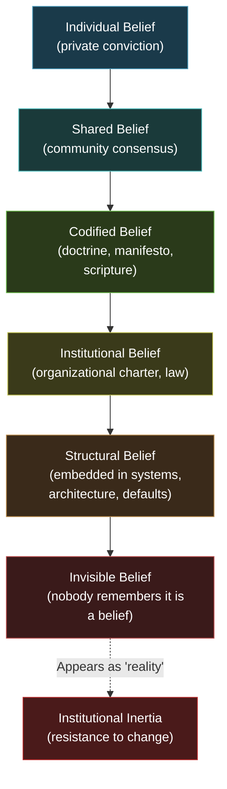

# Belief Systems Taxonomy

Every human decision, every institution, every governance framework operates on top of a **belief system** — a set of commitments about what is real, what is valuable, what is right, and what is knowable. These commitments are usually invisible to the people who hold them, which makes them the most powerful and most dangerous force in any organization.

The AINEFF Ecosystem must navigate this landscape without endorsing any position within it. This taxonomy maps the complete space of human belief systems — not to judge them, but to **make them visible, auditable, and governable**.

---

## Why Belief Systems Matter for Infrastructure

A naive technologist assumes that systems are belief-neutral. They are not.

- Every incentive structure embeds assumptions about human motivation (economic beliefs)
- Every governance framework embeds assumptions about authority and legitimacy (political beliefs)
- Every accountability mechanism embeds assumptions about free will and responsibility (philosophical beliefs)
- Every definition of "harm" embeds assumptions about value and suffering (ethical beliefs)
- Every epistemological commitment in AI systems embeds assumptions about what counts as knowledge (epistemological beliefs)

An infrastructure protocol that ignores this is not neutral — it is **unconsciously ideological**, which is the most dangerous form of ideology because it cannot be examined or challenged.

The AINEFF Ecosystem's approach: **catalog everything, endorse nothing, make the substrate visible.**

---

## 1. Religious Belief Systems

Organized frameworks centered on the divine, sacred, or transcendent.

### Monotheistic Traditions

| Belief System | Core Commitment | Key Institutions |
|---|---|---|
| **Christianity** | God incarnate in Jesus Christ; salvation through faith and/or works; scripture as revelation | Catholic Church, Orthodox Churches, Protestant denominations, Evangelical movements |
| **Islam** | One God (Allah), Muhammad as final prophet; Quran as literal word of God; Five Pillars | Sunni, Shia, Sufi traditions; mosques, madrasas, sharia courts |
| **Judaism** | Covenant between God and the Jewish people; Torah as foundational law; ongoing interpretation (Talmud) | Orthodox, Conservative, Reform; synagogues, rabbinical courts |
| **Baha'i Faith** | Unity of God, religion, and humanity; progressive revelation; Baha'u'llah as latest manifestation | Universal House of Justice, local assemblies |
| **Sikhism** | One God; equality of all people; service; Guru Granth Sahib as living guru | Gurdwaras, Khalsa, Sikh councils |

### Polytheistic and Dharmic Traditions

| Belief System | Core Commitment | Key Institutions |
|---|---|---|
| **Hinduism** | Brahman as ultimate reality; dharma, karma, moksha; diverse paths (bhakti, jnana, karma yoga) | Temples, ashrams, caste system, guru traditions |
| **Buddhism** | Four Noble Truths; Eightfold Path; cessation of suffering; no permanent self | Theravada, Mahayana, Vajrayana; monasteries, sangha |
| **Shinto** | Kami (spirits) in nature; ritual purity; ancestor veneration; harmony with nature | Shrines, festivals, imperial traditions |
| **Traditional African Religions** | Ancestor veneration; spiritual forces in nature; communal ritual; oral tradition | Divination systems, initiation rites, communal ceremonies |
| **Indigenous American Spirituality** | Sacred land; spiritual interconnection; ceremonial practice; oral teaching traditions | Tribal ceremonies, sweat lodges, vision quests |

### Theological Positions

| Position | Core Commitment | Relevance |
|---|---|---|
| **Theism** | God exists and actively intervenes in the world | Foundation of most religious institutions |
| **Deism** | God exists but does not intervene after creation | Historical influence on Enlightenment governance |
| **Atheism** | No gods exist; the universe is natural, not supernatural | Foundation of secular governance models |
| **Agnosticism** | The existence of gods is unknown or unknowable | Epistemic humility as institutional value |
| **Pantheism** | God and the universe are identical; the divine is everything | Environmental ethics, deep ecology |
| **Panentheism** | God contains and interpenetrates the universe but also transcends it | Process theology, ecological theology |

**AINEFF Relevance:** The constitutional framework must operate across all religious contexts. The ORF (Obligation & Responsibility Finality Protocol) must define "accountability" in terms that do not depend on any specific theology. The JAL (Jurisdiction Adapter Layer) must accommodate Sharia-compliant jurisdictions alongside secular ones.

---

## 2. Philosophical Belief Systems

Frameworks for understanding reality, knowledge, and value through systematic reasoning.

### Metaphysical Positions

| Position | Core Commitment | Implications |
|---|---|---|
| **Materialism** | Only physical matter exists; consciousness is an emergent property of material processes | AI can be conscious; no soul to account for |
| **Idealism** | Mind or consciousness is fundamental; matter is derivative or illusory | AI cannot be conscious in the same way; human experience is irreducible |
| **Dualism** | Mind and matter are both fundamental and irreducible | Human accountability has a non-material component |
| **Pragmatism** | Truth is what works; meaning derives from practical consequences, not abstract correspondence | Systems should be judged by outcomes, not principles |
| **Existentialism** | Existence precedes essence; humans create their own meaning through authentic choice | Individual responsibility is absolute; systems cannot substitute for personal accountability |
| **Phenomenology** | Study of structures of consciousness as experienced from the first-person perspective | User experience is not just interface — it is the reality of the system |

### Epistemological Positions

| Position | Core Commitment | Implications |
|---|---|---|
| **Rationalism** | Knowledge derives primarily from reason, independent of sensory experience | Formal proofs and logical derivation are the gold standard |
| **Empiricism** | Knowledge derives primarily from sensory experience and observation | Data and measurement are the gold standard |
| **Skepticism** | Certain knowledge is impossible; all claims should be doubted until warranted | Every system claim must be independently verifiable |
| **Constructivism** | Knowledge is constructed by knowers, not discovered in objective reality | Systems of governance are social constructions, not natural laws |
| **Positivism** | Only empirically verifiable statements are meaningful | If you cannot measure it, it does not exist for governance purposes |
| **Fallibilism** | All knowledge claims are provisional and potentially revisable | Every belief, standard, and rule needs an expiration date |
| **Critical Realism** | An objective reality exists, but our knowledge of it is always mediated and fallible | Systems should aim for objectivity while acknowledging its incompleteness |

### Ethical Frameworks

| Framework | Core Commitment | Implications |
|---|---|---|
| **Deontology** | Actions are right or wrong based on rules and duties, regardless of consequences | Obligations are binding regardless of outcomes; the Atomic Constraint is deontological |
| **Consequentialism / Utilitarianism** | Actions are right if they maximize good outcomes (happiness, utility, well-being) | Cost-benefit analysis is morally legitimate; outcomes justify processes |
| **Virtue Ethics** | Ethics is about developing good character (virtues) rather than following rules or maximizing outcomes | Operator selection should emphasize character, not just competence |
| **Care Ethics** | Ethical action is rooted in relationships, empathy, and responsiveness to others' needs | Systems must account for relational contexts, not just abstract rules |
| **Contractualism** | Ethical principles are those that no one could reasonably reject | Governance must be justifiable to all affected parties |
| **Rights-Based Ethics** | Individuals have inherent rights that cannot be overridden by utilitarian calculations | Some obligations are absolute regardless of cost-benefit analysis |

**AINEFF Relevance:** The Atomic Constraint ("Every obligation must have a traceable, finite, non-deferrable human accountability endpoint") is fundamentally deontological — it is a rule that holds regardless of consequences. However, the broader ecosystem's design incorporates consequentialist reasoning (expected value, optimization) and virtue ethics (M-Shaped Mind, operator development). This philosophical pluralism is deliberate and must be made explicit.

---

## 3. Political Belief Systems

Frameworks for organizing collective power, authority, and governance.

| Belief System | Core Commitment | Institutional Expression |
|---|---|---|
| **Liberalism** | Individual rights, rule of law, representative government, free markets with regulation | Constitutional democracies, human rights frameworks, international institutions |
| **Conservatism** | Preservation of proven institutions, gradual change, respect for tradition and hierarchy | Parliamentary traditions, common law, cultural institutions |
| **Socialism** | Collective ownership of means of production, redistribution of wealth, worker rights | Labor unions, cooperative movements, welfare states, social democratic parties |
| **Communism** | Classless, stateless society; abolition of private property; workers' control of production | Communist parties, planned economies, revolutionary movements |
| **Anarchism** | Rejection of all unjustified hierarchies; voluntary association; mutual aid | Cooperatives, communes, direct action movements, horizontalist organizations |
| **Libertarianism** | Maximum individual liberty; minimal state; free markets; property rights as foundational | Think tanks, cryptocurrency communities, minimal-state advocacy |
| **Fascism** | Ultranationalism, authoritarian state, corporatism, rejection of liberal democracy | Authoritarian regimes, nationalist movements (historical and contemporary) |
| **Social Democracy** | Mixed economy; strong welfare state; democratic governance; regulated capitalism | Nordic model, European social democratic parties |
| **Populism** | "The people" versus "the elites"; direct appeal to mass sentiment; anti-establishment | Various political movements across the ideological spectrum |
| **Technocracy** | Governance by technical experts; evidence-based policy; rational administration | Regulatory agencies, central banks, international development institutions |

**AINEFF Relevance:** The ecosystem must function across all political systems. An AINE operating in a social democratic welfare state and an AINE operating in a libertarian jurisdiction must both be governed by the same constitutional framework. The JAL (Jurisdiction Adapter Layer) exists precisely because political belief systems create incompatible legal environments that the protocol must bridge.

---

## 4. Economic Belief Systems

Frameworks for understanding production, distribution, and exchange of value.

| Belief System | Core Commitment | Implications for AINEFF |
|---|---|---|
| **Capitalism** | Private ownership; free markets; profit motive as engine of innovation and allocation | AINEFF operates within capitalist structures but constrains them constitutionally |
| **Marxism** | Class struggle; labor theory of value; alienation; historical materialism; critique of capitalism | AINEFF must address power asymmetries that Marxist analysis identifies |
| **Keynesianism** | Government intervention to manage demand; counter-cyclical fiscal policy; market imperfection | Regulatory mandates for AINEFF governance frameworks align with Keynesian logic |
| **Neoliberalism** | Deregulation; privatization; free trade; minimal state intervention in markets | Tension with AINEFF's governance-heavy approach; must demonstrate market-compatible value |
| **Austrian Economics** | Subjective value; spontaneous order; opposition to central planning; entrepreneurial discovery | AINEFF's decentralized coordination resonates; central control does not |
| **Institutional Economics** | Institutions (rules, norms, enforcement) shape economic behavior; transaction costs determine firm boundaries | AINEFF is fundamentally an institutional economic project |
| **Behavioral Economics** | Humans are not fully rational; cognitive biases systematically distort economic decisions | Nudge architecture, cognitive post-processing, and bias mitigation are built into AINEFF systems |
| **Development Economics** | Economic growth in low-income countries requires different models than mature economies | AINEFF's scalability across economic contexts requires development economics awareness |
| **Circular Economy** | Replace linear "take-make-dispose" with circular "reduce-reuse-recycle-regenerate" | Sustainability constraints in enterprise governance |
| **Degrowth** | Economic growth is incompatible with ecological sustainability; prosperity without GDP growth | Challenges AINEFF's growth assumptions; must be engaged, not dismissed |

**AINEFF Relevance:** The ecosystem's economic model — obligation flow taxation, CaaS, GaaS, EaaS — sits within capitalist structures but embeds institutional economics assumptions about the centrality of governance infrastructure. This is not neutral, and the ecosystem must acknowledge it.

---

## 5. Spiritual & Mystical Belief Systems

Frameworks centered on direct spiritual experience, inner transformation, or non-institutional transcendence.

| Belief System | Core Commitment | Key Expressions |
|---|---|---|
| **Mysticism** | Direct experience of the divine or ultimate reality, beyond intellectual understanding | Contemplative traditions across religions: Sufism, Kabbalah, Christian mysticism, Zen |
| **New Age** | Eclectic spiritual practice; personal transformation; holistic healing; cosmic consciousness | Meditation, crystals, energy healing, channeling, astrological practice |
| **Animism** | All things (animals, plants, rivers, mountains) possess spiritual essence or agency | Indigenous traditions worldwide; deep ecology; some environmental philosophy |
| **Shamanism** | Spiritual practitioners access altered states to interact with spirit world for healing and guidance | Indigenous traditions; neo-shamanism; ayahuasca and psychedelic traditions |
| **Secular Spirituality** | Spiritual practices (meditation, contemplation, awe) without supernatural commitments | Mindfulness movement, secular Buddhism, naturalistic spirituality |
| **Transhumanism** | Human limitations can and should be transcended through technology | Longevity research, neural enhancement, digital consciousness, AI alignment |

**AINEFF Relevance:** These belief systems influence how individuals relate to work, purpose, and institutional authority. An operator who practices secular spirituality and one who follows traditional shamanic practice both work within the AINEFF framework — the System of Meaning must accommodate both without pathologizing either.

---

## 6. Modern & Emergent Belief Systems

Frameworks that have emerged in recent decades, often at the intersection of technology and culture.

| Belief System | Core Commitment | Institutional Expression |
|---|---|---|
| **Techno-Utopianism** | Technology will solve humanity's fundamental problems; progress is inevitable and good | Silicon Valley culture, effective accelerationism, tech evangelism |
| **Techno-Pessimism** | Technology creates as many problems as it solves; unchecked tech threatens humanity | AI safety movement, tech criticism, degrowth-tech intersection |
| **Effective Altruism** | Use evidence and reason to maximize positive impact; all lives have equal value | EA organizations, longtermism, cause prioritization research |
| **Longtermism** | The long-term future of humanity matters morally; existential risk reduction is a top priority | Existential risk research, AI alignment, civilizational resilience |
| **Conspiratorial Thinking** | Powerful hidden groups control events; official narratives conceal the truth | Online communities, alternative media, distrust of institutions |
| **Nihilism** | Life has no inherent meaning; values are human constructions without objective grounding | Philosophical nihilism (descriptive), existential nihilism, moral nihilism |
| **Syncretic Systems** | Deliberately combine elements from multiple traditions into coherent personal practice | Individual spiritual practice, interfaith movements, integral theory |
| **Post-Humanism** | The human is not the center of ethics or ontology; agency extends to animals, ecosystems, machines | Animal rights, environmental personhood, AI rights discussions |
| **Digital Nativism** | Digital reality is as real and valid as physical reality; online identity is authentic identity | Metaverse culture, digital nomadism, virtual community |
| **Metamodernism** | Oscillation between modernist sincerity and postmodern irony; both/and rather than either/or | Contemporary art, political movements, cultural criticism |

**AINEFF Relevance:** Techno-utopianism is the default belief system of the AI industry. AINEFF must resist unconsciously adopting it while operating within the industry it describes. Conspiratorial thinking is a governance challenge — it erodes trust in the very accountability systems AINEFF provides. Effective altruism and longtermism align with some AINEFF commitments but diverge on others.

---

## How Belief Systems Create Institutional Inertia

Belief systems do not merely inform individual opinions. They **calcify into institutional structures** that persist long after the original believers are gone.

### The Belief-to-Institution Pipeline

This pipeline explains why institutional reform is so difficult. By the time a belief has become structural, it is invisible — it looks like "the way things are" rather than "a choice someone made based on a specific belief." The belief has been laundered through institutionalization.

### Examples of Invisible Beliefs in Current Systems

| Invisible Belief | Institutional Expression | Original Belief System |
|---|---|---|
| "Quarterly reporting is natural" | Financial regulation, stock markets | Capitalist efficiency + positivist measurement |
| "Shareholders own the company" | Corporate law, fiduciary duty doctrine | Liberal property rights + utilitarian shareholder theory |
| "Individuals are rational actors" | Regulatory cost-benefit analysis | Neoclassical economics + Enlightenment rationalism |
| "Growth is always good" | GDP measurement, corporate strategy | Capitalist growth imperative + techno-utopianism |
| "Technology is neutral" | Technology policy, platform governance | Positivism + libertarianism |

---

## AINEFF's Constitutional Neutrality

The AINEFF Ecosystem takes a specific position on belief systems: **constitutional neutrality with explicit acknowledgment of its own commitments.**

### What AINEFF Is Neutral About

- **Religion:** The ecosystem does not prefer any religious tradition over another or over non-religion
- **Political ideology:** The ecosystem functions across liberal, conservative, socialist, and other political contexts
- **Economic theory:** The ecosystem does not claim capitalism is better than socialism or vice versa
- **Metaphysics:** The ecosystem does not take positions on consciousness, free will, or the nature of reality

### What AINEFF Is NOT Neutral About

The ecosystem makes explicit commitments that are themselves belief-laden:

| AINEFF Commitment | Underlying Belief | Belief System Origin |
|---|---|---|
| Human accountability is non-negotiable | Humans bear moral responsibility for consequences | Deontological ethics, liberal humanism |
| Obligations must be traceable | Transparency is a prerequisite for justice | Enlightenment rationalism, empiricism |
| Power asymmetries must be monitored | Unchecked power corrupts | Liberal political theory, checks and balances tradition |
| Systems must be auditable | Authority must be justifiable to those affected | Contractualism, democratic theory |
| Knowledge decays and must be refreshed | Fallibilism — all knowledge is provisional | Critical rationalism (Popper), pragmatism |

**This is not a contradiction.** It is an honest admission that no system is belief-free, and the responsible approach is to **name your commitments explicitly** rather than pretend they do not exist.

### Relevance to the System of Meaning

The System of Meaning within the AINEFF Ecosystem is the component that handles the interface between the ecosystem's constitutional commitments and the diverse belief systems of its participants. It must:

1. **Accommodate** belief diversity without requiring belief conformity
2. **Detect** when belief-driven decisions conflict with constitutional constraints
3. **Translate** governance requirements across belief-incompatible jurisdictions
4. **Resist** the calcification of any single belief system into invisible structural assumptions
5. **Audit** its own belief commitments and subject them to the same scrutiny it applies to others

---

## Belief System Interaction Matrix

Belief systems do not exist in isolation. They interact, conflict, and sometimes synthesize:

| Interaction Type | Example | AINEFF Governance Challenge |
|---|---|---|
| **Reinforcement** | Capitalism + Utilitarianism = maximize shareholder value as moral duty | Embedded beliefs become harder to challenge when they reinforce each other |
| **Conflict** | Religious deontology + Secular consequentialism = irreconcilable views on specific obligations | The ecosystem must adjudicate without privileging either system |
| **Synthesis** | Buddhism + Cognitive Science = mindfulness as secular practice | Novel belief systems emerge that do not fit existing categories |
| **Subsumption** | Neoliberalism absorbing sustainability language = "green growth" | Co-option of one belief system's language by another masks real conflict |
| **Suppression** | Any dominant ideology + dissenting views = censorship, marginalization | The ecosystem must protect space for dissent, including against its own commitments |

---

## Governance Implications

For every AINEFF system that touches human decision-making, these questions must be answerable:

1. **What belief system assumptions are embedded in this system's design?**
2. **Which belief systems would conflict with this system's operation?**
3. **How does the JAL (Jurisdiction Adapter Layer) translate this system's requirements across belief-incompatible contexts?**
4. **When was the last time this system's belief assumptions were audited?**
5. **Who has the authority to challenge this system's belief commitments?**

If these questions cannot be answered, the system is operating on invisible beliefs — which means it is operating on unaccountable ideology. And unaccountable ideology is precisely what the AINEFF Ecosystem was designed to prevent.
