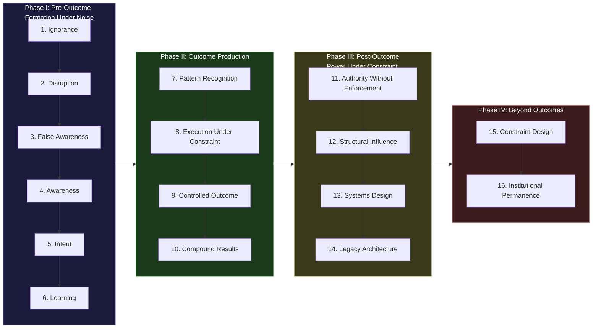

# E2E Human Progression Model

Most developmental models are linear, optimistic, and incomplete. They assume that learning leads to mastery, mastery leads to success, and success leads to impact. Reality is not that clean.

The E2E (End-to-End) Human Progression Model maps the **actual** arc of human development — including the phases that nobody talks about: the ego damage of learning, the false awareness that precedes real awareness, the contested nature of every transition, and the post-outcome phases where power must operate under constraint to survive.

This model is the developmental backbone of the AINEFF Human Management System (HMS). It defines what "progression" means for every AINEOUTM (team member) in the ecosystem and provides the framework for measuring, supporting, and governing human development at scale.

---

## The Four Macro-Phases

The 16 phases organize into four macro-phases, each with fundamentally different dynamics:

---

## Phase I — Pre-Outcome: Formation Under Noise

These are the phases before a person can reliably produce meaningful results. Most people spend their entire lives oscillating within Phase I. This is not failure — it is the natural condition of a complex system encountering an overwhelming environment.

### Phase 1: Ignorance

**The state of not knowing that you do not know.**

This is not stupidity. It is the default condition of every human in every domain they have not yet encountered. A brilliant physicist is in Phase 1 regarding governance architecture. A master chef is in Phase 1 regarding quantum computing. Ignorance is domain-specific and universal.

- **Characteristic behavior:** Confidence without basis. Opinions formed from proximity (what you grew up around) rather than investigation.
- **Emotional signature:** Comfort. Ignorance is painless — that is why it persists.
- **Exit condition:** Encounter with disruption that cannot be ignored.
- **AINEFF system touchpoint:** The WGE (Work Genesis Engine) must never assign work to someone in Phase 1 for the relevant domain. The diagnostic systems must be able to detect Phase 1 without the person self-reporting it (they cannot — they do not know what they do not know).

### Phase 2: Disruption / Friction

**The state of encountering evidence that your current model is wrong, incomplete, or inadequate.**

Something breaks the comfortable ignorance — a failure, an encounter with someone operating at a higher phase, exposure to a domain you did not know existed, or a crisis that reveals the inadequacy of your current understanding.

- **Characteristic behavior:** Confusion, defensiveness, or fascination. The response to disruption reveals character: some people lean in, most retreat.
- **Emotional signature:** Discomfort. The first taste of cognitive dissonance.
- **Exit condition:** Engagement with the disruption rather than retreat from it.
- **AINEFF system touchpoint:** HMS must distinguish between productive disruption (growth catalyst) and destructive disruption (trauma, exploitation). Not all friction is developmental — some is simply damage.

### Phase 3: False Awareness

**The state of believing you understand when you do not.**

This is the most dangerous phase. After disruption, the mind seeks resolution — and usually finds it too quickly. You read one book, attend one seminar, have one conversation with an expert, and suddenly you feel like you "get it." You do not. You have replaced ignorance with a slightly more sophisticated form of ignorance.

- **Characteristic behavior:** Overconfident explanation of complex topics. Name-dropping of concepts without deep understanding. "I just learned about first-principles thinking and now I apply it to everything."
- **Emotional signature:** Excitement, evangelical energy. The Dunning-Kruger peak.
- **Exit condition:** Encounter with a problem that the false model cannot solve, followed by intellectual honesty about the failure.
- **AINEFF system touchpoint:** The CPE (Cognitive Post-Processing Engine) must apply falsification and steel-manning to outputs from people in Phase 3. The most confidently wrong conclusions come from this phase.

### Phase 4: Awareness (Corrected)

**The state of genuinely understanding the shape and boundaries of a domain — including what you do not know.**

True awareness is characterized not by confidence but by calibrated uncertainty. You know what you know, you know what you do not know, and you have a rough map of the domain's structure. This is where real learning can begin.

- **Characteristic behavior:** Asking better questions. Acknowledging uncertainty. Seeking expert input rather than dispensing amateur conclusions.
- **Emotional signature:** Humility mixed with curiosity. The valley after the Dunning-Kruger peak.
- **Exit condition:** Formation of genuine intent to develop competence in the domain.
- **AINEFF system touchpoint:** This is the earliest phase at which an AINEOUTM can be meaningfully assigned to a learning pathway. Before Phase 4, training is premature — the person does not yet have the conceptual scaffolding to receive structured knowledge.

### Phase 5: Intent

**The state of having made a genuine commitment to develop competence, with understanding of the cost.**

Intent is not desire. Desire is "I wish I could play piano." Intent is "I am going to practice piano for one hour every day for two years, and I understand that the first six months will feel like failure." Intent includes awareness of the sacrifice, the timeline, and the probability of failure.

- **Characteristic behavior:** Resource allocation (time, money, attention) toward the commitment. Saying no to other things. Building systems and routines that support the intent.
- **Emotional signature:** Resolve. Not excitement (that was Phase 3). Resolve is quieter and more durable.
- **Exit condition:** Beginning the actual learning process.
- **AINEFF system touchpoint:** HMS must validate intent before allocating expensive training resources. The difference between Phase 3 enthusiasm and Phase 5 intent is the difference between a wasted investment and a productive one.

### Phase 6: Learning (Ego Damage)

**The state of actively acquiring competence while repeatedly confronting your own inadequacy.**

Real learning hurts. It requires doing things badly, receiving critical feedback, failing publicly, and revising your self-image. The ego damage is not a side effect — it is the mechanism. You cannot learn to be competent without first experiencing incompetence, and experiencing incompetence when you have committed to competence is painful.

- **Characteristic behavior:** Practice, failure, feedback, adjustment. Visible struggle. Asking for help. Producing work that is below the standard you can now see but not yet meet.
- **Emotional signature:** Frustration, self-doubt, occasional despair. Punctuated by moments of breakthrough that provide just enough reinforcement to continue.
- **Exit condition:** Pattern recognition — the ability to see the underlying structure of the domain, not just its surface features.
- **AINEFF system touchpoint:** HMS must provide psychological safety during Phase 6. The ecosystem must normalize ego damage as developmental, not pathological. FMS (Failure Management System) must classify Phase 6 failures as learning investments, not performance deficiencies.

---

## Phase II — Outcome Production

These are the phases where a person can reliably produce meaningful, verifiable results. The transition from Phase I to Phase II is the most significant developmental threshold — it is where potential becomes capability.

### Phase 7: Pattern Recognition

**The ability to perceive the underlying structure of a domain — to see signal through noise.**

Pattern recognition is the bridge between learning and execution. You stop seeing individual problems and start seeing categories of problems. You stop memorizing solutions and start deriving them from principles. The domain becomes legible.

- **Characteristic behavior:** Faster diagnosis. Ability to predict outcomes before they occur. Seeing connections that novices miss. "This is the same problem as..."
- **Emotional signature:** Growing confidence — calibrated this time, not false.
- **Exit condition:** Ability to produce results under real-world constraints (not just in controlled environments).
- **AINEFF system touchpoint:** This is where the Skills Ontology (AINEOUTMJS) begins to register real capability. Before Phase 7, skills are aspirational. At Phase 7, they are functional.

### Phase 8: Execution Under Constraint

**The ability to produce results in the real world — with incomplete information, limited resources, political friction, and time pressure.**

The gap between knowing and doing is immense. Phase 8 closes it. You can now produce outcomes not just in theory or in practice environments but in the messy, constrained, adversarial conditions of actual work.

- **Characteristic behavior:** Delivering under pressure. Adapting plans when conditions change. Producing acceptable results with inadequate resources. Making trade-offs without paralysis.
- **Emotional signature:** Professional confidence. The feeling of "I can handle this."
- **Exit condition:** Ability to produce results consistently and predictably, not just occasionally.
- **AINEFF system touchpoint:** This is the minimum phase for autonomous work assignment. The WGE can begin routing real work to individuals at Phase 8. The ORF (Obligation & Responsibility Finality Protocol) can assign genuine accountability.

### Phase 9: Controlled Outcome Generation

**The ability to reliably produce specific, intended outcomes — not just "good results" but the exact results you aimed for.**

The difference between Phase 8 and Phase 9 is control. Phase 8 produces results; Phase 9 produces the results you specified in advance. This requires deep understanding of the causal chain from action to outcome, including second- and third-order effects.

- **Characteristic behavior:** Precision. Predictability. The ability to estimate effort, timeline, and probability of success with high accuracy. "I will deliver X by Y with Z% confidence."
- **Emotional signature:** Quiet mastery. The absence of anxiety about whether things will work.
- **Exit condition:** Results begin compounding — each outcome builds on previous ones, creating exponential rather than linear progress.
- **AINEFF system touchpoint:** Phase 9 operators are eligible for AINEOUT (team) leadership. They can be trusted with outcome accountability, not just task accountability.

### Phase 10: Compound Results

**The state where outputs multiply — each result creates leverage for the next, and the trajectory becomes exponential.**

Compound results are the product of accumulated skill, reputation, network, knowledge, and infrastructure. A Phase 10 operator does not just do good work — their work creates conditions for more good work. Their reputation opens doors, their knowledge enables shortcuts, their network provides resources, and their infrastructure automates routine tasks.

- **Characteristic behavior:** Increasing output with decreasing effort. Building systems rather than doing tasks. Attracting opportunities rather than seeking them. "Making it look easy."
- **Emotional signature:** Flow. Momentum. The feeling of riding a wave you helped create.
- **Exit condition:** Recognition by others that your authority exceeds your formal position — the transition from "competent" to "authoritative."
- **AINEFF system touchpoint:** Phase 10 operators are candidates for AINEOU (organizational unit) leadership. The IRMS (Identity & Role Management System) should track compound trajectories, not just current performance.

---

## Phase III — Post-Outcome: Power Under Constraint

These phases describe what happens after a person has demonstrated the ability to produce results. The challenge shifts from "can you do it?" to "can you wield the power that success creates without being corrupted by it?"

### Phase 11: Authority Without Enforcement

**Influence that operates through credibility and respect rather than formal power or coercion.**

This is the hallmark of genuine authority. People follow your guidance not because you can punish them for disobedience but because they trust your judgment. You do not need to enforce compliance — your track record does it for you.

- **Characteristic behavior:** People seek your opinion voluntarily. Decisions you recommend get implemented without you pushing. Your presence in a room changes the quality of the conversation.
- **Emotional signature:** Responsibility. The weight of knowing that people will act on your words.
- **Exit condition:** Ability to influence structures and systems, not just individuals.
- **AINEFF system touchpoint:** Phase 11 is the minimum for governance roles. MAGE (Meta-Agent Governance Engine) should weight the input of Phase 11+ individuals differently than Phase 8 individuals — not autocratically, but through calibrated credibility.

### Phase 12: Structural Influence

**The ability to shape the systems, processes, and structures that others operate within.**

Structural influence is the transition from changing outcomes to changing the conditions that produce outcomes. You are no longer just playing the game — you are modifying the rules, the board, and the incentive structures.

- **Characteristic behavior:** Redesigning processes. Establishing standards. Creating roles and teams. Setting precedents that persist beyond your direct involvement.
- **Emotional signature:** Strategic patience. Understanding that structural changes take time to manifest.
- **Exit condition:** Ability to design systems that produce desired outcomes without your direct involvement.
- **AINEFF system touchpoint:** Phase 12 operators are candidates for AINE (enterprise) leadership. The AGK (Autonomous Governance Kernel) should be designed by Phase 12+ individuals.

### Phase 13: Systems Design

**The ability to create self-sustaining systems — machines that run without the designer's ongoing presence.**

This is the phase where an individual's contribution transcends their personal involvement. The systems they design continue to produce outcomes, train people, enforce standards, and adapt to change long after the designer has moved on.

- **Characteristic behavior:** Building organizations, frameworks, and protocols that outlast you. Creating documentation, governance, and succession planning as core deliverables, not afterthoughts.
- **Emotional signature:** Detachment. The ability to let go of personal control because the system handles it.
- **Exit condition:** Systems designed begin to produce outcomes that surprise even their designer — emergent behavior that exceeds the original design intent.
- **AINEFF system touchpoint:** The entire AINEFF Ecosystem is a Phase 13 artifact — a system designed to produce outcomes at civilizational scale. Phase 13 operators design AINEG (enterprise group) governance structures.

### Phase 14: Legacy Architecture

**The creation of structures that persist across generations — outliving the creator.**

Legacy architecture is not about fame or reputation. It is about creating durable institutional structures that continue to serve their function long after the architect is gone. Think of the designers of constitutional frameworks, not the politicians who operate within them.

- **Characteristic behavior:** Constitutional thinking. Multi-generational planning. Creating constraints that bind future actors (including yourself). Investing in institutional memory and succession.
- **Emotional signature:** Mortality awareness transformed into design motivation. "This must outlive me."
- **Exit condition:** Transition from creating structures to creating the meta-structures that govern how future structures are created.
- **AINEFF system touchpoint:** AINEFF itself — the non-operating foundation, the constitutional framework — is a legacy architecture artifact. Phase 14 operators design AINEFF-level governance.

---

## Phase IV — Beyond Outcomes

These final phases transcend individual achievement entirely. They describe the rare condition of operating at the level of civilization infrastructure.

### Phase 15: Constraint Design

**The ability to define the boundaries within which all other actors operate — to set the rules of the game itself.**

Constraint designers do not play games. They do not design games. They design the constraints that determine which games are possible. This is the level of constitutional design, protocol architecture, and civilizational infrastructure.

- **Characteristic behavior:** Defining what is and is not permissible at a structural level. Creating irreversible commitments. Setting constraints that bind even the constraint designer.
- **Emotional signature:** Extreme responsibility. The awareness that your constraints will affect people you will never meet, in situations you cannot predict.
- **Exit condition:** Constraints become so deeply embedded that they are perceived as "reality" rather than "design choices."
- **AINEFF system touchpoint:** The Atomic Constraint is a Phase 15 artifact. The ORF protocol is Phase 15 design. Phase 15 is the level at which the AINEFF constitutional framework operates.

### Phase 16: Institutional Permanence

**The state where designed structures have become indistinguishable from the operating environment — terrain, not architecture.**

This is the final phase: the designed system has become so deeply integrated into the fabric of institutional reality that it is no longer perceived as a system at all. It is simply "how things work." TCP/IP is at Phase 16. Double-entry bookkeeping is at Phase 16. The Westphalian state system is at Phase 16.

- **Characteristic behavior:** Invisibility. The system works so well that nobody thinks about it. Removal would be unthinkable — not because it is sacred, but because everything else depends on it.
- **Emotional signature:** (There is no emotional signature. The person who designed it is likely dead. The system persists as terrain.)
- **Exit condition:** There is no exit from Phase 16. By definition, it is permanent. It can only be replaced by another Phase 16 system, not reformed from within.
- **AINEFF system touchpoint:** Phase 16 is the ecosystem's stated end-state: "When nobody talks about the AINEFF Ecosystem because it is simply how things work, we will have succeeded."

---

## Critical Properties of the Model

### 1. Non-Linearity

The model is presented as sequential phases, but progression is **not linear**. Individuals can:

- Skip phases (rare, usually indicates Phase 3 misdiagnosis)
- Regress to earlier phases (common, especially under stress or in new domains)
- Occupy different phases simultaneously in different domains
- Get permanently stuck at any phase

There is no guaranteed trajectory. Most people stabilize somewhere in Phases 1-6. Phase 10+ is rare. Phase 14+ is extremely rare.

### 2. Recursion

Every phase contains a fractal version of the entire model within it. Learning to learn (Phase 6 about Phase 6) is itself a 16-phase journey. Designing systems for designing systems (Phase 13 about Phase 13) is its own complete progression. The model is self-similar at every scale.

### 3. Contestation at Every Phase

No transition between phases is automatic or uncontested. At every boundary, there are forces pushing you back:

| Transition | Contesting Force |
|---|---|
| 1 to 2 | Comfort of ignorance; social pressure to not "rock the boat" |
| 2 to 3 | Desire for quick resolution; market for false certainty |
| 3 to 4 | Ego investment in false model; sunk cost of prior learning |
| 4 to 5 | Fear of commitment; awareness of the real cost of development |
| 5 to 6 | Pain of ego damage; social stigma of visible incompetence |
| 6 to 7 | Premature pattern-matching; mistaking noise for signal |
| 7 to 8 | Gap between theoretical knowledge and practical execution |
| 8 to 9 | Satisfaction with "good enough"; resistance to precision discipline |
| 9 to 10 | Failure to invest in compounding assets; short-term optimization |
| 10 to 11 | Confusing positional authority with earned authority |
| 11 to 12 | Reluctance to cede individual control for structural influence |
| 12 to 13 | Inability to design systems that operate without your presence |
| 13 to 14 | Failure to think beyond your own lifespan; mortality denial |
| 14 to 15 | Resistance to constraining your own future freedom of action |
| 15 to 16 | External forces; competing systems; entropy |

### 4. Domain-Specificity

A person at Phase 12 in software engineering may be at Phase 3 in governance design. The model applies per-domain, not per-person. The M-Shaped Mind (see [The M-Shaped Mind](./m-shaped-mind)) describes the cognitive architecture needed to hold multiple domains at different phases simultaneously.

---

## Integration with AINEFF Systems

| AINEFF System | How It Uses the Model |
|---|---|
| **HMS (Human Management System)** | Tracks each AINEOUTM's phase per-domain; designs development pathways; matches assignments to phase |
| **WGE (Work Genesis Engine)** | Routes work to operators at appropriate phases; rejects assignments where phase mismatch would cause failure |
| **FMS (Failure Management System)** | Classifies failures by phase context — Phase 6 failure is learning investment; Phase 9 failure is performance issue |
| **IRMS (Identity & Role Management System)** | Maps roles to minimum phase requirements; prevents premature authority assignment |
| **HAAS (Human Accountability & Audit System)** | Scales accountability expectations to developmental phase; Phase 8 accountability differs from Phase 14 accountability |
| **MAGE (Meta-Agent Governance Engine)** | Weights governance input by demonstrated phase; Phase 12+ input carries different weight than Phase 7 input |
| **PIAR (Pre-Incident Accountability Review)** | Assesses whether the humans in an accountability chain are at appropriate phases for the obligations they hold |

---

## The Model's Own Limitation

This model is itself a knowledge artifact subject to all the constraints it describes. It was designed by humans at particular developmental phases, with particular belief system commitments, at a particular moment in time. It should be:

- **Treated as a living document** — updated as new evidence about human development emerges
- **Subject to falsification** — if the model's predictions about progression fail, the model must be revised
- **Used with epistemic humility** — no model of human development is complete, and this one makes claims that cannot yet be fully validated

The model is a tool, not a truth. Use it accordingly.
