# Knowledge Substrate

Every system in the AINEFF Ecosystem rests on something deeper than code, capital, or governance. It rests on **knowledge** — the raw cognitive substrate from which all structure is extracted, all decisions are made, and all authority is legitimized.

This section documents that substrate. Not the systems built on top of it, but the **thinking, knowing, believing, and learning** that make those systems possible.

---

## Why This Layer Exists

Most organizations treat knowledge as an afterthought — something that lives in people's heads, in scattered documents, in tribal lore that evaporates when employees leave. The AINEFF Ecosystem treats knowledge as **foundational infrastructure**, as critical as compute or capital.

The Knowledge Substrate is **Level 8** of the ecosystem — the deepest layer, sitting beneath even the constitutional framework. It is the ground truth from which everything else is derived:

- **Governance** derives from epistemological commitments about what can be known and verified
- **Systems** derive from thinking tools applied to coordination problems
- **Execution** derives from learning models that compress expertise into repeatable capability
- **Authority** derives from belief systems that communities recognize as legitimate
- **Talent** derives from cognitive architectures that match operators to wicked environments

Without an explicit, auditable knowledge substrate, an organization is building on sand. With one, it can reason about its own reasoning — the prerequisite for true autonomy.

---

## What This Section Contains

| Page | Focus | Key Question Answered |
|---|---|---|
| [60+ Thinking Tools](./thinking-tools) | Cognitive instruments | What are the named methods for structured thought? |
| [Knowledge Container Taxonomy](./knowledge-containers) | Storage and transmission | In what forms does knowledge exist, persist, and propagate? |
| [Learning Domain Taxonomy](./learning-categories) | Subject-matter map | What are the complete domains of human learning? |
| [Belief Systems Taxonomy](./belief-systems) | Ideological substrate | What are the systems of meaning that shape institutions and individuals? |
| [E2E Human Progression Model](./e2e-human-progression) | Developmental arc | How do humans progress from ignorance to institutional permanence? |
| [The M-Shaped Mind](./m-shaped-mind) | Cognitive architecture | What mental shape survives in wicked, rule-changing environments? |
| [Agentic User Experience](./agentic-ux) | Human-AI interaction | What does it feel like when autonomous agents work on your behalf? |

---

## The Knowledge-to-System Pipeline

Knowledge does not sit idle in the AINEFF Ecosystem. It flows through a defined pipeline:

```mermaid
flowchart LR
    subgraph Substrate["Knowledge Substrate (This Section)"]
        direction TB
        TT["Thinking Tools"]
        KC["Knowledge Containers"]
        BS["Belief Systems"]
        LD["Learning Domains"]
        HP["Human Progression"]
    end

    subgraph Processing["Cognitive Processing"]
        direction TB
        GRIL["GRIL — Grounded Retrieval"]
        CPE["CPE — Cognitive Post-Processing"]
        OMG["OMG — Orchestrated Memory"]
    end

    subgraph Application["Operational Systems"]
        direction TB
        GKMS["GKMS — Governance Knowledge"]
        KIMS["KIMS — Knowledge Integrity"]
        WGE["WGE — Work Genesis Engine"]
    end

    Substrate -->|"Raw material"| Processing
    Processing -->|"Structured intelligence"| Application

    style Substrate fill:#1a1a3a,stroke:#6a6aba,color:#fff
    style Processing fill:#1a3a1a,stroke:#6aba6a,color:#fff
    style Application fill:#3a1a1a,stroke:#ba6a6a,color:#fff
```

1. **Thinking Tools** supply the reasoning methods that the Cognitive Post-Processing Engine (CPE) applies to raw information
2. **Knowledge Containers** define the formats that the Governance Knowledge Management System (GKMS) can ingest and audit
3. **Learning Domains** feed the Skills Ontology that powers every AINEOUTMJS (skill-level) assignment
4. **Belief Systems** inform the System of Meaning that AINEFF's constitutional neutrality must navigate
5. **Human Progression** models the developmental arc that the Human Management System (HMS) tracks and supports

---

## Design Principles for the Knowledge Layer

1. **Explicit over implicit** — If a thinking tool, knowledge type, or belief system influences a decision, it must be nameable and auditable. No hidden epistemics.

2. **Taxonomic completeness** — The goal is not to list "some useful tools." It is to map the **entire space** of cognitive instruments, knowledge forms, and belief structures so that gaps become visible.

3. **Neutrality of substrate** — The Knowledge Substrate documents belief systems without endorsing them. It catalogs thinking tools without prescribing them. It maps learning domains without ranking them. The substrate is terrain, not ideology.

4. **Composability** — Thinking tools compose with knowledge containers. Learning domains compose with belief systems. The M-Shaped Mind composes with the Human Progression Model. Every element in this layer is designed to interlock with others.

5. **Machine-readability trajectory** — While this documentation is human-readable, every taxonomy here is designed to eventually become a machine-readable ontology that autonomous agents can query, apply, and reason over.

---

## How to Read This Section

**Start with [Thinking Tools](./thinking-tools)** to understand the cognitive instruments available. Then read [Knowledge Containers](./knowledge-containers) to understand where knowledge lives. [Learning Domains](./learning-categories) maps the subject-matter space. [Belief Systems](./belief-systems) maps the ideological space. [E2E Human Progression](./e2e-human-progression) provides the developmental model. [The M-Shaped Mind](./m-shaped-mind) describes the ideal cognitive architecture. And [Agentic UX](./agentic-ux) bridges all of this into the human-AI interaction layer.

Each page is self-contained but cross-references its neighbors. The substrate is designed to be explored in any order after this overview.
