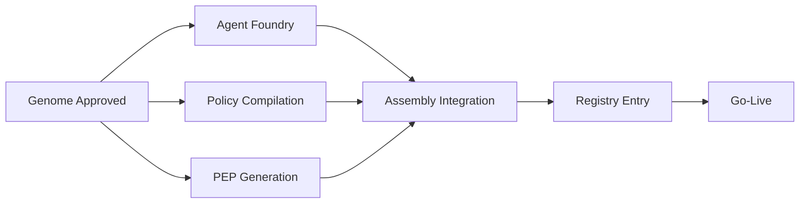
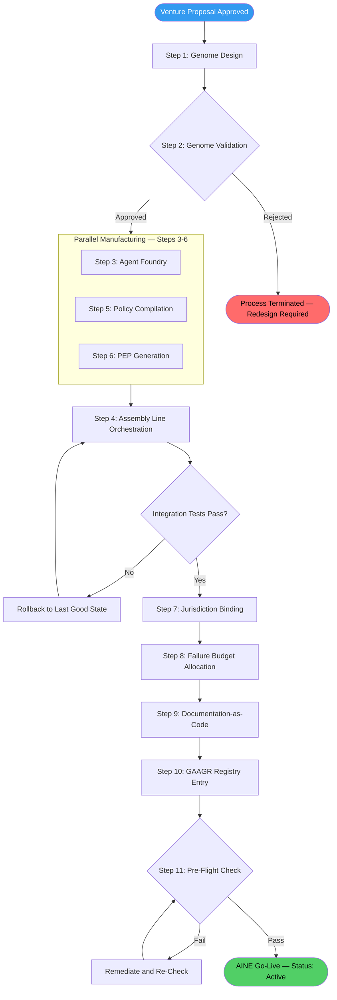

# SOP: AINE Creation & Manufacturing

This SOP governs the end-to-end process of creating a new AINE (Single Productive Enterprise) within the AINEFF Ecosystem. An AINE is not improvised. It is **manufactured** — assembled from validated components, constrained by compiled policy, and registered in the global registry before it executes a single task.

---

## Trigger

This procedure is initiated when **all** of the following conditions are met:

- A venture proposal has been submitted and approved through the Capital Allocation process.
- A validated AINE Genome has been produced specifying industry, jurisdiction, risk profile, and ethical constraints.
- Capital envelope has been allocated and approved.
- A sponsoring entity (AINEF OS or AINEG) has accepted manufacturing responsibility.

---

## Roles

| Role | Responsibility |
|------|---------------|
| **EMS Operator** | Orchestrates the entire manufacturing pipeline; owns the timeline |
| **Genome Designer** | Designs the AINE-Genome.json based on venture requirements |
| **Validation Committee** | Reviews and approves/rejects the genome; rejection is final |
| **Agent Foundry Engineer** | Instantiates AI agents from AINEFF-approved templates |
| **Policy Compiler** | Translates legal and regulatory requirements into executable constraints |
| **PEP Architect** | Generates and seals the Private Execution Protocol |
| **GAAGR Registry Operator** | Creates and maintains the AINE's entry in the Global AINE & Agent Governance Registry |
| **Kill-Switch Operator** | Configures failure budgets and termination triggers |

---

## Steps

### Step 1: Genome Design

**Owner:** Genome Designer
**Duration:** 4–16 hours

| Input | Output |
|-------|--------|
| Industry vertical | `AINE-Genome.json` |
| Target jurisdiction(s) | Genome Design Rationale Document |
| Risk tolerance profile | |
| Ethical constraint set | |
| Revenue model parameters | |

The Genome Designer produces the `AINE-Genome.json` file, which encodes:

- **Identity**: Name, codename, version, sponsoring entity
- **Mandate**: What this AINE is authorized to do (and explicitly not do)
- **Jurisdiction**: Legal jurisdictions and applicable regulations
- **Risk Profile**: Risk appetite, failure tolerance, insurance requirements
- **Ethics Constraints**: Hard boundaries that cannot be overridden at runtime
- **Revenue Model**: Pricing structure, margin targets, capital requirements
- **Agent Requirements**: What AI agents are needed and their capability profiles
- **Kill Criteria**: Pre-defined conditions that trigger automatic termination

### Step 2: Genome Validation

**Owner:** Validation Committee
**Duration:** 2–8 hours

The Validation Committee reviews the genome against:

- Constitutional compliance (AINEFF mandates)
- Jurisdictional feasibility
- Risk/return profile acceptability
- Ethical constraint completeness
- Conflict with existing AINEs in the portfolio

:::danger
**Rejection is final.** If the Validation Committee rejects a genome, the process terminates. A new genome must be designed from scratch — patching a rejected genome is not permitted. This prevents governance erosion through incremental weakening.
:::

**Artifacts:** Validation Report (approved/rejected), Reviewer Sign-off Records

### Step 3: Agent Foundry

**Owner:** Agent Foundry Engineer
**Duration:** 4–12 hours

AI agents are instantiated from **AINEFF-approved templates only**. No custom agent architectures are permitted without Constitutional amendment.

- Select agent templates matching genome requirements
- Configure agent parameters within template bounds
- Generate agent identity keys
- Bind agents to the AINE's governance namespace

**Artifacts:** Agent Manifest, Agent Configuration Files, Agent Identity Certificates

### Step 4: Assembly Line Orchestration

**Owner:** EMS Operator
**Duration:** 2–8 hours

The EMS Operator constructs the **dependency DAG** (Directed Acyclic Graph) that defines:

- Component assembly order
- Parallel vs. sequential dependencies
- Integration test gates between components
- Rollback points at each assembly stage

**Artifacts:** Assembly DAG, Integration Test Results, Rollback Manifest

### Step 5: Policy Compilation

**Owner:** Policy Compiler
**Duration:** 4–24 hours (varies by jurisdiction complexity)

Legal and regulatory requirements are translated into **executable constraints** — machine-readable policy that governs agent behavior at runtime.

- Ingest applicable laws and regulations for target jurisdiction(s)
- Map legal requirements to technical constraints
- Compile constraints into executable policy rules
- Validate compiled policy against legal source material
- Generate policy compliance attestation

**Artifacts:** Compiled Policy Package, Legal-to-Technical Mapping, Compliance Attestation

### Step 6: PEP Generation

**Owner:** PEP Architect
**Duration:** 2–4 hours

The **Private Execution Protocol (PEP)** is the AINE's unique sealed protocol that governs its internal operations while maintaining privacy.

- Generate unique cryptographic keys
- Seal the execution protocol
- Configure privacy boundaries (what is visible externally vs. internally)
- Bind PEP to the AINE's governance namespace
- Test PEP seal integrity

:::warning
PEP keys are generated once and sealed. There is no key recovery procedure. Loss of PEP keys triggers AINE termination. See [AINE Termination SOP](./aine-termination-sop).
:::

**Artifacts:** Sealed PEP, PEP Integrity Certificate, Key Escrow Records (sealed)

### Step 7: Jurisdiction Binding

**Owner:** Policy Compiler + Legal
**Duration:** 2–8 hours

- Register the AINE as a legal entity in the target jurisdiction(s)
- Bind legal identity to the AINE's cryptographic identity
- Configure jurisdiction-specific reporting requirements
- Establish regulatory communication channels
- Verify tax registration and compliance obligations

**Artifacts:** Legal Entity Registration, Jurisdiction Binding Certificate, Regulatory Channel Configuration

### Step 8: Failure Budget Allocation

**Owner:** Kill-Switch Operator
**Duration:** 1–2 hours

- Define the failure budget (capital, time, reputation, compliance deviations)
- Configure automatic kill triggers tied to budget exhaustion
- Set warning thresholds at 50%, 75%, and 90% of budget consumption
- Test kill-switch activation and verify clean shutdown capability

**Artifacts:** Failure Budget Document, Kill-Switch Configuration, Kill-Switch Test Report

### Step 9: Documentation-as-Code Generation

**Owner:** EMS Operator
**Duration:** 1–4 hours

All AINE documentation is generated as code — version-controlled, auditable, and linked to the governance trail.

- Generate operational runbook
- Generate governance documentation
- Generate API documentation (if applicable)
- Generate client-facing documentation
- Generate audit documentation

**Artifacts:** Documentation Package (in repository), Documentation Integrity Hash

### Step 10: GAAGR Registry Entry

**Owner:** GAAGR Registry Operator
**Duration:** 30 minutes–1 hour

The AINE is registered in the **Global AINE & Agent Governance Registry (GAAGR)**:

- Create AINE record with status: `Pending Go-Live`
- Register all agents under the AINE's governance namespace
- Link to genome, PEP, policy package, and failure budget
- Publish registry entry to all ecosystem entities with need-to-know

**Artifacts:** GAAGR Registry Entry, Registry Confirmation Receipt

### Step 11: Go-Live with Monitoring

**Owner:** EMS Operator
**Duration:** 1–4 hours

- Execute pre-flight checklist (all artifacts present, all tests passing, all registrations complete)
- Activate AINE in production environment
- Begin 24-hour intensive monitoring window
- Verify telemetry flows to ACTS (Accountability Chain Tracking System)
- Update GAAGR status: `Active`
- Notify all stakeholders of successful go-live

**Artifacts:** Go-Live Checklist (signed), Monitoring Dashboard Configuration, Stakeholder Notification Records

---

## End-to-End Process Flow

---

## Kill & Rollback Procedures

At any point during manufacturing, the process can be aborted:

| Stage | Rollback Action |
|-------|----------------|
| Steps 1-2 (Design/Validation) | No artifacts to clean up beyond documents |
| Step 3 (Agent Foundry) | Destroy agent instances, revoke identity keys |
| Step 4 (Assembly) | Rollback to last good DAG state or full teardown |
| Steps 5-6 (Policy/PEP) | Destroy compiled policy and PEP keys |
| Step 7 (Jurisdiction) | Initiate legal entity dissolution |
| Steps 8-11 (Budget through Go-Live) | Full teardown, GAAGR entry marked `Aborted` |

**Post-abort:** All artifacts are sealed and archived for audit purposes. Nothing is deleted — only marked as `Aborted` with timestamp and reason.

---

## Service Level Agreements

| AINE Type | Target Duration | Maximum Duration |
|-----------|----------------|-----------------|
| Standard (unregulated industry) | **48 hours** | 5 business days |
| Regulated industry (finance, healthcare, legal) | **2 weeks** | 30 business days |
| Multi-jurisdiction | **3 weeks** | 45 business days |

:::info
These SLAs measure the time from genome approval (Step 2 complete) to go-live (Step 11 complete). Genome design time (Step 1) is excluded as it depends on venture complexity.
:::

---

## Artifacts Summary

| Step | Artifacts Produced |
|------|--------------------|
| 1 | AINE-Genome.json, Genome Design Rationale |
| 2 | Validation Report, Reviewer Sign-offs |
| 3 | Agent Manifest, Agent Configs, Identity Certificates |
| 4 | Assembly DAG, Integration Test Results, Rollback Manifest |
| 5 | Compiled Policy Package, Legal-Technical Mapping, Compliance Attestation |
| 6 | Sealed PEP, PEP Integrity Certificate, Key Escrow Records |
| 7 | Legal Entity Registration, Jurisdiction Binding Certificate |
| 8 | Failure Budget Document, Kill-Switch Config, Kill-Switch Test Report |
| 9 | Documentation Package, Documentation Integrity Hash |
| 10 | GAAGR Registry Entry, Registry Confirmation |
| 11 | Go-Live Checklist, Monitoring Config, Stakeholder Notifications |
