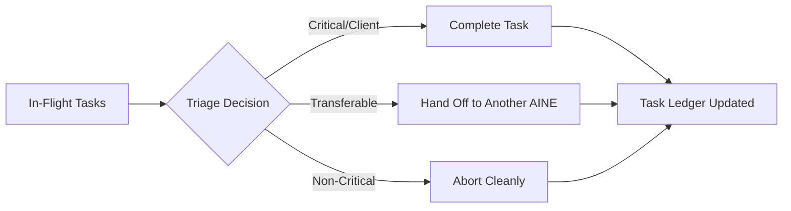
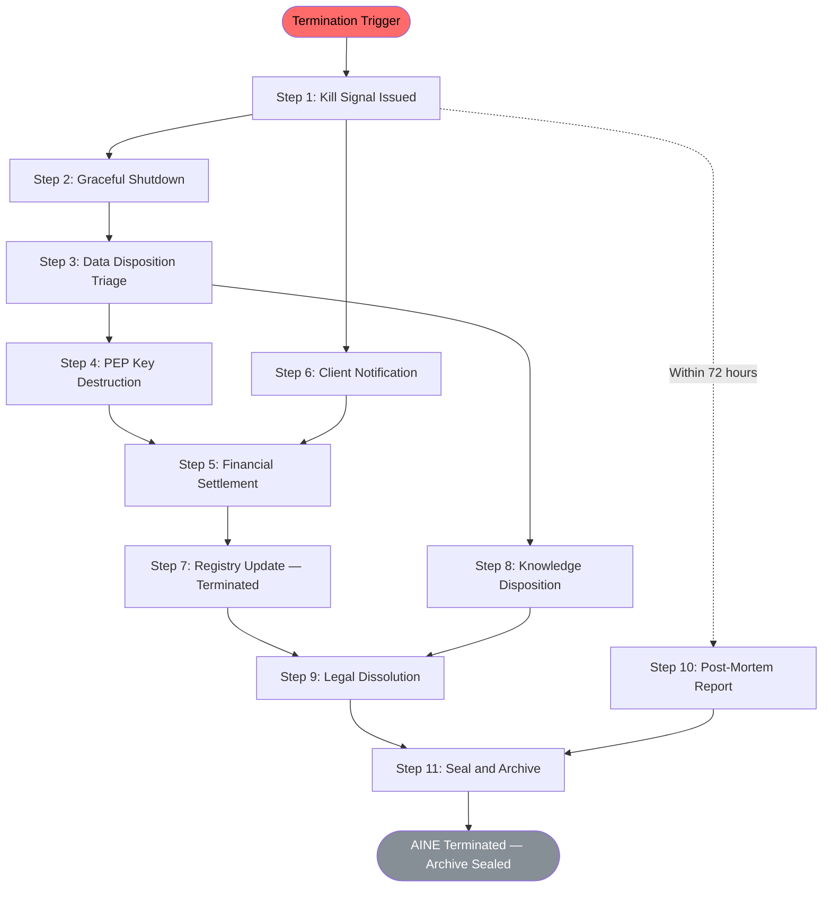

# SOP: AINE Termination & Exit

This SOP governs the controlled shutdown, dissolution, and archival of an AINE (Single Productive Enterprise). Termination is not failure — it is a **designed capability**. Every AINE is built with termination as a first-class feature. The ecosystem's strength comes from its ability to kill ventures cleanly, not from keeping them alive artificially.

---

## Trigger Conditions

An AINE termination is initiated when **any** of the following conditions are met:

| Trigger | Authority | Response Type |
|---------|-----------|--------------|
| **Kill criteria met** | Automatic (system-triggered) | Emergency or Orderly |
| **Failure budget exhausted** | Automatic (system-triggered) | Emergency |
| **Mandate expired** | Scheduled | Orderly |
| **Regulatory order** | External (regulator) | Emergency |
| **Constitutional violation** | Frankmax / AINEFF | Emergency |
| **Portfolio optimization** | AINEG / Capital Allocation Committee | Orderly |
| **Voluntary dissolution** | AINE operators + AINEG approval | Orderly |

---

## Roles

| Role | Responsibility |
|------|---------------|
| **Kill-Switch Operator** | Initiates the kill signal and monitors shutdown sequence |
| **Exit Orchestrator** | Manages the end-to-end termination workflow |
| **Legal Counsel** | Handles contractual obligations, client notifications, and dissolution filings |
| **Finance Lead** | Manages financial settlement, revenue distribution, and capital recovery |
| **Data Steward** | Executes data disposition triage and knowledge preservation |
| **GAAGR Registry Operator** | Updates registry status throughout the process |
| **Post-Mortem Lead** | Conducts and documents the post-mortem review |

---

## Steps

### Step 1: Kill Signal Issued

**Owner:** Kill-Switch Operator
**Duration:** Immediate (automated) or < 1 hour (manual)

- Kill signal is generated (automatically from budget exhaustion or manually from authorized personnel)
- Signal is cryptographically signed by the issuing authority
- Signal is broadcast to all AINE subsystems simultaneously
- GAAGR status updated: `Active` → `Terminating`
- All new task acceptance is halted immediately
- All external API endpoints begin returning `503 — Service Terminating`

**Artifacts:** Kill Signal Record (signed), GAAGR Status Change Log

### Step 2: Task Completion / Graceful Shutdown

**Owner:** Exit Orchestrator
**Duration:** 1–24 hours (emergency) / 1–7 days (orderly)

- In-flight tasks are triaged: complete, hand off, or abort
- Client-facing tasks prioritized for completion or clean handoff
- Internal tasks are cancelled unless completion is necessary for audit trail
- All agent processes receive shutdown signals
- Agents complete current atomic operations and halt

**Artifacts:** Task Disposition Report, Agent Shutdown Confirmations

### Step 3: Data Disposition Triage

**Owner:** Data Steward
**Duration:** 4–48 hours

Every data asset is classified into one of three categories:

| Disposition | Criteria | Action |
|-------------|----------|--------|
| **Inherit** | Valuable to ecosystem, no privacy restrictions | Transfer to AINEG knowledge base or surviving AINEs |
| **Archive** | Required for compliance/audit, not operationally useful | Seal and archive with retention schedule |
| **Destroy** | Client-private, PEP-internal, or legally required to destroy | Cryptographic destruction with verification |

**Artifacts:** Data Disposition Manifest, Data Transfer Records, Destruction Certificates

### Step 4: PEP Key Destruction

**Owner:** Kill-Switch Operator + PEP Architect (if available)
**Duration:** 1–2 hours

- All PEP (Private Execution Protocol) cryptographic keys are destroyed
- Key destruction is cryptographically verified and witnessed
- PEP-sealed data becomes permanently inaccessible
- Key destruction certificates are generated and stored in GAAGR

:::danger
**PEP key destruction is irreversible.** Once executed, no data sealed under the PEP can ever be recovered. This step must be explicitly authorized and cannot be automated.
:::

**Artifacts:** Key Destruction Certificate (witnessed), PEP Seal Verification (final)

### Step 5: Financial Settlement

**Owner:** Finance Lead
**Duration:** 1–14 days

- Outstanding invoices collected or written off
- Outstanding payables settled
- Revenue share distributions calculated and executed
- Capital recovery initiated (return unused capital to ecosystem treasury)
- Tax obligations calculated and provisioned
- Insurance claims filed (if applicable)
- Final financial statement produced

**Artifacts:** Final Financial Statement, Settlement Records, Tax Provision, Insurance Claims

### Step 6: Client Notification

**Owner:** Legal Counsel + Exit Orchestrator
**Duration:** Immediate upon Step 1, with follow-ups

- All active clients notified of termination (within 24 hours of kill signal)
- Transition plans offered (alternative AINE, external referral, or data export)
- Contractual obligations reviewed and fulfilled or settled
- Client data exported in requested format
- Service level commitments honored through transition period

**Artifacts:** Client Notification Records, Transition Plans, Contractual Settlement Records

### Step 7: Registry Update

**Owner:** GAAGR Registry Operator
**Duration:** 30 minutes

- GAAGR status updated: `Terminating` → `Terminated`
- Termination reason, date, and authorizing party recorded
- All agent registrations under this AINE marked `Decommissioned`
- Cross-references updated (linked AINEs, shared resources)

**Artifacts:** GAAGR Registry Update Confirmation

### Step 8: Knowledge Disposition Execution

**Owner:** Data Steward
**Duration:** 1–7 days

Execute the knowledge disposition plan from Step 3:

- **Inherited knowledge** transferred and validated in target systems
- **Archived data** sealed with retention schedule metadata
- **Destroyed data** cryptographically erased with verification
- Knowledge graph updated — all AINE nodes marked as terminated
- Operational learnings extracted and added to ecosystem knowledge base

**Artifacts:** Knowledge Transfer Receipts, Archive Seal Certificates, Destruction Verification Logs

### Step 9: Legal Dissolution Certificate

**Owner:** Legal Counsel
**Duration:** 1–30 days (jurisdiction-dependent)

- Legal entity dissolution filed in all registered jurisdictions
- Tax clearance obtained
- Regulatory deregistration completed
- Dissolution certificate obtained and filed

**Artifacts:** Dissolution Filing Receipts, Tax Clearance Certificates, Dissolution Certificate

### Step 10: Post-Mortem Report

**Owner:** Post-Mortem Lead
**Duration:** 2–5 days (must begin within 72 hours of kill signal)

The post-mortem report documents:

- **What happened:** Timeline of events leading to termination
- **Why it happened:** Root cause analysis (market, execution, governance, external shock)
- **What we learned:** Lessons applicable to future AINE design and operation
- **What we would change:** Specific recommendations for process improvement
- **Genome analysis:** Was the genome flawed, or was execution the issue?
- **Governance analysis:** Did governance catch the problem in time?
- **Financial analysis:** Was capital used efficiently? What was the total cost?

**Artifacts:** Post-Mortem Report, Lessons Learned Document, Genome Retrospective

### Step 11: Seal and Archive

**Owner:** Exit Orchestrator
**Duration:** 1–2 days

- All termination artifacts are collected into a single sealed archive
- Archive is cryptographically signed by the Exit Orchestrator and Legal Counsel
- Archive is stored in the ecosystem's permanent audit repository
- Archive retention: **Permanent** (termination records are never deleted)
- Final confirmation sent to all stakeholders

**Artifacts:** Sealed Termination Archive, Final Confirmation Records

---

## End-to-End Process Flow

---

## Time Bounds

| Scenario | Total Duration | Key Constraint |
|----------|---------------|----------------|
| **Emergency kill** (regulatory, constitutional violation) | **72 hours maximum** | Steps 1-4 must complete within 24 hours |
| **Budget exhaustion** | **7 days** | Financial settlement may extend to 14 days |
| **Orderly wind-down** (mandate expiry, portfolio optimization) | **30 days** | Client transition period drives the timeline |

---

## Emergency Kill Sequence

For P0/P1 events requiring immediate shutdown:

In an emergency kill:
- **All operations freeze immediately** — no graceful task completion
- **Network isolation** is applied to prevent contagion
- **Forensic data is preserved** before any destruction occurs
- **PEP keys are destroyed** within 4 hours
- **Post-mortem begins immediately**, not after 72 hours

---

## Post-Termination Obligations

Even after an AINE is terminated and archived, certain obligations persist:

| Obligation | Duration | Owner |
|------------|----------|-------|
| Client data retention (as contractually required) | Per contract | Data Steward |
| Tax records | 7 years (or jurisdiction requirement) | Finance |
| Audit trail | Permanent | GAAGR Registry |
| Regulatory reporting | Per regulatory requirement | Legal |
| Post-mortem lessons in knowledge base | Permanent | Knowledge Team |
