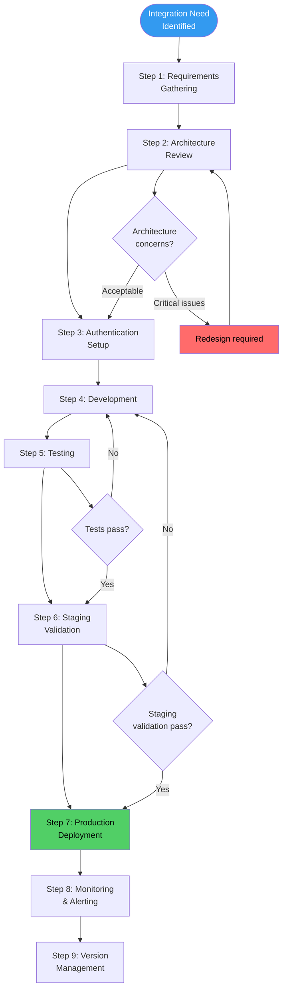
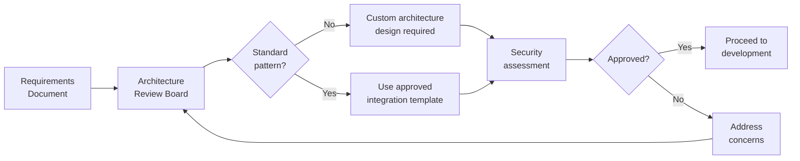
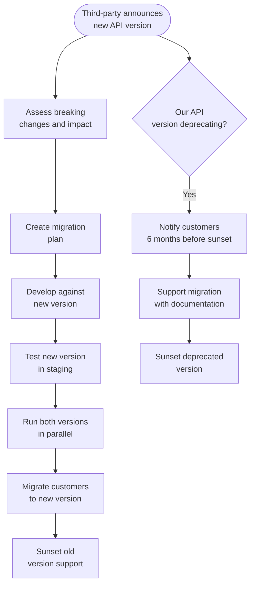

---

sidebar_position: 22
title: "SOP: Third-Party Integration & API Management"
description: "Complete Standard Operating Procedure for managing third-party integrations and APIs — including integration lifecycle, authentication standards, rate limiting, error handling, webhook management, version deprecation, and monitoring."
tags: [sop, operational, technical]
custom_status: active
custom_owner: Andrew Leo
custom_last_review: 2026-03-01
custom_next_review: 2026-06-01
---

# SOP: Third-Party Integration & API Management

The AINEFF Ecosystem's products -- DocuFlow and others -- do not exist in isolation. They connect to customer systems, external services, payment processors, communication platforms, and data providers. Every integration is a **trust boundary** -- a point where the ecosystem's systems meet systems we do not control. Failures at integration points cascade unpredictably, and security breaches at integration points expose both sides.

This SOP defines how integrations are designed, built, tested, deployed, monitored, and retired across their full lifecycle.

---

## Overview

The integration lifecycle follows a nine-stage pipeline from requirements through ongoing management. Every integration must pass through each stage -- there are no shortcuts for "simple" integrations, because integration complexity is almost always underestimated. The depth of each stage scales with integration criticality, but every stage must be addressed.

---

## Trigger / When to Use

| Trigger | Action | Timeline |
|---------|--------|----------|
| New customer requires system integration | Full integration lifecycle initiated | Begin within 5 business days of contract signing |
| Existing integration requires version upgrade | Version management process triggered | Plan within 14 days of upgrade notification |
| Third-party API announces deprecation | Deprecation response plan initiated | Immediate assessment, migration plan within 30 days |
| Integration health alert fires | Incident triage + remediation | Per incident severity (see Incident Response SOP) |
| New product feature requires external API | Architecture review before development begins | Review completed before sprint planning |
| Customer reports integration failure | Support triage + investigation | Initial response within 4 hours |
| Quarterly integration health review | Review all active integrations | Completed within 2 weeks of quarter end |

---

## Roles & Responsibilities

| Role | Responsibility |
|------|---------------|
| **Integration Engineer** | Designs, builds, tests, and maintains integrations |
| **Architecture Reviewer** | Reviews integration architecture for security, scalability, and standards compliance |
| **Security Lead** | Reviews authentication design, conducts security assessment, manages credential rotation |
| **Cell Lead** | Approves integration requests, manages prioritization |
| **Customer Success Operator** | Manages customer communication during integration setup, handles support escalations |
| **DevOps/Infrastructure** | Manages deployment, monitoring, and infrastructure for integrations |
| **Product Owner** | Defines integration requirements from product and customer perspective |

---

## Process Flow

---

## Step-by-Step Procedure

### Step 1: Requirements Gathering (Days 1-5)

**Owner:** Product Owner + Integration Engineer
**Duration:** 3-5 business days

| Requirement Area | Questions to Answer |
|-----------------|-------------------|
| **Functional scope** | What data flows between systems? In which direction? What triggers the flow? |
| **Data format** | JSON, XML, CSV, binary? Schema definitions? |
| **Volume** | Expected requests per minute/hour/day? Burst patterns? |
| **Latency** | Maximum acceptable response time? Async or sync? |
| **Availability** | Required uptime? Acceptable degradation modes? |
| **Security** | Data sensitivity classification? Compliance requirements (GDPR, HIPAA, SOC 2)? |
| **Customer environment** | On-premise, cloud, hybrid? Firewall restrictions? IP whitelisting? |
| **Error handling** | What happens when the integration fails? Retry? Queue? Alert? |
| **Versioning** | How does the third party handle API versioning? What is their deprecation policy? |

**Artifacts:** Integration Requirements Document, Data Flow Diagram

### Step 2: Architecture Review (Days 5-8)

**Owner:** Architecture Reviewer + Security Lead
**Duration:** 2-3 business days

Architecture review checklist:

| Check | Standard |
|-------|----------|
| **Authentication method** | Must use OAuth 2.0, API keys with rotation, or mTLS |
| **Data encryption** | TLS 1.2+ in transit, AES-256 at rest for sensitive data |
| **Rate limiting** | Client-side rate limiting implemented (do not rely on server-side only) |
| **Circuit breaker** | Circuit breaker pattern implemented for all external calls |
| **Retry strategy** | Exponential backoff with jitter, maximum 5 retries |
| **Idempotency** | All write operations must be idempotent |
| **Timeout configuration** | Connection timeout: 5s, read timeout: 30s (adjustable per integration) |
| **Logging** | All API calls logged with request ID, status, duration (no sensitive data in logs) |
| **Fallback behavior** | Defined degradation mode when integration is unavailable |

### Step 3: Authentication Setup (Days 8-10)

**Owner:** Integration Engineer + Security Lead
**Duration:** 2 business days

| Authentication Standard | When to Use | Implementation |
|------------------------|-------------|---------------|
| **OAuth 2.0 (Client Credentials)** | Server-to-server integrations | Preferred for most third-party APIs |
| **OAuth 2.0 (Authorization Code + PKCE)** | User-facing integrations | When customer users authorize access |
| **API Keys** | Simple read-only integrations | Rotated every 90 days, stored in secrets manager |
| **mTLS (Mutual TLS)** | High-security or financial integrations | Certificate-based mutual authentication |
| **Webhook Signatures** | Inbound webhook verification | HMAC-SHA256 signature verification |

**Credential management rules:**

| Rule | Implementation |
|------|---------------|
| No credentials in code | All credentials in secrets manager (e.g., GCP Secret Manager, Vault) |
| Automatic rotation | API keys rotated every 90 days; OAuth tokens refreshed per expiry |
| Least privilege | Integration credentials scoped to minimum required permissions |
| Separate credentials per environment | Dev, staging, and production use different credentials |
| Credential audit trail | All credential access logged and auditable |
| Emergency revocation | Credentials can be revoked within 15 minutes if compromised |

### Step 4: Development (Days 10-20)

**Owner:** Integration Engineer
**Duration:** 5-10 business days

Development follows standard coding practices plus integration-specific requirements:

| Requirement | Standard |
|-------------|----------|
| **SDK or direct API** | Use official SDKs when available; direct HTTP when SDKs are immature or restrictive |
| **Error mapping** | Map third-party error codes to ecosystem error taxonomy |
| **Retry logic** | Implement exponential backoff: base 1s, multiplier 2x, max 5 retries, max delay 30s |
| **Circuit breaker** | Open after 5 consecutive failures, half-open after 30s, close after 3 successes |
| **Request/response logging** | Log correlation ID, HTTP method, URL, status code, duration (redact sensitive fields) |
| **Webhook processing** | Verify signature, deduplicate by event ID, process asynchronously |
| **Configuration** | All integration parameters externalized (not hardcoded) |
| **Feature flags** | New integrations behind feature flags for gradual rollout |

### Step 5: Testing (Days 20-25)

**Owner:** Integration Engineer + QA
**Duration:** 3-5 business days

| Test Type | Scope | Pass Criteria |
|-----------|-------|---------------|
| **Unit tests** | Individual integration functions | 100% of critical paths covered |
| **Integration tests** | End-to-end with sandbox/test environment | All data flows work as specified |
| **Contract tests** | Verify API contract compliance | Request/response schemas validated |
| **Error handling tests** | Simulate failures, timeouts, malformed responses | Graceful degradation, no data loss |
| **Rate limit tests** | Verify behavior at and above rate limits | Backoff works correctly, no cascading failures |
| **Security tests** | Authentication, authorization, injection | No vulnerabilities identified |
| **Load tests** | Simulate expected and peak volume | Performance within latency requirements |

### Step 6: Staging Validation (Days 25-28)

**Owner:** Integration Engineer + Customer Success Operator
**Duration:** 2-3 business days

- Deploy to staging environment with production-like configuration
- Run full integration test suite against staging
- Customer validates data flows in staging (for customer-specific integrations)
- Verify monitoring and alerting configuration
- Confirm rollback procedure works

### Step 7: Production Deployment (Day 28-30)

**Owner:** DevOps/Infrastructure + Integration Engineer
**Duration:** 1-2 business days

Production deployment follows the [System Deployment & Release SOP](./deployment-sop):

- Deploy behind feature flag (disabled)
- Enable for internal testing (dogfood)
- Enable for single customer (canary)
- Monitor for 24 hours
- Enable for all customers (gradual rollout)

### Step 8: Monitoring & Alerting (Ongoing)

**Owner:** DevOps/Infrastructure + Integration Engineer
**Duration:** Continuous

| Metric | Alert Threshold | Response |
|--------|----------------|----------|
| **Error rate** | &gt; 1% of requests for 5 minutes | Page on-call engineer |
| **Latency (P99)** | &gt; 2x baseline for 10 minutes | Alert integration engineer |
| **Availability** | Third-party endpoint down for &gt; 2 minutes | Circuit breaker activates, alert team |
| **Rate limit proximity** | &gt; 80% of rate limit consumed | Alert integration engineer for optimization |
| **Authentication failures** | Any 401/403 from valid credentials | Immediate investigation (possible credential compromise) |
| **Data integrity** | Checksum mismatch or schema violation | Alert + pause processing until investigated |
| **Webhook delivery failures** | &gt; 3 consecutive delivery failures | Retry with backoff, alert after 10 failures |

### Step 9: Version Management (Ongoing)

**Owner:** Integration Engineer + Product Owner
**Duration:** Per version lifecycle

---

## API Version Deprecation Policy (Our APIs)

When the ecosystem deprecates its own API versions that customers consume:

| Phase | Timeline | Action |
|-------|----------|--------|
| **Announcement** | 6 months before sunset | Email notification, documentation update, API response header warning |
| **Active migration support** | Months 1-4 | Migration guides, customer support, parallel version availability |
| **Deprecation warnings** | Months 4-5 | API returns deprecation warnings in response headers |
| **Grace period** | Month 6 | Final warnings, direct outreach to remaining consumers |
| **Sunset** | After 6 months | Old version returns 410 Gone with migration link |

| Deprecation Rule | Standard |
|-----------------|----------|
| Minimum notice period | 6 months for breaking changes |
| Minimum notice period for minor changes | 3 months |
| Maximum concurrent supported versions | 3 (current + 2 previous) |
| Customer communication | Direct email + in-API warnings + documentation |
| Migration support | Published migration guide + API compatibility layer when feasible |

---

## Rate Limiting Policies

### Inbound Rate Limits (Our APIs)

| Tier | Rate Limit | Burst | Use Case |
|------|-----------|-------|----------|
| **Standard** | 100 requests/minute | 150 requests/minute for 30s | Default for all integrations |
| **Professional** | 500 requests/minute | 750 requests/minute for 30s | High-volume customers |
| **Enterprise** | 2,000 requests/minute | 3,000 requests/minute for 30s | Enterprise agreements |
| **Internal** | 5,000 requests/minute | 10,000 requests/minute for 30s | Ecosystem internal services |

### Outbound Rate Respect (Third-Party APIs)

| Strategy | Implementation |
|----------|---------------|
| **Pre-flight check** | Check rate limit headers before making requests |
| **Client-side throttling** | Implement token bucket algorithm for outbound requests |
| **Queue management** | Queue requests when approaching rate limits, process at sustainable rate |
| **Backoff on 429** | Exponential backoff starting at retry-after header value (or 1s default) |
| **Alert on sustained throttling** | Alert if &gt; 20% of requests are rate-limited in a 5-minute window |

---

## Webhook Management

| Aspect | Standard |
|--------|----------|
| **Signature verification** | HMAC-SHA256 with shared secret; reject unsigned webhooks |
| **Idempotency** | Deduplicate by event ID; process each event at most once |
| **Processing model** | Acknowledge immediately (200 OK), process asynchronously |
| **Retry policy** | If our endpoint fails, third party retries per their policy; we implement replay for our outbound webhooks |
| **Outbound retry schedule** | Retry at 1m, 5m, 30m, 2h, 12h, 24h; mark as failed after 6 attempts |
| **Dead letter queue** | Failed webhooks stored in DLQ for manual inspection and replay |
| **Monitoring** | Track delivery rate, processing latency, and failure rate per webhook type |

---

## Customer Integration Onboarding

When a customer sets up an integration with our products:

| Step | Owner | Duration |
|------|-------|----------|
| **Kickoff call** | Customer Success + Integration Engineer | 30-60 minutes |
| **Credential provisioning** | Customer Success | Same day as kickoff |
| **Sandbox testing** | Customer (with our support) | 3-5 business days |
| **Production go-live** | Integration Engineer | 1 business day |
| **Post-go-live monitoring** | Integration Engineer | 7 days enhanced monitoring |
| **Handoff to support** | Customer Success | After 7-day monitoring period |

---

## Artifacts / Outputs

| Artifact | Produced By | Retention |
|----------|------------|-----------|
| Integration Requirements Document | Product Owner | Duration of integration + 2 years |
| Architecture Review Record | Architecture Reviewer | Duration of integration + 2 years |
| Security Assessment | Security Lead | Duration of integration + 2 years |
| Test Results (all types) | Integration Engineer | Duration of integration + 1 year |
| Deployment Record | DevOps | Duration of integration + 2 years |
| Monitoring Configuration | DevOps | Current (version-controlled) |
| API Documentation (published) | Integration Engineer | Current + archived versions |
| Customer Integration Runbook | Customer Success | Duration of customer relationship |
| Deprecation Communication Records | Product Owner | 3 years after sunset |

---

## Time Bounds / SLAs

| Activity | SLA |
|----------|-----|
| Requirements to architecture review | &lt; 5 business days |
| Architecture review completion | &lt; 3 business days |
| Development (standard integration) | &lt; 10 business days |
| Testing completion | &lt; 5 business days |
| Staging validation | &lt; 3 business days |
| Total requirements to production (standard) | &lt; 30 business days |
| Customer integration onboarding | &lt; 10 business days from kickoff |
| Integration incident response | Per Incident Response SOP severity |
| Deprecation notice to customers | &gt; 6 months before sunset |
| Version migration support | Available for full deprecation period |
| Credential rotation | Every 90 days (automated) |

---

## Kill Criteria / Escalation Triggers

| Condition | Escalation |
|-----------|-----------|
| Integration error rate exceeds 5% for &gt; 1 hour | Circuit breaker activates, incident declared (P2 minimum) |
| Third-party API goes down with no ETA | Customer communication within 4 hours, fallback mode activated |
| Security vulnerability discovered in integration | Immediate credential rotation, integration paused pending assessment |
| Customer data exposed through integration failure | P1 incident declared, legal notification, customer communication within 24 hours |
| Third-party announces surprise deprecation (&lt; 3 months notice) | Emergency migration plan, AINE Lead involvement, customer communication |
| Rate limiting causes data loss or customer-visible failure | Immediate architecture review, rate limit tier upgrade |
| Integration development exceeds 2x estimated timeline | Cell Lead review of scope, potential descoping or architecture redesign |

---

## Anti-Patterns

| Anti-Pattern | Why It Fails | Correct Approach |
|-------------|-------------|-----------------|
| **Trusting third-party uptime** | External services fail unpredictably; no SLA is 100% | Implement circuit breakers, fallbacks, and degradation modes |
| **Hardcoded credentials** | Credentials in code get committed, leaked, and are impossible to rotate | Secrets manager with automatic rotation |
| **No rate limiting on our side** | Customers can overwhelm our systems or third-party quotas | Implement tiered rate limiting for all API consumers |
| **Synchronous webhook processing** | Long processing blocks acknowledgment, causing retries and duplicates | Acknowledge immediately, process asynchronously |
| **Ignoring deprecation notices** | Surprise breakage when old versions sunset | Track all third-party deprecation timelines, plan migrations proactively |
| **Testing only the happy path** | Integrations fail in production on errors, timeouts, and edge cases | Test error paths, timeouts, rate limits, malformed data, and partial failures |
| **No monitoring after go-live** | Integration degrades silently until a customer reports it | Comprehensive monitoring from day one with defined alert thresholds |
| **Skipping architecture review** | "Simple" integrations have complex failure modes | Every integration gets architecture review, scaled to complexity |

---

## Cross-References

| Related SOP | Relationship |
|------------|-------------|
| [System Deployment & Release](./deployment-sop) | Integration deployments follow the standard deployment pipeline |
| [Incident Response & External Shocks](./incident-response-sop) | Integration failures are incidents classified by the incident response framework |
| [Client Engagement Lifecycle](./client-engagement-sop) | Customer integrations are often part of engagement delivery |
| [Audit & Compliance Procedures](./audit-sop) | Integration security and data handling are auditable |
| [Knowledge Capture & Playbook Updates](./knowledge-capture-sop) | Integration patterns and lessons are captured in the Technical Playbook |
| [Venture Cell Operations](./venture-cell-sop) | Integration health is reviewed in cell operational rhythms |
