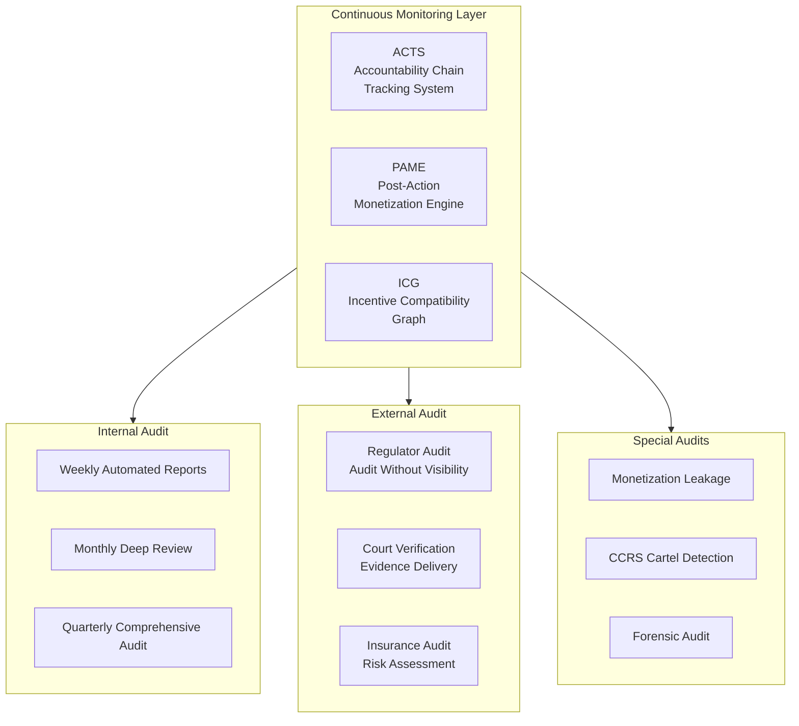
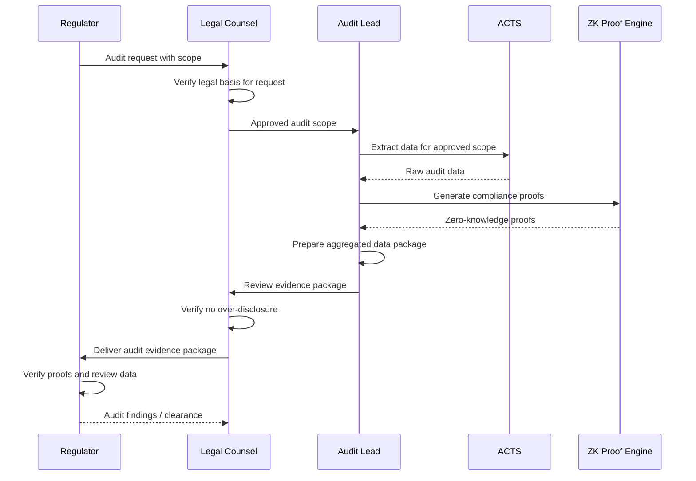
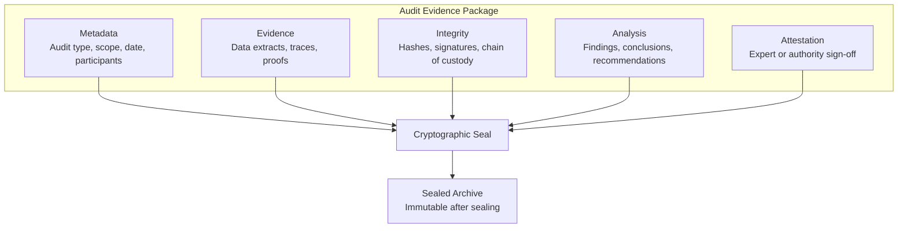
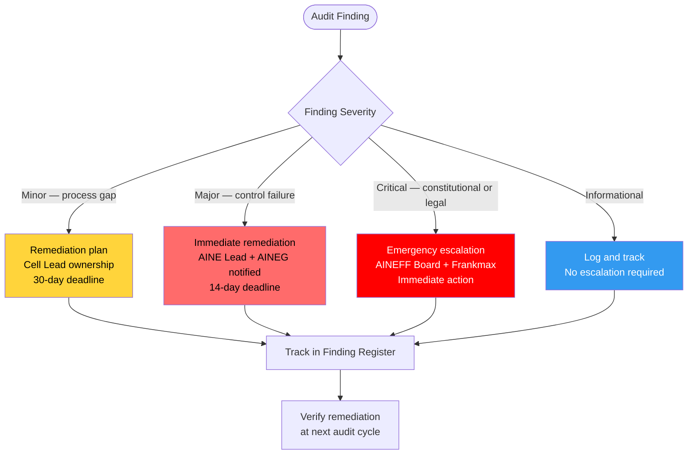

---

sidebar_position: 10
title: "SOP: Audit & Compliance Procedures"
description: "Complete Standard Operating Procedure for audit operations — internal continuous monitoring, external regulator audits, court verification, insurance audits, and monetization leakage detection."
tags: [sop, operational, governance]
custom_status: active
custom_owner: Andrew Leo
custom_last_review: 2026-03-01
custom_next_review: 2026-06-01
---

# SOP: Audit & Compliance Procedures

:::info[Audit Is Continuous, Not Periodic]
The AINEFF Ecosystem treats audit as a continuous, automated function -- not a quarterly event. Every action produces auditable artifacts, every decision has a governance trail, and every financial flow is traceable in real time.
:::

Audit is not a periodic event in the AINEFF Ecosystem — it is a **continuous, automated, layered function**. The ecosystem's constitutional design means that every action produces auditable artifacts, every decision has a governance trail, and every financial flow is traceable. This SOP defines how that audit infrastructure is operated, how external audits are handled without compromising internal privacy, and how evidence is packaged for courts, regulators, and insurers.

---

## Audit Architecture Overview

---

## Internal Audit Cycle

### Continuous Monitoring via ACTS

The Accountability Chain Tracking System (ACTS) provides real-time, continuous monitoring of all ecosystem operations.

| Monitoring Function | Frequency | Output |
|--------------------|-----------|--------|
| **Decision tracking** | Real-time | Every decision linked to PIAR, operator, and authority level |
| **Financial flow monitoring** | Real-time | Every transaction tracked with source, destination, and authorization |
| **Agent behavior monitoring** | Real-time | All AI agent actions logged with policy compliance check |
| **Governance compliance** | Real-time | SOP adherence tracking, deviation alerting |
| **Kill criteria monitoring** | Real-time | Continuous comparison of metrics against kill thresholds |

### Weekly Automated Audit Reports

**Generated:** Every Monday at 06:00 UTC (automated)
**Distribution:** Cell Leads, AINE Leads, AINEG
**Review Required By:** Cell Lead (same day)

| Report Section | Content |
|---------------|---------|
| **Financial summary** | Revenue, costs, capital utilization, anomalies |
| **Governance compliance** | PIAR completion rates, SOP deviations, authority violations |
| **Operational metrics** | Delivery performance, client satisfaction, system health |
| **Risk indicators** | Kill criteria proximity, failure budget utilization, emerging risks |
| **Anomaly flags** | Statistical anomalies in any monitored metric |

### Monthly Deep Review

**Conducted:** First week of each month
**Duration:** 2–4 hours per AINE
**Participants:** Cell Lead, AINE Lead, Audit Lead, Finance Lead

| Review Area | Depth |
|------------|-------|
| **Financial reconciliation** | Line-by-line verification of all financial flows |
| **Governance audit** | Review of all PIARs, rule changes, and authority exercises |
| **Operator performance** | Performance data cross-referenced with governance data |
| **Client engagement** | Contract compliance, deliverable quality, satisfaction trends |
| **System integrity** | Security scan results, access logs, data integrity checks |
| **Knowledge disposition** | Proper handling of sensitive and proprietary information |

**Artifacts:** Monthly Audit Report, Finding Register, Remediation Plan (if findings exist)

### Quarterly Comprehensive Audit

**Conducted:** End of each quarter
**Duration:** Full week
**Participants:** All entity leads, external audit partner (if engaged)

The quarterly audit covers everything in the monthly audit plus:

- Cross-AINE financial reconciliation
- Portfolio-level governance review
- Constitutional compliance assessment
- Rule entropy scoring (feeds into annual pruning)
- Insurance coverage adequacy review
- Regulatory change impact assessment

**Artifacts:** Quarterly Audit Report, Board Summary, Remediation Tracker

---

## External Audit: Regulator-Requested

### Audit Without Visibility (AWV)

When regulators request an audit, the ecosystem provides **verifiable compliance evidence without exposing internal PEP-sealed operations**. This is achieved through:

### AWV Components

| Component | Purpose | What It Shows | What It Hides |
|-----------|---------|---------------|---------------|
| **Zero-knowledge proofs** | Prove compliance without revealing internals | That rules are being followed | How they are being followed |
| **Aggregated data** | Provide statistical evidence | Portfolio-level metrics | Individual AINE internals |
| **Cryptographic commitments** | Prove data integrity | That records have not been tampered with | The actual records |
| **Compliance attestations** | Third-party verification | That an independent party verified compliance | Verification methodology details |

### AWV Procedure

1. **Receive request** — Legal Counsel receives and validates the regulatory audit request
2. **Scope definition** — Determine exactly what the regulator is entitled to see (legal review)
3. **Data extraction** — Audit Lead extracts relevant data from ACTS within approved scope
4. **Proof generation** — Generate zero-knowledge proofs for compliance claims
5. **Data aggregation** — Aggregate individual data to portfolio level (no individual PEP exposure)
6. **Legal review** — Legal Counsel reviews the evidence package for over-disclosure
7. **Delivery** — Evidence package delivered to regulator with cover letter explaining methodology
8. **Follow-up** — Address any regulator questions or additional requests

**Timeline:** 5–15 business days from request to delivery (depending on scope)

**Artifacts:** Audit Request Record, Scope Agreement, Evidence Package, Delivery Confirmation, Follow-up Log

---

## Court Verification: Evidence Delivery

When ecosystem data is required for legal proceedings, the evidence delivery procedure ensures **admissible, verifiable, tamper-evident evidence**.

### Evidence Package Components

| Component | Purpose |
|-----------|---------|
| **Causal traces** | Step-by-step reconstruction of events from ACTS |
| **Cryptographic commitments** | Hash chains proving records were created at the time claimed |
| **Deterministic replay** | Ability to re-execute the event sequence and produce identical results |
| **Chain of custody** | Documented handling of all evidence from creation to delivery |
| **Expert attestation** | Technical expert explanation of evidence methodology |

:::warning[Court Evidence Must Meet Admissibility Standards]
Evidence delivered for legal proceedings must be authentic, tamper-evident, and maintain an unbroken chain of custody. Failure to meet these standards can result in evidence being ruled inadmissible.
:::

### Court Verification Procedure

1. **Legal request received** — Subpoena, discovery request, or voluntary disclosure decision
2. **Scope determination** — Legal Counsel determines what must be disclosed
3. **Evidence extraction** — Audit Lead extracts evidence from ACTS with full chain of custody
4. **Integrity verification** — Verify cryptographic commitments and hash chains
5. **Replay validation** — Conduct deterministic replay to verify causal traces
6. **Expert report** — Technical expert prepares attestation explaining the evidence
7. **Legal packaging** — Evidence packaged in court-admissible format
8. **Delivery** — Evidence delivered through legal channels

**Artifacts:** Evidence Package, Chain of Custody Record, Expert Attestation, Delivery Record

---

## Insurance Audit

Insurance partners require ongoing data feeds to price risk and assess claims.

### Data Feeds for Insurance Pricing

| Data Feed | Frequency | Content |
|-----------|-----------|---------|
| **Risk profile updates** | Monthly | Updated risk metrics per AINE and portfolio-level |
| **Incident reports** | As they occur | P0-P2 incident summaries with financial impact |
| **Governance compliance scores** | Quarterly | PIAR completion, SOP adherence, violation counts |
| **Financial health indicators** | Monthly | Revenue trends, capital utilization, failure budget status |
| **Kill criteria proximity** | Monthly | How close each AINE is to kill thresholds |

### Insurance Claim Evidence

When filing an insurance claim:

1. **Incident documentation** — Complete post-incident review from Incident Response SOP
2. **Financial impact** — Quantified financial damage with supporting evidence
3. **Response documentation** — Evidence that the SOP was followed during response
4. **Causation evidence** — Causal trace from ACTS linking incident to loss
5. **Mitigation evidence** — Steps taken to minimize damage

**Artifacts:** Insurance Data Feed Logs, Claim Package, Insurer Correspondence

---

## Monetization Leakage Audit

### PAME Monitoring

The Post-Action Monetization Engine (PAME) is audited for **value leakage** — situations where value is created but not captured by the ecosystem.

| Leakage Type | Detection Method | Response |
|-------------|-----------------|----------|
| **Unpriced value delivery** | Client receives value not reflected in invoicing | Pricing adjustment or contract amendment |
| **Underpriced engagements** | Revenue per hour falls below target | Pricing review, scope adjustment |
| **Scope creep** | Deliverables exceed contracted scope without pricing | Contract enforcement, PIAR for future engagements |
| **Knowledge leakage** | Proprietary knowledge shared without value capture | IP review, NDA enforcement |
| **Referral value not captured** | Referrals generated but not tracked or compensated | CRM process enforcement |

### ICG Graph Analysis

The Incentive Compatibility Graph (ICG) is analyzed for misaligned incentives that create leakage:

- Are operator incentives aligned with ecosystem value capture?
- Are client engagement structures capturing full value?
- Are inter-AINE transfers priced correctly?
- Are knowledge assets being properly valued?

### CCRS Cartel Detection

The Cartel, Collusion, and Rent-Seeking detection system monitors for:

| Detection Target | Method | Response |
|-----------------|--------|----------|
| **Internal cartels** | Statistical analysis of pricing patterns | Investigation + governance review |
| **Collusive pricing** | Cross-reference with market rates | Price correction |
| **Rent-seeking behavior** | Monitor for value extraction without value creation | Authority review + potential demotion |
| **Shadow transactions** | Anomaly detection in financial flows | Forensic audit |

**Artifacts:** Leakage Report, ICG Analysis, CCRS Detection Report

---

## Audit Evidence Packaging

All audit evidence follows a standardized packaging format:

---

## Audit Trail Retention Periods

| Record Type | Retention Period | Justification |
|-------------|-----------------|---------------|
| Financial transactions | 7 years minimum | Tax and regulatory requirement |
| Governance decisions (PIARs) | Permanent | Constitutional requirement |

:::note[Governance Records Are Permanent]
PIARs, incident records, and audit reports are retained permanently as constitutional requirements. These form the accountability chain of the ecosystem and cannot be deleted.
:::
| Incident records | Permanent | Forensic and learning value |
| Client engagement records | 7 years after engagement end | Contractual and regulatory |
| Operator performance records | Duration of employment + 3 years | Employment law compliance |
| System logs | 2 years rolling | Operational and forensic use |
| Audit reports | Permanent | Governance requirement |
| PEP-sealed data | Until PEP key destruction | Bound to PEP lifecycle |

---

## Escalation Procedures for Audit Findings

| Finding Severity | Escalation Path | Remediation Deadline | Follow-up |
|-----------------|-----------------|---------------------|-----------|
| **Informational** | Logged only | No deadline | Next regular audit |
| **Minor** | Cell Lead | 30 days | Verified at next monthly audit |
| **Major** | AINE Lead + AINEG | 14 days | Dedicated follow-up audit |
| **Critical** | AINEFF Board + Frankmax | Immediate | Continuous monitoring until resolved |

:::danger[Critical Audit Findings Require Immediate Escalation]
Critical findings involving constitutional or legal violations trigger emergency escalation to the AINEFF Board and Frankmax with immediate action required. There is no cooling period for critical findings.
:::
