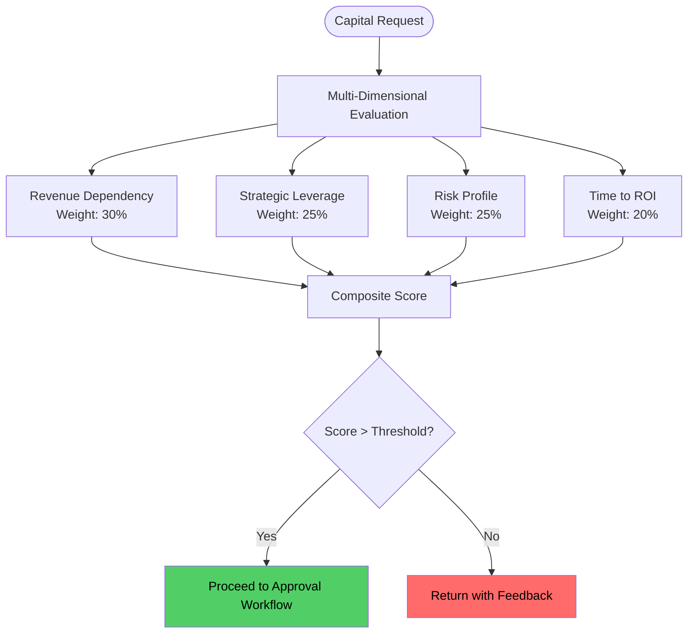
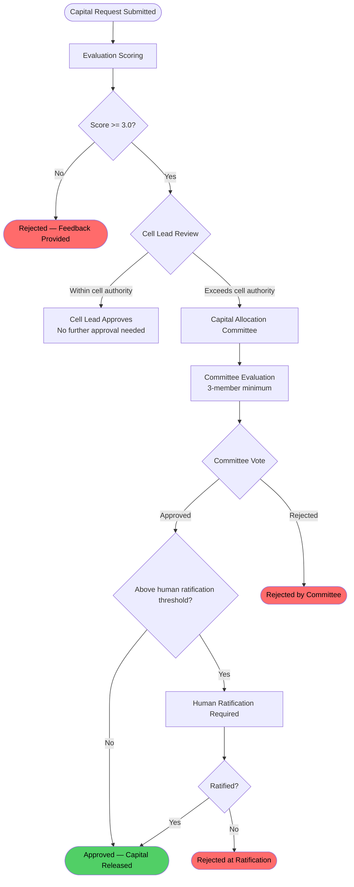
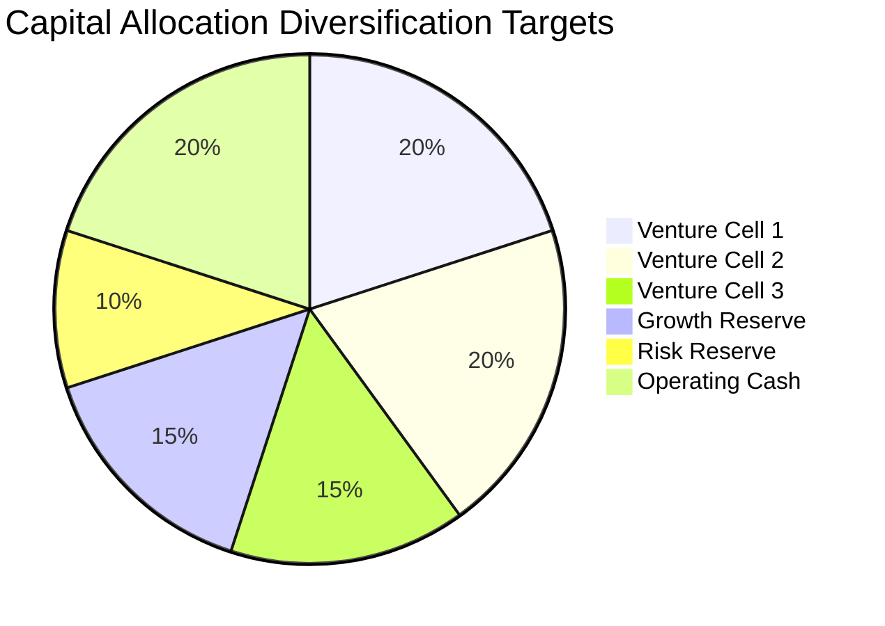
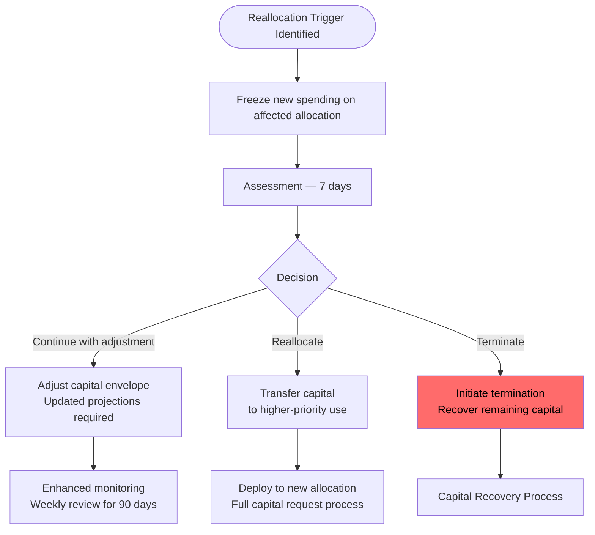
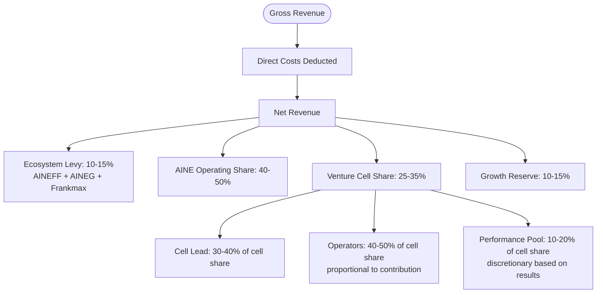

---

sidebar_position: 11
title: "SOP: Capital Allocation & Investment"
description: "Complete Standard Operating Procedure for capital deployment — request submission, evaluation criteria, approval workflow, envelope management, monitoring, and reallocation triggers."
tags: [sop, operational, financial, governance]
custom_status: active
custom_owner: Andrew Leo
custom_last_review: 2026-03-01
custom_next_review: 2026-06-01
---

# SOP: Capital Allocation & Investment

Capital is the fuel of the ecosystem, and its allocation is one of the most consequential governance functions. Every dollar deployed creates both opportunity and obligation. This SOP defines how capital requests are submitted, evaluated, approved, monitored, and — when necessary — reallocated or terminated.

Capital allocation is not a budgeting exercise. It is an **investment decision** subject to the same rigor as any venture capital deployment: clear thesis, defined returns, measurable milestones, and pre-committed kill criteria.

---

## Capital Request Submission

### Who Can Submit

| Operator Stage | Capital Request Authority |
|---------------|--------------------------|
| Stage 1–3 | Cannot submit capital requests |
| Stage 4 (Bounded) | Can submit requests up to micro-budget limit (typically &lt; $500) |
| Stage 5 (Autonomous) | Can submit requests up to cell-level limit (typically &lt; $10,000) |
| Stage 6 (Govern/Allocate) | Can submit requests up to entity-level limit and approve requests within delegation |

### Request Structure

Every capital request must include:

| Section | Content |
|---------|---------|
| **Request summary** | What is requested, how much, and why |
| **Investment thesis** | Why this capital deployment will generate returns |
| **Amount requested** | Specific amount with line-item breakdown |
| **Timeline** | When capital is needed and expected deployment schedule |
| **Expected returns** | Revenue projection with assumptions clearly stated |
| **Time to ROI** | When will this investment generate positive returns? |
| **Risk assessment** | What could go wrong and what is the downside exposure? |
| **Kill criteria** | Pre-defined conditions that would trigger termination of the investment |
| **Alternatives** | What are the alternatives to this capital request? (Including "do nothing") |
| **Strategic alignment** | How does this align with ecosystem strategy and AINE mandate? |

**Artifacts:** Capital Request Document

---

## Evaluation Criteria

Every capital request is evaluated against four dimensions:

### Revenue Dependency (30% weight)

| Score | Criteria |
|-------|----------|
| 5 (Highest) | Direct, measurable revenue generation within 30 days |
| 4 | Revenue generation within 90 days with clear pipeline |
| 3 | Revenue enablement — supports existing revenue streams |
| 2 | Indirect revenue impact — infrastructure, capability building |
| 1 (Lowest) | No clear revenue linkage |

### Strategic Leverage (25% weight)

| Score | Criteria |
|-------|----------|
| 5 (Highest) | Creates compounding advantage — moat, network effect, or platform |
| 4 | Significant strategic positioning in target market |
| 3 | Incremental strategic value — strengthens existing position |
| 2 | Operationally useful but not strategically differentiating |
| 1 (Lowest) | Commodity investment — anyone could do this |

### Risk Profile (25% weight)

| Score | Criteria |
|-------|----------|
| 5 (Lowest risk) | Proven model, validated market, experienced team |
| 4 | Partially validated — some market evidence, capable team |
| 3 | Moderate uncertainty — reasonable thesis but unproven |
| 2 | High uncertainty — speculative thesis, limited evidence |
| 1 (Highest risk) | Highly speculative — novel market, untested approach |

### Time to ROI (20% weight)

| Score | Criteria |
|-------|----------|
| 5 (Fastest) | Positive ROI within 30 days |
| 4 | Positive ROI within 90 days |
| 3 | Positive ROI within 6 months |
| 2 | Positive ROI within 12 months |
| 1 (Slowest) | Positive ROI beyond 12 months |

### Scoring Threshold

- **Score 4.0+** — Strong candidate, proceed to approval
- **Score 3.0–3.9** — Conditional, requires additional justification or risk mitigation
- **Score below 3.0** — Rejected, return with specific feedback for improvement

---

## Approval Workflow

### Approval Thresholds

| Amount | Approval Authority | Additional Requirements |
|--------|-------------------|------------------------|
| &lt; $500 | Operator (Stage 4+) | Log only |
| $500–$5,000 | Cell Lead | Documented rationale |
| $5,000–$25,000 | Capital Allocation Committee (simple majority) | Full capital request + PIAR |
| $25,000–$100,000 | Capital Allocation Committee (supermajority) | Full capital request + PIAR + external review |
| &gt; $100,000 | Committee + Human Ratification | Full capital request + PIAR + external review + Board awareness |

### PIAR Requirement

All capital requests above $5,000 require a completed [Pre-Incident Accountability Review (PIAR)](./piar-sop) that covers:

- Authority verification (does the requester have the authority to request this amount?)
- Liability mapping (who bears the risk if this investment fails?)
- Kill criteria (pre-committed conditions for terminating the investment)
- Assumption surfacing (what are we assuming about the market, timeline, team?)
- Fallback state (what happens to the capital if the investment is terminated?)

---

## Capital Envelope Management

### Maximum Exposure Rules

| Constraint | Limit | Purpose |
|-----------|-------|---------|
| **Per venture cell** | Maximum 30% of total ecosystem capital | Prevent single-cell concentration risk |
| **Per AINE** | Maximum 50% of total ecosystem capital | Prevent single-entity concentration risk |
| **Per industry** | Maximum 40% of total ecosystem capital | Ensure sector diversification |
| **Per jurisdiction** | Maximum 60% of total ecosystem capital | Ensure geographic diversification |
| **Cash reserve** | Minimum 20% of total capital always liquid | Ensure operational continuity |

### Diversification Requirements

The actual allocation will vary based on portfolio composition, but the diversification targets ensure no single concentration creates existential risk.

---

## Monitoring

### Monthly Utilization Review

**Owner:** Cell Lead + Finance Lead
**Frequency:** Monthly (aligned with monthly audit cycle)

| Review Item | Metrics |
|------------|---------|
| **Capital deployed vs. allocated** | Utilization rate, deployment pace |
| **Revenue vs. projection** | Actual revenue compared to capital request projections |
| **Burn rate** | Monthly expenditure rate and remaining runway |
| **Kill criteria proximity** | How close are we to pre-committed kill thresholds? |
| **ROI tracking** | Current return on invested capital |

### Quarterly Performance Assessment

**Owner:** Capital Allocation Committee
**Frequency:** Quarterly (aligned with phase gate reviews)

| Assessment Area | Evaluation |
|----------------|-----------|
| **Investment thesis validation** | Is the original thesis still valid? |
| **Revenue trajectory** | On track, ahead, or behind projections? |
| **Capital efficiency** | Revenue per dollar invested vs. targets |
| **Market conditions** | Have external conditions changed the risk profile? |
| **Team performance** | Is the team executing effectively? |
| **Kill criteria status** | Any kill criteria triggered or approaching? |

---

## Reallocation Triggers

Capital reallocation is triggered when any of the following conditions are met:

| Trigger | Response | Timeline |
|---------|----------|----------|
| **Underperformance** — Revenue below 50% of projection for 2 consecutive months | Review + potential reallocation | 30-day review window |
| **Market shift** — Fundamental market change invalidating investment thesis | Immediate review, potential freeze | 14-day decision deadline |
| **Opportunity cost** — Higher-return opportunity identified requiring reallocation | Comparative analysis + PIAR | 30-day decision deadline |
| **Kill criteria met** — Pre-committed termination condition triggered | Capital recovery initiated | Immediate |
| **Team failure** — Key operator departure or performance collapse | Restructure or terminate | 14-day decision deadline |
| **Regulatory change** — New regulation invalidating the investment | Legal review + freeze | 7-day initial assessment |

### Reallocation Process

---

## Kill Criteria for Funded Initiatives

Every funded initiative must have pre-committed kill criteria. These are defined at the time of capital request and cannot be modified without a PIAR and Committee approval.

### Standard Kill Criteria Template

| Criterion | Threshold | Check Frequency |
|-----------|-----------|-----------------|
| Revenue vs. target | Below 40% for 3 consecutive months | Monthly |
| Capital burn rate | Exceeds 150% of planned rate for 2 months | Monthly |
| Client acquisition | Below 50% of target for 2 consecutive months | Monthly |
| Operator retention | Below 50% of founding team retained | Continuous |
| Regulatory compliance | Any material violation | Continuous |
| Market viability | Investment thesis invalidated | Quarterly |

### Kill Criteria Enforcement

- Kill criteria are **automatically monitored** by ACTS
- Warning alerts at 75% of threshold
- Critical alerts at 90% of threshold
- **Automatic freeze** when kill criteria are met — no new spending authorized
- Cell Lead has 7 days to present a remediation plan or accept termination
- Capital Allocation Committee makes final kill/continue decision

---

## Revenue Share Distribution

### Distribution Waterfall

### Distribution Timing

| Distribution | Timing | Condition |
|-------------|--------|-----------|
| **Ecosystem levy** | Monthly | Automatic deduction from gross revenue |
| **AINE operating share** | Monthly | After levy deduction |
| **Cell share — base** | Monthly | After AINE share allocation |
| **Cell share — performance** | Quarterly | Based on quarterly performance assessment |
| **Growth reserve** | Monthly | Automatically allocated, requires Committee approval to access |
