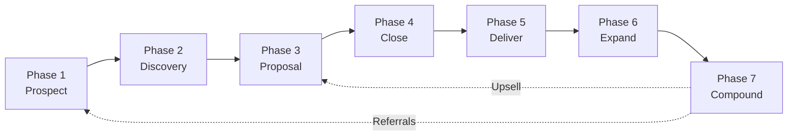
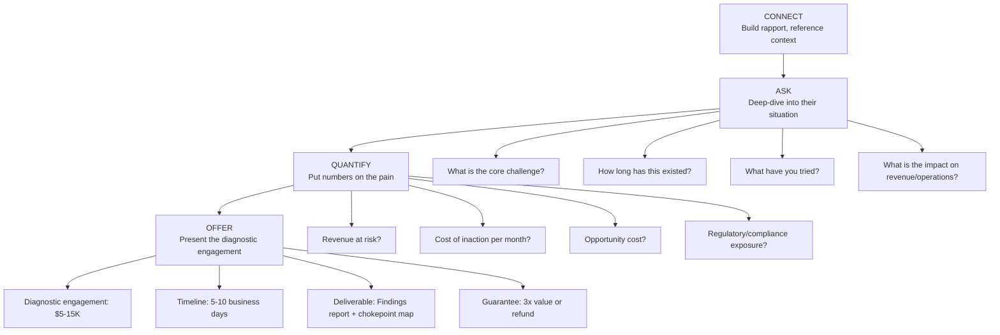
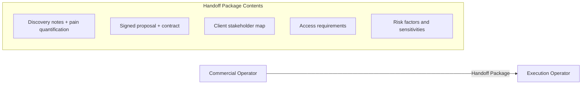
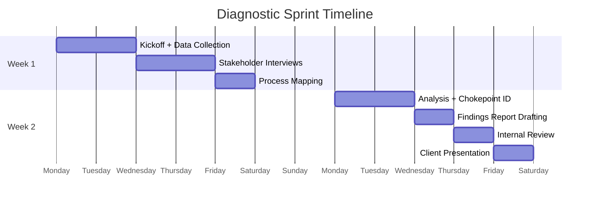
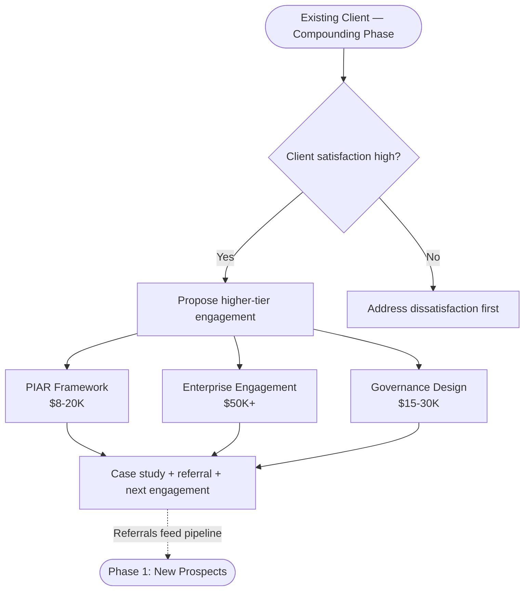
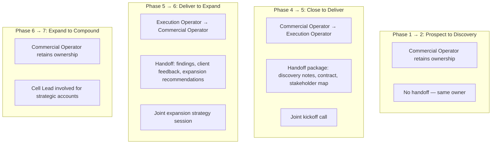

---

sidebar_position: 7
title: "SOP: Client Engagement Lifecycle"
description: "Complete Standard Operating Procedure for the client engagement lifecycle — from first contact through diagnostic, delivery, expansion, and compounding using the CONNECT-ASK-QUANTIFY-OFFER framework."
tags: [sop, operational, frankmax]
custom_status: active
custom_owner: Andrew Leo
custom_last_review: 2026-03-01
custom_next_review: 2026-06-01
---

# SOP: Client Engagement Lifecycle

This SOP governs the complete lifecycle of a client engagement — from the first LinkedIn message to a compounding, long-term relationship that generates recurring revenue and referrals. Every phase has defined activities, artifacts, handoff procedures, and CRM tracking requirements.

---

## The 7-Phase Lifecycle

---

## Phase 1: Prospect

**Owner:** Commercial Operator
**Duration:** Ongoing (pipeline always active)
**CRM Stage:** `Prospect`

### LinkedIn Outreach

The primary prospecting channel is LinkedIn. Outreach follows the **CONNECT** script:

| Element | Purpose |
|---------|---------|
| **C**ontext | Reference something specific about the prospect's situation |
| **O**bservation | Share a relevant insight about their industry/challenge |
| **N**eed | Identify a potential need without being presumptuous |
| **N**ext step | Suggest a low-commitment next action |
| **E**vidence | Provide a brief proof point (case study, metric, insight) |
| **C**all to action | Clear, specific, single ask |
| **T**iming | Reference urgency or relevance to current events |

### Qualification Criteria

Before moving a prospect to Discovery, they must meet the following criteria:

| Criterion | Minimum Threshold |
|-----------|------------------|
| **Budget authority** | Prospect can authorize or influence $5K+ spending |
| **Problem awareness** | Prospect acknowledges a problem in their operations/governance |
| **Timing** | Problem is current (not "someday") |
| **Fit** | Problem falls within our mandate and capability |
| **Engagement** | Prospect has responded and expressed interest in a conversation |

### CRM Tracking

- Prospect record created with source, date, and initial notes
- All outreach activities logged (messages sent, responses received)
- Qualification checklist completed before stage advancement
- Pipeline value estimated (even if rough)

**Artifacts:** Prospect Record, Outreach Log, Qualification Assessment

---

## Phase 2: Discovery

**Owner:** Commercial Operator + Cell Lead (for complex prospects)
**Duration:** Weeks 1–2
**CRM Stage:** `Discovery`

### Free Diagnostic Call

The discovery phase centers on a **free diagnostic call** — a structured conversation designed to quantify the prospect's pain and determine if we can help.

The call follows the **CONNECT-ASK-QUANTIFY-OFFER** framework:

### Pain Quantification

Every discovery conversation must produce a quantified pain number:

| Pain Category | Quantification Method |
|--------------|----------------------|
| Revenue leakage | Annual revenue at risk due to the problem |
| Operational waste | Hours/cost wasted per month |
| Compliance exposure | Potential fines, legal costs, reputational damage |
| Opportunity cost | Revenue not captured due to the problem |

**Target:** Quantified pain should be at least **10x** the proposed engagement cost to ensure clear ROI.

### Disqualification Criteria

Move to `Disqualified` if:
- Pain is not quantifiable or is below $50K annually
- Prospect cannot make a purchasing decision within 30 days
- Problem is outside our mandate and capability
- Prospect is shopping for the lowest price (not value)

**Artifacts:** Discovery Call Notes, Pain Quantification Worksheet, Qualification/Disqualification Decision

---

## Phase 3: Proposal

**Owner:** Commercial Operator
**Duration:** 2–5 business days after discovery
**CRM Stage:** `Proposal`

### Written Proposal Structure

| Section | Content |
|---------|---------|
| **Executive Summary** | 1 paragraph: their problem, our solution, expected outcome |
| **Problem Statement** | Quantified pain from discovery (their numbers, not ours) |
| **Approach** | What we will do, in plain language |
| **Deliverables** | Specific, tangible outputs they will receive |
| **Timeline** | Start date, milestone dates, delivery date |
| **Investment** | Pricing with clear scope |
| **ROI Model** | Expected return based on quantified pain |
| **Guarantee** | 3x value guarantee (see below) |
| **Next Steps** | Exactly how to proceed |

### Pricing Framework

| Engagement Type | Price Range | Duration |
|----------------|------------|----------|
| **Diagnostic** | $5,000–$15,000 | 5–10 business days |
| **Implementation** | $15,000–$50,000 | 4–12 weeks |
| **Retainer** | $2,000–$5,000/month | Ongoing |
| **Governance upgrade (PIAR/Enterprise)** | $8,000–$20,000 | 2–6 weeks |

### The 3x Value Guarantee

Every diagnostic engagement carries a guarantee: **if the client does not receive at least 3x the engagement cost in identified value, the engagement is refunded.** This guarantee:

- Removes risk from the buyer's decision
- Forces us to quantify value rigorously during discovery
- Creates trust and differentiates from competitors
- Has never been triggered (if discovery is done correctly)

**Artifacts:** Written Proposal, ROI Model, Pricing Approval (from Cell Lead if above standard range)

---

## Phase 4: Close

**Owner:** Commercial Operator
**Duration:** 1–5 business days after proposal
**CRM Stage:** `Closed Won` or `Closed Lost`

### Contract Signing

- Standard engagement agreement (pre-approved template)
- Custom terms require Legal review and PIAR if material
- Digital signature (no wet signatures required)
- Scope, deliverables, timeline, and pricing must match proposal exactly

### Payment Terms

| Milestone | Payment | Timing |
|-----------|---------|--------|
| Contract signed | **50% upfront** | Due on signing |
| Delivery complete | **50% on delivery** | Due on final deliverable acceptance |

For retainers: Monthly invoicing, payment due within 15 days.

### Kickoff Scheduling

- Kickoff call scheduled within 5 business days of contract signing
- Client provided with: engagement brief, team introduction, access requirements
- Internal team briefed: engagement scope, client context, deliverables, timeline

### Handoff: Commercial to Delivery

**Artifacts:** Signed Contract, Payment Confirmation (50%), Kickoff Schedule, Handoff Package

---

## Phase 5: Deliver

**Owner:** Execution Operator (with Commercial Operator maintaining relationship)
**Duration:** 5–10 business days (diagnostic) / 4–12 weeks (implementation)
**CRM Stage:** `Delivering`

### Diagnostic Sprint (5–10 Days)

### Deliverables

| Deliverable | Description |
|-------------|------------|
| **Findings Report** | Detailed analysis of current state, identified problems, and quantified impact |
| **Chokepoint Map** | Visual map of operational bottlenecks and governance gaps |
| **Recommendation Roadmap** | Prioritized list of improvements with estimated ROI |
| **Quick Wins** | 3–5 immediate actions the client can take without further engagement |
| **Expansion Proposal** | If applicable, proposed next engagement (delivered separately) |

### Quality Gates

- Internal peer review of all deliverables before client presentation
- Cell Lead sign-off on findings report
- Commercial Operator reviews for client relationship alignment
- All deliverables must reference quantified pain from discovery

### Client Presentation

- Findings presented to client stakeholders (not just emailed)
- Interactive session: questions, clarifications, priority alignment
- Agreement on which recommendations to pursue
- Clear next steps defined

**Artifacts:** Findings Report, Chokepoint Map, Recommendation Roadmap, Client Presentation Recording, Feedback Notes

---

## Phase 6: Expand

**Owner:** Commercial Operator + Cell Lead
**Duration:** 1–4 weeks after delivery
**CRM Stage:** `Expansion`

### Expansion Opportunities

Based on diagnostic findings, propose one or more expansion engagements:

| Expansion Type | Typical Scope | Price Range |
|---------------|---------------|-------------|
| **Monthly retainer** | Ongoing advisory, implementation support, governance coaching | $2,000–$5,000/month |
| **Implementation project** | Execute the recommendations from the diagnostic | $15,000–$50,000 |
| **Governance upgrade** | PIAR framework implementation, governance design, compliance architecture | $8,000–$20,000 |
| **Enterprise engagement** | Multi-department or organization-wide transformation | $50,000+ |

### Expansion Timing

- **Retainer proposal:** Present within 1 week of diagnostic delivery
- **Implementation proposal:** Present during the findings meeting
- **Governance upgrade:** Present when the client recognizes governance gaps
- **Enterprise:** Only after successful diagnostic + at least one expansion

### Expansion Conversion Targets

| Metric | Target |
|--------|--------|
| Diagnostic → Retainer conversion | &gt; 40% |
| Diagnostic → Implementation conversion | &gt; 25% |
| First engagement → Second engagement (any type) | &gt; 50% |
| Client lifetime value (12 months) | &gt; 5x initial diagnostic fee |

**Artifacts:** Expansion Proposal(s), Conversion Tracking, Updated CRM Records

---

## Phase 7: Compound

**Owner:** Commercial Operator + Cell Lead
**Duration:** Ongoing
**CRM Stage:** `Compounding`

### Case Study Production

Every successful engagement should produce a case study:

| Element | Content |
|---------|---------|
| **Situation** | Client context and initial pain |
| **Problem** | Quantified problem statement |
| **Approach** | What we did (methodology, not proprietary detail) |
| **Results** | Quantified outcomes (revenue gained, costs saved, risks mitigated) |
| **Client Quote** | Testimonial from client stakeholder |

Timeline: Case study drafted within 2 weeks of engagement completion, client approval within 4 weeks.

### Referral Request

- Request referral during the "peak satisfaction" moment (usually at findings presentation or first measurable result)
- Ask specifically: "Who else in your network faces similar challenges?"
- Offer referral incentive (if applicable within governance constraints)
- Track referral source in CRM

### Upsell to PIAR / Enterprise

For clients who have completed initial engagements:

**Artifacts:** Case Study, Referral Records, Upsell Proposals, Lifetime Value Tracking

---

## CRM Tracking Requirements

Every client engagement must maintain the following CRM records:

| Data Point | Updated | Owner |
|-----------|---------|-------|
| Current pipeline stage | Real-time | Commercial Operator |
| All communication logs | Real-time | Whoever communicates |
| Pain quantification | At discovery | Commercial Operator |
| Proposal details and status | At proposal | Commercial Operator |
| Contract and payment status | At close | Commercial Operator + Finance |
| Delivery milestones | Weekly during delivery | Execution Operator |
| Client satisfaction score | After each milestone | Commercial Operator |
| Expansion opportunities | Ongoing | Commercial Operator |
| Referral tracking | Ongoing | Commercial Operator |
| Lifetime value | Monthly | Cell Lead |

---

## Handoff Procedures

### Handoff Rules

1. **Every handoff has a package** — no verbal-only handoffs
2. **Joint meeting** at every handoff point — outgoing and incoming owner meet with client together
3. **Client should never feel the handoff** — continuity of experience is paramount
4. **CRM records must be complete** before handoff is accepted
5. **Both parties sign off** on the handoff (accountability transfer)
