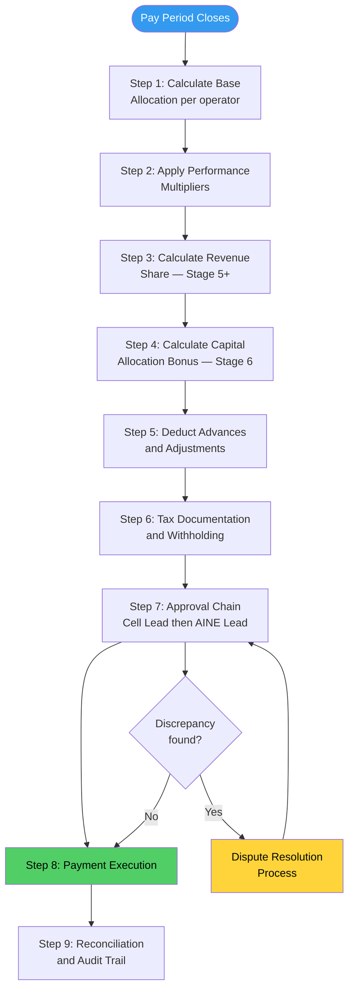
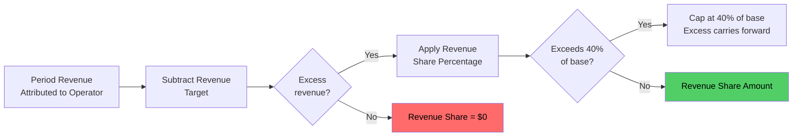
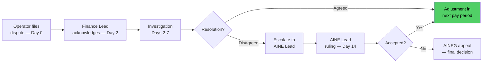

# SOP: Compensation Calculation & Settlement

Compensation in the AINEFF Ecosystem is not a salary negotiation or an opaque HR function. It is a **transparent, formula-driven system** where every operator can calculate their own expected income, verify the calculation, and understand exactly how their performance translates to compensation. The system is designed to be auditable, predictable, and aligned with ecosystem value creation.

This SOP defines how operator income is calculated, verified, approved, and paid for every pay period.

---

## Overview

The compensation system has five components that stack progressively as operators advance through stages:

1. **Base Allocation** -- fixed compensation scaled by stage and market benchmarks
2. **Performance Multiplier** -- variable modifier based on review scores
3. **Revenue Share** -- percentage of cell revenue (Stage 5+)
4. **Capital Allocation Bonus** -- return on capital allocation decisions (Stage 6)
5. **Advance/Draw System** -- early access to earned compensation

Every component has a defined formula, documented inputs, and auditable outputs. No compensation is discretionary or opaque.

---

## Trigger / When to Use

| Trigger | Action | Timeline |
|---------|--------|----------|
| End of pay period (bi-weekly or monthly) | Standard compensation calculation and settlement | Within 5 business days of period close |
| Operator stage change (promotion or demotion) | Compensation adjustment calculation | Effective next full pay period (30-day grace for demotions) |
| Quarterly review completion | Performance multiplier recalculation | Applied to next quarter's pay periods |
| Annual review completion | Base allocation adjustment | Effective first pay period of new fiscal year |
| Operator dispute filed | Dispute resolution process initiated | Acknowledged within 2 business days |
| Advance request submitted | Advance evaluation and processing | Decision within 3 business days |

---

## Roles & Responsibilities

| Role | Responsibility |
|------|---------------|
| **Finance Lead** | Runs compensation calculations, produces pay statements, manages payment execution |
| **Cell Lead** | Validates cell revenue figures, confirms operator performance data, approves cell-level calculations |
| **AINE Lead** | Approves all compensation runs before payment, resolves Cell Lead disputes |
| **Operator** | Reviews pay statement, files disputes within window, manages tax obligations |
| **AINEG Finance** | Audits cross-AINE compensation consistency, manages ecosystem-level compensation budget |
| **External Accountant** | Produces tax documentation, validates compliance with jurisdiction-specific requirements |

---

## Process Flow

---

## Compensation Components

### Component 1: Base Allocation

Base allocation is the fixed compensation component, scaled by operator stage and benchmarked against market rates for the operator's jurisdiction and role equivalent.

| Stage | Base Allocation Range | Market Benchmark |
|-------|----------------------|-----------------|
| Stage 1 (Filter) | $0 | N/A -- no compensation during screening |
| Stage 2 (Observe) | $1,500-$3,000/month | Living stipend, not market-benchmarked |
| Stage 3 (Assist) | 60-70% of market equivalent | Below market -- filters for growth motivation |
| Stage 4 (Execute Bounded) | 90-100% of market equivalent | At market -- competitive base |
| Stage 5 (Execute Autonomous) | 110-130% of market equivalent | Above market -- retains top performers |
| Stage 6 (Govern/Allocate) | 130-160% of market equivalent | Premium -- reflects governance authority |

**Market benchmark methodology:**

- Market data sourced from 3+ compensation databases annually
- Adjusted for jurisdiction (cost of labor, not cost of living)
- Role equivalents mapped to ecosystem stage definitions
- Updated annually during fiscal year planning

### Component 2: Performance Multiplier

The performance multiplier adjusts base allocation based on the most recent quarterly review score.

| Review Score | Multiplier | Effect on Base |
|-------------|-----------|---------------|
| 5/5 (Exceptional) | 1.15x | +15% above base |
| 4/5 (Exceeds Expectations) | 1.08x | +8% above base |
| 3/5 (Meets Expectations) | 1.00x | No adjustment |
| 2/5 (Below Expectations) | 0.95x | -5% below base |
| 1/5 (Unacceptable) | 0.90x | -10% below base (PIP triggered) |

**Rules:**

- Multiplier is recalculated quarterly after calibration
- Multiplier cannot drop below 0.85x (floor protection)
- Multiplier resets to 1.00x on stage change (promotion or demotion)
- Stage 2 operators do not have a performance multiplier (stipend is fixed)

### Component 3: Revenue Share

Revenue share is available to Stage 5+ operators and directly ties compensation to the revenue they generate.

| Stage | Revenue Share Basis | Percentage |
|-------|-------------------|-----------|
| Stage 5 | Personal portfolio revenue | 5-10% of portfolio revenue above target |
| Stage 6 | Cell-level revenue | 3-7% of total cell revenue above target |

**Calculation method:**

1. Determine the operator's revenue attribution (portfolio or cell, depending on stage)
2. Subtract the revenue target for the period (set during annual planning)
3. Apply the revenue share percentage to the excess
4. Cap at 40% of base allocation per period (prevents over-concentration of variable comp)

### Component 4: Capital Allocation Bonus (Stage 6 Only)

Stage 6 operators who allocate capital earn a bonus based on the return generated by their allocation decisions.

| Metric | Bonus Calculation |
|--------|------------------|
| Capital deployed that generates positive return within 12 months | 2-5% of the net return |
| Capital deployed that generates negative return | No bonus (no clawback, but tracked in performance review) |
| New AINE creation that reaches profitability | One-time bonus of 1% of first-year AINE revenue |

**Rules:**

- Return is measured at 12-month mark from deployment
- Bonus is paid quarterly in arrears (after return is confirmed)
- Maximum capital allocation bonus: 30% of base allocation per year
- Decisions that result in losses are not penalized financially but are reflected in performance reviews

### Component 5: Advance/Draw System

Operators may request advances against expected compensation.

| Advance Type | Maximum | Repayment |
|-------------|---------|-----------|
| **Emergency advance** | 1 month base allocation | Deducted over next 3 pay periods |
| **Project advance** | 50% of expected project bonus | Deducted from bonus when paid |
| **Relocation advance** | 2 months base allocation | Deducted over 6 pay periods |

**Rules:**

- Maximum 1 active advance at a time
- Advance balance cannot exceed 2 months of base allocation
- Advances are interest-free
- Remaining advance balance is deducted from final settlement on exit
- Cell Lead approval required; AINE Lead approval for amounts &gt; 1 month base

---

## Step-by-Step Settlement Procedure

### Step 1: Period Close (Day 1)

**Owner:** Finance Lead
**Duration:** 1 business day

- Lock all revenue, time, and performance data for the period
- Generate period-close snapshot for each operator
- Verify all data sources are complete (no missing time entries, unreconciled revenue)

### Step 2: Calculate Base Allocation (Day 2)

**Owner:** Finance Lead
**Duration:** Automated, manual verification

- Pull current stage for each operator
- Apply base allocation formula for stage and jurisdiction
- Pro-rate for partial periods (new hires, stage changes, leaves)
- Apply performance multiplier from most recent quarterly review

### Step 3: Calculate Revenue Share (Day 2-3)

**Owner:** Finance Lead + Cell Lead
**Duration:** 1-2 business days

- Cell Lead validates period revenue figures
- Finance Lead attributes revenue to operators based on portfolio assignments
- Calculate excess over target
- Apply revenue share percentage
- Apply cap (40% of base)

### Step 4: Calculate Capital Allocation Bonus (Day 3)

**Owner:** Finance Lead + AINE Lead
**Duration:** 1 business day

- Review all capital allocation decisions that have reached 12-month mark
- Calculate return on each allocation
- Apply bonus percentage to positive returns
- Stage 6 operators only

### Step 5: Apply Deductions (Day 3)

**Owner:** Finance Lead
**Duration:** Automated

| Deduction Type | Application |
|---------------|-------------|
| Active advance repayment | Per repayment schedule |
| Prior period adjustments | Corrections from previous disputes |
| Benefit contributions | If applicable per operator agreement |
| Equipment or resource charges | If applicable per policy |

### Step 6: Tax Documentation (Day 4)

**Owner:** Finance Lead + External Accountant
**Duration:** 1 business day

- Generate tax withholding calculations per jurisdiction
- Produce pay statements with full breakdown
- Prepare tax reporting documentation (quarterly and annual)
- Ensure compliance with local employment/contractor tax requirements

### Step 7: Approval Chain (Day 4-5)

**Owner:** Cell Lead, then AINE Lead
**Duration:** 1-2 business days

| Approval Level | Reviewer | Checks |
|---------------|----------|--------|
| Cell Lead | Reviews all operators in cell | Revenue figures, performance data accuracy, unusual amounts |
| AINE Lead | Reviews full compensation run | Total compensation within budget, no anomalies, policy compliance |

### Step 8: Payment Execution (Day 5)

**Owner:** Finance Lead
**Duration:** Same day as final approval

- Execute payment via approved payment method
- Send pay statement to each operator
- Record payment in financial system
- Operator review window opens (5 business days to dispute)

### Step 9: Reconciliation (Day 6-10)

**Owner:** Finance Lead
**Duration:** Ongoing through dispute window

- Reconcile payments against bank statements
- Address any operator questions or disputes
- Produce reconciliation report for audit trail
- Close period in financial system after dispute window

---

## Payment Schedule Options

| Schedule | Frequency | Used When |
|----------|-----------|----------|
| **Bi-weekly** | Every 2 weeks (26 pay periods/year) | Default for Stage 2-4 operators |
| **Monthly** | Once per month (12 pay periods/year) | Default for Stage 5-6 operators |
| **Custom** | Per agreement | Only with AINE Lead approval for special circumstances |

Operators may request schedule changes with 30 days notice. Revenue share and capital allocation bonuses are always paid monthly regardless of base schedule.

---

## Dispute Resolution

### Filing a Dispute

Operators have 5 business days from pay statement receipt to file a dispute.

| Dispute Type | Examples | Resolution Path |
|-------------|----------|----------------|
| **Calculation error** | Incorrect base, wrong multiplier applied, missing revenue | Finance Lead corrects and adjusts next period |
| **Data dispute** | Disagrees with revenue attribution, performance data | Cell Lead reviews source data with operator |
| **Policy dispute** | Disagrees with cap application, deduction timing | AINE Lead reviews against policy, rules on interpretation |
| **Systemic dispute** | Believes the formula or policy itself is unfair | Escalates to AINEG through governance review process |

### Dispute Timeline

| SLA | Timeframe |
|-----|-----------|
| Dispute acknowledgment | 2 business days |
| Investigation complete | 7 business days |
| AINE Lead ruling (if escalated) | 14 business days from filing |
| AINEG appeal (if further escalated) | 21 business days from filing |
| Correction payment (if owed) | Next pay period after resolution |

---

## Artifacts / Outputs

| Artifact | Produced By | Retention |
|----------|------------|-----------|
| Period-close data snapshot | Finance Lead | 7 years |
| Compensation calculation worksheet | Finance Lead | 7 years |
| Pay statement (per operator) | Finance Lead | 7 years |
| Cell Lead approval record | Cell Lead | 7 years |
| AINE Lead approval record | AINE Lead | 7 years |
| Payment execution confirmation | Finance Lead | 7 years |
| Reconciliation report | Finance Lead | 7 years |
| Tax withholding documentation | External Accountant | 7 years |
| Annual tax reporting (per operator) | External Accountant | 7 years |
| Dispute records | Finance Lead | Duration of employment + 3 years |
| Advance agreements | Finance Lead + Operator | Until advance fully repaid + 1 year |

---

## Time Bounds / SLAs

| Activity | SLA |
|----------|-----|
| Period close to payment execution | &lt; 5 business days |
| Pay statement delivery to operator | Same day as payment |
| Dispute acknowledgment | &lt; 2 business days |
| Dispute resolution (standard) | &lt; 7 business days |
| Dispute resolution (escalated) | &lt; 14 business days |
| Advance request decision | &lt; 3 business days |
| Stage change compensation adjustment | Effective next full pay period |
| Annual market benchmark update | Completed before fiscal year planning |
| Tax documentation delivery (annual) | Within 30 days of fiscal year close |

---

## Kill Criteria / Escalation Triggers

| Condition | Escalation |
|-----------|-----------|
| Payment delayed beyond 5 business days from period close | AINE Lead intervenes, Finance Lead reports cause |
| More than 10% of operators file disputes in a single period | AINEG reviews compensation system for systemic issues |
| Total compensation spend exceeds budget by &gt; 15% | AINE Lead + AINEG finance review, capital allocation adjustment |
| Revenue share payouts exceed cap for &gt; 50% of eligible operators | Revenue targets may need recalibration |
| Advance balance across all operators exceeds 5% of monthly payroll | Advance policy review triggered |
| Tax compliance finding from external audit | Immediate remediation, external accountant engagement |
| Operator not paid for 2+ consecutive periods | Emergency escalation to AINEFF Board |

---

## Anti-Patterns

| Anti-Pattern | Why It Fails | Correct Approach |
|-------------|-------------|-----------------|
| **Opaque compensation** | Destroys trust, breeds resentment, invites suspicion | Every formula is documented and every operator can verify their own calculation |
| **Discretionary bonuses** | Creates favoritism, undermines meritocracy | All variable compensation is formula-driven with documented inputs |
| **Negotiation-based pay** | Rewards negotiation skill, not performance; creates inequity | Stage-based ranges with market benchmarks eliminate negotiation |
| **Delayed payments** | Signals financial instability, violates operator trust | Strict 5-day SLA from period close to payment |
| **Ignoring disputes** | Small disputes become grievances become departures | Every dispute acknowledged within 2 days, resolved within 7 |
| **Revenue share without caps** | Creates perverse incentives, unsustainable payouts | 40% cap prevents over-concentration while maintaining motivation |
| **Punitive clawbacks** | Creates fear, discourages risk-taking | Capital allocation losses tracked in reviews, not compensation |

---

## Cross-References

| Related SOP | Relationship |
|------------|-------------|
| [Operator Onboarding & Lifecycle](./operator-onboarding-sop) | Defines the 6 stages and income ranges that compensation scales against |
| [Operator Performance Review](./operator-performance-review-sop) | Review scores drive performance multipliers and promotion-related adjustments |
| [Operator Offboarding & Knowledge Transition](./operator-offboarding-sop) | Defines final settlement calculation on operator exit |
| [Capital Allocation & Investment](./capital-allocation-sop) | Capital allocation decisions feed Stage 6 bonus calculations |
| [Venture Cell Operations](./venture-cell-sop) | Cell revenue figures are primary inputs to revenue share calculations |
| [Audit & Compliance Procedures](./audit-sop) | All compensation records are auditable and subject to periodic review |
