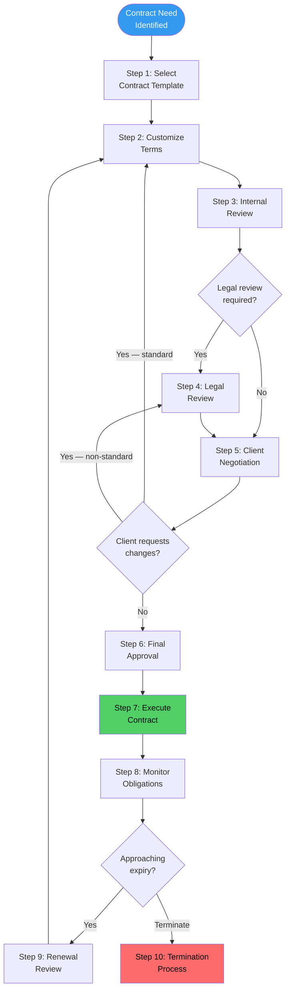
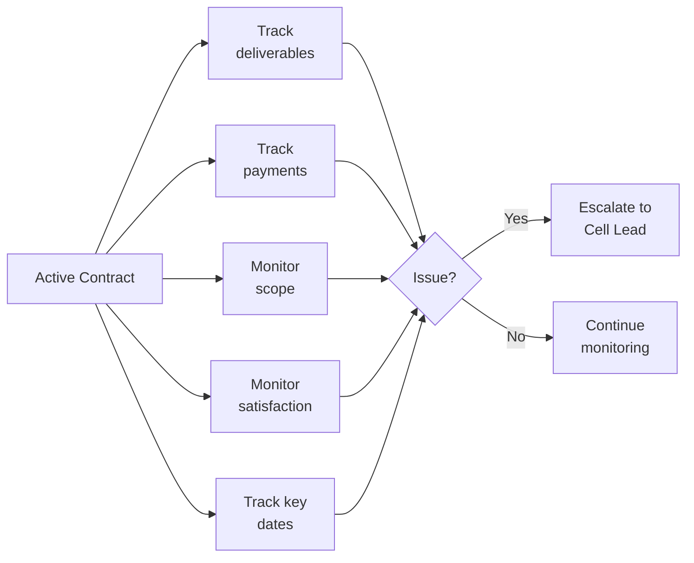

---

sidebar_position: 23
title: "SOP: Client Contract & Legal Review"
description: "Complete Standard Operating Procedure for the client contract lifecycle — from template selection through negotiation, legal review, execution, obligation monitoring, and renewal or termination."
tags: [sop, operational, governance]
custom_status: active
custom_owner: Andrew Leo
custom_last_review: 2026-03-01
custom_next_review: 2026-06-01
---

# SOP: Client Contract & Legal Review

Every client relationship in the AINEFF Ecosystem is governed by a written contract. No work begins without one. No scope changes without an amendment. No verbal agreements that override written terms. Contracts are not bureaucratic overhead -- they are **governance artifacts** that protect both the ecosystem and the client by making expectations explicit, enforceable, and auditable.

This SOP defines the complete contract lifecycle from initial template selection through renewal or termination.

---

## Overview

The contract lifecycle has ten stages that ensure every agreement is appropriately reviewed, properly executed, and actively monitored. Most engagements use standard templates that require minimal customization. Non-standard terms trigger mandatory legal review. The system is designed to be fast for routine engagements and thorough for complex ones.

---

## Trigger / When to Use

| Trigger | Action | Timeline |
|---------|--------|----------|
| New client engagement approved (Phase 4 of Client Engagement SOP) | Contract creation initiated | Contract sent within 5 business days of verbal agreement |
| Scope change requested by client or operator | Amendment process triggered | Assessment within 3 business days |
| Contract approaching renewal date (90 days out) | Renewal review initiated | Renewal decision by 60 days before expiry |
| Client requests termination | Termination process triggered | Acknowledged within 2 business days |
| Non-standard terms requested by client | Legal review triggered | Review initiated within 3 business days |
| Quarterly contract health review | Portfolio review of all active contracts | Completed within 2 weeks of quarter end |
| Dispute or potential breach identified | Dispute resolution process triggered | Assessment within 48 hours |

---

## Roles & Responsibilities

| Role | Responsibility |
|------|---------------|
| **Commercial Operator** | Selects template, customizes standard terms, manages client negotiation |
| **Cell Lead** | Approves non-standard terms within authority limits, reviews contract health |
| **Legal Counsel** | Reviews non-standard terms, advises on risk, approves final language for complex contracts |
| **AINE Lead** | Approves contracts above Cell Lead authority limits |
| **Founder (Frankmax)** | Approves contracts that involve IP assignment, liability cap exceptions, or ecosystem-level risk |
| **Finance Lead** | Reviews payment terms, validates pricing against guidelines |
| **Operator (Delivery)** | Monitors obligation fulfillment during contract execution |

---

## Process Flow

---

## Contract Types

| Contract Type | Use Case | Standard Template | Typical Value | Approval Authority |
|--------------|----------|-------------------|---------------|-------------------|
| **NDA (Mutual)** | Pre-engagement confidentiality | Yes | N/A | Commercial Operator |
| **Diagnostic Engagement** | Initial diagnostic sprint ($5-15K) | Yes | $5,000-$15,000 | Cell Lead |
| **Implementation Agreement** | Project-based delivery | Yes | $15,000-$50,000 | Cell Lead |
| **Retainer Agreement** | Ongoing advisory/support | Yes | $2,000-$5,000/month | Cell Lead |
| **Licensing Agreement** | Software or IP licensing | Yes (with Legal review) | Varies | AINE Lead |
| **Enterprise Agreement** | Multi-department or org-wide engagement | Custom (Legal required) | $50,000+ | AINE Lead + Founder |
| **Partnership Agreement** | Strategic partnership or integration | Custom (Legal required) | Varies | Founder |

---

## Step-by-Step Procedure

### Step 1: Select Contract Template (Day 1)

**Owner:** Commercial Operator
**Duration:** Same day

| Template Selection Criteria | Template |
|----------------------------|----------|
| First-time engagement, need confidentiality before sharing details | NDA (Mutual) |
| Diagnostic sprint, standard scope | Diagnostic Engagement |
| Defined project with milestones and deliverables | Implementation Agreement |
| Ongoing relationship, monthly scope | Retainer Agreement |
| Software product access | Licensing Agreement |
| Large, complex, or multi-phase engagement | Enterprise Agreement |

**Rules:**

- Always start with a standard template -- never draft from scratch
- Templates are version-controlled in the Golden Repo
- Template modifications are tracked (no silent changes)
- If no template fits, escalate to Legal Counsel before drafting

### Step 2: Customize Terms (Days 1-3)

**Owner:** Commercial Operator
**Duration:** 1-3 business days

Standard customization (within Commercial Operator authority):

| Customizable Field | Range/Options |
|-------------------|---------------|
| **Client name and entity details** | Per client |
| **Scope of work** | Per engagement, within template structure |
| **Pricing** | Within pricing framework (see Client Engagement SOP) |
| **Timeline** | Per engagement requirements |
| **Payment schedule** | 50/50, milestone-based, or monthly (per template options) |
| **Deliverables** | Per engagement, using standard descriptions |
| **Notice period** | 30-90 days (template default: 30) |

Non-standard customization (requires Legal review):

| Non-Standard Term | Why It Requires Review |
|------------------|----------------------|
| Liability cap modification | Affects ecosystem risk exposure |
| Indemnification clause changes | Alters risk allocation |
| IP assignment or licensing modifications | Affects ecosystem IP ownership |
| Governing law/jurisdiction changes | Legal complexity and enforceability |
| Non-compete or exclusivity clauses | Constrains future ecosystem operations |
| Data processing agreement modifications | Compliance and regulatory implications |
| Warranty or guarantee modifications | Changes ecosystem obligations |

### Step 3: Internal Review (Days 3-5)

**Owner:** Cell Lead + Finance Lead
**Duration:** 1-2 business days

| Reviewer | Review Focus |
|----------|-------------|
| **Cell Lead** | Scope feasibility, resource availability, strategic alignment |
| **Finance Lead** | Pricing validates against guidelines, payment terms are acceptable, revenue recognition is clear |

Internal review checklist:

| Check | Verified By |
|-------|-------------|
| Scope is deliverable with available resources | Cell Lead |
| Pricing is within guidelines (or deviation justified) | Finance Lead |
| Timeline is realistic | Cell Lead |
| Payment terms are standard (or deviation justified) | Finance Lead |
| No non-standard terms slipped in without flagging | Cell Lead |
| Client entity is verified (not a sanctions-listed entity) | Finance Lead |

### Step 4: Legal Review (Days 5-10, if triggered)

**Owner:** Legal Counsel
**Duration:** 3-5 business days

Legal review is **mandatory** when any of the following conditions are met:

| Mandatory Legal Review Trigger | Rationale |
|-------------------------------|-----------|
| Non-standard terms requested by client | Risk assessment required |
| Contract value exceeds $50,000 | Material financial commitment |
| IP assignment or licensing involved | Ecosystem IP protection |
| New jurisdiction (first contract in a country/state) | Legal enforceability assessment |
| Client is a regulated entity (financial services, healthcare, government) | Compliance requirements |
| Contract duration exceeds 12 months | Long-term obligation review |
| Indemnification or liability terms differ from template | Risk allocation assessment |

Legal review produces:

| Output | Content |
|--------|---------|
| **Risk assessment** | Identified risks with severity and mitigation options |
| **Recommended changes** | Specific language modifications |
| **Approval conditions** | Conditions that must be met for legal sign-off |
| **Red lines** | Terms that cannot be accepted under any circumstances |

### Step 5: Client Negotiation (Days 5-15)

**Owner:** Commercial Operator (with Cell Lead for complex negotiations)
**Duration:** 3-10 business days

| Negotiation Authority | Scope |
|----------------------|-------|
| **Commercial Operator** | Standard terms, pricing within guidelines, timeline adjustments |
| **Cell Lead** | Non-standard terms within pre-approved parameters, pricing exceptions up to 15% |
| **AINE Lead** | Material non-standard terms, pricing exceptions up to 30%, liability modifications |
| **Founder** | IP assignments, liability cap exceptions, exclusivity, strategic partnerships |

**Negotiation rules:**

- Never agree to a term verbally that you cannot put in writing
- Track all redlines and counter-proposals in the contract tracker
- If the client requests a term you cannot evaluate, pause and consult (do not guess)
- Maximum 3 rounds of negotiation before Cell Lead escalation
- Walk away if the client's requirements create unacceptable ecosystem risk

### Step 6: Final Approval (Days 15-17)

**Owner:** Approval authority per contract type
**Duration:** 1-2 business days

| Contract Value | Approval Chain |
|---------------|---------------|
| &lt; $15,000 (standard terms) | Cell Lead |
| $15,000-$50,000 (standard terms) | Cell Lead + Finance Lead |
| $15,000-$50,000 (non-standard terms) | Cell Lead + Legal Counsel |
| &gt; $50,000 | AINE Lead + Legal Counsel |
| IP assignment or exclusivity | Founder + Legal Counsel |

**Final approval checklist:**

| Check | Approver |
|-------|----------|
| All non-standard terms have been legally reviewed | Legal Counsel |
| Pricing is approved | Finance Lead |
| Scope is deliverable | Cell Lead |
| Risk is acceptable | Appropriate approval authority |
| All parties are authorized signatories | Legal Counsel |

### Step 7: Execute Contract (Days 17-19)

**Owner:** Commercial Operator
**Duration:** 1-2 business days

- Both parties sign (digital signatures preferred)
- Executed contract filed in contract management system
- Contract record created with key dates (start, milestones, expiry, renewal)
- Payment schedule entered in financial system
- Delivery team briefed on obligations

### Step 8: Monitor Obligations (Ongoing)

**Owner:** Delivery Operator + Commercial Operator
**Duration:** Life of contract

| Monitoring Activity | Frequency | Owner |
|--------------------|-----------|-------|
| Deliverable tracking against milestones | Weekly | Delivery Operator |
| Payment tracking (invoicing and collection) | Per payment schedule | Finance Lead |
| Scope compliance (no unapproved scope creep) | Weekly | Cell Lead |
| Client satisfaction monitoring | Monthly | Commercial Operator |
| Obligation deadline tracking | Automated alerts | Contract management system |
| SLA compliance monitoring | Per contract SLA definitions | Delivery Operator |

### Step 9: Renewal Review (90 days before expiry)

**Owner:** Commercial Operator + Cell Lead
**Duration:** 30-day review period

| Renewal Assessment | Criterion |
|-------------------|-----------|
| **Client value** | Is the client generating sufficient revenue and strategic value? |
| **Performance** | Have we met our obligations? Has the client met theirs? |
| **Relationship health** | Client satisfaction score, communication quality, payment history |
| **Market alignment** | Are the terms still market-appropriate? Should pricing be adjusted? |
| **Scope evolution** | Does the scope need updating to reflect current needs? |

Renewal options:

| Option | When Appropriate |
|--------|-----------------|
| **Renew as-is** | Both parties satisfied, terms still appropriate |
| **Renew with modifications** | Scope, pricing, or terms need updating |
| **Upgrade to higher-tier engagement** | Client ready for expansion |
| **Allow to expire** | Client no longer fits strategic direction or terms are unworkable |
| **Terminate early** | Material issues warrant ending before natural expiry |

### Step 10: Termination Process

**Owner:** Commercial Operator + Legal Counsel
**Duration:** Per contract notice period

| Termination Type | Notice Required | Process |
|-----------------|-----------------|---------|
| **Mutual agreement** | As agreed by both parties | Document mutual consent, settle outstanding obligations |
| **For convenience (by us)** | Per contract notice period (typically 30 days) | Written notice, complete in-progress work, final settlement |
| **For convenience (by client)** | Per contract notice period | Acknowledge, complete handoff, final settlement |
| **For cause (by us)** | Immediate or per contract | Document breach, provide cure notice if required, legal involvement |
| **For cause (by client)** | Per contract | Investigate claim, remediate if possible, legal involvement if disputed |

---

## Standard vs. Custom Clause Tracking

Every contract is tracked for clause customization to monitor ecosystem-wide trends:

| Tracking Metric | Purpose |
|----------------|---------|
| Percentage of contracts using standard templates unmodified | Template effectiveness |
| Most frequently negotiated clauses | Template improvement opportunities |
| Non-standard terms accepted (by type) | Risk exposure monitoring |
| Negotiation rounds per contract | Process efficiency |
| Time from need identification to execution | Pipeline velocity |
| Legal review turnaround time | Legal resourcing adequacy |

---

## Artifacts / Outputs

| Artifact | Produced By | Retention |
|----------|------------|-----------|
| Selected template (version-tracked) | Commercial Operator | 7 years after contract end |
| Customization log (all changes from template) | Commercial Operator | 7 years after contract end |
| Internal review record | Cell Lead + Finance Lead | 7 years after contract end |
| Legal review record (if applicable) | Legal Counsel | 7 years after contract end |
| Negotiation trail (all redlines and counter-proposals) | Commercial Operator | 7 years after contract end |
| Final approval record | Approval authority | 7 years after contract end |
| Executed contract (signed) | Both parties | 7 years after contract end |
| Obligation monitoring records | Delivery Operator | 7 years after contract end |
| Renewal assessment | Commercial Operator | 7 years after contract end |
| Termination records | Commercial Operator + Legal | 7 years after contract end |
| Clause tracking data | Finance Lead | Permanent (aggregated) |

---

## Time Bounds / SLAs

| Activity | SLA |
|----------|-----|
| Template selection to first draft | &lt; 2 business days |
| Internal review completion | &lt; 2 business days |
| Legal review completion | &lt; 5 business days |
| Client negotiation (standard contract) | &lt; 10 business days |
| Total need identification to execution (standard) | &lt; 15 business days |
| Total need identification to execution (complex/custom) | &lt; 30 business days |
| Amendment processing | &lt; 10 business days |
| Renewal review initiation | 90 days before expiry |
| Renewal decision | 60 days before expiry |
| Termination notice processing | Within 2 business days of decision |
| Quarterly contract health review | Within 2 weeks of quarter end |

---

## Kill Criteria / Escalation Triggers

| Condition | Escalation |
|-----------|-----------|
| Client negotiation exceeds 3 rounds without resolution | Cell Lead takes over negotiation or recommends walk-away |
| Contract execution delayed beyond 30 business days | AINE Lead reviews for pipeline blockers |
| Non-standard term accepted without legal review | Immediate legal review triggered, governance violation recorded |
| Payment more than 30 days overdue | Escalate to Cell Lead, pause new deliverables, formal collection notice |
| Payment more than 60 days overdue | Legal Counsel involvement, potential contract termination |
| Scope creep detected (work delivered outside contract scope) | Immediate Cell Lead review, amendment or scope correction |
| Client disputes contract terms | Legal Counsel involvement within 48 hours |
| More than 20% of active contracts have non-standard terms | Template review and update triggered |
| Contract signed without proper approval | Governance violation, immediate audit, approval retroactively obtained or contract renegotiated |

---

## Anti-Patterns

| Anti-Pattern | Why It Fails | Correct Approach |
|-------------|-------------|-----------------|
| **Verbal agreements** | Unenforceable, lead to disputes, not auditable | Everything in writing, signed before work begins |
| **Starting work before contract execution** | Ecosystem assumes all risk, payment not guaranteed | No work begins until contract is signed and initial payment received |
| **Accepting every client redline** | Erodes standard terms, creates inconsistent risk exposure | Negotiate from a position of standards; walk away if terms are unacceptable |
| **Legal review as a bottleneck** | Slow legal turnaround delays revenue | Clear triggers for when legal review is required; pre-approved parameters for routine negotiations |
| **Ignoring obligation monitoring** | Missed deliverables erode trust, missed payments harm cash flow | Automated deadline tracking with alerts |
| **Auto-renewing without review** | Locks ecosystem into outdated or unfavorable terms | Every renewal gets a deliberate review 90 days before expiry |
| **Template drift** | Operators modify templates without updating the master | All templates version-controlled; customizations tracked and logged |
| **Scope creep without amendments** | Work delivered without compensation, sets bad precedent | Every scope change gets an amendment or change order |

---

## Cross-References

| Related SOP | Relationship |
|------------|-------------|
| [Client Engagement Lifecycle](./client-engagement-sop) | Contract execution is Phase 4 of the engagement lifecycle |
| [Capital Allocation & Investment](./capital-allocation-sop) | Large contracts may require capital allocation approval |
| [Governance Review & Rule Changes](./governance-review-sop) | Contract template changes follow governance review procedures |
| [Audit & Compliance Procedures](./audit-sop) | Contract records are auditable and reviewed in quarterly audits |
| [Compensation Calculation & Settlement](./compensation-settlement-sop) | Contract revenue feeds compensation calculations |
| [Operator Onboarding & Lifecycle](./operator-onboarding-sop) | Defines authority levels for contract negotiation by stage |
| [Operator Offboarding & Knowledge Transition](./operator-offboarding-sop) | Active contracts must be transitioned during offboarding |
