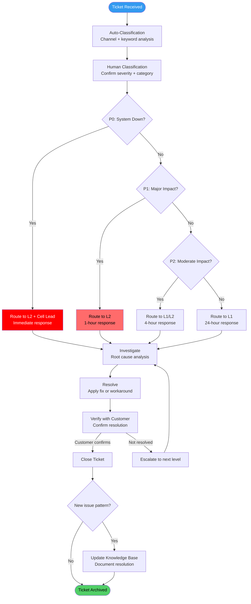

---

sidebar_position: 15
title: "SOP: Customer Support Triage & Escalation"
description: "Complete Standard Operating Procedure for customer support — ticket intake, severity-based routing, response time SLAs, escalation paths, resolution authority, and knowledge base maintenance."
tags: [sop, operational, frankmax]
custom_status: active
custom_owner: Andrew Leo
custom_last_review: 2026-03-01
custom_next_review: 2026-06-01
---

# SOP: Customer Support Triage &amp; Escalation

Customer support is not a cost center — it is a revenue protection function and an intelligence pipeline. Every support interaction is an opportunity to retain revenue, identify product defects, and strengthen client relationships. This SOP defines how support tickets enter the system, how they are classified, how they are routed, and what response times are guaranteed at each severity level.

Support failures cascade. A missed P0 becomes a churned client. A pattern of unresolved P2s becomes a reputation problem. This process exists to ensure that no support request falls through the cracks.

---

## Overview

This SOP governs the complete support ticket lifecycle from initial receipt through resolution, verification, and knowledge base update. It defines severity classifications, routing rules, SLA targets, escalation paths, and the authority levels required for different resolution types.

---

## Trigger / When to Use

This SOP is triggered when:

- A customer contacts any support channel (email, in-app, Slack, phone)
- An internal system alert detects a customer-impacting issue
- A client-facing operator identifies a customer problem during engagement
- A support ticket is escalated from automated resolution to human review
- Monthly support metrics review identifies SLA breaches or trends

---

## Roles &amp; Responsibilities

| Role | Responsibility | Authority |
|------|---------------|-----------|
| **Support Operator (L1)** | Ticket intake, initial classification, known-issue resolution | Resolve known issues, apply documented fixes (Stage 3+) |
| **Support Operator (L2)** | Technical investigation, custom resolution, workaround development | Resolve complex issues, modify configurations (Stage 4+) |
| **Cell Lead (L3)** | Escalation handling, cross-system investigation, customer communication for P0/P1 | Full resolution authority, compensation decisions up to $500 |
| **Product Operator** | Defect-to-feature pipeline, product feedback aggregation | File defects, propose feature changes |
| **Commercial Operator** | Relationship management, customer satisfaction recovery | Client retention decisions, compensation above $500 |
| **Founder** | Final escalation, strategic customer decisions | Unlimited resolution authority |

---

## Process Flow

---

## Detailed Procedure

### Step 1: Support Channels

| Channel | Customer Tier | Intake Method | Response Expectation |
|---------|-------------|---------------|---------------------|
| **Email** | All customers | Support inbox, auto-ticket creation | Per SLA by severity |
| **In-App** | All customers | Embedded support widget, auto-ticket creation | Per SLA by severity |
| **Slack (dedicated channel)** | Enterprise customers only | Shared Slack channel, auto-ticket creation | Per SLA by severity, with real-time visibility |
| **Phone (callback)** | Enterprise customers, P0 only | Callback request via in-app, scheduled within 15 min | P0: 15 min callback, others routed to async |

**Channel rules:**
- All channels create tickets in the same system — no separate queues
- Slack messages without a ticket reference auto-generate a ticket
- Phone is callback-only (no inbound support line) to manage capacity
- After-hours channels auto-acknowledge and route to on-call for P0/P1 only

### Step 2: Auto-Classification

Incoming tickets are auto-classified before human review:

| Classification Signal | Method | Action |
|----------------------|--------|--------|
| **Keyword matching** | "down," "cannot access," "error 500," "data loss" | Auto-flag as potential P0/P1 |
| **Customer tier** | Enterprise vs. standard | Route to appropriate queue |
| **Known issue matching** | Compare against active incident list | Auto-link to existing incident |
| **Repeat ticket detection** | Same customer, same topic within 7 days | Flag as follow-up, link to original |
| **Sentiment analysis** | Negative sentiment indicators | Flag for priority human review |

### Step 3: Severity Classification

| Severity | Name | Definition | Examples |
|----------|------|-----------|----------|
| **P0** | Critical | Customer system completely non-functional, data loss occurring, security breach suspected | Production outage, payment processing failure, data corruption, unauthorized access |
| **P1** | High | Major feature non-functional, significant business impact, no workaround available | Core workflow broken, reporting inaccurate, integration failure, performance unusable |
| **P2** | Moderate | Feature partially impaired, workaround exists, moderate business impact | Non-critical feature broken, UI issues affecting workflow, intermittent errors |
| **P3** | Low | Minor issue, cosmetic, question, or feature request | Documentation question, minor UI bug, feature request, "how do I" questions |

### Step 4: Response Time SLAs

| Severity | First Response | Status Update Frequency | Resolution Target | Escalation Trigger |
|----------|---------------|------------------------|-------------------|--------------------|
| **P0** | 15 minutes | Every 30 minutes | 4 hours | Auto-escalate if no response in 15 min |
| **P1** | 1 hour | Every 2 hours | 8 hours | Auto-escalate if no response in 1 hour |
| **P2** | 4 hours | Every 24 hours | 3 business days | Auto-escalate if no response in 4 hours |
| **P3** | 24 hours | On status change | 10 business days | Auto-escalate if no response in 24 hours |

**SLA measurement:**
- First Response = time from ticket creation to first human reply (auto-acknowledgment does not count)
- Resolution Target = time from ticket creation to customer-verified resolution
- SLAs measured during business hours (09:00-18:00 local customer time) for P2/P3
- P0 and P1 SLAs are 24/7/365

### Step 5: Routing Rules

| Condition | Route To | Rationale |
|-----------|---------|-----------|
| P0 (any customer) | L2 + Cell Lead simultaneously | Needs immediate technical expertise and management |
| P1 (enterprise customer) | L2 + Commercial Operator notified | Technical fix plus relationship management |
| P1 (standard customer) | L2 | Technical investigation |
| P2 (known issue) | L1 with documented resolution | Standard resolution, no investigation needed |
| P2 (new issue) | L2 | Requires investigation |
| P3 (how-to question) | L1 + knowledge base auto-suggest | Self-service where possible |
| P3 (feature request) | L1 + Product Operator notified | Intake for feature pipeline |
| Repeat ticket (3+ in 30 days) | L2 + Cell Lead notified | Pattern indicates systemic issue |

### Step 6: Investigation

| Investigation Step | P0 | P1 | P2 | P3 |
|-------------------|----|----|----|----|
| **Reproduce the issue** | Required (within 15 min) | Required (within 1 hr) | Required (within 4 hr) | Best effort |
| **Identify root cause** | Required | Required | Required | Optional |
| **Check for broader impact** | Required (all customers) | Required (same tier) | Recommended | Not required |
| **File defect ticket** | Mandatory | Mandatory | If bug confirmed | If bug confirmed |
| **Notify incident response** | If P0 criteria met | If spreading | Not required | Not required |

### Step 7: Resolution Types

| Resolution Type | Authority Required | Documentation |
|----------------|-------------------|---------------|
| **Known fix applied** | L1 | Link to KB article |
| **Configuration change** | L2 | Change log entry |
| **Workaround provided** | L1/L2 | Workaround steps documented |
| **Bug fix deployed** | L2 + deployment pipeline | Defect ticket linked |
| **Data correction** | L2 + Cell Lead approval | Data change log, before/after |
| **Service credit issued** | Cell Lead (up to $500) / Commercial Operator (&gt; $500) | Credit record in billing |
| **Feature request accepted** | Product Operator | Feature backlog entry |
| **Customer training provided** | L1/L2 | Training session recorded |

### Step 8: Customer Communication Templates

| Scenario | Template Elements |
|----------|------------------|
| **Initial acknowledgment** | Ticket number, severity confirmed, expected response time, assigned owner |
| **Investigation update** | Current status, what has been tried, next steps, expected timeline |
| **Workaround provided** | Workaround steps, limitations of workaround, permanent fix timeline |
| **Resolution notification** | What was found, what was fixed, how to verify, prevention measures |
| **Escalation notification** | Why escalated, new owner introduction, revised timeline |
| **SLA breach apology** | Acknowledgment of delay, root cause of delay, corrective steps, compensation (if applicable) |

**Communication rules:**
- Never use technical jargon in customer-facing messages
- Always include a specific next step or action item
- Never promise a timeline you cannot control (say "investigating" not "will be fixed by")
- P0/P1 updates must come from a named individual, not a generic mailbox

### Step 9: Verification and Closure

| Closure Step | Requirement |
|-------------|-------------|
| **Customer verification** | Customer explicitly confirms resolution (email reply or in-app confirmation) |
| **Auto-close** | If no customer response within 5 business days of resolution notification, auto-close with notification |
| **Satisfaction survey** | Sent on closure for P0, P1, and randomly sampled P2/P3 (25% sample) |
| **Resolution documentation** | Resolution steps documented in ticket for future reference |
| **Linked tickets updated** | If resolution applies to other open tickets, those are updated |

### Step 10: Knowledge Base Maintenance

| Trigger | Action | Owner |
|---------|--------|-------|
| New issue resolved for first time | Create KB article draft | Resolving operator |
| Same issue resolved 3+ times | Elevate to permanent KB article | L2 + Product Operator |
| KB article referenced 10+ times in 30 days | Review for product fix (eliminate the need for the article) | Product Operator |
| Product change deployed | Review affected KB articles for accuracy | QA Operator |
| Quarterly review | Audit all KB articles for staleness | L1 team lead |

---

## Satisfaction Measurement

| Metric | Target | Measurement Method |
|--------|--------|-------------------|
| **Customer Satisfaction (CSAT)** | &gt; 90% satisfied | Post-resolution survey |
| **First Contact Resolution (FCR)** | &gt; 60% | Resolved without escalation or follow-up |
| **SLA Compliance** | &gt; 95% for all severity levels | Automated SLA tracking |
| **Time to Resolution (TTR)** | Within SLA targets | Automated measurement |
| **Ticket Reopen Rate** | &lt; 5% | Tickets reopened within 7 days of closure |
| **Knowledge Base Deflection** | &gt; 30% of P3 tickets self-served | KB article views vs. ticket creation |

### Monthly Support Review

| Review Item | Data Source | Action If Below Target |
|------------|-----------|----------------------|
| SLA compliance by severity | Ticketing system | Process review, capacity adjustment |
| CSAT scores | Survey results | Individual coaching, process improvement |
| Top 10 ticket categories | Ticket analysis | Product defect pipeline, KB improvement |
| Repeat customer analysis | CRM cross-reference | Proactive outreach, relationship recovery |
| Escalation frequency | Ticket routing data | L1 training improvement, KB gaps |
| Resolution time distribution | Ticket timing data | Resource allocation adjustment |

---

## Artifacts / Outputs

| Artifact | Produced At | Owner |
|----------|------------|-------|
| Support Ticket Record | Every interaction | Support Operator |
| Investigation Notes | Investigation phase | Assigned operator |
| Resolution Documentation | Resolution | Resolving operator |
| Defect Ticket (if applicable) | Investigation | QA Operator via support |
| Knowledge Base Article | New issue resolution | Resolving operator |
| Customer Satisfaction Survey | Ticket closure | Automated |
| Monthly Support Metrics Report | Monthly review | Cell Lead |
| SLA Breach Report | When SLA missed | Support Operator |
| Escalation Record | When escalated | Escalating operator |

---

## Time Bounds / SLAs

| Activity | Maximum Duration | Escalation |
|----------|-----------------|-----------|
| P0 first response | 15 minutes | Auto-page on-call + Cell Lead |
| P1 first response | 1 hour | Auto-notify Cell Lead |
| P2 first response | 4 hours | Auto-escalate to L2 |
| P3 first response | 24 hours | Auto-escalate to queue manager |
| Auto-classification | 2 minutes | Manual classification by L1 |
| Knowledge base article creation | 5 business days after new issue resolution | Cell Lead review |
| Monthly support review | Completed by 5th business day of month | Cell Lead |
| Satisfaction survey collection | 7 days after ticket closure | Automated with reminder |

---

## Kill Criteria / Escalation Triggers

| Trigger | Escalation Path |
|---------|----------------|
| P0 not responded within 15 minutes | Auto-page all L2 + Cell Lead + Founder notification |
| P0 not resolved within 4 hours | Cell Lead to Founder, incident response SOP activated |
| P1 not responded within 1 hour | Auto-escalate to Cell Lead |
| SLA compliance drops below 90% for any severity | Cell Lead review, capacity analysis |
| CSAT drops below 80% for any 30-day period | Cell Lead + Commercial Operator intervention |
| Same customer files 5+ tickets in 30 days | Proactive outreach by Commercial Operator |
| Single issue generates 10+ tickets from different customers | Escalate to Product Operator as systemic defect |
| Ticket reopen rate exceeds 10% | QA process review for resolution quality |
| P0 incident affects &gt; 10% of customer base | Incident Response SOP takes over; support coordinates communication |

---

## Anti-Patterns

| Anti-Pattern | Why It Is Dangerous | Correct Approach |
|-------------|-------------------|-----------------|
| **"Works for me"** | Dismissing customer-reported issues without reproduction | Always attempt reproduction in customer's environment context |
| **Severity downgrading** | Classifying P1 as P2 to meet SLA targets | Severity is based on customer impact, not team capacity |
| **Email-only resolution** | Resolving via email without documenting in ticket system | All resolutions must be in the ticket system for metrics and KB |
| **Hero support** | Single operator handles everything, creating a bus factor | Route and escalate per process; no single-person dependencies |
| **Silent escalation** | Escalating without informing the customer | Every escalation includes customer notification with new owner |
| **Closing without verification** | Marking tickets resolved without customer confirmation | Customer must confirm or auto-close with notification after 5 days |
| **Ticket hoarding** | Operators holding tickets without progress updates | Status update frequency enforced by severity SLA |
| **Feature request dismissal** | Telling customers "we do not plan to build that" | All feature requests enter the pipeline; communicate transparently |

---

## Cross-References

- [Client Engagement Lifecycle SOP](./client-engagement-sop) — Client relationship context and commercial operator coordination
- [Incident Response &amp; External Shocks SOP](./incident-response-sop) — When support issues escalate to ecosystem incidents
- [Product Feature Lifecycle SOP](./product-feature-lifecycle-sop) — Feature requests from support entering the product pipeline
- [Quality Assurance &amp; Testing SOP](./qa-testing-sop) — Defect filing and severity classification alignment
- [Security Incident Response SOP](./security-incident-sop) — When support tickets indicate security breaches
- [Venture Cell Operations SOP](./venture-cell-sop) — Support capacity within venture cell resource planning
