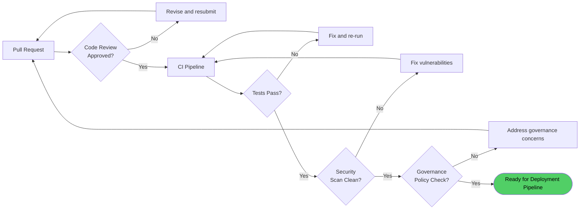
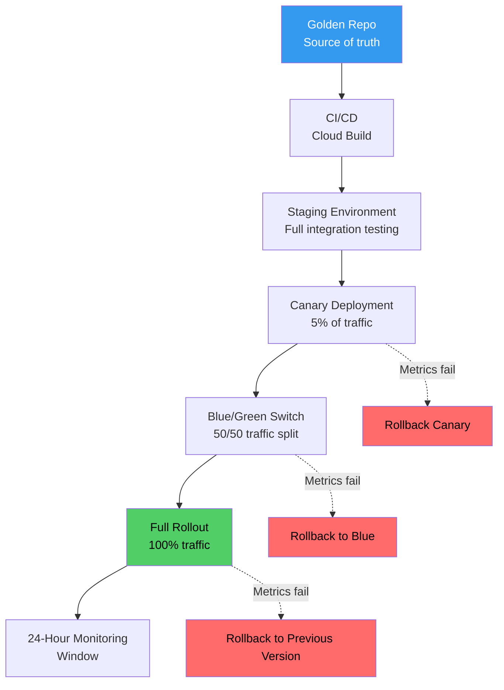
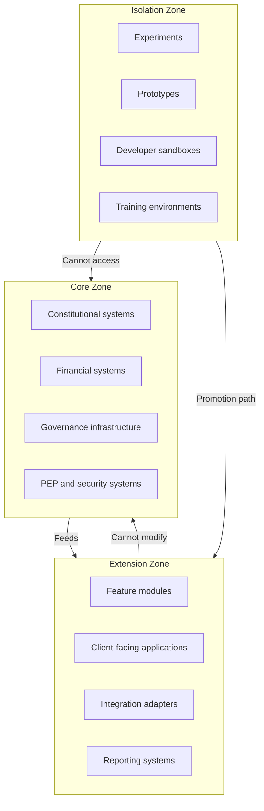
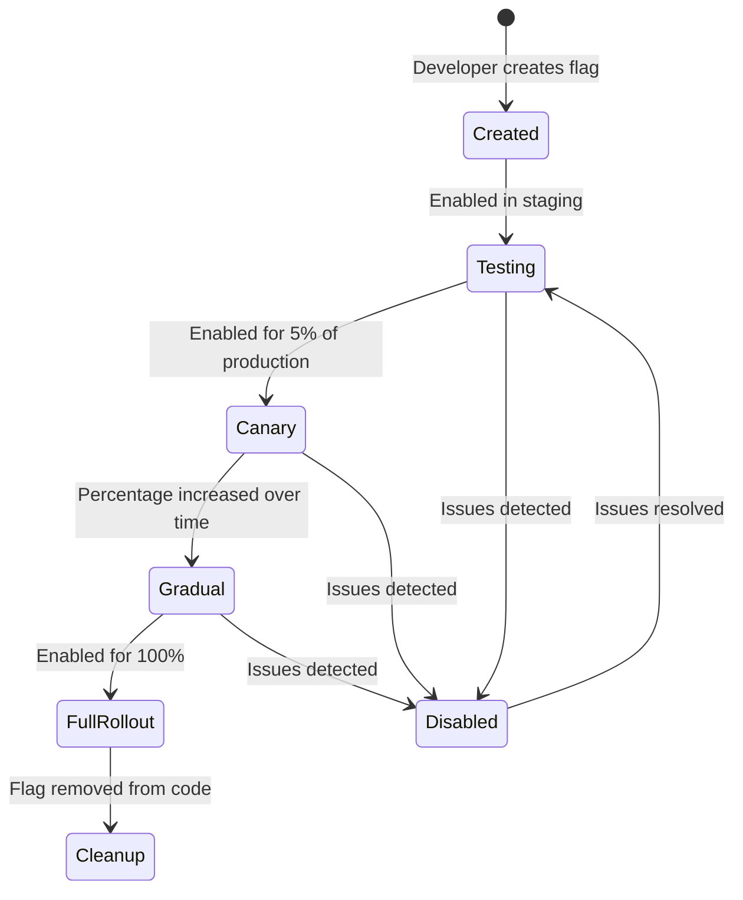
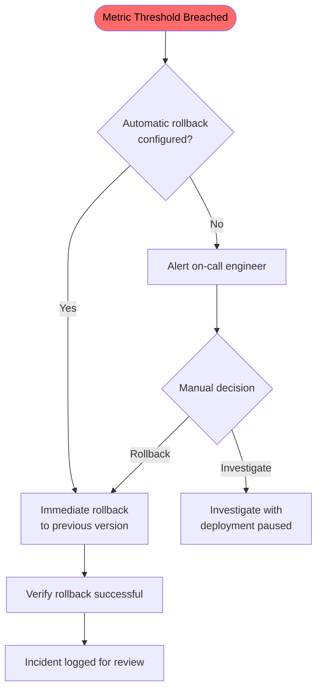
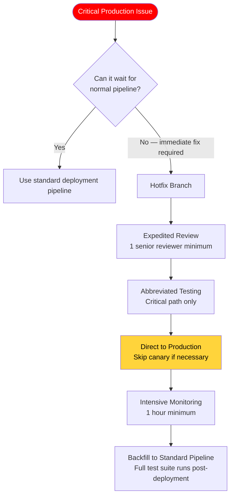
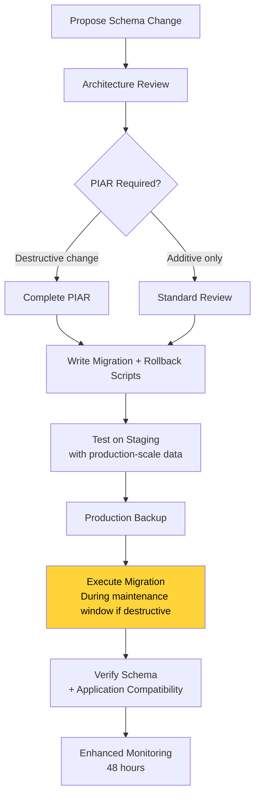

---

sidebar_position: 12
title: "SOP: System Deployment & Release"
description: "Complete Standard Operating Procedure for deploying systems — CI/CD pipeline, three architecture zones, canary deployment, rollback procedures, feature flags, and emergency hotfixes."
tags: [sop, operational, technical]
custom_status: active
custom_owner: Andrew Leo
custom_last_review: 2026-03-01
custom_next_review: 2026-06-01
---

# SOP: System Deployment & Release

Every system in the AINEFF Ecosystem follows a controlled deployment pipeline. There are no cowboy deployments, no "just push it to prod," and no skipping steps because someone is in a hurry. The deployment process is designed to catch failures **before** they reach production, and to contain failures **when** they reach production.

This SOP defines the deployment pipeline, architecture zones, rollback procedures, and emergency protocols.

---

## Pre-Deployment Checklist

Before any deployment enters the pipeline, the following must be verified:

| Check | Owner | Tool/Method |
|-------|-------|-------------|
| **Code review** | Peer reviewer (required) | Pull request with at least 1 approval |
| **Test suite pass** | CI/CD pipeline (automated) | All unit, integration, and contract tests passing |
| **Security scan** | CI/CD pipeline (automated) | Static analysis, dependency vulnerability scan |
| **Governance policy check** | Automated + manual | Deployment does not violate constitutional constraints |
| **PIAR completion** | Decision Maker | Required for significant deployments (new systems, breaking changes) |
| **Documentation updated** | Developer | All affected documentation updated in same PR |
| **Rollback plan** | Developer | Documented rollback steps, tested if possible |

---

## Deployment Pipeline

### Stage 1: Golden Repo

The Golden Repo is the **single source of truth** for all ecosystem code and configuration.

| Rule | Enforcement |
|------|-------------|
| All changes enter through reviewed pull requests | Branch protection rules |
| Main branch is always deployable | Required status checks |
| No direct commits to main | Branch protection rules |
| All commits signed | Commit signing requirement |
| Version tags for all releases | Automated semantic versioning |

### Stage 2: CI/CD (Cloud Build)

Automated pipeline that runs on every merge to main:

| Step | Duration | Failure Action |
|------|----------|---------------|
| Dependency installation | 1–3 min | Fail build, notify developer |
| Unit tests | 2–5 min | Fail build, notify developer |
| Integration tests | 5–15 min | Fail build, notify developer |
| Contract tests | 2–5 min | Fail build, notify developer |
| Security scan | 3–10 min | Fail build, notify security team |
| Build artifacts | 2–5 min | Fail build, notify developer |
| Artifact signing | 1 min | Fail build, notify infrastructure team |

### Stage 3: Staging

Full deployment to staging environment that mirrors production:

| Validation | Duration | Criteria |
|-----------|----------|----------|
| Smoke tests | 5 min | Core functionality operational |
| Load tests | 15–30 min | Performance within acceptable bounds |
| Integration validation | 15 min | All system integrations functional |
| Data migration test | Varies | If schema changes, migration runs cleanly |
| Manual validation | 30–60 min | QA review of critical paths |

**Staging gate:** All validations must pass. Any failure blocks promotion to canary.

### Stage 4: Canary Deployment (5% traffic)

A small percentage of production traffic is routed to the new version:

| Monitoring | Duration | Criteria |
|-----------|----------|----------|
| Error rate | 30 min minimum | Error rate &lt;= baseline + 0.1% |
| Latency | 30 min minimum | P99 latency &lt;= baseline + 10% |
| Resource utilization | 30 min minimum | CPU/memory within normal bounds |
| Business metrics | 1 hour minimum | Conversion rates, transaction volumes stable |

**Canary gate:** All metrics must be within bounds. Automatic rollback if any metric breaches threshold.

### Stage 5: Blue/Green Switch (50/50 traffic)

Traffic is split evenly between old (blue) and new (green) versions:

| Monitoring | Duration | Criteria |
|-----------|----------|----------|
| All canary metrics | 1 hour minimum | Sustained healthy metrics at scale |
| Cross-version consistency | 1 hour minimum | No discrepancies between blue and green outputs |

**Blue/Green gate:** If green performs at parity with or better than blue, promote to full rollout.

### Stage 6: Full Rollout (100% traffic)

All traffic routed to new version. Old version kept warm for rollback.

| Post-rollout | Duration | Action |
|-------------|----------|--------|
| Enhanced monitoring | 24 hours | Alert thresholds tightened |
| Old version retention | 72 hours | Available for immediate rollback |
| Old version decommission | After 72 hours | Remove old version if no issues |

---

## Three Architecture Zones

Not all code is equal. The ecosystem uses **three architecture zones** with different review rigor, ownership requirements, and deployment freedoms.

### Zone Definitions

| Zone | Ownership | Review Requirements | Deployment Freedom | Failure Impact |
|------|-----------|--------------------|--------------------|---------------|
| **Core** | Senior operators (Stage 5–6) | Full review by 2+ senior reviewers, PIAR required | Full pipeline mandatory, no shortcuts | Ecosystem-wide — failure affects all AINEs |
| **Extension** | Any qualified operator (Stage 3+) | Standard peer review, automated test gate | Standard pipeline, canary optional for low-risk | AINE-level — failure contained to deploying AINE |
| **Isolation** | Any operator | Self-review permitted | Direct deployment, no pipeline required | None — sandboxed, no production impact |

### Zone Rules

**Core Zone:**
- Changes require PIAR before development begins
- Two senior reviewers must approve (not just one)
- Full pipeline with extended canary period (minimum 2 hours)
- Architecture review required for structural changes
- No automated merges — human approval at every gate

**Extension Zone:**
- Standard peer review (1 reviewer)
- Full test suite must pass
- Standard pipeline (canary optional for configuration-only changes)
- Automated deployment permitted after review approval

**Isolation Zone:**
- No review requirements
- No pipeline requirements
- Cannot access Core Zone systems or data
- Cannot serve production traffic
- Must go through promotion process to move to Extension Zone

---

## Feature Flag Procedures

Feature flags allow code to be deployed without being activated, enabling safe gradual rollouts.

### Flag Lifecycle

### Flag Rules

| Rule | Rationale |
|------|-----------|
| **Maximum flag lifespan: 30 days** | Prevents permanent flags that become tech debt |
| **Flag registry maintained** | All active flags tracked with owner, creation date, and purpose |
| **Stale flag alerts** | Automated alerts when a flag exceeds 21 days |
| **Cleanup ticket created on flag creation** | Every flag has a scheduled cleanup |
| **No nested flags** | Feature flags cannot depend on other feature flags |

---

## Rollback Procedures

### Automatic Rollback

Automatic rollback is triggered when canary or blue/green metrics breach thresholds:

### Manual Rollback

Manual rollback is available for any deployment within 72 hours:

1. **Identify** the deployment to roll back (version number, timestamp)
2. **Notify** the team that a rollback is in progress
3. **Execute** rollback command (re-deploys previous version through blue/green switch)
4. **Verify** that previous version is serving traffic correctly
5. **Investigate** root cause of the issue that triggered rollback
6. **Document** the rollback in the incident tracker

### Database Rollback Considerations

If the deployment included database schema changes:

| Scenario | Rollback Approach |
|----------|-------------------|
| Additive schema change (new column, new table) | Application rollback only — schema remains |
| Destructive schema change (column removed, type changed) | Schema migration rollback required — follow migration SOP |
| Data migration | May not be reversible — PIAR required before deployment |

---

## Post-Deployment Monitoring

### Health Checks

| Check | Frequency | Alert Threshold |
|-------|-----------|-----------------|
| HTTP health endpoint | Every 30 seconds | 3 consecutive failures |
| Database connectivity | Every 60 seconds | 2 consecutive failures |
| External API connectivity | Every 60 seconds | 3 consecutive failures |
| Memory utilization | Every 30 seconds | &gt; 85% sustained for 5 minutes |
| CPU utilization | Every 30 seconds | &gt; 80% sustained for 5 minutes |
| Error rate | Continuous | &gt; baseline + 0.5% |
| Latency (P99) | Continuous | &gt; baseline + 20% |

### Telemetry Verification

After deployment, verify that all telemetry pipelines are functioning:

- Application logs flowing to centralized logging
- Metrics being collected and visible in dashboards
- ACTS events being recorded for governance trail
- Business metrics (revenue, transactions, client events) tracking correctly

### 24-Hour Monitoring Window

For the first 24 hours after full rollout:

- Alert thresholds are tightened (stricter than normal)
- On-call engineer is assigned specifically for this deployment
- Hourly check-ins during business hours
- Automatic escalation if any metric degrades

---

## Emergency Hotfix Procedure

When a critical production issue requires an immediate fix outside the normal deployment cycle:

### Hotfix Rules

| Rule | Rationale |
|------|-----------|
| **Minimum 1 senior reviewer** | No unreviewed code in production, even in emergencies |
| **Abbreviated test suite** (critical path only) | Speed over comprehensive testing — risk accepted |
| **Backfill mandatory** | Full test suite must run within 24 hours |
| **Post-hotfix incident report** | Every hotfix is an incident and requires a post-incident review |
| **Maximum 3 hotfixes before root cause fix** | Repeated hotfixes indicate a deeper problem |

---

## Schema Migration Procedure

Database schema changes require special handling due to their potential irreversibility.

### Migration Process

### Migration Rules

| Rule | Rationale |
|------|-----------|
| **Every migration has a rollback script** | Must be able to undo the migration |
| **Tested on production-scale data** | Performance characteristics differ at scale |
| **Backup before execution** | Recovery option if migration fails catastrophically |
| **Destructive changes during maintenance window** | Minimize impact of potential issues |
| **48-hour enhanced monitoring** | Schema issues may manifest slowly |
| **No migrations on Friday** | Avoid weekend debugging |
