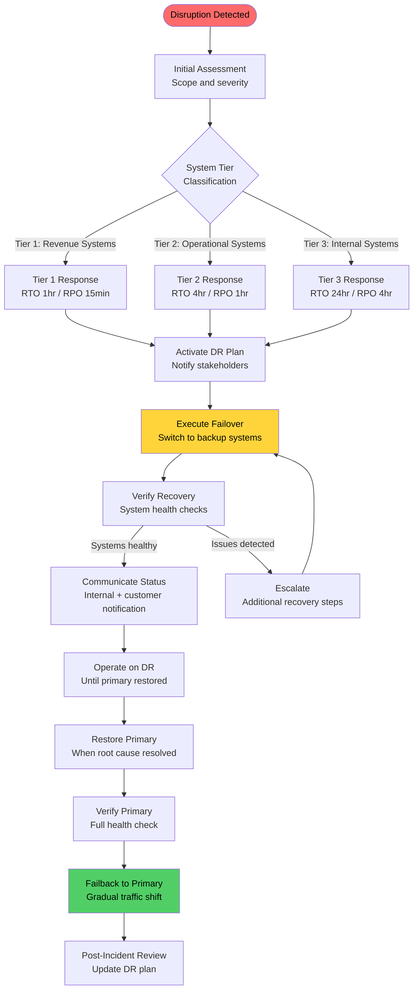
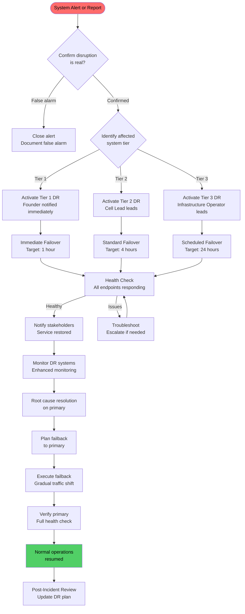

---

sidebar_position: 17
title: "SOP: Data Backup & Disaster Recovery"
description: "Complete Standard Operating Procedure for data backup and disaster recovery — backup frequency, encryption standards, RTO/RPO targets by system tier, test restore procedures, failover activation, and recovery priority ordering."
tags: [sop, operational, risk]
custom_status: active
custom_owner: Andrew Leo
custom_last_review: 2026-03-01
custom_next_review: 2026-06-01
---

# SOP: Data Backup &amp; Disaster Recovery

Data is not an asset until it is backed up, encrypted, geographically distributed, and proven recoverable.

:::warning[Untested Backups Are Not Backups]
A backup that has never been restored successfully in a test environment provides false confidence. Monthly test restores are mandatory to prove recoverability.
:::

A backup that has never been tested is not a backup — it is a hope. This SOP defines the backup infrastructure, disaster recovery procedures, and recovery targets for every system tier in the AINEFF Ecosystem.

Disaster recovery is not an event-driven process that you design when disaster strikes. It is a continuous operational discipline — backups run daily, test restores run monthly, and failover drills run quarterly. When the real disaster arrives, the response is rehearsed, not improvised.

---

## Overview

This SOP governs data backup operations, disaster recovery planning, and business continuity for the AINEFF Ecosystem. It defines backup types and frequencies, encryption standards, geographic redundancy requirements, RTO/RPO targets by system tier, test restore schedules, and the recovery activation procedure.

---

## Trigger / When to Use

This SOP is triggered when:

- A system outage is detected that may require failover to backup infrastructure
- A data loss event is suspected or confirmed
- The monthly test restore is scheduled
- The quarterly failover drill is scheduled
- A new system is onboarded and requires backup configuration
- Backup monitoring detects a failure in the backup pipeline
- A disaster event (natural, cyber, infrastructure) impacts primary systems

---

## Roles &amp; Responsibilities

| Role | Responsibility | Authority |
|------|---------------|-----------|
| **Infrastructure Operator** | Backup configuration, monitoring, test restores, failover execution | Execute backup and recovery procedures |
| **Cell Lead** | DR plan ownership, recovery prioritization, communication during incidents | Activate DR plan for Tier 2-3 systems |
| **Founder** | Final authority on DR activation for Tier 1 systems, resource allocation | Activate DR for Tier 1, approve recovery budget |
| **Security Operator** | Encryption key management, backup integrity verification | Encryption standards and key rotation |
| **Data Operator** | Customer data isolation, data classification, retention compliance | Data classification and isolation requirements |
| **All Operators** | Follow DR procedures, maintain local recovery documentation | Execute assigned recovery tasks |

---

## Process Flow

---

## Detailed Procedure

### Step 1: System Tier Classification

Every system in the ecosystem is classified into one of three tiers based on business impact:

| Tier | Definition | Examples | RTO | RPO |
|------|-----------|----------|-----|-----|
:::danger[Tier 1 RTO/RPO Targets Are Non-Negotiable]
Tier 1 systems must recover within 1 hour (RTO) with no more than 15 minutes of data loss (RPO). Missing these targets means direct revenue loss and potential client SLA violations.
:::

| **Tier 1** | Revenue-generating systems; downtime directly causes revenue loss | Payment processing, client-facing applications, AI inference endpoints, CRM (active deals) | 1 hour | 15 minutes |
| **Tier 2** | Operational systems; downtime degrades operations but does not immediately stop revenue | Internal dashboards, reporting systems, CI/CD pipeline, communication tools, monitoring | 4 hours | 1 hour |
| **Tier 3** | Internal systems; downtime is inconvenient but operations continue | Documentation, training environments, development sandboxes, internal wikis | 24 hours | 4 hours |

#### RTO/RPO Definitions

| Term | Definition |
|------|-----------|
| **RTO (Recovery Time Objective)** | Maximum acceptable time from disruption to restored service |
| **RPO (Recovery Point Objective)** | Maximum acceptable data loss measured in time (how far back the last good backup is) |

### Step 2: Backup Types and Frequency

| Backup Type | Description | Frequency by Tier |
|-------------|-----------|-------------------|
| **Full backup** | Complete copy of all data | Tier 1: Daily, Tier 2: Weekly, Tier 3: Weekly |
| **Incremental backup** | Only data changed since last backup (any type) | Tier 1: Every 15 min, Tier 2: Hourly, Tier 3: Every 4 hours |
| **Differential backup** | All data changed since last full backup | Tier 1: Every 4 hours, Tier 2: Daily, Tier 3: Not required |
| **Transaction log backup** | Database transaction logs for point-in-time recovery | Tier 1: Continuous (real-time), Tier 2: Every 15 min, Tier 3: Hourly |

#### Backup Schedule Matrix

| System | Tier | Full | Differential | Incremental | Transaction Log |
|--------|------|------|-------------|-------------|----------------|
| Payment processing DB | 1 | Daily 02:00 UTC | Every 4 hours | Every 15 min | Continuous |
| Client application DB | 1 | Daily 02:00 UTC | Every 4 hours | Every 15 min | Continuous |
| AI model state/config | 1 | Daily 03:00 UTC | Every 4 hours | Every 15 min | N/A |
| CRM database | 1 | Daily 02:00 UTC | Every 4 hours | Every 15 min | Continuous |
| ACTS audit trail | 1 | Daily 01:00 UTC | Every 4 hours | Every 15 min | Continuous |
| Reporting database | 2 | Weekly Sun 02:00 UTC | Daily 02:00 UTC | Hourly | Every 15 min |
| CI/CD configuration | 2 | Weekly Sun 03:00 UTC | Daily 03:00 UTC | Hourly | N/A |
| Monitoring data | 2 | Weekly Sun 03:00 UTC | Daily 04:00 UTC | Hourly | N/A |
| Documentation | 3 | Weekly Sun 04:00 UTC | N/A | Every 4 hours | N/A |
| Dev sandboxes | 3 | Weekly Sun 04:00 UTC | N/A | Every 4 hours | N/A |

### Step 3: Encryption Standards

| Requirement | Standard | Enforcement |
|------------|---------|-------------|
| **Encryption at rest** | AES-256 | All backup storage volumes |
| **Encryption in transit** | TLS 1.3 | All backup data transfers |
| **Key management** | Keys stored in separate system from backup data | Hardware security module or managed KMS |
| **Key rotation** | Every 90 days | Automated rotation with verification |
| **Key escrow** | Backup decryption keys escrowed with two-person access control | Quarterly escrow verification |

**Encryption rules:**
- Backup data and encryption keys must never reside in the same system or region
- Decryption requires two-person authorization for Tier 1 data
- Key destruction follows the data retention policy — keys are destroyed when backups expire
- Encryption algorithm upgrades are evaluated annually

### Step 4: Geographic Redundancy

:::warning[Backup and Encryption Keys Must Never Co-Locate]
Backup data and encryption keys must reside in separate systems and separate regions. If both are compromised simultaneously, all backup data is irrecoverable.
:::

| Requirement | Specification |
|------------|---------------|
| **Primary backup location** | Same cloud region as production (low-latency restore) |
| **Secondary backup location** | Different cloud region, minimum 500km from primary |
| **Tertiary backup (Tier 1 only)** | Different cloud provider or offline storage |
| **Cross-region replication** | Continuous for Tier 1, daily for Tier 2, weekly for Tier 3 |
| **Jurisdictional compliance** | Backup locations must comply with data residency requirements |

### Step 5: Customer Data Isolation

| Requirement | Implementation |
|------------|---------------|
| **Logical isolation** | Customer data backed up in customer-specific containers |
| **Tenant identification** | Every backup record tagged with tenant identifier |
| **Selective restore** | Ability to restore a single customer's data without affecting others |
| **Customer data deletion** | Backups containing deleted customer data purged per retention policy |
| **PII handling** | Customer PII in backups subject to same protection as production PII |

### Step 6: Retention Policies

| Data Category | Retention Period | Justification |
|-------------|-----------------|---------------|
| Tier 1 full backups | 90 days | Recovery window for delayed detection |
| Tier 1 incremental/differential | 30 days | Short-term point-in-time recovery |
| Tier 1 transaction logs | 30 days | Granular point-in-time recovery |
| Tier 2 full backups | 60 days | Operational recovery window |
| Tier 2 incremental | 14 days | Short-term recovery |
| Tier 3 full backups | 30 days | Convenience recovery |
| Tier 3 incremental | 7 days | Short-term recovery |
| Financial records | 7 years (archival backup) | Regulatory compliance |
| ACTS audit trail | Permanent (archival backup) | Constitutional requirement |
| Customer data post-deletion | Purged within 30 days | Privacy compliance |

### Step 7: Test Restore Procedures

| Test Type | Frequency | Scope | Success Criteria |
|-----------|-----------|-------|-----------------|
| **Individual system restore** | Monthly | One Tier 1 system selected on rotation | Restored within RTO, data complete to RPO |
| **Full Tier 1 restore** | Quarterly | All Tier 1 systems simultaneously | All systems operational within RTO |
| **Cross-region failover** | Quarterly | Failover from primary to secondary region | Service restored from secondary within RTO |
| **Single-tenant restore** | Semi-annually | Restore one customer's data in isolation | Customer data complete, no cross-tenant leakage |
| **Full disaster simulation** | Annually | Complete DR activation including communication | End-to-end recovery within all RTO targets |

#### Monthly Test Restore Procedure

1. **Select target system** — Rotate through Tier 1 systems each month
2. **Create isolated restore environment** — Separate from production and staging
3. **Execute restore from latest backup** — Use the same procedure that would be used in a real disaster
4. **Verify data integrity** — Compare restored data against production checksums
5. **Verify application functionality** — Run smoke tests against restored system
6. **Measure recovery time** — Record actual time vs. RTO target
7. **Document results** — Pass/fail, time to restore, issues encountered, lessons learned
8. **File remediation tickets** — For any issues discovered during the restore

### Step 8: DR Activation Procedure

### Step 9: Recovery Priority Order

When multiple systems are affected, recovery follows this priority order:

| Priority | System Category | Rationale |
|----------|----------------|-----------|
:::tip[Recovery Priority Order Prevents Cascading Failures]
Following the recovery priority order ensures that foundational services (auth, databases) are restored before dependent services. Recovering in the wrong order wastes time on services that cannot function without their dependencies.
:::

| 1 | Authentication and access control | Nothing works without auth |
| 2 | Database systems (Tier 1) | Data foundation for all services |
| 3 | Payment processing | Revenue protection |
| 4 | Client-facing applications | Customer experience |
| 5 | AI inference endpoints | Core product functionality |
| 6 | ACTS audit trail | Governance continuity |
| 7 | CRM and client records | Operational continuity |
| 8 | Monitoring and alerting | Operational visibility |
| 9 | CI/CD pipeline | Development continuity |
| 10 | Communication tools | Team coordination |
| 11 | Reporting and analytics | Business intelligence |
| 12 | Documentation and training | Non-critical reference |

### Step 10: Communication During DR

| Audience | When to Notify | Method | Content |
|----------|---------------|--------|---------|
| **Internal (all operators)** | Immediately on DR activation | Designated emergency channel | Systems affected, estimated recovery, assigned roles |
| **Affected customers (Tier 1)** | Within 30 minutes of DR activation | Email + status page | Service impact, estimated restoration, workarounds |
| **All customers (if widespread)** | Within 1 hour of DR activation | Email + status page + social | Service impact, estimated restoration, regular updates |
| **Regulators (if applicable)** | Per regulatory requirements | Official channels | Scope of impact, data protection status |
| **Vendors (if affected)** | As needed | Direct contact | Coordination requirements |

---

## Artifacts / Outputs

| Artifact | Produced At | Owner |
|----------|------------|-------|
| Backup Configuration Record | System onboarding | Infrastructure Operator |
| Backup Monitoring Dashboard | Ongoing (automated) | Infrastructure Operator |
| Monthly Test Restore Report | Monthly test | Infrastructure Operator |
| Quarterly Failover Drill Report | Quarterly drill | Cell Lead |
| DR Activation Record | DR event | DR Lead (Cell Lead or Founder) |
| Communication Log | DR event | Cell Lead |
| Post-Incident Review | After recovery | Cell Lead |
| Recovery Time Measurement | Each test and real event | Infrastructure Operator |
| Retention Compliance Report | Quarterly | Data Operator |
| Encryption Key Audit | Quarterly | Security Operator |

---

## Time Bounds / SLAs

| Activity | Maximum Duration | Escalation |
|----------|-----------------|-----------|
| DR activation decision | 15 minutes from confirmed disruption | Auto-escalate to Founder if Cell Lead unreachable |
| Tier 1 recovery | 1 hour (RTO) | Founder + all available Infrastructure Operators |
| Tier 2 recovery | 4 hours (RTO) | Cell Lead escalation |
| Tier 3 recovery | 24 hours (RTO) | Infrastructure Operator manages |
| Customer notification (Tier 1 event) | 30 minutes from DR activation | Cell Lead drafts, Founder approves |
| Post-incident review | 72 hours from recovery | Cell Lead schedules |
| Monthly test restore execution | 4 hours per system | Infrastructure Operator escalates blockers |
| Backup failure resolution | 1 hour for Tier 1, 4 hours for Tier 2 | Cell Lead notified immediately for Tier 1 |
| Failback to primary | 4 hours after primary confirmed healthy | Cell Lead oversight |

---

## Kill Criteria / Escalation Triggers

| Trigger | Escalation Path |
|---------|----------------|
| Backup job failure for Tier 1 system | Immediate Infrastructure Operator alert; Cell Lead notified if not resolved in 1 hour |
| Test restore fails to meet RTO | Infrastructure Operator + Cell Lead review; remediation plan within 48 hours |
| RPO target missed (data loss exceeds RPO) | Incident declared; Founder notified; post-incident review mandatory |
| Backup storage approaching capacity (&gt; 80%) | Infrastructure Operator provisions additional storage within 48 hours |
| Encryption key rotation failure | Security Operator + Infrastructure Operator immediate resolution |
| Cross-region replication lag &gt; 2x target | Infrastructure Operator investigates; Cell Lead notified if persistent |
| DR drill reveals RTO breach | Remediation plan within 1 week; re-test within 30 days |
| Backup retention compliance violation | Data Operator + Legal review within 48 hours |
| 3+ consecutive backup failures on any system | Cell Lead declares backup incident; root cause analysis mandatory |

---

## Anti-Patterns

| Anti-Pattern | Why It Is Dangerous | Correct Approach |
|-------------|-------------------|-----------------|
| **"Backups are running, we are fine"** | Untested backups are assumptions, not assurances | Monthly test restores prove recoverability |
| **Single-region backups** | Regional outage destroys both production and backup | Geographic redundancy with cross-region replication |
| **Backup and encryption keys co-located** | Compromised system exposes both data and keys | Keys in separate system, separate region |
| **DR plan in a document nobody reads** | Unrehseared plans fail under pressure | Quarterly drills with measured recovery times |
| **Ignoring Tier 2/3 systems** | "Non-critical" systems become critical during extended outages | All tiers have defined RTO/RPO and are tested |
| **Customer data in shared backup containers** | Cross-tenant data leakage risk during selective restore | Customer data isolation with tenant-tagged containers |
| **No failback plan** | Teams get stuck running on DR infrastructure indefinitely | Failback procedure defined and tested alongside failover |
| **Skipping post-incident review** | Same DR failures repeat because lessons are not captured | Post-incident review mandatory within 72 hours |

---

## Cross-References

- [Incident Response &amp; External Shocks SOP](./incident-response-sop) — Incident classification that may trigger DR activation
- [Security Incident Response SOP](./security-incident-sop) — Data breach scenarios requiring DR coordination
- [System Deployment &amp; Release SOP](./deployment-sop) — Rollback procedures complementing DR
- [Audit &amp; Compliance Procedures SOP](./audit-sop) — Backup records as audit artifacts, retention compliance
- [Vendor Risk Assessment &amp; Contract SOP](./vendor-management-sop) — Vendor failover and infrastructure provider management
- [Capital Allocation &amp; Investment SOP](./capital-allocation-sop) — DR infrastructure budget allocation
