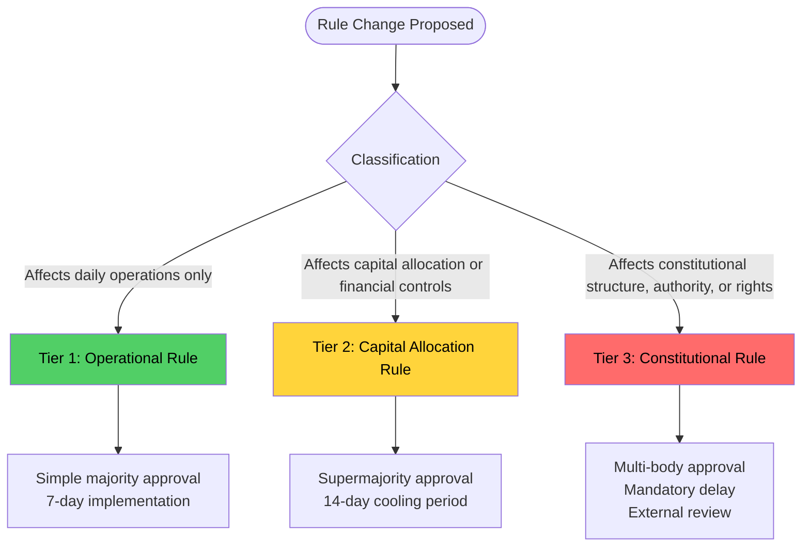
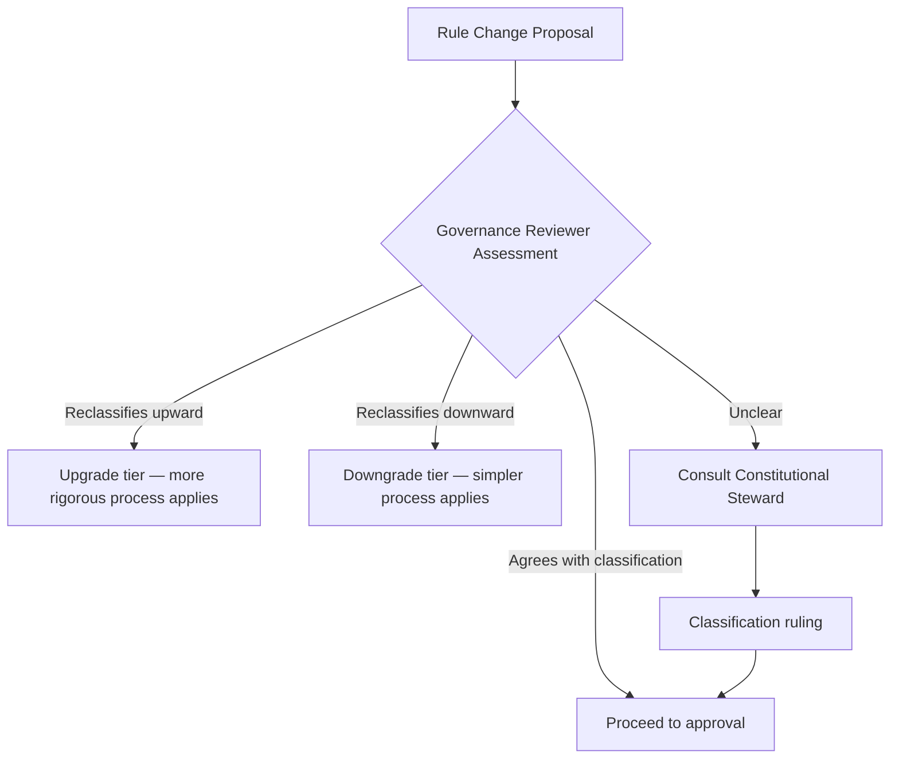
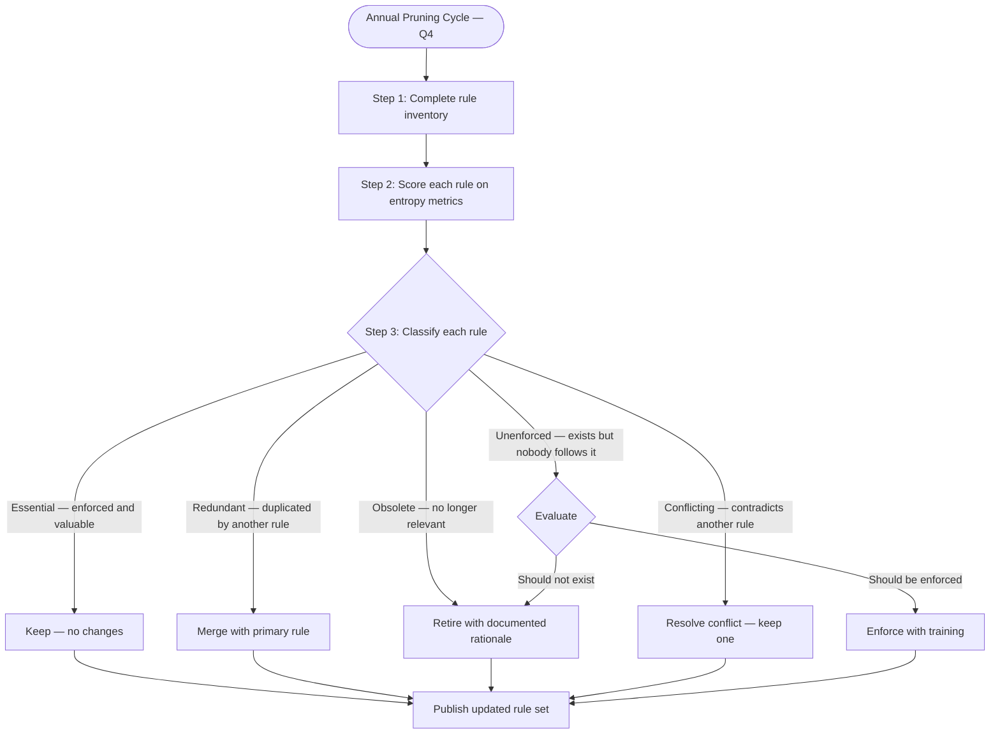

---

sidebar_position: 8
title: "SOP: Governance Review & Rule Changes"
description: "Complete Standard Operating Procedure for proposing, approving, and implementing governance rule changes — including operational, capital, and constitutional tiers with rule entropy monitoring."
tags: [sop, operational, governance, aineff]
custom_status: active
custom_owner: Andrew Leo
custom_last_review: 2026-03-01
custom_next_review: 2026-06-01
---

# SOP: Governance Review & Rule Changes

Governance in the AINEFF Ecosystem is not static. Rules must evolve as the ecosystem grows, markets change, and operational experience accumulates. But governance changes are among the most dangerous actions in the ecosystem — a bad rule can propagate across every AINE, every operator, and every decision.

This SOP defines how governance rules are proposed, classified, reviewed, approved, implemented, and pruned.

---

## Rule Classification

Every governance rule change is classified into one of three tiers. The tier determines the approval process, cooling period, and implementation timeline.

### Tier 1: Operational Rules

**Scope:** Rules that govern daily operations — process steps, tool usage, reporting requirements, communication protocols.

| Parameter | Value |
|-----------|-------|
| **Approval** | Simple majority of affected Cell Leads |
| **Cooling period** | None |
| **Implementation** | 7 days |
| **Review required** | Governance Reviewer sign-off |
| **Reversibility** | Can be reversed by same approval process |
| **Examples** | Standup format change, tool migration, reporting cadence adjustment |

### Tier 2: Capital Allocation Rules

**Scope:** Rules that govern how money moves — spending limits, approval thresholds, revenue share formulas, investment criteria.

| Parameter | Value |
|-----------|-------|
| **Approval** | Supermajority (2/3) of Capital Allocation Committee |
| **Cooling period** | 14 days (mandatory — no exceptions) |
| **Implementation** | After cooling period expires with no objections sustained |
| **Review required** | Governance Reviewer + Finance Lead + Legal review |
| **Reversibility** | Requires same approval process; cannot be emergency-reversed |
| **Examples** | Spending limit changes, revenue share adjustments, new investment criteria |

### Tier 3: Constitutional Rules

**Scope:** Rules that define the fundamental structure — authority hierarchies, entity mandates, rights, constitutional principles.

| Parameter | Value |
|-----------|-------|
| **Approval** | Multi-body: AINEFF Board + AINEG + Frankmax + affected entity leads |
| **Cooling period** | 30 days (mandatory) |
| **External review** | Independent governance review (external to ecosystem) |
| **Implementation** | After cooling period + external review clearance |
| **Reversibility** | Requires same multi-body process |
| **Examples** | Authority structure changes, new entity creation, constitutional principle amendments |

---

## Rule Change Procedure

### Step 1: Proposal Submission

**Owner:** Rule Proposer
**Duration:** 1–5 days

The Rule Proposer submits a structured proposal:

| Section | Content |
|---------|---------|
| **Current state** | What is the current rule? (Exact text) |
| **Proposed change** | What is the new rule? (Exact text) |
| **Rationale** | Why is this change needed? |
| **Impact assessment** | What entities, operators, and processes are affected? |
| **Risk assessment** | What could go wrong if this rule is implemented? |
| **Reversibility plan** | How would we undo this if it fails? |
| **Classification** | Tier 1, 2, or 3 (proposer's assessment, subject to Reviewer override) |

**Artifacts:** Rule Change Proposal Document

### Step 2: Classification Verification

**Owner:** Governance Reviewer
**Duration:** 1–2 days

Classification criteria:

| Question | If Yes → |
|----------|----------|
| Does it change how money moves or is allocated? | Tier 2 minimum |
| Does it change who has authority over what? | Tier 3 |
| Does it affect constitutional principles or entity mandates? | Tier 3 |
| Could it be reversed in 24 hours with no lasting impact? | Tier 1 eligible |
| Does it affect only a single cell or team? | Tier 1 eligible |

**Artifacts:** Classification Decision (with rationale)

### Step 3: Impact Analysis

**Owner:** Governance Reviewer + affected entity representatives
**Duration:** 2–7 days (Tier 1), 7–14 days (Tier 2), 14–30 days (Tier 3)

- Map all entities, operators, processes, and systems affected by the change
- Estimate transition cost (time, money, disruption)
- Identify dependencies and sequencing requirements
- Assess compatibility with existing rules (conflict detection)
- Produce impact report

**Artifacts:** Impact Analysis Report

### Step 4: Approval

**Owner:** Approval body (varies by tier)
**Duration:** 1–3 days (Tier 1), 3–7 days (Tier 2), 7–14 days (Tier 3)

| Tier | Approval Body | Threshold |
|------|--------------|-----------|
| 1 | Affected Cell Leads | Simple majority |
| 2 | Capital Allocation Committee | 2/3 supermajority |
| 3 | Multi-body (AINEFF Board + AINEG + Frankmax + entity leads) | Unanimous or near-unanimous (defined per entity) |

Approval is documented with: voter identities, votes, rationale for dissenting votes, final tally.

**Artifacts:** Approval Record, Dissent Register (if any)

### Step 5: Cooling Period

**Owner:** Governance Reviewer (monitors)
**Duration:** None (Tier 1), 14 days (Tier 2), 30 days (Tier 3)

During the cooling period:
- The approved change is published to all affected parties
- Any party may raise objections
- Sustained objections trigger a re-review (not a re-vote — a substantive review of the objection)
- If no sustained objections, the change proceeds to implementation

For Tier 3: External review is conducted during the cooling period.

**Artifacts:** Cooling Period Log, Objection Records (if any), External Review Report (Tier 3)

### Step 6: Implementation

**Owner:** Governance Reviewer + affected system owners
**Duration:** 7 days (Tier 1), 14 days (Tier 2), 30 days (Tier 3)

- Update governance documentation (version-controlled)
- Update affected SOPs and processes
- Update affected systems and configurations
- Communicate changes to all affected operators
- Provide training if the change alters operational procedures
- Monitor for unintended consequences during implementation window

**Artifacts:** Updated Governance Documents, Communication Records, Training Records

### Step 7: Post-Implementation Review

**Owner:** Governance Reviewer
**Duration:** 30 days after implementation

- Assess whether the change achieved its intended purpose
- Monitor for unintended consequences
- Collect feedback from affected operators
- Determine if the rule should be adjusted, kept, or reversed

**Artifacts:** Post-Implementation Review Report

---

## Annual Rule Pruning Cycle

Governance rules accumulate entropy. Without active pruning, the rule set becomes bloated, contradictory, and unenforceable. The AINEFF Ecosystem conducts an **annual rule pruning cycle** to keep governance lean.

### Pruning Procedure

### Rule Entropy Score

Every rule is scored on the following entropy metrics:

| Metric | Weight | Scoring |
|--------|--------|---------|
| **Enforcement rate** | 25% | How often is this rule actually followed? (0-100%) |
| **Clarity** | 20% | Can an operator correctly interpret this rule without guidance? (0-100%) |
| **Relevance** | 20% | Does this rule address a current, real problem? (0-100%) |
| **Conflict score** | 15% | Does this rule contradict or overlap with other rules? (0 = no conflict, 100 = severe) |
| **Complexity** | 10% | How many conditions, exceptions, and qualifications? (0 = simple, 100 = labyrinthine) |
| **Age without review** | 10% | How long since this rule was last reviewed? (0 = recently, 100 = years) |

**Entropy threshold:** Rules scoring above 60% entropy are flagged for mandatory review.

### Maximum Rule Count Enforcement

Each governance layer has a **maximum rule count** to prevent regulatory bloat:

| Layer | Maximum Rules | Current Count | Action if Exceeded |
|-------|--------------|---------------|-------------------|
| Constitutional (AINEFF) | 25 | Tracked in registry | Cannot add new rule without retiring one |
| Portfolio coordination (AINEG) | 50 | Tracked in registry | Simplification review triggered |
| Operational (per AINE) | 75 | Tracked per AINE | Annual pruning prioritized |
| Cell-level | 30 | Tracked per cell | Cell Lead must prune before adding |

---

## Protocol Simplification Trigger

If any of the following conditions are met, a mandatory **Protocol Simplification Review** is triggered:

| Trigger | Threshold |
|---------|-----------|
| Rule count exceeds maximum for any layer | Immediate |
| Average entropy score exceeds 50% for any layer | Within 30 days |
| More than 3 rule conflicts detected in a single audit | Within 14 days |
| Operator survey: &gt; 30% report "governance is unclear or burdensome" | Within 30 days |
| Rule change frequency exceeds 5 changes per month at any layer | Immediate review |

---

## Roles

| Role | Responsibility |
|------|---------------|
| **Rule Proposer** | Any operator at Stage 4+ may propose rule changes |
| **Governance Reviewer** | Reviews proposals, classifies changes, monitors implementation |
| **Constitutional Steward** | Arbiter for Tier 3 changes and classification disputes |
| **Approval Body** | Varies by tier (Cell Leads, Capital Committee, or Multi-body) |

---

## Version Control for Governance Documents

All governance documents are version-controlled with:

| Field | Description |
|-------|-------------|
| **Version number** | Semantic versioning (major.minor.patch) |
| **Change date** | Date the change was implemented |
| **Change author** | Who proposed and who approved |
| **Change rationale** | Why the change was made |
| **Previous version** | Link to the previous version for comparison |
| **Affected documents** | List of all SOPs and processes updated as a result |

Governance documents are stored in the ecosystem's **Golden Repo** and follow the same deployment pipeline as code (review, approval, staged rollout).
