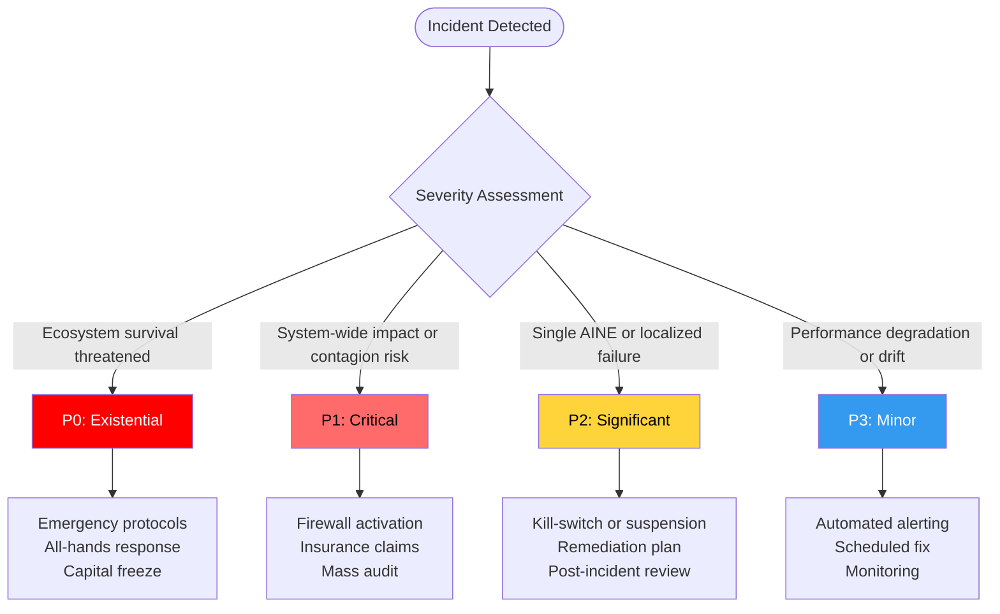
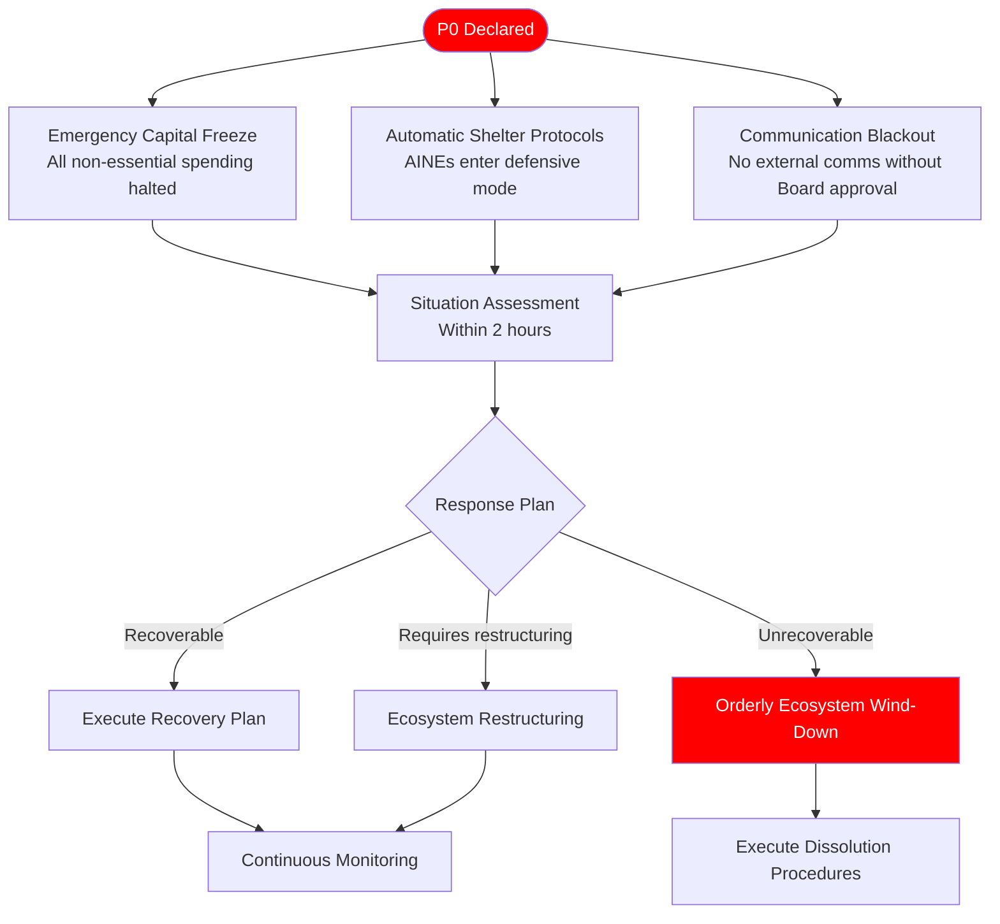
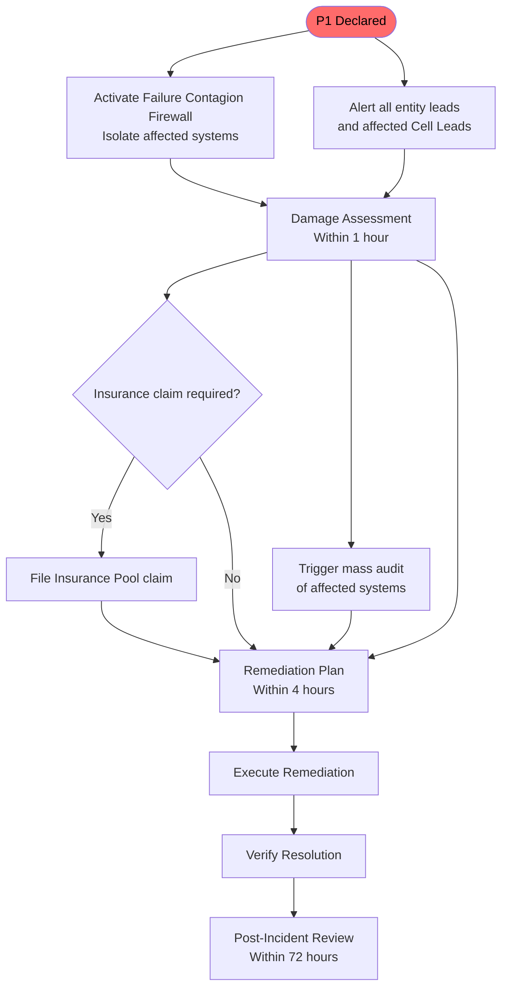
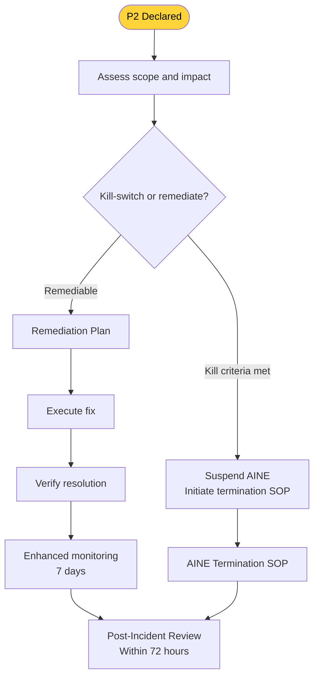
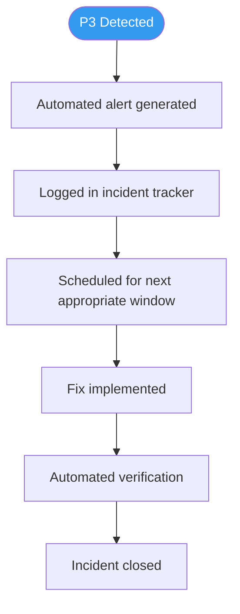
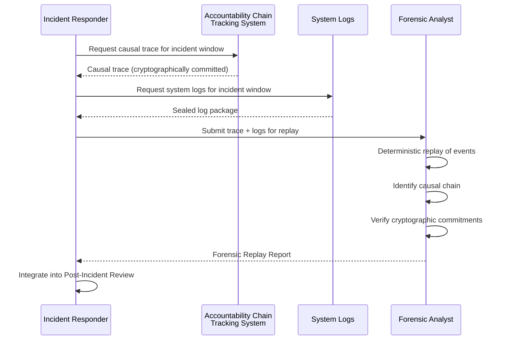

---

sidebar_position: 9
title: "SOP: Incident Response & External Shocks"
description: "Complete Standard Operating Procedure for incident response — severity-graded from P3 (minor) to P0 (existential), including communication protocols, escalation procedures, and forensic replay."
tags: [sop, operational, risk]
custom_status: active
custom_owner: Andrew Leo
custom_last_review: 2026-03-01
custom_next_review: 2026-06-01
---

# SOP: Incident Response & External Shocks

The AINEFF Ecosystem operates in a world of irreducible uncertainty. Markets crash, regulators act, AI models change, systems fail, and adversaries attack. This SOP defines the **severity-graded response framework** — from automated handling of minor drift to full ecosystem-level emergency protocols for existential threats.

---

## Severity Classification

### Severity Definitions

| Level | Name | Definition | Examples |
|-------|------|-----------|----------|
| **P0** | Existential | Threatens the survival or fundamental viability of the ecosystem | Regulatory ban in primary jurisdiction, war affecting operations, currency collapse, critical AI model provider shutdown |
| **P1** | Critical | System-wide impact, contagion risk, or major trust breach | System-wide infrastructure failure, data breach affecting multiple AINEs, failure contagion across venture cells, major compliance violation |
| **P2** | Significant | Localized failure with contained impact | Single AINE failure, isolated compliance violation, client data incident, single system outage |
| **P3** | Minor | Performance degradation or drift from expected behavior | Metric drift detection, minor service degradation, non-critical bug, process deviation |

:::danger[P0 Existential Threat -- Ecosystem Survival at Stake]
A P0 incident threatens the fundamental viability of the entire ecosystem. Response time is measured in minutes, not hours. Capital is frozen, shelter protocols activate, and a communication blackout is imposed immediately.
:::

:::warning[P1 Critical -- Contagion Risk Must Be Contained]
P1 incidents carry contagion risk. The Failure Contagion Firewall activates automatically to isolate affected systems. If containment fails, the incident escalates to P0.
:::

---

## P0 Response: Existential Threat

**Response Time:** Immediate (< 15 minutes to activate)
**Command:** AINEFF Board + all entity leads
**Duration:** Until threat is resolved or ecosystem restructured

### Trigger Examples

- Regulatory ban on AI operations in a primary jurisdiction
- Armed conflict affecting operational infrastructure
- Currency collapse in a key operating currency
- Critical AI model provider (e.g., foundation model) discontinues service or changes terms to make operations unviable

### Response Protocol

### P0 Actions

| Action | Timeline | Owner |
|--------|----------|-------|
| **Emergency capital freeze** | Immediate | Finance Lead (automated) |
| **Shelter protocols** | Immediate | All AINE Cell Leads (automated) |
| **Communication blackout** | Immediate | All operators |
| **Board assembly** | Within 1 hour | AINEFF Board |
| **Situation assessment** | Within 2 hours | All entity leads |
| **Response plan** | Within 6 hours | AINEFF Board |
| **Client communication** | Within 24 hours (Board-approved only) | Commercial Leads |
| **Regulatory communication** | As required | Legal Lead |

### Communication Rules (P0)

:::warning[P0 Communication Blackout Is Absolute]
During a P0 event, no operator may communicate externally about the incident without explicit AINEFF Board approval. Violations -- including social media posts -- are treated as governance violations.
:::

- **No external communication** without AINEFF Board approval
- **Single spokesperson** designated for all external communication
- **Internal communication** restricted to need-to-know channels
- **No social media** activity by any operator regarding the incident
- **Legal review** of all external communications before release

---

## P1 Response: Critical

**Response Time:** Within 30 minutes
**Command:** AINEG + affected entity leads
**Duration:** Until contained and remediated

### Trigger Examples

- System-wide infrastructure failure
- Data breach affecting multiple AINEs
- Failure contagion spreading between venture cells
- Major compliance violation affecting multiple jurisdictions
- Insurance-triggering event

### Response Protocol

### P1 Actions

| Action | Timeline | Owner |
|--------|----------|-------|
| **Failure Contagion Firewall activation** | Immediate | Infrastructure Lead (automated trigger) |
| **Entity lead notification** | Within 15 minutes | AINEG |
| **Damage assessment** | Within 1 hour | Incident Commander |
| **Insurance claim filing** | Within 4 hours (if applicable) | Finance + Legal |
| **Mass audit initiation** | Within 4 hours | Audit Lead |
| **Remediation plan** | Within 4 hours | Incident Commander |
| **Client communication** | Within 24 hours | Commercial Leads |
| **Post-incident review** | Within 72 hours | Post-Mortem Lead |

---

## P2 Response: Significant

**Response Time:** Within 2 hours
**Command:** Affected Cell Lead + AINE Lead
**Duration:** Until resolved

### Trigger Examples

- Single AINE failure
- Isolated compliance violation
- Client data incident (single client)
- Single system outage
- Operator governance violation

### Response Protocol

### P2 Actions

| Action | Timeline | Owner |
|--------|----------|-------|
| **Impact assessment** | Within 30 minutes | Cell Lead |
| **Kill criteria check** | Within 1 hour | Cell Lead + Kill-Switch Operator |
| **Kill-switch or remediation decision** | Within 2 hours | Cell Lead + AINE Lead |
| **Remediation plan** | Within 4 hours | Execution Operator |
| **Client notification** (if affected) | Within 24 hours | Commercial Operator |
| **Post-incident review** | Within 72 hours | Cell Lead |

---

## P3 Response: Minor

**Response Time:** Within 24 hours
**Command:** Responsible operator
**Duration:** Until resolved (scheduled)

### Trigger Examples

- Metric drift detected by monitoring
- Minor service degradation
- Non-critical bug discovered
- Process deviation identified
- Performance below expected threshold (but above kill criteria)

### Response Protocol

### P3 Actions

| Action | Timeline | Owner |
|--------|----------|-------|
| **Automated alerting** | Immediate | Monitoring system |
| **Incident logging** | Automated | Monitoring system |
| **Triage** | Within 24 hours | Responsible operator |
| **Fix** | Within 1 week | Assigned operator |
| **Verification** | Within 24 hours of fix | Automated tests |

---

## Communication Protocols by Severity

| Audience | P0 | P1 | P2 | P3 |
|----------|----|----|----|----|
| **AINEFF Board** | Immediate | Within 1 hour | Daily summary | Weekly summary |
| **Entity Leads** | Immediate | Within 15 minutes | Same day | Weekly summary |
| **Cell Leads** | Immediate | Within 30 minutes | Same day | As needed |
| **All Operators** | Board-approved only | Need-to-know | Affected teams only | Not required |
| **Clients** | Board-approved, within 24h | Within 24h (affected clients) | Within 24h (affected clients) | Not required |
| **Regulators** | As legally required | If compliance-relevant | If compliance-relevant | Not required |
| **Public** | Board-approved only | If required | Not required | Not required |

---

## Post-Incident Review Procedure

:::info[Post-Incident Reviews Are Mandatory Within 72 Hours]
This is not optional, not deferrable, and not a suggestion. The 72-hour window begins at the moment the incident is declared.
:::

Every P0, P1, and P2 incident requires a formal post-incident review within **72 hours**.

### Review Structure

| Section | Content |
|---------|---------|
| **Timeline** | Minute-by-minute reconstruction of the incident |
| **Root cause** | What actually caused the incident (not symptoms) |
| **Detection** | How was the incident detected? Could it have been detected earlier? |
| **Response** | How effective was the response? What worked and what did not? |
| **Impact** | Quantified impact (financial, operational, reputational, compliance) |
| **Remediation** | What was done to fix the immediate problem? |
| **Prevention** | What changes are needed to prevent recurrence? |
| **Governance** | Were governance procedures followed? If not, why not? |
| **Action items** | Specific, assigned, time-bound follow-up actions |

### Review Participants

| Severity | Required Participants |
|----------|----------------------|
| P0 | AINEFF Board, all entity leads, external reviewer |
| P1 | AINEG, affected entity leads, incident commander |
| P2 | Cell Lead, affected operators, AINE Lead |

---

## Forensic Replay Procedure

:::note[Forensic Replay Produces Court-Grade Evidence]
The forensic replay procedure produces deterministic, cryptographically verified evidence for legal proceedings, regulatory inquiries, and insurance claims.
:::

For P0 and P1 incidents, a **forensic replay** is conducted to produce a deterministic, auditable reconstruction of events.

### Forensic Replay Steps

1. **Evidence collection** — Gather all ACTS traces, system logs, and telemetry for the incident window
2. **Chain of custody** — Verify cryptographic integrity of all evidence
3. **Deterministic replay** — Re-execute the event sequence in an isolated environment
4. **Causal analysis** — Trace the causal chain from root cause to observed failure
5. **Counterfactual analysis** — What would have happened if detection was earlier? If response was different?
6. **Report production** — Produce forensic replay report with evidence, analysis, and recommendations

**Artifacts:** Forensic Replay Report, Evidence Package (sealed), Chain of Custody Record

---

## Incident Metrics

The following metrics are tracked for all incidents:

| Metric | Target |
|--------|--------|
| **Mean Time to Detect (MTTD)** | &lt; 5 minutes (P0-P1), &lt; 1 hour (P2), &lt; 24 hours (P3) |
| **Mean Time to Respond (MTTR)** | &lt; 15 minutes (P0), &lt; 30 minutes (P1), &lt; 2 hours (P2) |
| **Mean Time to Resolve** | Varies by severity and nature |
| **Post-Incident Review completion** | 100% within 72 hours (P0-P2) |
| **Action item closure rate** | &gt; 90% within 30 days |
| **Recurrence rate** | &lt; 5% (same root cause within 12 months) |

---

## Related Documents

<CrossReference to="/docs/architecture/governance-enforcement" title="Governance Enforcement Architecture" description="The enforcement systems (PAME, ICG, CCRS) and response ladders that detect and respond to incidents at the architectural level" badge="Architecture" />

<CrossReference to="/docs/guides/escalation-matrix" title="Escalation & Authority Matrix" description="Visual reference for decision authority limits and escalation paths used during incident response triage" badge="Guide" />
