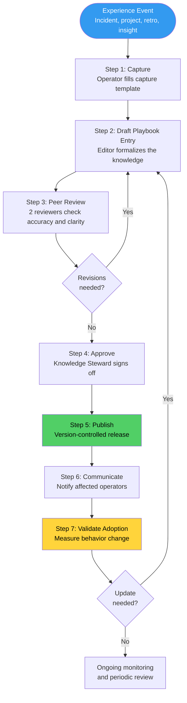
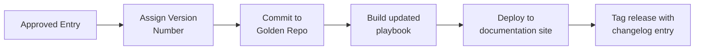

# SOP: Knowledge Capture & Playbook Updates

Knowledge in the AINEFF Ecosystem does not live in people's heads. Every operational lesson, every hard-won insight, every pattern that works (or fails) must be **captured, formalized, reviewed, published, and validated**. When an operator leaves, their knowledge stays. When a new operator joins, they inherit the accumulated wisdom of every operator who came before them.

This SOP defines how knowledge flows from experience to documentation to adoption -- ensuring the ecosystem gets smarter with every engagement, every incident, and every review cycle.

---

## Overview

The knowledge capture system operates on a continuous loop: operational experience generates insights, insights are captured using structured templates, captured knowledge is reviewed and formalized into playbook entries, playbooks are published and communicated, and adoption is measured to ensure the knowledge actually changes behavior.

Knowledge that is captured but not adopted is waste. Knowledge that is adopted but not captured is fragile. This SOP ensures neither state persists.

---

## Trigger / When to Use

| Trigger | Knowledge Type | Capture Timeline |
|---------|---------------|-----------------|
| Post-incident review completed (P0-P2) | Procedural, technical | Within 5 business days of review |
| Client engagement completed | Procedural, tacit, commercial | Within 10 business days of engagement close |
| Quarterly retrospective | All types | During retro session, formalized within 2 weeks |
| Customer insight identified | Market, commercial | Within 3 business days of identification |
| New tool or process adopted | Technical, procedural | Before tool/process goes live |
| Operator discovers undocumented pattern | Tribal, tacit | Within 5 business days of discovery |
| SOP deviation proves beneficial | Procedural | Captured during next review cycle |
| Onboarding feedback from new operator | Procedural, tribal | Within 1 week of onboarding completion |
| Audit finding identifies knowledge gap | All types | Within 14 days of finding |

---

## Roles & Responsibilities

| Role | Responsibility |
|------|---------------|
| **Knowledge Contributor** | Any operator who captures an insight using the capture template |
| **Playbook Editor** | Formalizes captured knowledge into playbook entries (typically Stage 4+ operator) |
| **Peer Reviewer** | Reviews draft playbook entries for accuracy, clarity, and completeness |
| **Knowledge Steward** | Approves publications, manages playbook structure, monitors adoption (Cell Lead or designated operator) |
| **Cell Lead** | Ensures knowledge capture happens within their cell, validates relevance |
| **AINE Lead** | Oversees cross-cell knowledge sharing, approves structural changes to playbooks |
| **All Operators** | Responsible for reading, understanding, and adopting published playbook updates |

---

## Process Flow

---

## Knowledge Types

| Type | Definition | Examples | Capture Method |
|------|-----------|----------|---------------|
| **Procedural** | Step-by-step processes for accomplishing tasks | Deployment checklists, client onboarding steps, review procedures | Structured template with numbered steps |
| **Tacit** | Experience-based judgment difficult to articulate | "When a client says X, it usually means Y" -- pattern recognition | Narrative capture with scenario examples |
| **Tribal** | Informal knowledge shared within a group but not documented | Why we do things a certain way, historical context for decisions | Interview-style capture, retro sessions |
| **Technical** | System-specific knowledge about tools, architectures, and configurations | API quirks, infrastructure patterns, debugging techniques | Technical documentation template |
| **Commercial** | Market insights, client patterns, pricing intelligence | Industry trends, competitive positioning, client buying signals | Market intelligence template |

---

## Step-by-Step Procedure

### Step 1: Capture (Days 0-5 from trigger)

**Owner:** Knowledge Contributor (any operator)
**Duration:** 30-60 minutes per capture

The contributor fills out the **Knowledge Capture Template**:

| Template Section | Content | Purpose |
|-----------------|---------|---------|
| **Context** | What happened? When? Who was involved? | Situational grounding |
| **Insight** | What did we learn? What was the key realization? | Core knowledge extraction |
| **Evidence** | What data, metrics, or observations support this insight? | Validation and credibility |
| **Impact** | How does this affect our operations, revenue, or governance? | Prioritization input |
| **Recommendation** | What should we do differently based on this knowledge? | Actionable guidance |
| **Knowledge type** | Procedural, tacit, tribal, technical, or commercial | Classification |
| **Scope** | Cell-specific, AINE-wide, or ecosystem-wide | Distribution targeting |
| **Source event** | Link to incident report, project record, retro notes, or engagement record | Traceability |

**Capture rules:**

- Capture within the timeline specified for each trigger (see Trigger table above)
- One insight per capture template (do not bundle multiple insights)
- Use concrete examples, not abstract generalizations
- Include "what went wrong" as readily as "what went right"

### Step 2: Draft Playbook Entry (Days 5-10)

**Owner:** Playbook Editor
**Duration:** 2-4 hours per entry

The editor transforms the raw capture into a structured playbook entry:

| Entry Section | Content |
|--------------|---------|
| **Title** | Clear, searchable title describing the knowledge |
| **Category** | Which playbook section this belongs in |
| **Summary** | 2-3 sentence overview of the knowledge |
| **When to apply** | Specific situations where this knowledge is relevant |
| **Procedure/Guidance** | Step-by-step instructions or decision guidance |
| **Examples** | Real scenarios illustrating application (anonymized if needed) |
| **Common mistakes** | What to avoid when applying this knowledge |
| **Related entries** | Cross-references to other playbook entries |
| **Version** | Semantic version number (1.0.0 for new entries) |
| **Last updated** | Date of most recent revision |
| **Contributors** | Who contributed to this entry |

### Step 3: Peer Review (Days 10-15)

**Owner:** 2 Peer Reviewers
**Duration:** 1-2 hours per reviewer

Peer reviewers evaluate the draft entry against:

| Review Criterion | Question |
|-----------------|----------|
| **Accuracy** | Is the information factually correct? Would following this guidance produce the intended result? |
| **Clarity** | Can a Stage 3 operator understand and apply this without additional guidance? |
| **Completeness** | Are there missing steps, edge cases, or exceptions that should be documented? |
| **Consistency** | Does this align with existing playbook entries and SOPs? Are there contradictions? |
| **Actionability** | Can an operator act on this knowledge immediately, or is it too abstract? |
| **Scope** | Is the distribution scope appropriate? Too narrow or too broad? |

**Review output:** Approved, Approved with Minor Revisions, or Requires Major Revision

### Step 4: Approve (Days 15-17)

**Owner:** Knowledge Steward
**Duration:** 1 business day

The Knowledge Steward:

- Verifies peer review was completed by qualified reviewers
- Confirms the entry fits the playbook structure and taxonomy
- Checks for conflicts with existing governance rules or SOPs
- Approves for publication or returns for additional revision
- Assigns the entry to the correct playbook section

### Step 5: Publish (Day 17-18)

**Owner:** Knowledge Steward
**Duration:** Same day as approval

Publication follows version control requirements:

| Version Control Rule | Implementation |
|---------------------|---------------|
| Every playbook change is a Git commit | Full audit trail of who changed what and when |
| Semantic versioning for each entry | Major (breaking change), Minor (new guidance), Patch (correction) |
| Changelog maintained per playbook | Operators can see what changed and when |
| Previous versions accessible | Operators can reference historical guidance |
| No direct edits to published playbooks | All changes go through the review process |

### Step 6: Communicate (Days 18-20)

**Owner:** Knowledge Steward
**Duration:** 1-2 business days

| Scope | Communication Channel | Method |
|-------|----------------------|--------|
| Cell-specific | Cell standup + cell communication channel | Verbal summary + link to entry |
| AINE-wide | AINE weekly digest + AINE communication channel | Written summary + link to entry |
| Ecosystem-wide | Ecosystem newsletter + all-hands mention | Featured article + link to entry |

**Communication requirements:**

- Include a 2-3 sentence summary of the new knowledge
- Explain why it matters and who it affects
- Link directly to the playbook entry
- For procedural changes, include a "what changed" diff summary
- For critical knowledge (safety, compliance, governance), require acknowledgment

### Step 7: Validate Adoption (Days 30-60)

**Owner:** Knowledge Steward + Cell Lead
**Duration:** Ongoing measurement

| Validation Method | Metric | Target |
|------------------|--------|--------|
| **Acknowledgment tracking** | Percentage of affected operators who acknowledged the update | &gt; 90% within 2 weeks |
| **Behavioral observation** | Is the knowledge being applied in daily operations? | Spot-checked by Cell Lead |
| **Audit trail** | Do subsequent PIARs, reviews, and deliverables reflect the knowledge? | Checked during quarterly audit |
| **Feedback collection** | Do operators find the entry useful and clear? | Net positive feedback |
| **Incident recurrence** | For post-incident knowledge, has the root cause recurred? | Zero recurrence within 6 months |

If adoption is below target:

1. Investigate why (unclear entry, irrelevant knowledge, communication failure, resistance)
2. Revise the entry, communication approach, or training as needed
3. Re-measure after intervention

---

## Playbook Structure Standards

### Playbook Organization

| Level | Example | Purpose |
|-------|---------|---------|
| **Playbook** | Operations Playbook, Commercial Playbook, Technical Playbook | Top-level knowledge domain |
| **Section** | Client Engagement, Incident Response, Deployment | Major functional area |
| **Entry** | "Handling scope creep in diagnostic engagements" | Specific piece of knowledge |
| **Version** | v2.1.0 | Specific version of an entry |

### Mandatory Playbooks

| Playbook | Owner | Scope |
|----------|-------|-------|
| **Operations Playbook** | AINE Lead | Day-to-day operational procedures and patterns |
| **Commercial Playbook** | Commercial Lead | Sales, client management, pricing, and expansion patterns |
| **Technical Playbook** | Technical Lead | Architecture, deployment, integration, and debugging patterns |
| **Governance Playbook** | Governance Reviewer | PIAR patterns, governance interpretations, compliance guidance |
| **Onboarding Playbook** | HR/Operations Lead | Everything a new operator needs to be effective |

### Entry Quality Standards

| Standard | Requirement |
|----------|-------------|
| **Readability** | Written at a level a Stage 3 operator can understand |
| **Length** | 200-800 words per entry (not counting examples) |
| **Structure** | Uses the standard entry template consistently |
| **Examples** | Minimum 1 real-world example per entry |
| **Cross-references** | Links to related entries and relevant SOPs |
| **Currency** | Reviewed at least annually; flagged if older than 12 months without review |

---

## Quarterly Knowledge Retrospective

Every quarter, each cell conducts a **Knowledge Retrospective** as part of the quarterly review cycle.

| Retro Element | Purpose |
|--------------|---------|
| **Capture review** | How many knowledge captures were filed this quarter? Are we capturing enough? |
| **Publication review** | How many entries were published? What is the pipeline backlog? |
| **Adoption review** | Which entries had high/low adoption? Why? |
| **Gap identification** | What knowledge do we need but do not have documented? |
| **Stale entry review** | Which entries are outdated and need revision or retirement? |
| **Cross-cell sharing** | What knowledge from other cells should we adopt? |

---

## Artifacts / Outputs

| Artifact | Produced By | Retention |
|----------|------------|-----------|
| Knowledge Capture Template (completed) | Knowledge Contributor | Permanent (part of audit trail) |
| Draft Playbook Entry | Playbook Editor | Until published (drafts archived) |
| Peer Review Records | Peer Reviewers | Permanent |
| Published Playbook Entry | Knowledge Steward | Permanent (version-controlled) |
| Communication Records | Knowledge Steward | 3 years |
| Adoption Measurement Reports | Knowledge Steward | 3 years |
| Quarterly Knowledge Retro Minutes | Cell Lead | Permanent |
| Playbook Changelog | Automated | Permanent |

---

## Time Bounds / SLAs

| Activity | SLA |
|----------|-----|
| Knowledge capture from trigger event | Per trigger table (3-14 business days depending on type) |
| Capture to draft playbook entry | &lt; 10 business days |
| Peer review completion | &lt; 5 business days from draft |
| Approval decision | &lt; 2 business days from review completion |
| Publication after approval | &lt; 1 business day |
| Communication to affected operators | &lt; 2 business days from publication |
| Adoption validation (initial) | 30 days from publication |
| Total capture-to-publication pipeline | &lt; 20 business days |
| Stale entry review | Every 12 months (flagged automatically) |
| Quarterly knowledge retrospective | Within 2 weeks of quarter close |

---

## Kill Criteria / Escalation Triggers

| Condition | Escalation |
|-----------|-----------|
| Knowledge capture pipeline backlog exceeds 20 items | AINE Lead reviews resourcing for playbook editing |
| Published entry has &lt; 50% acknowledgment after 30 days | Knowledge Steward investigates communication failure |
| Same root cause recurs after post-incident knowledge was published | Incident Response SOP triggered + adoption investigation |
| Playbook entry contradicts an active SOP | Immediate escalation to Governance Reviewer for resolution |
| More than 30% of entries flagged as stale in quarterly retro | AINE Lead mandates dedicated playbook refresh sprint |
| Operator reports making a mistake because playbook was wrong | Immediate entry revision + communication to all affected operators |
| No knowledge captures filed by a cell in an entire quarter | Cell Lead's performance review notes knowledge contribution gap |

---

## Anti-Patterns

| Anti-Pattern | Why It Fails | Correct Approach |
|-------------|-------------|-----------------|
| **Write-only documentation** | Knowledge captured but never read or applied is waste | Measure adoption, not just publication volume |
| **Hero knowledge** | Critical knowledge lives in one person's head | Capture and distribute before the person becomes a single point of failure |
| **Perfectionism paralysis** | Waiting for the "perfect" entry delays value delivery | Publish good-enough entries and iterate; v1.0 beats v0.0 |
| **Copy-paste SOPs** | Playbook entries that duplicate SOPs without adding context | Playbooks add judgment, examples, and tacit knowledge -- SOPs define the rules |
| **Mandatory reading without accountability** | Sending links nobody reads | Require acknowledgment and spot-check application |
| **Knowledge hoarding** | Operators keep insights to themselves for competitive advantage | Culture + incentives that reward sharing; knowledge contribution in performance reviews |
| **Outdated playbooks** | Entries that no longer reflect current operations mislead operators | Automated staleness flagging + annual review requirement |
| **Capture without context** | Raw notes without situational framing are useless to future readers | Template enforces context, evidence, and recommendation fields |

---

## Cross-References

| Related SOP | Relationship |
|------------|-------------|
| [Incident Response & External Shocks](./incident-response-sop) | Post-incident reviews are primary knowledge capture triggers |
| [Client Engagement Lifecycle](./client-engagement-sop) | Client engagement completions trigger knowledge capture |
| [Operator Onboarding & Lifecycle](./operator-onboarding-sop) | Onboarding Playbook is maintained through this process |
| [Operator Performance Review](./operator-performance-review-sop) | Knowledge contribution is a review criterion |
| [Governance Review & Rule Changes](./governance-review-sop) | Playbook updates that conflict with governance trigger the governance review process |
| [Audit & Compliance Procedures](./audit-sop) | Knowledge gaps identified in audits trigger capture requirements |
| [Venture Cell Operations](./venture-cell-sop) | Quarterly retros feed knowledge capture; standups are communication channels |
| [System Deployment & Release](./deployment-sop) | Technical playbook entries follow the same version control pipeline as code |
| [AINE Creation & Manufacturing](./aine-creation-sop) | New AINE creation triggers playbook initialization |
