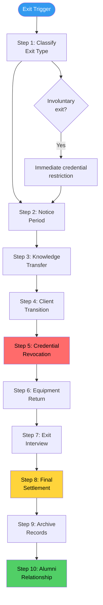
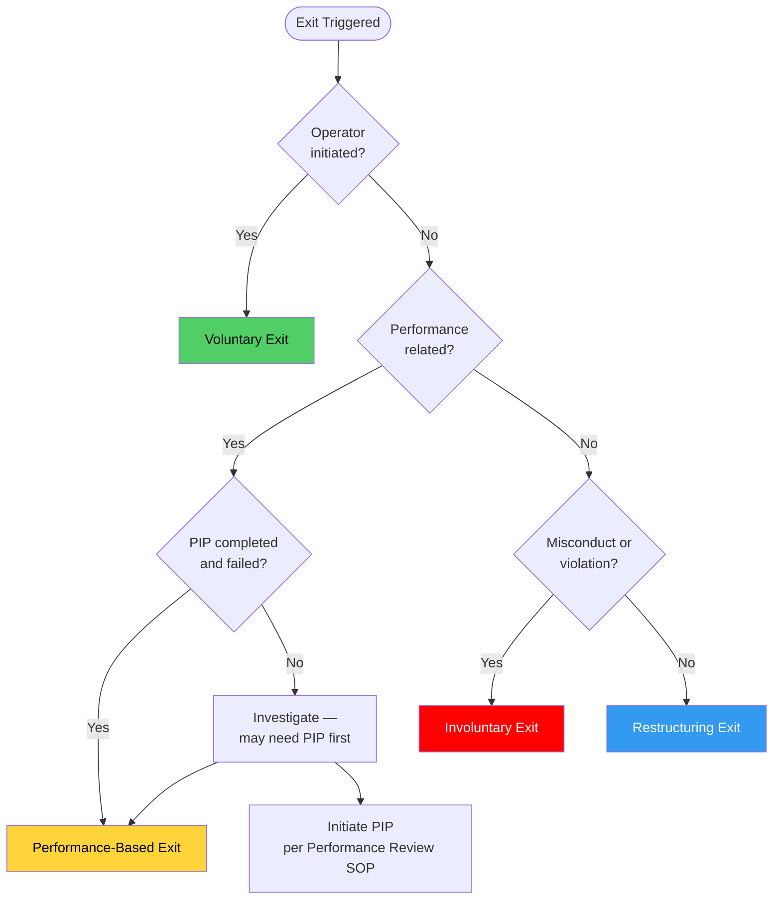
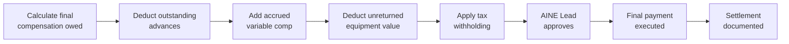

# SOP: Operator Offboarding & Knowledge Transition

Operator exits are inevitable. People leave for new opportunities, performance issues are not always resolvable, and the ecosystem's needs evolve. The question is not whether operators will leave, but whether their departure will be **orderly or chaotic**. This SOP ensures that every exit -- voluntary or involuntary -- protects the ecosystem's knowledge, client relationships, security, and operational continuity.

This SOP is the inverse of the [Operator Onboarding & Lifecycle SOP](./operator-onboarding-sop). Onboarding builds capability; offboarding preserves it.

---

## Overview

The offboarding process covers everything from the moment an exit is triggered through final settlement and record archival. It handles four exit types with different timelines and procedures, but all share the same core requirements: knowledge must be transferred, credentials must be revoked, clients must be transitioned, and the operator must be treated with dignity regardless of the circumstances.

---

## Trigger / When to Use

| Trigger | Exit Type | Initiated By |
|---------|-----------|-------------|
| Operator submits resignation | Voluntary | Operator |
| Operator's contract expires and is not renewed | Voluntary (planned) | Cell Lead / AINE Lead |
| PIP failure (performance targets not met after full PIP cycle) | Performance-based | Cell Lead + AINE Lead |
| Governance violation (gross misconduct, constitutional breach) | Involuntary | AINE Lead + AINEG |
| Cell dissolution or ecosystem restructuring | Restructuring | AINE Lead + AINEG |
| Mutual agreement to part ways | Voluntary (mutual) | Both parties |

---

## Roles & Responsibilities

| Role | Responsibility |
|------|---------------|
| **Exiting Operator** | Participates in knowledge transfer, completes handoff documentation, returns equipment |
| **Cell Lead** | Manages the offboarding process, ensures knowledge transfer, conducts or delegates exit interview |
| **AINE Lead** | Approves offboarding plan, oversees client transition for high-value accounts |
| **Receiving Operator(s)** | Accepts knowledge transfer, takes over active work and client relationships |
| **Finance Lead** | Calculates final settlement, processes final payment, manages advance recovery |
| **Security/IT Lead** | Executes credential revocation, equipment recovery, access audit |
| **Legal Counsel** | Reviews NDA/non-compete enforcement, manages any legal matters arising from exit |
| **HR/Operations Lead** | Manages exit paperwork, benefits termination, record archival |
| **AINEG Representative** | Involved in involuntary exits of Stage 5-6 operators, oversees due process |

---

## Process Flow

---

## Exit Type Classification

### Exit Types and Parameters

| Exit Type | Notice Period | Knowledge Transfer Window | Credential Revocation | Severance |
|-----------|-------------|--------------------------|----------------------|-----------|
| **Voluntary (resignation)** | 2 weeks (Stage 2-4), 4 weeks (Stage 5-6) | Full notice period | Staged: access reduced incrementally | None (standard) |
| **Voluntary (mutual agreement)** | As negotiated (typically 2-4 weeks) | Full agreed period | Staged | Per agreement |
| **Performance-based (PIP failure)** | 2 weeks (or payment in lieu) | 2 weeks | Staged during notice period | None |
| **Involuntary (misconduct)** | None (immediate) | None (knowledge captured by team) | Immediate (within 1 hour) | None |
| **Restructuring** | 4 weeks minimum | Full notice period | Staged | Ecosystem-defined severance package |

### Classification Decision Matrix

---

## Step-by-Step Procedure

### Step 1: Classify Exit Type (Day 0)

**Owner:** Cell Lead + AINE Lead
**Duration:** Same day

- Determine exit type using the classification matrix
- Document the classification with rationale
- For involuntary exits: AINEG Representative must concur for Stage 5-6 operators
- Immediately notify Security/IT Lead for involuntary exits (credential restriction begins)
- Create offboarding checklist with timeline appropriate to exit type

### Step 2: Notice Period (Days 0-14/28)

**Owner:** Cell Lead
**Duration:** Per exit type

| Activity During Notice | Owner | Timeline |
|-----------------------|-------|----------|
| Communicate exit to affected team members | Cell Lead | Within 24 hours of classification |
| Identify receiving operators for knowledge transfer | Cell Lead | Within 48 hours |
| Create knowledge transfer plan | Cell Lead + Exiting Operator | Within 3 business days |
| Notify affected clients (per client transition plan) | Commercial Operator + Cell Lead | Within 1 week |
| Begin reducing access to new work assignment | Cell Lead | Immediate |

**Involuntary exit notice period:**

- No notice period -- exit is effective immediately
- Operator is informed in a private meeting with Cell Lead + AINE Lead + HR/Operations Lead
- If contested, operator may request AINEG review within 14 days
- Knowledge transfer responsibility falls to the team, not the exiting operator

### Step 3: Knowledge Transfer (Notice Period)

**Owner:** Exiting Operator + Receiving Operator(s)
**Duration:** Full notice period

Knowledge transfer is the most critical element of offboarding. No operator exit is complete until their knowledge is documented and transferred.

| Knowledge Category | Transfer Method | Deliverable |
|-------------------|----------------|-------------|
| **Active work items** | Paired handoff sessions (live walkthroughs) | Documented status of every active task, decision, and dependency |
| **Client relationships** | Joint client meetings (introduction of successor) | Client relationship summary: history, preferences, sensitivities, open issues |
| **Undocumented processes** | Recorded capture sessions | Playbook entries per Knowledge Capture SOP |
| **System access and credentials** | Documented handoff | Access inventory: what systems, what permissions, what credentials (not the credentials themselves) |
| **In-progress decisions** | PIAR handoff | All open PIARs transferred to new Decision Maker |
| **Tribal knowledge** | Structured interview | Recorded and transcribed knowledge capture sessions |

**Knowledge transfer checklist:**

| Item | Verified By | Status |
|------|-------------|--------|
| All active tasks documented and assigned to receiving operator | Cell Lead | Required |
| All client relationships have introduction meetings scheduled or completed | Commercial Operator | Required |
| All open PIARs transferred | Governance Reviewer | Required |
| All undocumented processes captured | Knowledge Steward | Required |
| All credentials and access documented (not shared, documented) | Security/IT Lead | Required |
| All project documentation is current and accessible | Cell Lead | Required |
| Email/communication forwarding configured | Security/IT Lead | Required |

### Step 4: Client Transition (During Notice Period)

**Owner:** Commercial Operator + Cell Lead
**Duration:** Overlaps with notice period

| Client Tier | Transition Method | Timeline |
|------------|------------------|----------|
| **Strategic accounts** (top 20% by revenue) | AINE Lead introduces successor, joint meetings | Completed before last day |
| **Standard accounts** | Cell Lead introduces successor via email + call | Completed before last day |
| **Low-touch accounts** | Written notification with successor contact details | Sent before last day |

**Client transition rules:**

- The client should never learn about the exit from the departing operator first (Cell Lead communicates)
- Position the transition positively -- "expanding our team" not "losing a team member"
- Successor must have access to full client history before the introduction
- No client should experience a gap in service during the transition
- Follow up with each transitioned client within 2 weeks of the exit

### Step 5: Credential Revocation (Last Day / Immediate for Involuntary)

**Owner:** Security/IT Lead
**Duration:** Per timeline below

| Exit Type | Revocation Timeline | Scope |
|-----------|-------------------|-------|
| **Involuntary (misconduct)** | Within 1 hour of exit decision | All access immediately, all sessions terminated |
| **Performance-based** | End of last working day | All access by end of day |
| **Voluntary** | Staged: reduce to read-only during last week, full revocation on last day | Gradual reduction to minimize disruption |
| **Restructuring** | End of last working day | All access by end of day |

**Credential revocation checklist:**

| System/Access | Action | Verified By |
|--------------|--------|-------------|
| Email account | Disable login, configure forwarding to successor | Security/IT Lead |
| Code repositories (Golden Repo) | Remove all access | Security/IT Lead |
| Cloud infrastructure (GCP, AWS) | Remove all IAM permissions | Security/IT Lead |
| Communication platforms (Slack, Teams) | Deactivate account | Security/IT Lead |
| CRM and business systems | Remove access | Security/IT Lead |
| Client-facing systems | Remove access | Security/IT Lead |
| Physical access (office, facilities) | Disable badges/keys | Security/IT Lead |
| VPN and network access | Revoke certificates | Security/IT Lead |
| Secrets manager access | Rotate any credentials the operator had access to | Security/IT Lead |
| API keys and tokens | Revoke and rotate | Security/IT Lead |
| Multi-factor authentication devices | Deregister | Security/IT Lead |

**Post-revocation audit:**

- Within 24 hours of revocation, Security/IT Lead runs a complete access audit
- Verify no residual access exists across all systems
- Verify credential rotation completed for all shared secrets
- Document the access audit result

### Step 6: Equipment Return (Last Day)

**Owner:** HR/Operations Lead
**Duration:** Last working day

| Equipment | Return Method | If Not Returned |
|-----------|--------------|----------------|
| Laptop/computer | In-person or prepaid shipping | Deducted from final settlement (up to equipment value) |
| Mobile devices (if ecosystem-provided) | In-person or prepaid shipping | Deducted from final settlement |
| Access badges/keys | In-person | Access already revoked; replacement cost may be charged |
| Physical documents | Returned or confirmed destroyed | Legal follow-up if sensitive materials |

### Step 7: Exit Interview (Last Week)

**Owner:** Cell Lead or HR/Operations Lead (not the exiting operator's direct reports)
**Duration:** 60 minutes

| Exit Interview Topic | Purpose |
|--------------------|---------|
| **Reasons for leaving** | Identify retention issues, organizational problems |
| **Experience assessment** | What worked well, what did not, in the operator's experience |
| **Management feedback** | Confidential feedback on Cell Lead and team dynamics |
| **Process improvement** | Specific suggestions for improving operations |
| **Unresolved concerns** | Any outstanding issues the operator wants to raise |
| **NDA/non-compete review** | Remind operator of ongoing obligations |
| **Alumni relationship** | Discuss ongoing relationship potential |

**Exit interview rules:**

- Conducted by someone other than the operator's direct Cell Lead (to encourage honesty)
- Responses are documented and aggregated (not attributed in reports unless the operator consents)
- Trends from exit interviews are reviewed quarterly by AINE Lead
- For involuntary exits, the exit interview is optional (the operator may decline)

### Step 8: Final Settlement (Within 10 business days of last day)

**Owner:** Finance Lead
**Duration:** Calculated within 5 business days, paid within 10 business days

| Settlement Component | Calculation |
|---------------------|-------------|
| **Base compensation** | Pro-rated through last working day |
| **Accrued performance bonus** | Pro-rated for current period, based on most recent review score |
| **Accrued revenue share** | Calculated through last working day, paid after period-end reconciliation |
| **Outstanding advances** | Deducted from settlement (full remaining balance) |
| **Unreturned equipment** | Deducted at depreciated value |
| **Severance (if applicable)** | Per restructuring policy or mutual agreement |
| **Accrued but unused PTO** | Paid out per jurisdiction requirements |

**Settlement by exit type:**

| Exit Type | Base | Bonus | Revenue Share | Severance |
|-----------|------|-------|---------------|-----------|
| Voluntary | Through last day | Pro-rated | Through last day | None |
| Performance-based | Through last day | Pro-rated (if performance above minimum) | Through last day | None |
| Involuntary (misconduct) | Through exit date | Forfeited | Forfeited | None |
| Restructuring | Through last day + notice period | Pro-rated | Through last day | 2 weeks per year of service (min 4 weeks) |

### Step 9: Archive Records (Within 30 days of exit)

**Owner:** HR/Operations Lead + Security/IT Lead
**Duration:** Completed within 30 days

| Record Category | Action | Retention |
|----------------|--------|-----------|
| Performance reviews | Archive in HR system | Duration of employment + 3 years |
| Compensation records | Archive in financial system | 7 years after exit |
| Training and development records | Archive in HR system | Duration of employment + 3 years |
| Governance records (PIARs, decisions) | Remain in governance system (not archived) | Permanent |
| Work product | Remains in repositories and systems | Permanent (part of ecosystem IP) |
| Email and communications | Archived per retention policy | 2 years after exit |
| Exit interview records | Archive in HR system | 3 years after exit |
| Settlement records | Archive in financial system | 7 years after exit |

### Step 10: Alumni Relationship Management (Ongoing)

**Owner:** HR/Operations Lead + Commercial Operator
**Duration:** Ongoing

| Alumni Activity | Purpose | Frequency |
|----------------|---------|-----------|
| Alumni network invitation | Maintain professional relationship | At exit |
| Quarterly ecosystem update | Keep alumni informed and engaged | Quarterly |
| Referral program | Alumni as talent and client pipeline | Ongoing |
| Re-hire consideration | Boomerang operators are often high-performers | As opportunities arise |
| Reference provision | Support alumni career transitions | On request |

**Alumni eligibility:**

| Exit Type | Alumni Network Eligible | Reference Eligible | Re-hire Eligible |
|-----------|------------------------|-------------------|-----------------|
| Voluntary | Yes | Yes | Yes (at appropriate stage) |
| Performance-based | Case-by-case | Limited | After 12 months, with conditions |
| Involuntary (misconduct) | No | No | No |
| Restructuring | Yes | Yes | Yes (priority consideration) |

---

## NDA and Non-Compete Enforcement

### Post-Exit Obligations

| Obligation | Duration | Enforcement |
|-----------|----------|-------------|
| **Confidentiality (NDA)** | Per NDA terms (typically 2-5 years post-exit) | Legal Counsel monitors, enforces if breach suspected |
| **Non-compete** | Per agreement (if applicable, typically 6-12 months) | Legal Counsel monitors, enforces proportionally |
| **Non-solicitation** | Per agreement (if applicable, typically 12 months) | Legal Counsel monitors for client/operator poaching |
| **IP assignment** | Permanent for work product created during engagement | Ecosystem retains all IP per operator agreement |

**Enforcement principles:**

- Enforcement is proportional to risk, not punitive
- Legal Counsel makes enforcement decisions, not Cell Leads
- Alumni in good standing receive collaborative enforcement (discussion before legal action)
- Involuntary exits receive stricter monitoring during non-compete period

---

## Artifacts / Outputs

| Artifact | Produced By | Retention |
|----------|------------|-----------|
| Exit classification record | Cell Lead + AINE Lead | Permanent |
| Offboarding checklist (completed) | Cell Lead | 3 years after exit |
| Knowledge transfer documentation | Exiting Operator + Receiving Operators | Permanent |
| Client transition records | Commercial Operator | 7 years after exit |
| Credential revocation audit | Security/IT Lead | 3 years after exit |
| Equipment return record | HR/Operations Lead | 3 years after exit |
| Exit interview record | Cell Lead / HR/Operations Lead | 3 years after exit |
| Final settlement calculation | Finance Lead | 7 years after exit |
| Final payment confirmation | Finance Lead | 7 years after exit |
| Archived records index | HR/Operations Lead | Permanent |

---

## Time Bounds / SLAs

| Activity | SLA |
|----------|-----|
| Exit classification | Same day as trigger |
| Team notification | Within 24 hours of classification |
| Knowledge transfer plan created | Within 3 business days |
| Client transition initiated | Within 1 week |
| Credential revocation (involuntary) | Within 1 hour |
| Credential revocation (voluntary/performance) | End of last working day |
| Post-revocation access audit | Within 24 hours of revocation |
| Equipment return | Last working day (or within 7 days if shipped) |
| Exit interview conducted | During last week |
| Final settlement calculated | Within 5 business days of last day |
| Final payment executed | Within 10 business days of last day |
| Records archived | Within 30 days of exit |
| Client follow-up after transition | Within 2 weeks of exit |

---

## Kill Criteria / Escalation Triggers

| Condition | Escalation |
|-----------|-----------|
| Knowledge transfer incomplete at end of notice period | AINE Lead extends notice or assigns emergency capture team |
| Critical client relationship at risk due to exit | AINE Lead personally manages transition |
| Credential revocation delayed beyond SLA | Security/IT Lead escalates to AINE Lead, emergency revocation |
| Exiting operator refuses to cooperate with knowledge transfer | Legal Counsel involvement, potential impact on final settlement |
| Final settlement disputed | Finance Lead + AINE Lead review, per Compensation Settlement SOP dispute process |
| NDA or non-compete breach suspected post-exit | Legal Counsel investigation initiated |
| Multiple exits from same cell within 30 days | AINE Lead reviews cell health, Cell Lead performance |
| Exit interview reveals systemic issues | AINE Lead initiates investigation |
| Involuntary exit contested by operator | AINEG reviews decision within 14 days |

---

## Anti-Patterns

| Anti-Pattern | Why It Fails | Correct Approach |
|-------------|-------------|-----------------|
| **Knowledge stays in the operator's head** | Critical knowledge walks out the door | Structured knowledge transfer with documented deliverables |
| **Surprise client notification** | Clients feel abandoned, damages trust | Proactive, positive communication with successor introduction |
| **Delayed credential revocation** | Security risk -- departed operators retain system access | Strict SLA enforcement, automated revocation where possible |
| **Punitive offboarding** | Damages ecosystem reputation, discourages future talent | Treat all exits with dignity; involuntary exits are firm but respectful |
| **Skipping exit interviews** | Loses valuable organizational intelligence | Every voluntary exit gets an interview; involuntary exits are offered one |
| **Delayed final settlement** | Legal liability, damages trust, harms ecosystem reputation | Strict 10-business-day SLA for final payment |
| **Burning bridges** | Former operators become detractors, not alumni | Alumni program maintains relationship and referral pipeline |
| **One-person client relationships** | Exit creates client retention crisis | All client relationships have backup coverage before an exit occurs |

---

## Cross-References

| Related SOP | Relationship |
|------------|-------------|
| [Operator Onboarding & Lifecycle](./operator-onboarding-sop) | Offboarding is the inverse of onboarding; stage definitions inform exit classification |
| [Operator Performance Review](./operator-performance-review-sop) | PIP failure triggers performance-based exit |
| [Compensation Calculation & Settlement](./compensation-settlement-sop) | Final settlement follows compensation methodology |
| [Knowledge Capture & Playbook Updates](./knowledge-capture-sop) | Knowledge transfer produces playbook entries |
| [Client Engagement Lifecycle](./client-engagement-sop) | Client transitions must maintain engagement continuity |
| [Client Contract & Legal Review](./contract-review-sop) | Active contracts must be transitioned to new operators |
| [Incident Response & External Shocks](./incident-response-sop) | Mass involuntary exits may trigger incident response |
| [Audit & Compliance Procedures](./audit-sop) | Offboarding records are auditable; credential revocation is verified in audits |
| [Venture Cell Operations](./venture-cell-sop) | Cell operations must continue without disruption through exit |
