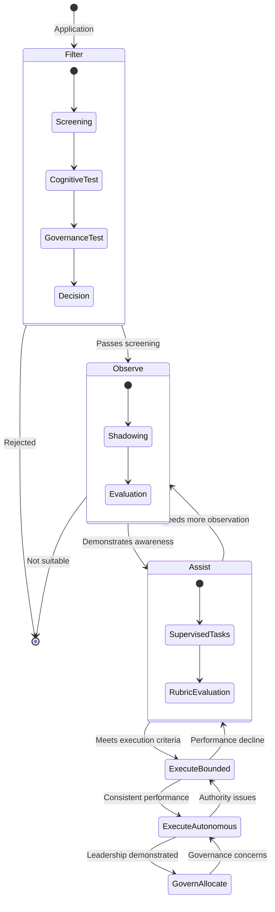
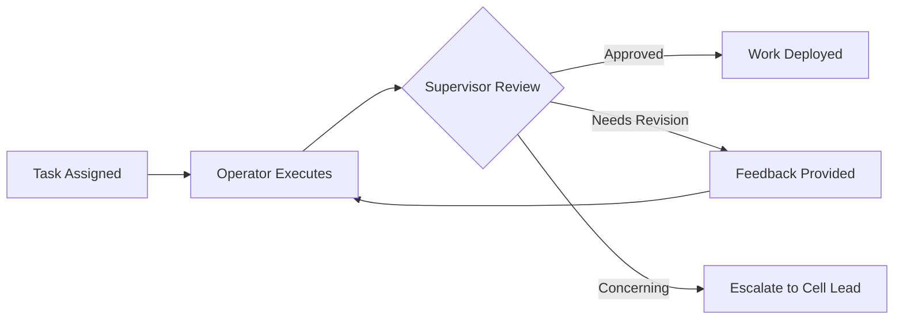
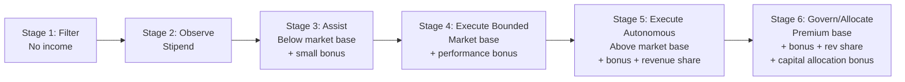
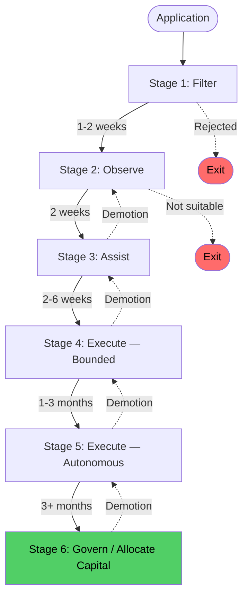

---

sidebar_position: 6
title: "SOP: Operator Onboarding & Lifecycle"
description: "Complete Standard Operating Procedure for the 6-stage operator lifecycle — from application screening through capital allocation authority, including promotion criteria, demotion triggers, and income scaling."
tags: [sop, operational, orf]
custom_status: active
custom_owner: Andrew Leo
custom_last_review: 2026-03-01
custom_next_review: 2026-06-01
---

# SOP: Operator Onboarding & Lifecycle

Operators are the human capital of the AINEFF Ecosystem. They are not "employees" in the traditional sense — they are **participants in a constitutional operating system** where authority, income, and responsibility scale together. No one starts with authority. Everyone earns it through demonstrated capability, governance awareness, and operational performance.

This SOP defines the complete 6-stage lifecycle from application through capital allocation authority.

---

## The 6-Stage Operator Lifecycle

---

## Stage 1: Filter

**Duration:** 1–2 weeks
**Authority Level:** None
**Income:** None

### Purpose

Identify candidates who have the raw capability to operate within a constitutional ecosystem. The filter screens for **trainability, not credentials**. Degrees, certifications, and previous titles are irrelevant. What matters is cognitive flexibility, governance awareness, and the ability to operate under constraint.

### Application Screening

| Screening Criterion | What We Look For | What Disqualifies |
|---------------------|-----------------|-------------------|
| **Signal testing** | Evidence of independent thinking, problem-solving in ambiguous situations | Reliance on credentials without demonstrated capability |
| **Trainability indicators** | Learning velocity, adaptability, willingness to be wrong | Fixed mindset, resistance to structured feedback |
| **Communication** | Clear, precise, honest communication | Vague, evasive, or performative communication |
| **Governance awareness** | Understanding that rules exist for reasons, willingness to operate within constraints | Authority resistance, "move fast and break things" mentality |

### Cognitive Assessment

A structured assessment (not an IQ test) measuring:

- **Pattern recognition** under ambiguity
- **Decision-making** under incomplete information
- **Constraint satisfaction** — can you find solutions within boundaries?
- **Failure analysis** — can you diagnose what went wrong and why?

### Governance Awareness Test

A scenario-based test evaluating:

- Understanding of accountability (pre-incident, not post-incident)
- Ability to identify when a decision requires escalation
- Willingness to document and be transparent
- Response to ethical dilemmas with no clear "right answer"

### Gate Criteria

| Criterion | Threshold |
|-----------|-----------|
| Cognitive assessment score | Above 70th percentile |
| Governance awareness score | Above 60th percentile |
| Communication quality | Assessed as "clear and honest" by 2+ reviewers |
| Cultural signal | No disqualifying indicators |

**Artifacts:** Application Record, Assessment Scores, Screening Decision (with rationale)

---

## Stage 2: Observe

**Duration:** 2 weeks
**Authority Level:** None (observation only)
**Income:** Stipend (covers living expenses, not performance-based)

### Purpose

Immerse the candidate in live operations without giving them any execution authority. They watch, listen, learn, and demonstrate that they understand the operational and governance context before they touch anything.

### Activities

- Shadow live venture cell operations (standups, reviews, delivery)
- Observe PIAR sessions (as silent observer)
- Review governance documentation and SOPs
- Attend architecture and product reviews (listen only)
- Complete structured learning modules on ecosystem fundamentals
- Maintain a daily observation journal (reviewed by mentor)

### Evaluation Criteria

| Criterion | Assessment Method |
|-----------|------------------|
| **Comprehension** | Can they accurately describe what they observed and why it matters? |
| **Pattern recognition** | Do they identify operational patterns without being told? |
| **Question quality** | Are their questions insightful, showing understanding of underlying systems? |
| **Governance internalization** | Do they understand why governance exists, not just what the rules are? |
| **Cultural fit** | Do they demonstrate respect for the operating model? |

### Gate Criteria

| Criterion | Threshold |
|-----------|-----------|
| Observation journal quality | Demonstrates clear understanding of operations and governance |
| Mentor assessment | "Ready for supervised tasks" recommendation |
| Governance quiz | Above 80% on ecosystem governance fundamentals |
| Peer feedback | No red flags from operators who interacted with the candidate |

**Artifacts:** Observation Journal, Mentor Assessment, Governance Quiz Results, Gate Decision

---

## Stage 3: Assist

**Duration:** 2–6 weeks
**Authority Level:** Bounded assistance under direct supervision
**Income:** Base compensation (below market, performance bonus possible)

### Purpose

The operator begins executing tasks under direct supervision. Every action is reviewed before it has impact. This stage builds execution skills while maintaining safety through oversight.

### Activities

- Execute bounded tasks assigned by Cell Lead or Senior Operator
- All work reviewed before submission/deployment
- Participate in standups (reporting on assigned tasks)
- Begin contributing to product and architecture reviews
- Complete first supervised PIAR (as Decision Maker, with experienced Governance Reviewer)

### Supervision Model

### Evaluation Rubric

| Dimension | Weight | Scoring |
|-----------|--------|---------|
| **Task quality** | 30% | Accuracy, completeness, attention to detail |
| **Governance compliance** | 25% | Following SOPs, documenting decisions, respecting boundaries |
| **Learning velocity** | 20% | Speed of improvement, retention of feedback |
| **Communication** | 15% | Clarity, timeliness, honesty about blockers |
| **Reliability** | 10% | Consistency, meeting deadlines, showing up prepared |

### Gate Criteria

| Criterion | Threshold |
|-----------|-----------|
| Evaluation rubric composite score | Above 70% for 3 consecutive weeks |
| Supervisor recommendation | "Ready for bounded independent execution" |
| Zero governance violations | No SOP violations or unauthorized actions |
| Completed first supervised PIAR | Assessed as "competent" by Governance Reviewer |

**Artifacts:** Weekly Evaluation Scores, Supervisor Assessments, PIAR Completion Record, Gate Decision

---

## Stage 4: Execute (Bounded)

**Duration:** 1–3 months
**Authority Level:** Independent execution with guardrails
**Income:** Market-rate base + performance bonus (tied to cell revenue)

### Purpose

The operator executes independently within defined guardrails. Peer review is mandatory for all significant work. The operator is developing judgment — learning when to act and when to escalate.

### Authority Boundaries

| Authority | Scope |
|-----------|-------|
| **Task execution** | Independent, within assigned scope |
| **Client communication** | With Cell Lead awareness (CC required) |
| **Spending** | Up to cell-defined micro-budget (typically &lt; $500/decision) |
| **Technical decisions** | Within established architecture, no novel patterns |
| **Governance** | Can initiate PIARs, cannot be sole Decision Maker on capital decisions |

### Mandatory Peer Review

All significant work products must be peer-reviewed before delivery:

- Code: Peer review before merge
- Client deliverables: Peer review before sending
- Proposals: Cell Lead review before submission
- Financial decisions: Cell Lead approval required

### Demotion Triggers

The operator is demoted to Stage 3 if any of the following occur:

| Trigger | Response |
|---------|----------|
| Governance violation (unauthorized action) | Immediate demotion + review |
| Quality failure affecting client | Demotion + remediation plan |
| Repeated failure to follow peer review process | Demotion after 2 warnings |
| Dishonesty or lack of transparency | Immediate demotion + governance review |

### Gate Criteria

| Criterion | Threshold |
|-----------|-----------|
| Consistent performance | Above 75% evaluation score for 2 consecutive months |
| Zero governance violations | No unauthorized actions or SOP violations |
| Client feedback | Positive feedback from at least 2 clients |
| Revenue contribution | Measurable contribution to cell revenue |
| PIAR competence | Successfully led at least 3 PIARs |

**Artifacts:** Monthly Performance Scores, Peer Review Records, Client Feedback, Gate Decision

---

## Stage 5: Execute (Autonomous)

**Duration:** Ongoing (minimum 3 months before Stage 6 eligibility)
**Authority Level:** Full execution authority within cell mandate
**Income:** Above-market base + significant performance bonus + revenue share

### Purpose

The operator has full execution authority. They are trusted to make operational decisions, manage client relationships, and contribute to cell strategy. They are responsible for revenue, not just tasks.

### Authority

| Authority | Scope |
|-----------|-------|
| **Task execution** | Full autonomy within cell mandate |
| **Client management** | Direct client relationships, independent communication |
| **Spending** | Up to cell-defined budget (typically &lt; $5,000/decision) |
| **Technical decisions** | Can introduce new patterns with peer consultation |
| **Governance** | Full PIAR authority as Decision Maker |
| **Mentoring** | Expected to mentor Stage 2–3 operators |
| **Revenue responsibility** | Directly accountable for revenue targets |

### Portfolio Assignment

Stage 5 operators are assigned a **portfolio** — a subset of the cell's clients and/or products for which they are directly responsible. Portfolio performance directly affects compensation.

### Demotion Triggers

| Trigger | Response |
|---------|----------|
| Sustained revenue underperformance (below 60% of target for 2 months) | Demotion to Stage 4 |
| Governance violation | Immediate demotion to Stage 4 + review |
| Failure to mentor assigned operators | Warning, then demotion if unresolved |
| Loss of client trust (substantiated complaint) | Review + potential demotion |

### Gate Criteria for Stage 6

| Criterion | Threshold |
|-----------|-----------|
| Revenue track record | Exceeded targets for 4+ consecutive months |
| Governance excellence | Zero violations, exemplary PIAR quality |
| Mentoring impact | At least 1 mentee progressed to Stage 4+ |
| Strategic contribution | Demonstrated ability to shape cell strategy |
| Leadership assessment | Recommended by Cell Lead + AINEG representative |

**Artifacts:** Portfolio Performance Records, Mentoring Logs, Strategic Contributions, Leadership Assessment

---

## Stage 6: Govern / Allocate Capital

**Duration:** Ongoing
**Authority Level:** Capital allocation + governance design
**Income:** Premium base + performance bonus + revenue share + capital allocation bonus

### Purpose

The operator has demonstrated the judgment, governance awareness, and performance record required to **allocate capital and design governance**. This is the highest authority level in the operational hierarchy.

### Authority

| Authority | Scope |
|-----------|-------|
| **Capital allocation** | Can approve capital requests within defined limits |
| **Governance design** | Can propose and implement governance rule changes |
| **Cell leadership** | Can lead venture cells, including setup and termination |
| **Strategy** | Direct input to AINEG portfolio strategy |
| **Hiring authority** | Can approve operator progression to Stage 4+ |
| **Constitutional input** | Can propose constitutional amendments (not approve) |

### Responsibilities

- Lead one or more venture cells
- Allocate capital within approved envelopes
- Design and refine governance procedures
- Mentor Stage 4–5 operators toward Stage 6
- Participate in quarterly phase gate reviews
- Contribute to ecosystem strategy and architecture

### Demotion Triggers

| Trigger | Response |
|---------|----------|
| Capital allocation resulting in significant loss without adequate PIAR | Demotion to Stage 5 + governance review |
| Constitutional violation | Immediate demotion + constitutional review |
| Failure of cells under management (pattern, not one-off) | Review + potential demotion |

---

## Income Scaling

| Stage | Base Compensation | Variable Compensation | Total Potential |
|-------|------------------|-----------------------|-----------------|
| 1 (Filter) | None | None | $0 |
| 2 (Observe) | Stipend | None | Subsistence |
| 3 (Assist) | 60-70% of market | Up to 10% bonus | Below market |
| 4 (Execute Bounded) | 90-100% of market | Up to 20% bonus | At market |
| 5 (Execute Autonomous) | 110-130% of market | Up to 40% bonus + revenue share | Above market |
| 6 (Govern/Allocate) | 130-160% of market | Up to 60% bonus + revenue share + capital bonus | Premium |

:::info
"Market" refers to equivalent role compensation in the relevant jurisdiction. The ecosystem competes on total compensation at Stage 4+, and significantly exceeds market at Stages 5–6. The below-market compensation at Stages 1–3 is intentional — it filters for operators motivated by growth and authority, not just salary.
:::

---

## Transition Summary

**Fastest possible progression:** ~6 months (exceptional performers)
**Typical progression:** 12–18 months to Stage 5, 18–24 months to Stage 6
**No guaranteed timeline:** Progression is merit-based, not time-based
