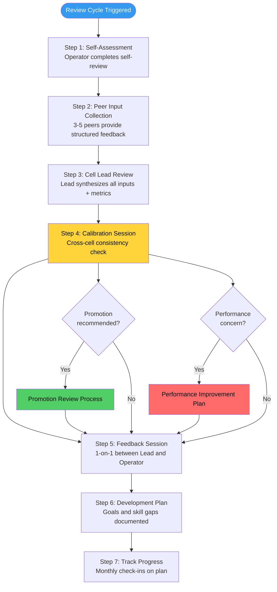
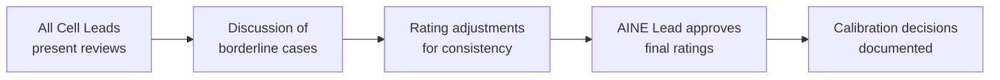
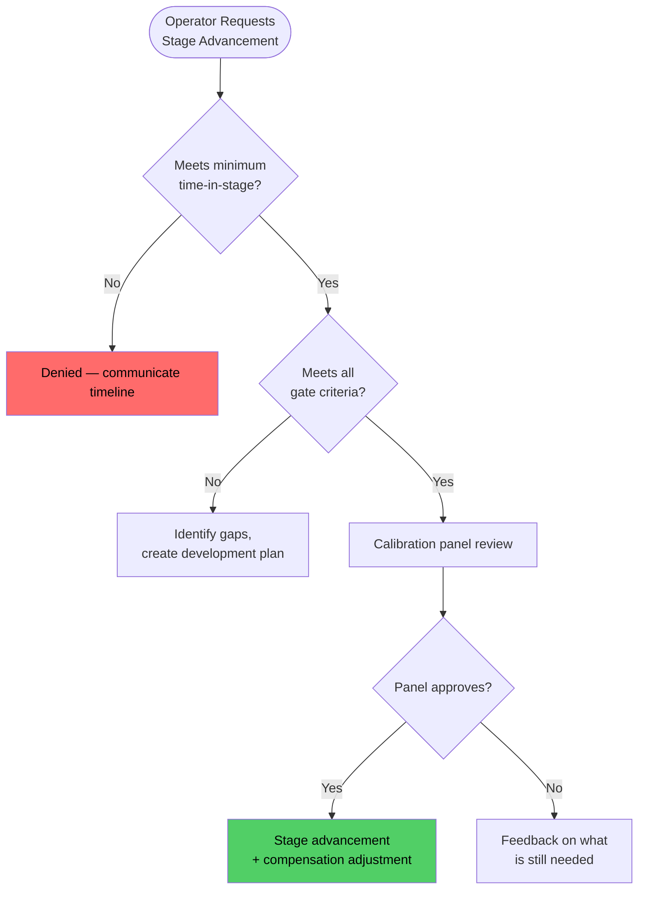
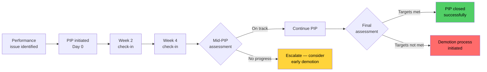

# SOP: Operator Performance Review

Performance review in the AINEFF Ecosystem is not a corporate ritual performed to justify compensation decisions already made. It is a **structured accountability mechanism** that ensures operators are growing, governance is respected, and the ecosystem's human capital is continuously improving. Every operator at every stage receives structured feedback, and every advancement or demotion is based on documented, auditable criteria.

This SOP defines the complete performance review lifecycle from self-assessment through development plan tracking.

---

## Overview

The performance review system operates on two cycles:

- **Quarterly reviews** -- lightweight, development-focused check-ins aligned with venture cell rhythms
- **Annual reviews** -- comprehensive evaluations that drive promotion decisions, compensation adjustments, and long-term development planning

Both cycles use the same criteria framework, scaled by operator stage. No review is ever a surprise -- continuous feedback ensures that quarterly and annual reviews are summaries of already-known performance, not ambushes.

---

## Trigger / When to Use

| Trigger | Review Type | Timeline |
|---------|-------------|----------|
| End of fiscal quarter | Quarterly review | Within 2 weeks of quarter close |
| End of fiscal year | Annual review | Within 4 weeks of year close |
| Operator requests stage advancement | Promotion review | Initiated by operator, completed within 3 weeks |
| Sustained performance decline detected | Performance improvement review | Initiated by Cell Lead within 5 business days of detection |
| Client complaint substantiated against operator | Ad-hoc review | Within 1 week of complaint substantiation |
| Governance violation by operator | Ad-hoc review | Within 48 hours of violation confirmation |

---

## Roles & Responsibilities

| Role | Responsibility |
|------|---------------|
| **Operator (Reviewee)** | Completes self-assessment, participates in feedback session, owns development plan |
| **Cell Lead** | Conducts review, provides rating, facilitates calibration, delivers feedback |
| **Peer Reviewers** | Provide structured peer input on collaboration, quality, and governance |
| **Calibration Panel** | Ensures consistency across cells (AINE Lead + all Cell Leads) |
| **AINE Lead** | Approves promotion decisions, oversees calibration |
| **AINEG Representative** | Approves Stage 5 to Stage 6 promotions, reviews demotion appeals |
| **Mentor (if assigned)** | Provides development-focused input for Stage 2-4 operators |

---

## Process Flow

---

## Review Criteria by Operator Stage

### Universal Criteria (All Stages)

| Dimension | Weight | Description |
|-----------|--------|-------------|
| **Governance Compliance** | 20% | SOP adherence, PIAR participation quality, documentation discipline |
| **Communication Quality** | 15% | Clarity, timeliness, honesty, transparency about blockers |
| **Reliability** | 10% | Consistency, deadline adherence, availability, follow-through |
| **Learning Velocity** | 10% | Speed of skill acquisition, feedback incorporation, adaptability |

### Stage-Specific Criteria

| Stage | Additional Criteria | Weight Allocation |
|-------|--------------------|-------------------|
| **Stage 2 (Observe)** | Observation journal quality, question depth, governance internalization | 45% stage-specific |
| **Stage 3 (Assist)** | Task quality, supervisor satisfaction, zero unauthorized actions | 45% stage-specific |
| **Stage 4 (Execute Bounded)** | Delivery quality, client feedback, peer review contributions, revenue awareness | 45% stage-specific |
| **Stage 5 (Execute Autonomous)** | Portfolio revenue performance, client relationship depth, mentoring impact, strategic contribution | 45% stage-specific |
| **Stage 6 (Govern/Allocate)** | Capital allocation ROI, governance design quality, cell health metrics, ecosystem contribution | 45% stage-specific |

### Stage 4-6 Detailed Metrics

| Metric | Stage 4 Target | Stage 5 Target | Stage 6 Target |
|--------|---------------|----------------|----------------|
| **Delivery on-time rate** | &gt; 85% | &gt; 90% | N/A (manages others) |
| **Client satisfaction score** | &gt; 7/10 | &gt; 8/10 | &gt; 8.5/10 (portfolio avg) |
| **Revenue contribution** | Measurable | Exceeds target | Portfolio exceeds target |
| **Peer review quality** | Provides useful reviews | Mentors through reviews | Designs review standards |
| **PIAR quality score** | Competent | Exemplary | Designs PIAR processes |
| **Governance violations** | Zero tolerance | Zero tolerance | Zero tolerance |

---

## Step-by-Step Procedure

### Step 1: Self-Assessment (Days 1-5)

**Owner:** Operator
**Duration:** 3-5 business days

The operator completes a structured self-assessment covering:

| Section | Content |
|---------|---------|
| **Accomplishments** | Key deliverables, revenue contributions, client outcomes |
| **Governance record** | PIARs participated in, SOP adherence, documentation quality |
| **Growth areas** | Skills developed, feedback incorporated, learning milestones |
| **Challenges** | Obstacles encountered, support needed, process friction |
| **Self-rating** | Rating on each review dimension (1-5 scale) with justification |
| **Development goals** | Proposed goals for the next period |

### Step 2: Peer Input Collection (Days 3-8)

**Owner:** Cell Lead (initiates), Peers (respond)
**Duration:** 5 business days

- Cell Lead selects 3-5 peer reviewers (must include at least 1 cross-cell peer if available)
- Peers complete a structured questionnaire covering collaboration, quality, governance, and communication
- Peer input is **attributed** (not anonymous) -- the ecosystem operates on transparency, not hidden feedback
- Peers rate the operator on relevant dimensions and provide specific behavioral examples

| Peer Input Question | Purpose |
|--------------------|---------|
| "Describe a specific situation where this operator demonstrated strong governance awareness." | Governance compliance evidence |
| "How would you rate the quality of this operator's work product? Provide an example." | Quality assessment |
| "Has this operator ever failed to meet a commitment? How did they handle it?" | Reliability and accountability |
| "Would you want this operator on your next critical project? Why or why not?" | Overall effectiveness signal |

### Step 3: Cell Lead Review (Days 8-12)

**Owner:** Cell Lead
**Duration:** 3-4 business days

The Cell Lead synthesizes:

- Self-assessment
- Peer input
- Quantitative metrics (from ACTS, CRM, delivery tracking)
- Client feedback (if applicable)
- Governance compliance records
- Previous review and development plan progress

The Cell Lead produces a **Review Summary** with:

- Rating on each dimension (1-5 scale)
- Composite score (weighted average)
- Narrative assessment (strengths, development areas, concerns)
- Recommendation: maintain stage, promote, or flag for concern

### Step 4: Calibration Session (Days 12-15)

**Owner:** AINE Lead + all Cell Leads
**Duration:** Half-day session per review cycle

Calibration ensures:

- Consistent rating standards across cells
- No Cell Lead is systematically too harsh or too lenient
- Promotion candidates are evaluated against a common standard
- Performance concerns are validated by multiple perspectives

| Calibration Rule | Purpose |
|-----------------|---------|
| No more than 20% of operators rated "Exceptional" (5/5) per cycle | Prevents rating inflation |
| Every rating of 1 or 2 requires documented evidence | Prevents unfair low ratings |
| Promotion recommendations require calibration panel agreement | Ensures promotion consistency |
| Demotion recommendations require AINE Lead approval | Protects operator due process |

### Step 5: Feedback Session (Days 15-20)

**Owner:** Cell Lead + Operator
**Duration:** 60-90 minutes

| Session Component | Duration | Content |
|------------------|----------|---------|
| **Opening** | 5 min | Set context, review purpose, confidentiality boundaries |
| **Operator perspective** | 15 min | Operator shares self-assessment highlights |
| **Cell Lead assessment** | 20 min | Present synthesized review, share ratings with evidence |
| **Discussion** | 20 min | Operator responds, asks questions, provides context |
| **Development planning** | 20 min | Agree on development goals and support needed |
| **Close** | 5 min | Confirm next steps, sign-off on review record |

**Rules for feedback sessions:**

- No surprises -- if the operator is hearing critical feedback for the first time in a review, the Cell Lead has failed at continuous feedback
- Evidence-based -- every rating must be supported by specific examples or metrics
- Forward-looking -- at least 50% of the session focuses on development, not past performance
- Documented -- both parties sign the review record

### Step 6: Development Plan (Days 20-25)

**Owner:** Operator (with Cell Lead input)
**Duration:** 3-5 business days

| Plan Element | Content |
|-------------|---------|
| **Skill gaps identified** | Specific capabilities to develop |
| **Development activities** | Training, mentoring, stretch assignments, shadowing |
| **Success metrics** | How progress will be measured |
| **Timeline** | Milestone dates for each development goal |
| **Support required** | Resources, mentoring, time allocation needed |
| **Accountability** | Who checks progress and how often |

### Step 7: Track Progress (Ongoing)

**Owner:** Operator + Cell Lead
**Duration:** Monthly 30-minute check-ins

- Monthly check-in on development plan progress
- Adjust goals if circumstances change
- Document progress in review system
- Feed forward into next quarterly review

---

## Promotion Criteria

### Stage Advancement Requirements

| Transition | Minimum Time in Stage | Key Gate Criteria | Approval Authority |
|-----------|----------------------|-------------------|-------------------|
| Stage 2 to 3 | 2 weeks | Observation journal quality, mentor recommendation, governance quiz &gt; 80% | Cell Lead |
| Stage 3 to 4 | 2 weeks | Evaluation rubric &gt; 70% for 3 weeks, supervisor recommendation, zero violations | Cell Lead |
| Stage 4 to 5 | 2 months | Evaluation &gt; 75% for 2 months, positive client feedback, revenue contribution | AINE Lead |
| Stage 5 to 6 | 3 months | Revenue exceeded 4+ months, zero violations, mentee progressed, leadership assessment | AINEG Representative |

---

## Demotion Procedures

Demotions are serious actions with significant impact on operator income, authority, and morale. They are executed with **dignity, due process, and documentation**.

### Demotion Triggers

| Trigger Category | Examples | Response Timeline |
|-----------------|----------|-------------------|
| **Governance violation** | Unauthorized action, SOP breach, dishonesty | Review within 48 hours |
| **Sustained performance decline** | Below minimum threshold for 2+ consecutive months | PIP first, demotion if PIP fails |
| **Client trust breach** | Substantiated client complaint, lost account due to operator error | Review within 1 week |
| **Authority misuse** | Spending beyond limits, unilateral decisions above authority | Review within 48 hours |

### Demotion Process

1. **Documentation** -- Cell Lead documents the trigger with specific evidence
2. **Review** -- AINE Lead reviews the evidence and proposed demotion
3. **Operator notification** -- Operator is informed in a private meeting with Cell Lead + AINE Lead
4. **Response period** -- Operator has 48 hours to provide context or dispute findings
5. **Decision** -- AINE Lead makes final decision (with AINEG input for Stage 5-6 demotions)
6. **Execution** -- Stage change is effective immediately, compensation adjusts at next pay period
7. **Development plan** -- Mandatory development plan created for return to previous stage
8. **Appeal** -- Operator may appeal to AINEG within 14 days

### Demotion Protections

| Protection | Purpose |
|-----------|---------|
| Written evidence required | No demotion based on hearsay or impression |
| Response period guaranteed | Operator always gets a chance to respond |
| Appeal path available | AINEG reviews all contested demotions |
| Development plan mandatory | Demotion is corrective, not punitive |
| Compensation transition period | 30-day grace period before compensation drops (except for gross violations) |

---

## Performance Improvement Plans (PIPs)

A PIP is triggered when an operator's performance falls below minimum thresholds but does not meet immediate demotion criteria.

### PIP Structure

| Element | Content |
|---------|---------|
| **Current performance** | Specific metrics and behaviors below threshold, with evidence |
| **Expected performance** | Clear, measurable targets the operator must achieve |
| **Timeline** | 30, 60, or 90 days depending on severity |
| **Support provided** | Additional mentoring, training, reduced workload, or scope adjustment |
| **Check-in cadence** | Weekly 1-on-1 meetings with Cell Lead |
| **Success criteria** | Exact metrics that constitute successful PIP completion |
| **Failure consequences** | Explicit statement of what happens if PIP is not met (demotion or exit) |

### PIP Timeline

### PIP Rules

| Rule | Rationale |
|------|-----------|
| Maximum 1 active PIP per operator at a time | Focus on improvement, not paperwork |
| PIP duration: 30 days (Stage 2-3), 60 days (Stage 4-5), 90 days (Stage 6) | Higher stages have more complex responsibilities |
| No more than 2 PIPs within 12 months | Repeated PIPs indicate fundamental misfit |
| PIP must include support, not just targets | Ecosystem invests in operator success |
| Cell Lead cannot unilaterally close a PIP as failed | AINE Lead must confirm |

---

## Skill Gap Identification & Remediation

### Skill Gap Assessment

During every review cycle, the following skill domains are assessed:

| Domain | Stage 2-3 Focus | Stage 4-5 Focus | Stage 6 Focus |
|--------|----------------|-----------------|---------------|
| **Technical execution** | Tool proficiency, process compliance | Architecture decisions, quality standards | System design, technical strategy |
| **Client management** | Communication clarity | Relationship ownership, expansion | Portfolio strategy, enterprise relationships |
| **Governance** | SOP awareness, PIAR participation | PIAR leadership, rule interpretation | Governance design, constitutional stewardship |
| **Leadership** | Self-management | Mentoring, team contribution | Cell leadership, ecosystem influence |
| **Commercial** | Revenue awareness | Revenue generation, pricing | Capital allocation, business model design |

### Remediation Options

| Remediation Type | Duration | Best For |
|-----------------|----------|----------|
| **Structured mentoring** | Ongoing (min 3 months) | Leadership gaps, governance gaps |
| **Stretch assignment** | 2-6 weeks | Skill application gaps, confidence building |
| **Shadowing** | 1-2 weeks | Process knowledge gaps, client management gaps |
| **External training** | Varies | Technical skill gaps, domain knowledge |
| **Cross-cell rotation** | 4-8 weeks | Breadth gaps, perspective building |
| **Paired execution** | 2-4 weeks | Quality gaps, methodology gaps |

---

## Artifacts / Outputs

| Artifact | Produced By | Retention |
|----------|------------|-----------|
| Self-Assessment Form | Operator | Duration of employment + 3 years |
| Peer Input Questionnaires | Peer Reviewers | Duration of employment + 3 years |
| Cell Lead Review Summary | Cell Lead | Duration of employment + 3 years |
| Calibration Session Minutes | AINE Lead | Duration of employment + 3 years |
| Feedback Session Record (signed) | Cell Lead + Operator | Duration of employment + 3 years |
| Development Plan | Operator + Cell Lead | Until superseded by next plan |
| PIP Documentation | Cell Lead + AINE Lead | Duration of employment + 3 years |
| Promotion Decision Record | Approval authority | Permanent |
| Demotion Decision Record | AINE Lead | Permanent |

---

## Time Bounds / SLAs

| Activity | SLA |
|----------|-----|
| Self-assessment completion | 5 business days from cycle start |
| Peer input collection | 5 business days from request |
| Cell Lead review synthesis | 4 business days after peer input closes |
| Calibration session | Completed within 3 business days of all reviews being ready |
| Feedback session delivery | Within 5 business days of calibration |
| Development plan finalization | Within 5 business days of feedback session |
| Total quarterly cycle duration | &lt; 25 business days |
| PIP initiation after performance decline detected | &lt; 5 business days |
| Promotion decision after request | &lt; 15 business days |

---

## Kill Criteria / Escalation Triggers

| Condition | Escalation |
|-----------|-----------|
| Review cycle exceeds 30 business days | AINE Lead intervenes to clear blockers |
| Cell Lead fails to deliver feedback within SLA | AINE Lead conducts the review directly |
| Operator refuses to participate in self-assessment | Treated as insubordination -- immediate Cell Lead + AINE Lead meeting |
| Calibration reveals systemic rating inflation (&gt; 30% rated 5/5) | AINE Lead mandates recalibration |
| PIP operator shows zero improvement at mid-point | Early demotion consideration triggered |
| Demotion appeal sustained by AINEG | Original decision reversed, Cell Lead receives feedback |
| More than 3 operators on active PIPs in a single cell | Cell Lead's own performance reviewed |

---

## Anti-Patterns

| Anti-Pattern | Why It Fails | Correct Approach |
|-------------|-------------|-----------------|
| **Surprise feedback** | Destroys trust, indicates Cell Lead failure at continuous feedback | Continuous feedback so reviews contain no surprises |
| **Recency bias** | Only reviewing last 2 weeks instead of full period | Use metrics and documented evidence from entire review period |
| **Halo/horn effect** | One strong or weak trait colors entire review | Use structured rubric with independent dimension scoring |
| **Avoiding difficult conversations** | Unaddressed issues fester and compound | Deliver honest feedback with evidence and empathy |
| **Stack ranking** | Forces artificial competition, destroys collaboration | Evaluate against absolute standards, not relative ranking |
| **Using PIPs as pretextual termination** | Bad faith undermines the entire review system | PIPs must include genuine support and achievable targets |
| **Promoting based on tenure** | Rewards time-serving, not capability | Promotion is merit-based with documented gate criteria |
| **Skipping calibration** | Allows inconsistent standards across cells | Calibration is mandatory, not optional |

---

## Cross-References

| Related SOP | Relationship |
|------------|-------------|
| [Operator Onboarding & Lifecycle](./operator-onboarding-sop) | Defines the 6 stages and gate criteria that performance reviews evaluate against |
| [Compensation Calculation & Settlement](./compensation-settlement-sop) | Review outcomes drive compensation adjustments |
| [Operator Offboarding & Knowledge Transition](./operator-offboarding-sop) | Failed PIPs and sustained underperformance may lead to offboarding |
| [Venture Cell Operations](./venture-cell-sop) | Cell rhythms provide the operational context for performance data |
| [Audit & Compliance Procedures](./audit-sop) | Performance records are auditable governance artifacts |
| [Governance Review & Rule Changes](./governance-review-sop) | Review criteria changes follow governance change procedures |
