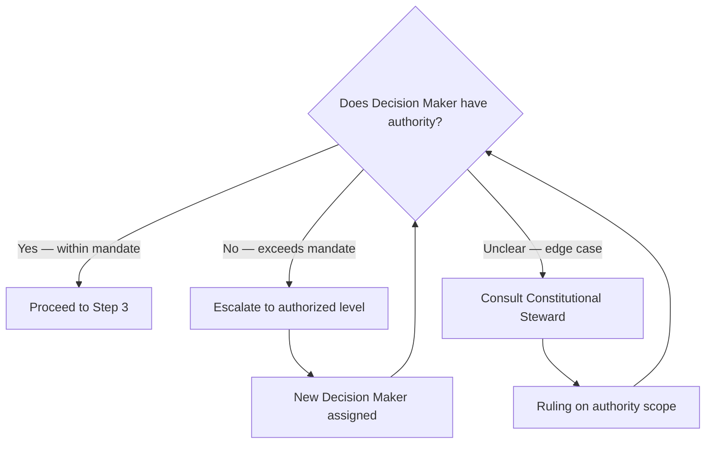
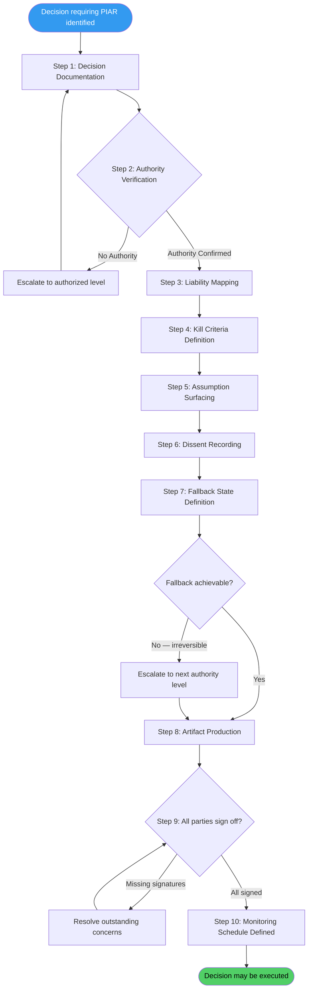

---

sidebar_position: 4
title: "SOP: Pre-Incident Accountability Review (PIAR)"
description: "Complete Standard Operating Procedure for conducting a Pre-Incident Accountability Review — the governance mechanism that establishes accountability before irreversible decisions are made, not after."
tags: [sop, operational, orf, governance]
custom_status: active
custom_owner: Andrew Leo
custom_last_review: 2026-03-01
custom_next_review: 2026-06-01
---

# SOP: Pre-Incident Accountability Review (PIAR)

The PIAR is the AINEFF Ecosystem's core governance mechanism for **accountability before action**. Traditional organizations conduct post-mortems after failures. The AINEFF Ecosystem conducts Pre-Incident Accountability Reviews *before* irreversible decisions are made — establishing who is accountable, what assumptions are being made, and what the fallback is, all *before* anything goes wrong.

---

## Trigger

:::danger[Skipping a Mandatory PIAR Is a Governance Violation]
Executing an irreversible action, deploying capital, or making an external commitment without a completed PIAR is a direct violation of the Atomic Constraint. Retroactive PIARs are explicitly prohibited -- accountability must be established before the action occurs.
:::

A PIAR is **mandatory** when any of the following conditions are met:

| Trigger Condition | Example |
|-------------------|---------|
| **Irreversible action** | Deploying to production, signing a contract, terminating an AINE |
| **Capital deployment** | Any expenditure above the cell's autonomous spending limit |
| **External commitment** | Client promise, regulatory filing, public announcement |
| **Authority boundary crossing** | Operator acting at or near the edge of their mandate |
| **Novel situation** | First-time scenario with no established playbook |
| **High-stakes reversible action** | Actions that are technically reversible but practically costly to undo |

A PIAR is **recommended** (but not mandatory) for:
- Significant internal process changes
- Team composition changes
- Vendor or tooling changes with switching costs

---

## Roles

| Role | Responsibility |
|------|---------------|
| **Decision Maker** | The person proposing the action; documents the decision and rationale |
| **Governance Reviewer** | Reviews the PIAR for completeness, authority compliance, and constitutional alignment |
| **Liability Bearer** | The person or entity that bears the consequences if the decision fails |
| **Independent Challenger** | A designated dissenter whose job is to find flaws, risks, and unstated assumptions |

:::info
The Independent Challenger role is **mandatory** for all PIARs. This is not optional. The Challenger is not adversarial — they are performing a structural function to surface blind spots.
:::

---

## Steps

### Step 1: Decision Documentation

**Owner:** Decision Maker
**Duration:** 30 minutes–2 hours

Document the decision with full context:

- **Who** is making this decision?
- **What** is being decided? (Specific, measurable, unambiguous)
- **Why** is this decision being made? (Business rationale, strategic context)
- **Under what mandate** does the decision maker have authority? (Link to governance document)
- **What is the scope?** (What is included and explicitly excluded)
- **What is the timeline?** (When must this be decided by, and why?)

**Artifacts:** Decision Brief (structured document)

### Step 2: Authority Verification

**Owner:** Governance Reviewer
**Duration:** 15–30 minutes

Verify that the Decision Maker has the authority to make this decision:

- Check operator's current authority level (Stage 1–6)
- Verify the decision falls within their mandate scope
- Verify the decision falls within their capital authority limit
- Check for conflicts of interest
- Verify no constitutional constraints are violated

**Artifacts:** Authority Verification Record

### Step 3: Liability Mapping

**Owner:** Governance Reviewer + Decision Maker
**Duration:** 15–45 minutes

Map who bears liability for each potential outcome:

| Outcome | Probability | Liability Bearer | Consequence |
|---------|-------------|-----------------|-------------|
| Success (as planned) | — | N/A | Rewards distributed per revenue share |
| Partial success | — | Decision Maker + Cell Lead | Performance review, process adjustment |
| Failure (reversible) | — | Decision Maker | Mandate review, potential demotion |
| Failure (irreversible) | — | Decision Maker + Liability Bearer | Full post-mortem, potential termination of authority |
| Catastrophic failure | — | Entity-level + AINEFF | Insurance, legal, potential AINE termination |

**Artifacts:** Liability Map

### Step 4: Kill Criteria Definition

**Owner:** Decision Maker + Independent Challenger
**Duration:** 15–30 minutes

Define the **specific, measurable conditions** that would trigger reversal or termination of this decision:

- What metrics indicate this decision is failing?
- At what thresholds do we act?
- Who has authority to pull the kill switch?
- What is the maximum time before a kill-or-continue decision is forced?

Kill criteria must be:
- **Specific** — not "if things go badly" but "if revenue drops below X for Y days"
- **Measurable** — tied to observable metrics
- **Time-bound** — include a maximum duration before mandatory review
- **Pre-committed** — agreed before the decision, not negotiated during failure

**Artifacts:** Kill Criteria Document

### Step 5: Assumption Surfacing

**Owner:** Independent Challenger
**Duration:** 30 minutes–1 hour

The Independent Challenger leads the assumption surfacing exercise:

- What are we assuming about the market, technology, team, timeline, or customer?
- Which assumptions, if wrong, would invalidate the decision?
- What evidence supports each critical assumption?
- What would disprove each assumption?
- What are we assuming will NOT change during execution?

Each assumption is classified:

| Classification | Definition | Action Required |
|---------------|------------|-----------------|
| **Validated** | Evidence exists and has been verified | Document the evidence |
| **Reasonable** | No direct evidence, but consistent with experience | Identify validation method |
| **Speculative** | No evidence, could easily be wrong | Build contingency plan |
| **Dangerous** | If wrong, the decision fails catastrophically | Kill criteria must cover this |

**Artifacts:** Assumption Register

### Step 6: Dissent Recording

**Owner:** Independent Challenger + All Participants
**Duration:** 15–30 minutes

Dissent is **structurally required** — it is not optional, and it is not a sign of dysfunction.

- The Independent Challenger presents their concerns
- All participants may register additional dissent
- Each dissent is recorded with: who, what concern, why it matters, what would resolve it
- Dissent does not block the decision (unless it reveals an authority violation)
- Dissent becomes part of the permanent governance record

:::warning
**Dissent is never punished.** Suppressing dissent is a governance violation. If a Decision Maker retaliates against a Challenger for raising concerns, this triggers an immediate governance review.
:::

**Artifacts:** Dissent Register (appended to PIAR Report)

### Step 7: Fallback State Definition

**Owner:** Decision Maker + Governance Reviewer
**Duration:** 15–30 minutes

Define the **specific state** the system returns to if the decision is reversed:

- What does "undo" look like?
- Is a clean rollback possible, or is this truly irreversible?
- What is the cost of rollback (time, money, reputation)?
- Who executes the rollback?
- What is the rollback timeline?

:::danger[Truly Irreversible Decisions Require Escalation]
If no fallback state is achievable, the PIAR must be escalated to the next authority level. Acknowledging irreversibility without escalation is insufficient -- the higher authority must explicitly accept the risk.
:::

If no fallback state is achievable, this must be explicitly acknowledged and the PIAR requires escalation to the next authority level.

**Artifacts:** Fallback Plan

### Step 8: Artifact Production

**Owner:** Governance Reviewer
**Duration:** 30 minutes

Assemble the full governance paper trail:

- Compile all PIAR artifacts into the PIAR Report
- Verify all required sections are complete
- Verify all signatures are present
- Generate cryptographic hash of the complete PIAR package
- Submit to ACTS (Accountability Chain Tracking System)

**Artifacts:** Complete PIAR Report Package

### Step 9: Sign-Off and Binding

**Owner:** All Roles
**Duration:** 15 minutes

- Decision Maker signs: "I am making this decision and accept accountability"
- Governance Reviewer signs: "This PIAR is complete and constitutionally compliant"
- Liability Bearer signs: "I accept the liability mapping"
- Independent Challenger signs: "My concerns have been heard and recorded"
- PIAR becomes binding — the decision may now be executed
- PIAR is immutable after sign-off (no retroactive changes)

**Artifacts:** Signed PIAR (immutable), ACTS Registration Confirmation

### Step 10: Post-Decision Monitoring Schedule

**Owner:** Decision Maker
**Duration:** 15 minutes to define; ongoing to execute

- Define monitoring cadence (daily, weekly, or triggered by events)
- Assign monitoring responsibility
- Link monitoring to kill criteria from Step 4
- Schedule mandatory review checkpoints
- Define escalation triggers

**Artifacts:** Monitoring Schedule, Linked Kill Criteria Dashboard

---

## End-to-End Process Flow

---

## Output Artifacts

Every completed PIAR produces the following package:

| Artifact | Purpose | Retention |
|----------|---------|-----------|
| **PIAR Report** | Complete decision record | Permanent |
| **Authority Map** | Proof of authorization | Permanent |
| **Kill Criteria Document** | Pre-committed termination conditions | Active until decision resolved |
| **Assumption Register** | Documented assumptions and their status | Permanent |
| **Dissent Register** | Recorded objections and concerns | Permanent |
| **Liability Map** | Who bears what consequences | Permanent |
| **Fallback Plan** | Rollback procedure if needed | Active until decision resolved |
| **Monitoring Schedule** | Ongoing oversight plan | Active until decision resolved |

---

## PIAR Timing Guidelines

| Decision Type | PIAR Duration | Participants Required |
|--------------|---------------|----------------------|
| Operational (within cell mandate) | **2–4 hours** | Decision Maker, Reviewer, Challenger |
| Capital deployment | **4–6 hours** | All roles + Finance |
| External commitment (client, regulatory) | **4–8 hours** | All roles + Legal |
| Constitutional boundary decision | **1–2 days** | All roles + Constitutional Steward |

---

## Anti-Patterns

:::warning[PIAR Anti-Patterns Trigger Governance Review]
The following patterns indicate a PIAR process that has failed its purpose. Any of these anti-patterns, if detected, triggers an immediate governance review.
:::

The following are PIAR anti-patterns that trigger governance review:

| Anti-Pattern | Why It Is Dangerous |
|-------------|-------------------|
| **Rubber-stamp PIAR** — completed in &lt; 30 minutes with no real challenge | Defeats the purpose; accountability theater |
| **Missing Challenger** — PIAR conducted without Independent Challenger | Structural blind spot; no dissent surface |
| **Retroactive PIAR** — PIAR conducted after the decision was already made | Governance violation; accountability cannot be established after the fact |
| **Kill criteria hedging** — vague or unmeasurable kill criteria | Makes it impossible to enforce pre-committed boundaries |
| **Dissent suppression** — Challenger's concerns dismissed without documentation | Governance violation; triggers immediate review |

---

## Related Documents

<CrossReference to="/docs/entities/orf-protocol" title="ORF — Obligation & Responsibility Finality Protocol" description="The obligation-netting protocol that PIARs help govern — ensuring accountability before irreversible obligation settlement" badge="Entity" />

<CrossReference to="/docs/products/offerings/piar" title="Pre-Incident Accountability Review (PIAR)" description="The productized PIAR offering that operationalizes this SOP as a client-facing governance service" badge="Product" />
