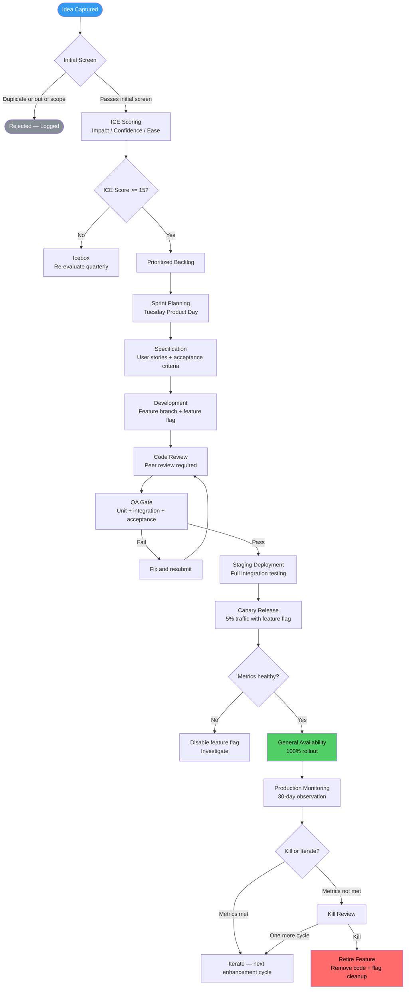

---

sidebar_position: 13
title: "SOP: Product Feature Lifecycle"
description: "Complete Standard Operating Procedure for the product feature lifecycle — from idea conception through prioritization, development, testing, deployment, monitoring, and retirement using ICE scoring, feature flags, and kill-or-iterate decision frameworks."
tags: [sop, operational, frankmax]
custom_status: active
custom_owner: Andrew Leo
custom_last_review: 2026-03-01
custom_next_review: 2026-06-01
---

# SOP: Product Feature Lifecycle

Every feature in the AINEFF Ecosystem follows a controlled lifecycle. Ideas do not become features because someone had a shower thought and started coding. They become features because they passed a rigorous evaluation, survived prioritization, met acceptance criteria, cleared QA gates, and proved their value in production. Features that fail to prove value are retired — not left to rot in the codebase consuming maintenance attention.

This SOP defines how ideas are captured, scored, built, shipped, monitored, and retired.

---

## Overview

The product feature lifecycle governs the journey from raw idea to production feature — and, when necessary, to retirement. It ensures that every feature shipped has a clear investment thesis, measurable success criteria, and a pre-committed decision point for kill-or-iterate evaluation.

---

## Trigger / When to Use

This SOP is triggered when:

- A new feature idea is proposed by any authorized source
- An existing feature requires significant enhancement (not a bug fix)
- A feature reaches its scheduled review date for kill-or-iterate evaluation
- Customer feedback or market data suggests a feature pivot
- The Tuesday Product Day rhythm (see [Founder Discipline Doctrine](../execution/founder-discipline)) requires backlog grooming

---

## Roles &amp; Responsibilities

| Role | Responsibility | Authority Level |
|------|---------------|-----------------|
| **Founder** | Final prioritization authority, product vision, kill decisions | Full authority |
| **Cell Lead** | Sprint planning, resource allocation, feature acceptance | Stage 5-6 operator |
| **Product Operator** | Backlog management, ICE scoring, user story writing | Stage 4+ operator |
| **Execution Operator** | Development, unit testing, code review | Stage 4+ operator |
| **QA Operator** | Test execution, acceptance validation, defect tracking | Stage 3+ operator |
| **Customer-facing Operator** | Customer feedback collection, feature request routing | Stage 3+ operator |

### Who Can Propose Features

| Source | Submission Method | Scoring Weight Modifier |
|--------|------------------|------------------------|
| **Founder** | Direct backlog entry | No modifier (standard ICE) |
| **Operators (Stage 4+)** | Feature proposal template | No modifier (standard ICE) |
| **Customer feedback (aggregated)** | Customer feedback pipeline | +1 Impact bonus if 3+ customers request |
| **Operators (Stage 1-3)** | Suggestion via Cell Lead | Cell Lead must sponsor and co-sign |
| **Market/competitive intelligence** | Intelligence brief | Requires founder review before scoring |

---

## Process Flow

---

## Detailed Procedure

### Step 1: Idea Capture

All feature ideas enter through a single intake channel — the feature backlog. No idea is evaluated verbally; every idea must be written down.

| Field | Required | Description |
|-------|----------|-------------|
| **Title** | Yes | One-line description of the feature |
| **Problem statement** | Yes | What user problem does this solve? |
| **Proposed solution** | Yes | High-level description of the feature |
| **Target user** | Yes | Who benefits from this feature? |
| **Revenue impact hypothesis** | Yes | How does this affect revenue (directly or indirectly)? |
| **Submitted by** | Yes | Name and operator stage |
| **Supporting evidence** | No | Customer quotes, usage data, competitive analysis |

### Step 2: Initial Screening

Before ICE scoring, ideas are screened for basic viability:

- **Duplicate check:** Is this already in the backlog or shipped?
- **Scope check:** Does this fall within the AINE's mandate?
- **Feasibility check:** Is this technically possible with current architecture?
- **Constraint check:** Does this violate any constitutional or governance constraints?

Rejected ideas are logged with a reason. They are not deleted — the rejection log is reviewed quarterly for pattern detection.

### Step 3: ICE Scoring

Every feature that passes screening is scored using the **ICE framework**:

| Dimension | Score Range | Criteria |
|-----------|-----------|----------|
| **Impact** | 1-10 | How significantly will this affect the target metric? |
| **Confidence** | 1-10 | How confident are we that this will achieve the predicted impact? |
| **Ease** | 1-10 | How easy is this to implement (inverse of effort)? |

**ICE Score = Impact x Confidence x Ease / 10** (maximum 100)

#### Impact Scoring Guide

| Score | Definition |
|-------|-----------|
| 9-10 | Directly generates new revenue stream or retains &gt; 20% at-risk revenue |
| 7-8 | Measurably increases conversion, retention, or deal size |
| 5-6 | Improves user experience with indirect revenue impact |
| 3-4 | Quality-of-life improvement, reduces support burden |
| 1-2 | Nice-to-have, no measurable business impact |

#### Confidence Scoring Guide

| Score | Definition |
|-------|-----------|
| 9-10 | Validated by customer commitment or payment |
| 7-8 | Strong customer feedback (3+ independent requests) |
| 5-6 | Reasonable hypothesis based on market data |
| 3-4 | Internal intuition with some supporting evidence |
| 1-2 | Pure speculation, no external validation |

#### Ease Scoring Guide

| Score | Definition |
|-------|-----------|
| 9-10 | Less than 1 day of development, no dependencies |
| 7-8 | 1-3 days, minimal dependencies |
| 5-6 | 1-2 weeks, some dependencies |
| 3-4 | 2-4 weeks, significant dependencies or architecture changes |
| 1-2 | Multi-sprint effort, major architecture changes required |

#### Scoring Thresholds

| ICE Score | Action |
|-----------|--------|
| **50+** | Immediate candidate for next sprint |
| **25-49** | Backlog — scheduled based on priority ranking |
| **15-24** | Backlog — lower priority, re-evaluate quarterly |
| **Below 15** | Icebox — not scheduled, re-evaluate quarterly |

### Step 4: Sprint Planning (Tuesday Product Day)

Sprint planning occurs every Tuesday, aligned with the [Founder Discipline Doctrine](../execution/founder-discipline) weekly rhythm.

| Activity | Duration | Owner |
|----------|----------|-------|
| **Backlog review** | 15 minutes | Product Operator |
| **Sprint retrospective** (previous sprint) | 15 minutes | Cell Lead |
| **Feature selection** | 20 minutes | Founder + Cell Lead |
| **Task breakdown** | 30 minutes | Execution Operator |
| **Capacity check** | 10 minutes | Cell Lead |

**Sprint cadence:** 1-week sprints. Short cycles enforce discipline and prevent scope creep.

**Sprint capacity rules:**
- Maximum 70% capacity allocated to new features
- Minimum 20% reserved for bug fixes and maintenance
- 10% buffer for emergencies and unplanned work

### Step 5: Specification

Every feature entering a sprint must have a complete specification before development begins:

| Specification Element | Content |
|----------------------|---------|
| **User story** | "As a [user type], I want [action] so that [benefit]" |
| **Acceptance criteria** | Numbered list of testable conditions (minimum 3) |
| **Edge cases** | Known edge cases and expected behavior |
| **Data requirements** | What data is needed, created, or modified |
| **API contract** | If applicable, request/response format |
| **Feature flag name** | Pre-assigned flag identifier |
| **Success metrics** | Quantifiable metrics that define success (measured post-GA) |
| **Kill criteria** | Pre-committed conditions that would trigger feature retirement |

### Step 6: Development

| Rule | Rationale |
|------|-----------|
| **Feature branch** required | No development on main branch |
| **Feature flag** wrapping all new behavior | Code deployed dark, activated separately |
| **Daily progress update** | 2-line status in team channel |
| **Maximum 5 days** for any single feature | If it takes longer, break it down |
| **Tests written alongside code** | Not after — unit tests are part of the feature |

### Step 7: QA Gate

Before any feature progresses to staging, it must pass the QA gate (see [Quality Assurance &amp; Testing SOP](./qa-testing-sop) for full details):

| Gate Check | Requirement |
|-----------|-------------|
| Unit test coverage | &gt;= 80% of new code |
| Integration tests | All integration points covered |
| Acceptance criteria | Every acceptance criterion has a passing test |
| Code review | Minimum 1 peer approval |
| Security scan | No new vulnerabilities introduced |

### Step 8: Staging Deployment

Feature deployed to staging environment with feature flag enabled:

- Full integration testing with production-like data
- Performance validation against baseline
- Cross-feature compatibility check
- Client-facing documentation reviewed

### Step 9: Canary Release

Feature flag enabled for 5% of production traffic:

| Metric | Threshold | Monitoring Duration |
|--------|-----------|-------------------|
| Error rate | &lt;= baseline + 0.1% | 24 hours minimum |
| Latency (P99) | &lt;= baseline + 10% | 24 hours minimum |
| User engagement | No negative deviation | 48 hours minimum |
| Revenue impact | No negative deviation | 48 hours minimum |

### Step 10: General Availability

Feature flag set to 100%. Full production monitoring begins.

### Step 11: Post-GA Monitoring (30-Day Window)

| Review Point | Timing | Evaluation |
|-------------|--------|-----------|
| **Week 1 check** | Day 7 | Error rates, adoption rate, support tickets |
| **Week 2 check** | Day 14 | Usage trends, user feedback, revenue impact |
| **Week 4 review** | Day 30 | Full success metric evaluation against kill criteria |

### Step 12: Kill-or-Iterate Decision

At the 30-day review, every feature faces a mandatory kill-or-iterate decision:

#### Kill-or-Iterate Decision Matrix

| Condition | Decision | Action |
|-----------|----------|--------|
| Success metrics met or exceeded | **Iterate** | Plan next enhancement, remove feature flag, clean up |
| Metrics trending positive but not yet met | **Extend** | One additional 30-day cycle (maximum 1 extension) |
| Metrics flat — no measurable impact | **Kill** | Retire feature, remove code, document learnings |
| Metrics negative — degraded experience | **Kill immediately** | Disable feature flag, remove code within 7 days |
| Usage below 5% of target users | **Kill** | Retire unless strategic rationale documented via PIAR |

**Kill decision authority:**
- Features with &lt; $1,000 estimated impact: Cell Lead
- Features with $1,000-$10,000 estimated impact: Cell Lead + Founder review
- Features with &gt; $10,000 estimated impact: Founder decision, PIAR required

---

## Artifacts / Outputs

| Artifact | Produced At | Owner |
|----------|------------|-------|
| Feature Proposal | Idea Capture | Submitter |
| ICE Score Card | Scoring | Product Operator |
| Feature Specification | Sprint Planning | Product Operator |
| Code + Tests | Development | Execution Operator |
| QA Sign-off | QA Gate | QA Operator |
| Canary Metrics Report | Canary Release | Product Operator |
| 30-Day Review Report | Post-GA Monitoring | Cell Lead |
| Kill/Iterate Decision Record | Decision Point | Decision Maker |
| Retirement Report | If killed | Product Operator |

---

## Time Bounds / SLAs

| Phase | Maximum Duration | Escalation if Exceeded |
|-------|-----------------|----------------------|
| Idea to ICE Score | 5 business days | Product Operator &rarr; Cell Lead |
| ICE Score to Sprint Entry | Depends on priority ranking | Quarterly icebox review |
| Specification | 2 business days | Cell Lead review |
| Development | 5 business days per feature | Break down or re-scope |
| QA Gate | 2 business days | Cell Lead + QA Operator review |
| Staging Validation | 1 business day | Automated pipeline |
| Canary to GA | 2-5 business days | Automated metrics |
| Post-GA Review | 30 calendar days | Mandatory — no extensions beyond 60 days |
| Feature Flag Cleanup | 7 days after GA or kill | Automated stale flag alerts |

---

## Kill Criteria / Escalation Triggers

| Trigger | Escalation Path |
|---------|----------------|
| Feature in development &gt; 10 days | Cell Lead reviews scope — mandatory break-down or cancellation |
| Feature flag active &gt; 30 days without GA | Product Operator must justify or disable |
| 3+ features killed in sequence from same source | Review scoring methodology and idea quality |
| Canary metrics breached | Automatic feature flag disable, incident logged |
| Post-GA metrics negative for 7+ consecutive days | Immediate kill review regardless of 30-day schedule |
| Sprint velocity drops below 60% for 2 consecutive sprints | Cell Lead reviews capacity allocation and feature complexity |

---

## Anti-Patterns

| Anti-Pattern | Why It Is Dangerous | Correct Approach |
|-------------|-------------------|-----------------|
| **"Just ship it and see"** | Bypasses scoring and specification; creates unmonitored features | Every feature must be scored, specified, and have kill criteria |
| **Zombie features** | Features that ship but are never reviewed; accumulate tech debt | Mandatory 30-day review with kill-or-iterate decision |
| **Feature hoarding** | Refusing to kill underperforming features due to sunk cost | Kill criteria are pre-committed; sunk cost is not a valid argument |
| **Scoring inflation** | Giving high ICE scores to pet projects | Scores require evidence; Confidence score must reflect validation level |
| **Specification-free development** | Starting development without acceptance criteria | No sprint entry without complete specification |
| **Eternal canary** | Leaving a feature at 5% traffic indefinitely | Maximum 5 days in canary; escalate or promote |
| **Founder bypass** | Founder skipping the process for "urgent" features | Founder follows the same process; urgency is handled via sprint capacity buffer |

---

## Cross-References

- [Founder Discipline Doctrine](../execution/founder-discipline) — Tuesday Product Day rhythm for sprint planning
- [Quality Assurance &amp; Testing SOP](./qa-testing-sop) — QA gate details and test requirements
- [System Deployment &amp; Release SOP](./deployment-sop) — Canary deployment, feature flags, and rollback procedures
- [Pre-Incident Accountability Review (PIAR)](./piar-sop) — Required for high-impact kill decisions
- [Venture Cell Operations SOP](./venture-cell-sop) — Sprint cadence within venture cell operating rhythms
- [Capital Allocation &amp; Investment SOP](./capital-allocation-sop) — Funding for features requiring significant investment
