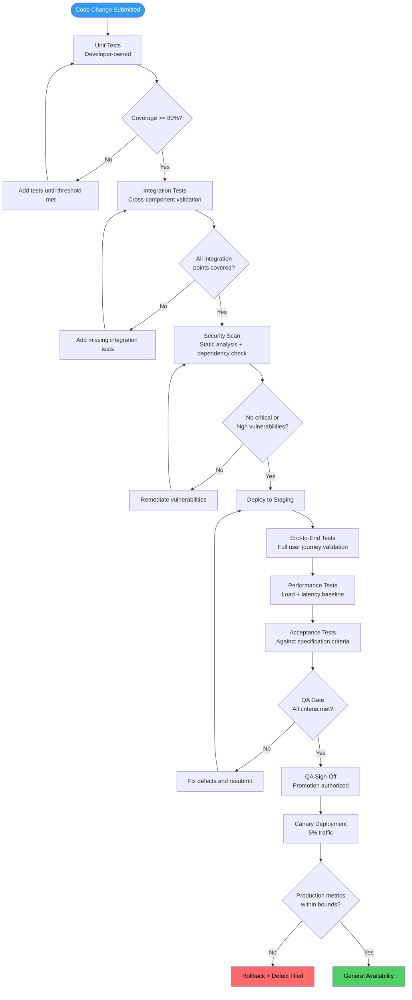
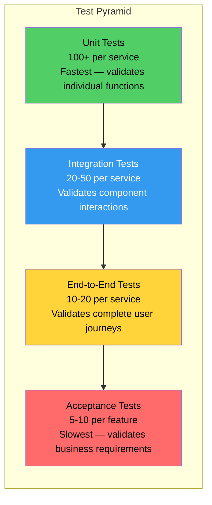
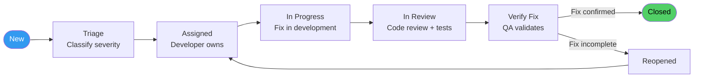

# SOP: Quality Assurance &amp; Testing

Quality is not an afterthought and testing is not a phase. In the AINEFF Ecosystem, quality is enforced through automated gates at every stage of the deployment pipeline. No code reaches production without passing a defined set of tests, and no test suite is considered complete without meeting coverage thresholds. This SOP defines the testing requirements, defect management process, and QA authority structure.

---

## Overview

This SOP governs all testing activities across the ecosystem — from unit tests written by developers to acceptance tests validated by stakeholders. It defines what must be tested, how deeply, at which stage, and by whom. It also defines how defects are classified, prioritized, and resolved.

---

## Trigger / When to Use

This SOP is triggered when:

- Any code change is submitted for review (pull request opened)
- A feature enters the QA gate in the deployment pipeline
- A defect is discovered at any stage (development through production)
- A new test environment is provisioned or reconfigured
- The quarterly test infrastructure review is scheduled
- A release candidate is assembled for staging promotion

---

## Roles &amp; Responsibilities

| Role | Responsibility | Authority |
|------|---------------|-----------|
| **Developer** | Write unit and integration tests alongside code | Test creation, defect fixing |
| **QA Operator** | Test plan creation, acceptance testing, defect triage | QA gate sign-off (Stage 3+) |
| **Cell Lead** | QA resource allocation, defect severity escalation | Override QA gate (documented exception only) |
| **Security Operator** | Security testing, vulnerability assessment | Security gate sign-off |
| **Product Operator** | Acceptance criteria definition, UAT coordination | Acceptance sign-off |
| **Infrastructure Operator** | Test environment management, CI/CD pipeline maintenance | Environment provisioning |

### QA Sign-Off Authority

| Deployment Stage | Sign-Off Required From | Override Authority |
|-----------------|----------------------|-------------------|
| Development (PR merge) | Peer reviewer + automated test pass | Cell Lead (documented exception) |
| Staging promotion | QA Operator sign-off | Cell Lead (PIAR required) |
| Canary release | QA Operator + Product Operator | Cell Lead + Founder (PIAR required) |
| GA rollout | Automated metrics validation | Cell Lead (incident logged if manual) |

---

## Process Flow

---

## Detailed Procedure

### Step 1: Test Pyramid

The ecosystem follows the standard test pyramid — more tests at the base (fast, cheap, isolated) and fewer at the top (slow, expensive, integrated).

#### Test Type Definitions

| Test Type | Scope | Speed | Owner | Environment |
|-----------|-------|-------|-------|-------------|
| **Unit** | Single function or method | &lt; 100ms per test | Developer | Local + CI |
| **Integration** | Component interactions, API contracts | &lt; 5s per test | Developer + QA | CI pipeline |
| **End-to-End** | Complete user journeys across services | &lt; 60s per test | QA Operator | Staging |
| **Acceptance** | Business requirements validation | &lt; 120s per test | Product Operator + QA | Staging |
| **Performance** | Load, latency, throughput | 15-30 min suite | Infrastructure Operator | Staging (production-scale) |
| **Security** | Vulnerabilities, access control, data protection | 5-15 min suite | Security Operator | CI + Staging |

### Step 2: Coverage Thresholds

| Metric | Minimum Threshold | Target | Enforcement |
|--------|------------------|--------|-------------|
| Unit test line coverage | 80% | 90% | CI pipeline blocks merge below minimum |
| Unit test branch coverage | 70% | 85% | CI pipeline warns below minimum |
| Integration test coverage (API endpoints) | 100% of public APIs | 100% | Manual review at QA gate |
| E2E test coverage (critical paths) | 100% of revenue-critical paths | 100% | QA Operator validates |
| Acceptance criteria coverage | 100% of acceptance criteria | 100% | QA gate blocks without full coverage |

**Coverage exceptions:** If a coverage threshold cannot be met, a documented exception must be filed with the Cell Lead. Exceptions expire after 30 days and must be renewed or resolved.

### Step 3: Test Environments

| Environment | Purpose | Data | Refresh Cycle | Access |
|-------------|---------|------|---------------|--------|
| **Local** | Developer testing, unit tests | Synthetic/mocked | Continuous | Developer only |
| **CI** | Automated pipeline tests | Synthetic fixtures | Per build | Automated only |
| **Staging** | Integration, E2E, acceptance, performance | Anonymized production mirror | Weekly refresh | QA + Dev team |
| **Canary** | Production validation at low traffic | Real production data | Live | Automated + on-call |
| **Production** | Live system | Real production data | Live | Restricted |

#### Test Data Management

| Rule | Rationale |
|------|-----------|
| **No production data in local or CI environments** | Data protection and privacy compliance |
| **Staging uses anonymized production mirror** | Realistic testing without exposing customer data |
| **Test data generation scripts maintained** | Reproducible test data for all scenarios |
| **Staging data refreshed weekly** | Prevents stale data from masking bugs |
| **Test data includes edge cases** | Boundary values, empty states, maximum loads |
| **PII scrubbing verified after each refresh** | Automated check that anonymization is complete |

### Step 4: Test Execution at Each Stage

#### Development Stage (CI Pipeline)

| Test Suite | Trigger | Pass Criteria | Failure Action |
|-----------|---------|---------------|---------------|
| Unit tests | Every commit push | 100% pass, coverage &gt;= 80% | Build fails, developer notified |
| Integration tests | Every PR opened/updated | 100% pass | Build fails, developer notified |
| Static analysis | Every PR opened/updated | No new critical/high issues | Build fails, developer notified |
| Dependency vulnerability scan | Every PR opened/updated | No new critical vulnerabilities | Build fails, security team notified |

#### Staging Stage

| Test Suite | Trigger | Pass Criteria | Failure Action |
|-----------|---------|---------------|---------------|
| E2E test suite | Deployment to staging | 100% pass | Staging blocked, QA Operator investigates |
| Performance baseline | Deployment to staging | Within 10% of baseline | QA Operator + Infrastructure review |
| Acceptance tests | QA Operator initiated | 100% of acceptance criteria pass | Feature returned to development |
| Cross-service regression | Deployment to staging | No regressions detected | Release blocked, defect filed |

#### Canary Stage

| Validation | Monitoring | Pass Criteria | Failure Action |
|-----------|-----------|---------------|---------------|
| Error rate | Continuous (automated) | &lt;= baseline + 0.1% | Automatic rollback |
| Latency P99 | Continuous (automated) | &lt;= baseline + 10% | Automatic rollback |
| Business metrics | Continuous (automated) | No negative deviation &gt; 2% | Alert on-call, manual review |
| User-reported issues | Support channel monitoring | Zero critical issues | Pause rollout, investigate |

### Step 5: Regression Testing

| Regression Type | When Executed | Scope | Duration |
|----------------|--------------|-------|----------|
| **Targeted regression** | Every deployment | Tests related to changed components | 5-15 minutes |
| **Full regression** | Weekly + before major releases | Complete test suite across all services | 1-2 hours |
| **Cross-service regression** | When shared dependencies change | All consuming services | 30-60 minutes |
| **Visual regression** | UI changes | Screenshot comparison of key pages | 10-20 minutes |

### Step 6: Performance Testing

| Test Type | Frequency | Criteria | Tool |
|-----------|-----------|----------|------|
| **Load test** | Every staging deployment | Handles 2x expected peak load | Automated load runner |
| **Latency test** | Every staging deployment | P50 &lt; 200ms, P99 &lt; 1s | Automated latency measurement |
| **Stress test** | Monthly | Degrades gracefully at 5x load | Automated stress suite |
| **Soak test** | Monthly | No memory leaks over 24hr run | Automated soak runner |
| **Spike test** | Quarterly | Recovers from 10x burst within 60s | Automated spike generator |

### Step 7: Security Testing

| Test Type | Frequency | Scope | Owner |
|-----------|-----------|-------|-------|
| **Static Application Security Testing (SAST)** | Every PR | Code-level vulnerabilities | CI pipeline (automated) |
| **Software Composition Analysis (SCA)** | Every PR | Dependency vulnerabilities | CI pipeline (automated) |
| **Dynamic Application Security Testing (DAST)** | Weekly on staging | Runtime vulnerabilities | Security Operator |
| **Penetration testing** | Quarterly | Full attack surface | External security partner |
| **Access control validation** | Every auth-related change | Authorization boundaries | Security Operator |

---

## Defect Management

### Defect Severity Classification

| Severity | Definition | Examples | SLA (Time to Fix) |
|----------|-----------|----------|-------------------|
| **Critical** | System down, data loss, security breach, revenue-blocking | Production outage, data corruption, auth bypass, payment failure | 4 hours |
| **High** | Major functionality broken, significant user impact, workaround exists | Feature completely non-functional, incorrect calculations, broken workflows | 24 hours |
| **Medium** | Minor functionality impaired, cosmetic issues with business impact | UI rendering issues, edge case failures, performance degradation | 5 business days |
| **Low** | Cosmetic, minor usability, no business impact | Typos, minor UI misalignment, documentation gaps | 15 business days |

### Defect Lifecycle

### Defect Triage Rules

| Rule | Detail |
|------|--------|
| **Triage within 4 hours** | Every new defect is classified within 4 business hours |
| **Severity assigned by QA Operator** | Developer cannot self-classify severity |
| **Critical defects interrupt current sprint** | Pulled into current sprint immediately |
| **High defects enter next sprint** | Unless sprint has capacity, then current sprint |
| **Duplicate detection** | QA Operator checks for existing defects before filing |
| **Root cause required for Critical/High** | Fix must include root cause analysis, not just symptom fix |

---

## Acceptance Criteria Template

Every feature must have acceptance criteria following this template:

| Element | Format | Example |
|---------|--------|---------|
| **Given** | The precondition or context | "Given the user is logged in and on the dashboard" |
| **When** | The action taken | "When the user clicks the export button" |
| **Then** | The expected outcome | "Then a CSV file is downloaded containing all visible records" |
| **And** | Additional conditions | "And the file name contains the current date" |

**Minimum acceptance criteria per feature:** 3 (happy path + 1 error case + 1 edge case)

---

## Artifacts / Outputs

| Artifact | Produced At | Owner |
|----------|------------|-------|
| Test Plan | Sprint planning | QA Operator |
| Unit Test Suite | Development | Developer |
| Integration Test Suite | Development | Developer |
| E2E Test Suite | Staging deployment | QA Operator |
| Acceptance Test Results | QA gate | QA Operator |
| Performance Test Report | Staging deployment | Infrastructure Operator |
| Security Scan Report | CI pipeline | Security Operator |
| Defect Report | Defect discovery | QA Operator |
| QA Sign-Off Record | QA gate passage | QA Operator |
| Coverage Report | Every CI build | CI pipeline (automated) |
| Regression Test Report | Every deployment | QA Operator |

---

## Time Bounds / SLAs

| Activity | Maximum Duration | Escalation |
|----------|-----------------|-----------|
| Unit test suite execution | 5 minutes | Optimize or split test suite |
| Integration test suite execution | 15 minutes | Review test efficiency |
| E2E test suite execution | 30 minutes | Parallelize or optimize |
| Full regression suite | 2 hours | Infrastructure Operator reviews |
| QA gate review (manual) | 2 business days | Cell Lead review |
| Defect triage | 4 business hours | Cell Lead assigns default severity |
| Critical defect fix | 4 hours | Cell Lead + Founder escalation |
| High defect fix | 24 hours | Cell Lead escalation |
| Test environment provisioning | 4 hours | Infrastructure Operator escalation |
| Staging data refresh | 2 hours | Automated — alert if exceeds |

---

## Kill Criteria / Escalation Triggers

| Trigger | Escalation Path |
|---------|----------------|
| Unit test coverage drops below 80% on any service | CI blocks merge; Developer + Cell Lead review |
| Critical defect in production | Immediate incident response; see Incident Response SOP |
| QA gate bypassed without documented exception | Audit finding; Cell Lead must file exception retroactively |
| Performance regression &gt; 20% on staging | Release blocked; Infrastructure + Cell Lead review |
| Security vulnerability rated Critical discovered | Release blocked; Security Operator + Cell Lead + Founder |
| 3+ defects reopened after "fix verified" | QA process review; Cell Lead investigates root cause |
| Test environment unavailable &gt; 4 hours | Infrastructure escalation; Cell Lead notified |
| Acceptance tests failing for &gt; 48 hours on staging | Sprint review; feature may be pulled from release |

---

## Anti-Patterns

| Anti-Pattern | Why It Is Dangerous | Correct Approach |
|-------------|-------------------|-----------------|
| **"Tests slow us down"** | Shipping untested code creates defect debt that compounds | Tests are part of development, not separate work |
| **Testing only the happy path** | Real users find edge cases; attackers find boundaries | Minimum: happy path + error case + edge case per feature |
| **QA gate bypass for urgency** | Urgency caused today's bug; skipping QA causes tomorrow's | Use hotfix procedure with abbreviated testing, never zero testing |
| **Flaky test tolerance** | Flaky tests erode confidence; teams start ignoring failures | Fix or delete flaky tests within 48 hours of detection |
| **Production data in test environments** | Privacy violations, regulatory exposure | Use anonymized production mirror with verified PII scrubbing |
| **Manual-only testing** | Does not scale, is not repeatable, is not auditable | Automate everything that can be automated; manual only for exploratory |
| **Test-after development** | Missed edge cases, specification gaps discovered too late | Write tests alongside code; acceptance criteria before development |
| **Ignoring performance tests** | Performance regressions compound silently | Performance baseline comparison on every staging deployment |

---

## Cross-References

- [System Deployment &amp; Release SOP](./deployment-sop) — How QA gates feed into the deployment pipeline
- [Product Feature Lifecycle SOP](./product-feature-lifecycle-sop) — Feature specification and acceptance criteria
- [Incident Response &amp; External Shocks SOP](./incident-response-sop) — Defect escalation to incident response
- [Security Incident Response SOP](./security-incident-sop) — Security vulnerability handling
- [Audit &amp; Compliance Procedures SOP](./audit-sop) — QA records as audit artifacts
- [Venture Cell Operations SOP](./venture-cell-sop) — Sprint cadence and capacity allocation
