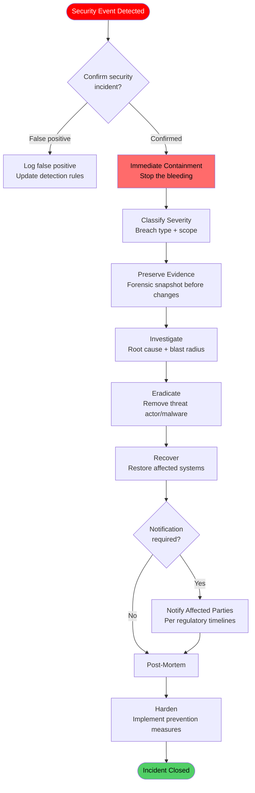

# SOP: Security Incident Response

A security incident is not just a technical failure — it is a trust failure. When data is exposed, credentials are compromised, or unauthorized access occurs, the damage extends beyond systems into customer relationships, regulatory standing, and ecosystem reputation. This SOP defines the security-specific response procedures that complement the general [Incident Response &amp; External Shocks SOP](./incident-response-sop) with security-focused protocols.

The foundational constraint: **every security action must have a human liability bearer.** No automated system may make unilateral security decisions that affect customer data, system access, or evidence integrity without a human authorizing and accepting accountability for that action. This is the Atomic Constraint applied to security operations.

---

## Overview

This SOP governs the detection, containment, investigation, eradication, and recovery from security incidents. It defines breach classification, mandatory notification timelines, forensic evidence preservation requirements, and regulatory reporting obligations. It complements the general incident response SOP with security-specific procedures and the additional requirements of data protection regulations.

---

## Trigger / When to Use

This SOP is triggered when:

- Unauthorized access to any ecosystem system is detected or suspected
- Customer data exposure (confirmed or potential) is identified
- Cryptographic key compromise is detected or suspected
- A supply chain attack affecting ecosystem dependencies is reported
- Insider threat indicators are detected (unusual access patterns, data exfiltration)
- A third-party vendor reports a breach affecting ecosystem data
- Anomalous authentication activity exceeds threshold (brute force, credential stuffing)
- Security monitoring detects malware, ransomware, or unauthorized software

---

## Roles &amp; Responsibilities

| Role | Responsibility | Authority |
|------|---------------|-----------|
| **Security Incident Commander** | Overall incident coordination, decision authority, communication | Full incident authority (Cell Lead or Founder) |
| **Security Operator** | Technical investigation, containment, evidence collection | Execute containment and investigation actions |
| **Infrastructure Operator** | System isolation, access revocation, network controls | Execute infrastructure-level security actions |
| **Legal/Compliance** | Regulatory notification, legal exposure assessment, evidence admissibility | Authorize external notifications |
| **Cell Lead** | Stakeholder communication, resource allocation, business impact assessment | Assign resources, authorize customer communication |
| **Founder** | Final authority for P0/P1 security incidents, regulatory relationships | Override any decision, authorize public statements |
| **Forensic Analyst** | Evidence preservation, chain of custody, forensic analysis | Evidence handling authority |

### The Atomic Constraint in Security

| Principle | Implementation |
|-----------|---------------|
| **Every security action has a human liability bearer** | No automated containment action affects customer-visible systems without human authorization |
| **Automated detection, human decision** | Systems detect and alert; humans decide and act |
| **Accountability chain unbroken** | Every action logged in ACTS with operator identity and authorization |
| **Post-action audit** | Every security action reviewed within 24 hours |

**Exception:** Automated brute-force protection (rate limiting, IP blocking) may operate without per-action human authorization, but the rules governing automation must be human-approved, and the automation logs must be reviewed daily.

---

## Process Flow

---

## Detailed Procedure

### Step 1: Detection

Security events are detected through multiple channels:

| Detection Source | Examples | Response Time |
|-----------------|----------|---------------|
| **Automated monitoring** | IDS/IPS alerts, anomaly detection, log analysis | Real-time alert |
| **Dependency notification** | Vendor breach notification, CVE disclosure | Upon receipt |
| **Internal report** | Operator observes suspicious activity | Upon report |
| **Customer report** | Customer reports unauthorized access to their data | Upon receipt |
| **External report** | Security researcher, law enforcement notification | Upon receipt |
| **Audit finding** | Routine audit discovers past compromise | Upon discovery |

**Detection SLA:** All security alerts must be triaged within 15 minutes during business hours, 30 minutes outside business hours.

### Step 2: Confirmation

Before activating full incident response, confirm the event is a real security incident:

| Confirmation Step | Maximum Time | Owner |
|------------------|-------------|-------|
| Review alert details and supporting evidence | 10 minutes | Security Operator |
| Check for known false positive patterns | 5 minutes | Security Operator |
| Verify affected systems and scope | 15 minutes | Security Operator |
| Escalate to Security Incident Commander if confirmed | Immediate | Security Operator |

**Rule:** When in doubt, treat it as a real incident. False positive cost is hours of investigation. Missed real incident cost is unbounded.

### Step 3: Immediate Containment

Containment actions are time-critical. The goal is to stop ongoing damage before investigating root cause.

| Containment Action | When to Use | Authorization Required |
|-------------------|-----------|----------------------|
| **Revoke compromised credentials** | Credential theft confirmed or suspected | Security Operator (immediate, notify Commander) |
| **Isolate affected systems** | Active unauthorized access or malware | Security Operator + Commander authorization |
| **Block malicious IP/network ranges** | Active attack from identified source | Security Operator (immediate, log in ACTS) |
| **Disable compromised user accounts** | Account takeover confirmed | Security Operator (immediate, notify Commander) |
| **Rotate cryptographic keys** | Key compromise confirmed or suspected | Security Operator + Commander + two-person authorization |
| **Suspend affected vendor integrations** | Vendor breach affecting ecosystem data | Commander authorization |
| **Enable enhanced logging** | Investigation requires additional telemetry | Security Operator |

**Containment rules:**
- Containment actions are documented in real-time in the incident channel
- Every containment action is logged in ACTS with the authorizing human
- Containment must not destroy evidence (snapshot before isolating)
- Customer-impacting containment (service disruption) requires Commander authorization

### Step 4: Breach Classification

| Classification | Definition | Examples |
|---------------|-----------|----------|
| **Data Exposure** | Customer or ecosystem data accessed or exfiltrated by unauthorized party | Database breach, API data leak, backup exposure, misconfigured storage |
| **Access Compromise** | Unauthorized access to systems, accounts, or infrastructure | Credential theft, session hijacking, privilege escalation, MFA bypass |
| **Supply Chain** | Compromise through a third-party dependency or vendor | Compromised dependency, vendor breach, malicious update |
| **Insider Threat** | Malicious or negligent action by an authorized operator | Data theft by operator, accidental data exposure, policy violation |
| **Cryptographic Compromise** | Encryption keys, certificates, or signing keys compromised | Key theft, weak key generation, certificate authority compromise |
| **Ransomware/Malware** | Malicious software deployed in ecosystem systems | Ransomware encryption, cryptominer, backdoor installation |

#### Severity Matrix

| Factor | Low (1) | Medium (2) | High (3) | Critical (4) |
|--------|---------|-----------|----------|--------------|
| **Data volume** | &lt; 100 records | 100-10,000 records | 10,000-100,000 records | &gt; 100,000 records |
| **Data sensitivity** | Non-sensitive operational | Aggregated/anonymized | PII or business-confidential | Financial, health, credentials |
| **Customer count** | 0 (internal only) | 1-10 customers | 10-100 customers | &gt; 100 customers |
| **Access duration** | &lt; 1 hour | 1-24 hours | 1-30 days | &gt; 30 days |
| **Ongoing risk** | Contained, no ongoing risk | Contained, monitoring needed | Partially contained | Active and ongoing |

**Severity Score = Sum of factors (5-20)**

| Score Range | Severity | Response Level |
|-------------|----------|---------------|
| 5-8 | **Low** | Security Operator leads, Cell Lead informed |
| 9-12 | **Medium** | Cell Lead leads, Founder informed |
| 13-16 | **High** | Founder leads, Legal engaged |
| 17-20 | **Critical** | Founder leads, Legal + external counsel, Board notified |

### Step 5: Evidence Preservation

Evidence preservation begins **before** any investigative or remediation actions that might alter the state of affected systems.

| Evidence Type | Collection Method | Priority |
|-------------|------------------|----------|
| **System snapshots** | Full disk images of affected systems | Immediate (before any changes) |
| **Memory dumps** | RAM capture of running processes | Immediate (volatile evidence) |
| **Log files** | Copy all relevant logs to isolated storage | Immediate |
| **Network captures** | Packet captures from affected network segments | If active attack ongoing |
| **ACTS audit trail** | Export ACTS records for incident window | Within 1 hour |
| **Access logs** | Authentication, authorization, and access records | Within 1 hour |
| **Configuration snapshots** | Current configuration of affected systems | Within 2 hours |

#### Chain of Custody Requirements

| Requirement | Implementation |
|------------|---------------|
| **Evidence hash** | SHA-256 hash computed immediately upon collection |
| **Evidence log** | Every piece of evidence logged with collector, time, method, and hash |
| **Tamper protection** | Evidence stored in write-once storage or cryptographically sealed |
| **Access control** | Evidence accessible only to Forensic Analyst and Commander |
| **Transfer documentation** | Every evidence transfer logged with sender, receiver, time |
| **Retention** | Evidence retained for minimum 3 years or duration of any legal proceedings |

### Step 6: Investigation

| Investigation Phase | Activities | Duration Target |
|--------------------|-----------|-----------------|
| **Scope determination** | Identify all affected systems, data, and users | 2-4 hours |
| **Attack vector identification** | Determine how the attacker gained access | 4-24 hours |
| **Blast radius assessment** | Determine the full extent of damage or exposure | 4-24 hours |
| **Timeline reconstruction** | Build minute-by-minute timeline of attacker activity | 24-72 hours |
| **Attribution (if possible)** | Identify the source of the attack | Ongoing (not required for response) |
| **Impact quantification** | Quantify data exposed, systems affected, business impact | 48-72 hours |

### Step 7: Eradication

| Eradication Action | When Required | Verification |
|-------------------|--------------|-------------|
| **Remove malware/backdoors** | Malware or unauthorized software detected | Full system scan post-removal |
| **Patch exploited vulnerability** | Vulnerability used as attack vector | Vulnerability scan confirms patch effective |
| **Reset all credentials** | Credential compromise confirmed | All affected credentials rotated and verified |
| **Revoke and reissue certificates** | Certificate compromise | New certificates deployed and validated |
| **Rotate encryption keys** | Key compromise confirmed | New keys deployed, old encrypted data re-encrypted where feasible |
| **Remove unauthorized accounts** | Attacker created accounts | Account audit confirms no unauthorized accounts remain |

### Step 8: Recovery

| Recovery Step | Owner | Verification |
|-------------|-------|-------------|
| **Restore from clean backup** | Infrastructure Operator | Backup integrity verified (pre-compromise backup) |
| **Redeploy affected services** | Infrastructure Operator | Clean build from golden repo |
| **Re-enable customer access** | Security Operator + Commander | Access controls verified |
| **Enhanced monitoring** | Security Operator | Additional alerting rules deployed |
| **Vulnerability scanning** | Security Operator | Full scan confirms no residual compromise |

**Recovery rules:**
- Restored systems must come from backups or builds confirmed pre-compromise
- No system is restored to its compromised state — clean rebuild required
- Enhanced monitoring remains in place for minimum 90 days post-recovery
- Recovery verification signed off by Security Operator and Commander

### Step 9: Notification of Affected Parties

#### Mandatory Notification Timelines

| Regulation / Requirement | Notification Deadline | Recipient | Content |
|-------------------------|----------------------|-----------|---------|
| **GDPR (EU)** | 72 hours from discovery | Supervisory authority | Nature of breach, data categories, approximate number of subjects, consequences, mitigation measures |
| **GDPR (individuals)** | Without undue delay (if high risk to individuals) | Affected data subjects | Nature of breach, contact details, likely consequences, mitigation measures |
| **Financial data exposure** | Immediately upon confirmation | Affected financial institutions + customers | Nature of exposure, data compromised, recommended protective actions |
| **Contractual obligations** | Per contract terms (typically 24-72 hours) | Affected clients | Per contract requirements |
| **Internal (ecosystem)** | Immediately upon confirmation | AINEFF Board, affected entity leads | Full incident details |

#### Notification Content Template

| Section | Content |
|---------|---------|
| **Incident summary** | What happened, in plain language |
| **Timeline** | When the breach occurred, when it was detected, when it was contained |
| **Data affected** | What types of data were exposed or compromised |
| **Individuals affected** | Number and categories of affected individuals |
| **Actions taken** | Containment and remediation steps already completed |
| **Ongoing actions** | What is being done to prevent recurrence |
| **Recommended actions for affected parties** | Password changes, monitoring, credit alerts, etc. |
| **Contact information** | How to reach the response team for questions |

#### Communication Rules

| Rule | Rationale |
|------|-----------|
| **Legal review before any external notification** | Ensure accuracy, avoid admissions, comply with regulatory requirements |
| **Single spokesperson** | Consistent messaging, controlled communication |
| **No speculation in notifications** | State what is known; do not guess about unknowns |
| **Regular updates** | Update affected parties at least every 72 hours until resolved |
| **Written records of all notifications** | Proof of compliance with notification obligations |

### Step 10: Post-Mortem

Every security incident requires a post-mortem within 72 hours of recovery:

| Post-Mortem Section | Content |
|--------------------|---------|
| **Incident timeline** | Minute-by-minute reconstruction from detection to recovery |
| **Root cause analysis** | How the breach occurred (technical and process failures) |
| **Detection analysis** | How long the compromise existed before detection; how to detect faster |
| **Response evaluation** | What worked, what did not, what was improvised |
| **Impact assessment** | Final quantified impact (data, financial, reputational, regulatory) |
| **Notification review** | Were all notification obligations met? |
| **Evidence review** | Is the evidence package complete and admissible? |
| **Prevention measures** | Specific, assigned, time-bound actions to prevent recurrence |
| **Governance review** | Was the Atomic Constraint maintained? Every action traceable to a human? |

### Step 11: Hardening

Post-incident hardening is not optional. Every security incident must result in specific defensive improvements:

| Hardening Area | Examples |
|---------------|----------|
| **Detection improvement** | New alerting rules, broader monitoring coverage, faster detection |
| **Access control tightening** | Reduced permissions, additional MFA requirements, shorter session lifetimes |
| **Vulnerability remediation** | Patch the exploited vulnerability across all systems, not just the affected one |
| **Process improvement** | Updated SOPs, improved training, better incident communication |
| **Architecture improvement** | Better network segmentation, improved isolation, enhanced encryption |
| **Vendor review** | If supply chain, review vendor security requirements and monitoring |

---

## Artifacts / Outputs

| Artifact | Produced At | Owner |
|----------|------------|-------|
| Incident Detection Record | Detection confirmation | Security Operator |
| Containment Action Log | Containment phase | Security Operator |
| Evidence Package (sealed) | Evidence preservation | Forensic Analyst |
| Chain of Custody Record | Evidence handling | Forensic Analyst |
| Investigation Report | Investigation completion | Security Incident Commander |
| Notification Records | Notification phase | Legal/Compliance |
| Customer Communication Records | Customer notification | Cell Lead |
| Post-Mortem Report | Within 72 hours of recovery | Security Incident Commander |
| Hardening Action Plan | Post-mortem | Security Operator |
| ACTS Incident Trail | Throughout incident | Automated + all operators |
| Regulatory Filing Records | If applicable | Legal/Compliance |

---

## Time Bounds / SLAs

| Activity | Maximum Duration | Escalation |
|----------|-----------------|-----------|
| Alert triage | 15 minutes (business hours) / 30 minutes (off-hours) | Auto-escalate to Commander |
| Incident confirmation | 30 minutes from alert | Commander decision |
| Containment initiation | 1 hour from confirmation | Commander + Founder |
| Evidence preservation start | Before any remediation actions | Forensic Analyst |
| Breach scope determination | 4 hours from confirmation | Commander review |
| Regulatory notification (GDPR) | 72 hours from discovery | Legal/Compliance deadline |
| Customer notification | Per regulatory + contractual requirements | Legal/Compliance drafts, Commander approves |
| Post-mortem completion | 72 hours from recovery | Commander schedules |
| Hardening actions initiated | 7 days from post-mortem | Security Operator + Cell Lead |
| Hardening actions completed | 30 days from post-mortem | Cell Lead tracks |
| Enhanced monitoring period | 90 days minimum post-recovery | Security Operator maintains |

---

## Kill Criteria / Escalation Triggers

| Trigger | Escalation Path |
|---------|----------------|
| Any confirmed data exposure of customer PII | Immediate escalation to Founder + Legal |
| Credential compromise for Tier 1 systems | Immediate containment + Commander activation |
| Active attacker presence detected in production | All hands security response, Founder notified |
| Supply chain compromise in critical vendor | Vendor integration suspended, emergency replacement evaluated |
| Insider threat indicators for Stage 5+ operator | Founder handles directly; access suspended pending investigation |
| Regulatory inquiry about a breach | Legal takes lead; all communication through Legal |
| Evidence tampering suspected | Forensic Analyst isolates evidence; independent review initiated |
| Containment fails (attacker re-establishes access) | Escalate to full infrastructure isolation; Founder + external security partner |
| Notification deadline approaching without approval | Legal escalates to Founder for immediate decision |
| Repeated security incidents (3+ in 90 days) | Founder-led security architecture review |

---

## Anti-Patterns

| Anti-Pattern | Why It Is Dangerous | Correct Approach |
|-------------|-------------------|-----------------|
| **"Investigate first, contain later"** | Ongoing damage accumulates while investigating | Contain immediately, investigate after bleeding stops |
| **Evidence destruction during containment** | Forensic evidence lost, regulatory exposure | Snapshot before any system changes |
| **Delayed notification** | Regulatory penalties, customer trust destruction | Start notification process immediately; deliver within required timelines |
| **Minimizing scope** | Underestimating blast radius leaves exposed systems unprotected | Assume worst case until investigation proves otherwise |
| **Single-person investigation** | Bias, fatigue, and bus factor in critical moment | Minimum two-person investigation team |
| **Automated containment without human review** | Violates Atomic Constraint; may cause disproportionate customer impact | Automated detection, human-authorized containment |
| **Blaming individuals in post-mortem** | Prevents honest analysis, drives incident hiding | Blameless post-mortem focused on systems and processes |
| **Skipping hardening** | Same vulnerability exploited again | Hardening actions are mandatory deliverables, not suggestions |
| **Informal communication** | Uncontrolled messaging creates legal and reputational exposure | All external communication through designated spokesperson after Legal review |

---

## Cross-References

- [Incident Response &amp; External Shocks SOP](./incident-response-sop) — General incident framework that this SOP extends with security specifics
- [Data Backup &amp; Disaster Recovery SOP](./disaster-recovery-sop) — Recovery procedures for systems affected by security incidents
- [Audit &amp; Compliance Procedures SOP](./audit-sop) — Evidence packaging and regulatory audit procedures
- [Vendor Risk Assessment &amp; Contract SOP](./vendor-management-sop) — Vendor breach response and supply chain incident handling
- [System Deployment &amp; Release SOP](./deployment-sop) — Clean rebuild procedures for compromised systems
- [Pre-Incident Accountability Review (PIAR)](./piar-sop) — Accountability framework referenced by the Atomic Constraint
