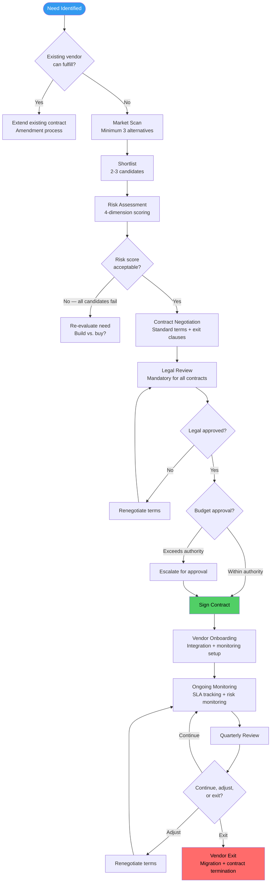
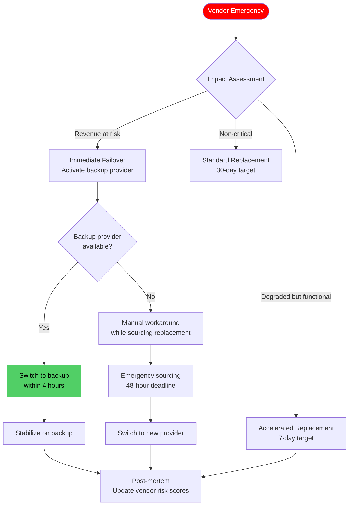

---

sidebar_position: 16
title: "SOP: Vendor Risk Assessment & Contract"
description: "Complete Standard Operating Procedure for vendor management — risk assessment, contract requirements, onboarding, SLA monitoring, quarterly review, concentration risk limits, and emergency replacement procedures for third-party dependencies."
tags: [sop, operational]
custom_status: active
custom_owner: Andrew Leo
custom_last_review: 2026-03-01
custom_next_review: 2026-06-01
---

# SOP: Vendor Risk Assessment &amp; Contract

The AINEFF Ecosystem depends on third-party vendors for infrastructure, AI model providers, payment processing, and specialized services. Every vendor dependency is a potential failure point. A vendor that goes down takes your revenue with it. A vendor that changes its API breaks your product. A vendor that gets breached exposes your customers. This SOP defines how vendor dependencies are evaluated, onboarded, monitored, and — when necessary — replaced.

No vendor relationship is permanent. Every vendor has an exit plan defined before the contract is signed.

---

## Overview

This SOP governs the complete vendor lifecycle from need identification through market assessment, risk scoring, contract negotiation, onboarding, ongoing monitoring, and exit. It ensures that no vendor creates unacceptable concentration risk, that every contract includes enforceable exit provisions, and that emergency replacement procedures exist for critical dependencies.

---

## Trigger / When to Use

This SOP is triggered when:

- A new third-party service or tool is being evaluated for adoption
- An existing vendor contract is approaching renewal (90 days before expiry)
- A vendor's risk profile changes (outage, breach, financial instability, acquisition)
- Quarterly vendor review is scheduled
- A vendor dependency needs emergency replacement
- Concentration risk thresholds are approached or breached

---

## Roles &amp; Responsibilities

| Role | Responsibility | Authority |
|------|---------------|-----------|
| **Requesting Operator** | Identify need, initial vendor research, business case | Submit vendor request |
| **Cell Lead** | Vendor evaluation, risk assessment, contract negotiation | Approve vendors up to $5,000/year |
| **Infrastructure Operator** | Technical evaluation, integration assessment, security review | Technical sign-off |
| **Legal/Compliance** | Contract review, regulatory compliance, data protection assessment | Legal sign-off required for all contracts |
| **Finance Lead** | Budget impact, payment terms, financial stability assessment | Financial sign-off for contracts &gt; $5,000/year |
| **Founder** | Strategic vendor decisions, concentration risk exceptions | Final approval for vendors &gt; $25,000/year or critical-tier |

---

## Process Flow

---

## Detailed Procedure

### Step 1: Need Identification

Before evaluating vendors, the need itself must be justified:

| Question | Required Answer |
|----------|----------------|
| What problem does this vendor solve? | Specific, measurable problem statement |
| Can we solve this in-house? | Build vs. buy analysis with cost comparison |
| Is this a temporary or permanent need? | If temporary (&lt; 6 months), consider alternatives to vendor commitment |
| What is the impact if we do not solve this? | Quantified cost of inaction |
| Does this create a new external dependency? | If yes, concentration risk check required |

### Step 2: Market Scan

| Scan Requirement | Minimum |
|-----------------|---------|
| Alternatives evaluated | 3 (including the leading candidate) |
| Pricing comparison | Side-by-side for equivalent scope |
| Reference checks | At least 1 per shortlisted vendor |
| Technical evaluation | Proof of concept or sandbox test |
| Exit cost assessment | Cost to switch from each vendor |

### Step 3: Vendor Risk Assessment

Every vendor is scored across four risk dimensions:

| Dimension | Weight | Score Range | Description |
|-----------|--------|-----------|-------------|
| **Data Access** | 30% | 1-5 | What level of access does the vendor have to ecosystem or customer data? |
| **Criticality** | 30% | 1-5 | How critical is this vendor to revenue-generating operations? |
| **Replaceability** | 25% | 1-5 | How easily can this vendor be replaced with an alternative? |
| **Financial Stability** | 15% | 1-5 | How financially stable and sustainable is the vendor? |

#### Data Access Scoring

| Score | Definition |
|-------|-----------|
| 1 (Lowest risk) | No access to ecosystem or customer data |
| 2 | Access to non-sensitive operational data only |
| 3 | Access to aggregated or anonymized customer data |
| 4 | Access to identifiable customer data (PII) |
| 5 (Highest risk) | Access to financial data, credentials, or encryption keys |

#### Criticality Scoring

| Score | Definition |
|-------|-----------|
| 1 (Lowest risk) | Nice-to-have tool; operations unaffected if unavailable |
| 2 | Productivity tool; operations degraded but functional without it |
| 3 | Operational tool; workaround exists but painful |
| 4 | Core dependency; revenue impacted within hours if unavailable |
| 5 (Highest risk) | Revenue-critical; revenue stops within minutes if unavailable |

#### Replaceability Scoring

| Score | Definition |
|-------|-----------|
| 1 (Lowest risk) | Commodity service; can switch in &lt; 1 week with no data migration |
| 2 | Multiple alternatives; switch in 2-4 weeks with minor migration |
| 3 | Few alternatives; switch in 1-3 months with significant migration |
| 4 | Very few alternatives; switch requires 3-6 months and re-architecture |
| 5 (Highest risk) | No viable alternative; vendor lock-in, proprietary formats, no export |

#### Financial Stability Scoring

| Score | Definition |
|-------|-----------|
| 1 (Lowest risk) | Large, profitable, publicly traded company |
| 2 | Established company with strong financials |
| 3 | Growth-stage company with clear funding runway |
| 4 | Early-stage startup with limited funding visibility |
| 5 (Highest risk) | Unstable finances, recent layoffs, or acquisition rumors |

#### Risk Score Calculation

**Vendor Risk Score = (Data Access x 0.30) + (Criticality x 0.30) + (Replaceability x 0.25) + (Financial Stability x 0.15)**

| Composite Score | Risk Tier | Required Approval | Review Frequency |
|----------------|-----------|-------------------|------------------|
| 1.0-2.0 | **Low** | Cell Lead | Annual |
| 2.1-3.0 | **Moderate** | Cell Lead + Finance | Semi-annual |
| 3.1-4.0 | **High** | Cell Lead + Finance + Founder | Quarterly |
| 4.1-5.0 | **Critical** | Founder + PIAR required | Monthly |

### Step 4: Contract Requirements

Every vendor contract must include the following provisions:

| Provision | Requirement | Non-Negotiable? |
|-----------|-------------|-----------------|
| **SLA definition** | Uptime, response time, resolution time — with measurement methodology | Yes |
| **SLA penalties** | Financial penalties (credits or refunds) for SLA breaches | Yes |
| **Data ownership** | Ecosystem retains ownership of all data processed by vendor | Yes |
| **Data export** | Right to export all data in standard format at any time | Yes |
| **Data deletion** | Vendor must delete all data within 30 days of contract termination | Yes |
| **Exit clause** | Right to terminate with 30-day notice (60 days for critical tier) | Yes |
| **Exit assistance** | Vendor must provide migration assistance during exit period | Yes |
| **Security requirements** | Vendor must meet minimum security standards (encryption, access control) | Yes |
| **Breach notification** | Vendor must notify within 24 hours of any data breach | Yes |
| **Audit rights** | Ecosystem has right to audit vendor's security and compliance | Yes |
| **Subprocessor notification** | Vendor must notify before engaging new subprocessors | Recommended |
| **Price protection** | Maximum annual price increase capped (typically 5-10%) | Recommended |
| **Insurance** | Vendor carries appropriate liability insurance | For critical tier |

### Step 5: Concentration Risk Limits

| Constraint | Limit | Purpose |
|-----------|-------|---------|
| **Single vendor revenue dependency** | No vendor may be sole provider for &gt; 30% of revenue-enabling infrastructure | Prevent single-vendor existential risk |
| **Vendor category concentration** | Maximum 2 vendors per critical category (e.g., AI model providers) | Ensure alternatives exist |
| **Geographic concentration** | Critical vendors must not all be in the same jurisdiction | Regulatory and geopolitical risk |
| **Financial concentration** | No single vendor receives &gt; 15% of total operating expenses | Budget concentration risk |
| **Technology concentration** | No single vendor provides &gt; 2 critical-tier services | Blast radius limitation |

**AI Model Provider specific rules:** Given the criticality of AI model providers to ecosystem operations, the following additional rules apply:

| Rule | Rationale |
|------|-----------|
| Minimum 2 model providers under contract | Redundancy for provider outage or policy change |
| Abstraction layer between application and provider | Enable rapid switching without code changes |
| Monthly provider comparison (cost, quality, availability) | Ensure optimal allocation and detect degradation |
| Exit plan tested quarterly | Verify that switching providers is operationally feasible |

### Step 6: Vendor Onboarding

| Onboarding Step | Owner | Duration |
|----------------|-------|----------|
| Technical integration setup | Infrastructure Operator | 1-5 days |
| Security configuration | Security Operator | 1-2 days |
| Monitoring and alerting setup | Infrastructure Operator | 1 day |
| Access provisioning (principle of least privilege) | Infrastructure Operator | 1 day |
| SLA baseline establishment | Cell Lead | 30 days observation |
| Documentation update | Requesting Operator | 2 days |
| Team training (if applicable) | Requesting Operator | 1-3 days |
| Emergency contact list established | Cell Lead | 1 day |

### Step 7: SLA Monitoring

| Monitoring Activity | Frequency | Owner |
|--------------------|-----------|-------|
| Uptime monitoring | Continuous (automated) | Infrastructure Operator |
| Performance metrics collection | Continuous (automated) | Infrastructure Operator |
| SLA compliance calculation | Weekly (automated report) | Cell Lead |
| Incident tracking | Per incident | Infrastructure Operator |
| Cost tracking | Monthly | Finance Lead |
| Security posture review | Quarterly | Security Operator |

### Step 8: Quarterly Vendor Review

| Review Item | Data Source | Decision Criteria |
|------------|-----------|-------------------|
| SLA compliance | Monitoring data | &lt; 95% compliance triggers review |
| Incident history | Incident tracker | &gt; 3 incidents in quarter triggers review |
| Cost trend | Finance records | &gt; 10% cost increase triggers review |
| Market alternatives | Market scan | Better alternatives trigger evaluation |
| Risk score update | Re-assessment | Score increase triggers action |
| Strategic alignment | Business review | Misalignment triggers exit planning |

### Step 9: Emergency Vendor Replacement

When a vendor must be replaced urgently (outage, breach, contract dispute, sudden shutdown):

**Emergency replacement authority:**
- Cell Lead may authorize emergency vendor switch without normal approval chain
- Retroactive PIAR and approval required within 72 hours
- All emergency switches are logged as incidents and reviewed in post-mortem

---

## Artifacts / Outputs

| Artifact | Produced At | Owner |
|----------|------------|-------|
| Vendor Need Justification | Need identification | Requesting Operator |
| Market Scan Report | Market evaluation | Requesting Operator |
| Vendor Risk Assessment | Risk scoring | Cell Lead |
| Contract (executed) | Contract signing | Legal/Compliance |
| Onboarding Checklist | Vendor onboarding | Infrastructure Operator |
| SLA Monitoring Dashboard | Ongoing | Infrastructure Operator |
| Quarterly Vendor Review Report | Quarterly review | Cell Lead |
| Emergency Replacement Record | If emergency switch occurs | Cell Lead |
| Vendor Exit Plan | Contract signing (updated quarterly) | Cell Lead |
| Concentration Risk Report | Quarterly | Finance Lead |

---

## Time Bounds / SLAs

| Activity | Maximum Duration | Escalation |
|----------|-----------------|-----------|
| Need justification | 3 business days | Cell Lead review |
| Market scan | 5 business days | Cell Lead extends or narrows scope |
| Risk assessment | 3 business days per vendor | Cell Lead completes or delegates |
| Contract negotiation | 15 business days | Founder escalation if stalled |
| Legal review | 5 business days | Founder escalation |
| Vendor onboarding | 10 business days | Cell Lead + Infrastructure Operator review |
| Emergency replacement (critical vendor) | 4 hours to failover | Founder notification |
| Quarterly review completion | 5 business days from quarter end | Cell Lead |
| Vendor exit execution | 30 days (standard) / 7 days (emergency) | Founder oversight |

---

## Kill Criteria / Escalation Triggers

| Trigger | Escalation Path |
|---------|----------------|
| Vendor SLA compliance &lt; 90% for 2 consecutive months | Cell Lead initiates exit evaluation |
| Vendor suffers data breach affecting ecosystem data | Immediate Cell Lead + Founder + Legal review |
| Vendor announces end-of-life or discontinuation | Emergency replacement process activated |
| Vendor acquired by competitor or hostile entity | Legal review + exit plan activation within 30 days |
| Concentration risk threshold breached | Founder review, mandatory diversification plan |
| Vendor cost increases &gt; 20% without proportional value increase | Contract renegotiation or exit evaluation |
| Vendor fails to respond to critical support request within 4 hours | Escalate to vendor executive contact; begin alternative evaluation |
| Vendor changes terms of service materially without notice | Legal review; potential contract breach claim + exit planning |

---

## Anti-Patterns

| Anti-Pattern | Why It Is Dangerous | Correct Approach |
|-------------|-------------------|-----------------|
| **"We will figure out the exit later"** | Exit becomes expensive and painful when unplanned | Exit plan defined and costed before contract signing |
| **Single-vendor dependency** | One vendor failure becomes your failure | Maintain alternatives and abstraction layers for critical services |
| **Vendor loyalty over performance** | Sunk cost fallacy keeps you with underperforming vendors | Quarterly review with objective metrics, not relationships |
| **Shadow vendors** | Operators adopting tools without going through vendor process | All vendor spending tracked; no unauthorized SaaS subscriptions |
| **Contract auto-renewal blindness** | Contracts auto-renew at unfavorable terms | 90-day renewal alerts; proactive review before every renewal |
| **Price-first evaluation** | Cheapest vendor may be the most expensive when it fails | Risk-adjusted cost: include switching costs, downtime cost, breach cost |
| **Ignoring subprocessors** | Your vendor's vendor is your risk too | Subprocessor notification clause; review subprocessor changes |
| **No backup for AI model providers** | Model provider policy change can halt operations overnight | Minimum 2 providers with tested abstraction layer |

---

## Cross-References

- [System Deployment &amp; Release SOP](./deployment-sop) — Vendor dependencies in the deployment pipeline, model provider management
- [Security Incident Response SOP](./security-incident-sop) — Vendor breach response procedures
- [Data Backup &amp; Disaster Recovery SOP](./disaster-recovery-sop) — Vendor failover in disaster recovery
- [Capital Allocation &amp; Investment SOP](./capital-allocation-sop) — Budget approval for vendor contracts
- [Audit &amp; Compliance Procedures SOP](./audit-sop) — Vendor compliance auditing
- [Incident Response &amp; External Shocks SOP](./incident-response-sop) — Vendor outage as external shock
