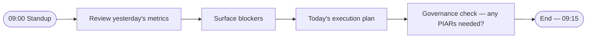
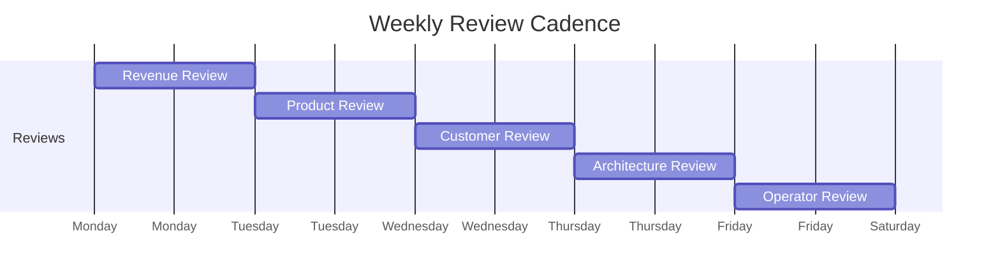
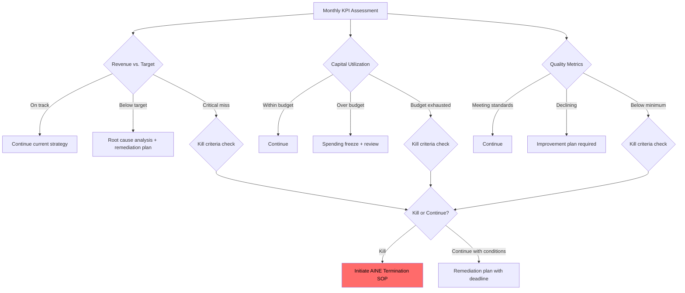
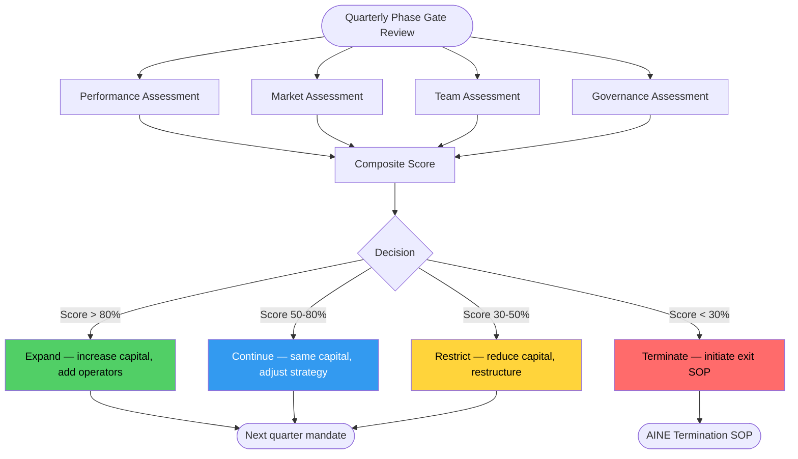
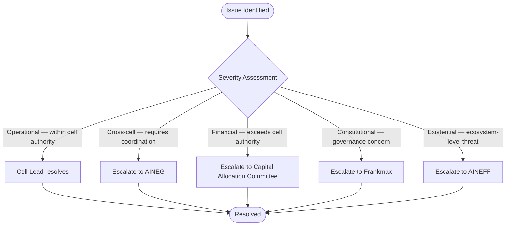
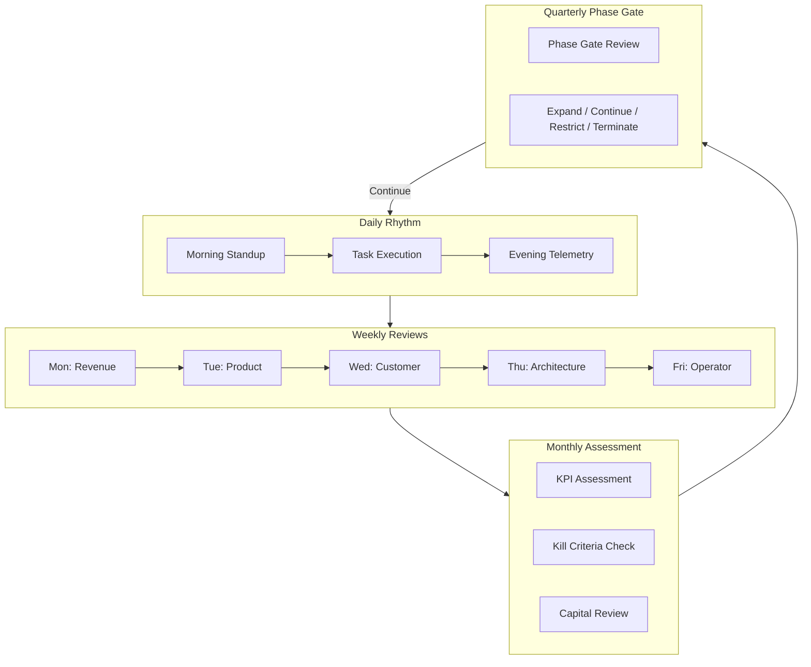

# SOP: Venture Cell Operations

A venture cell is the **atomic unit of execution** in the AINEFF Ecosystem. It is a small, capital-bounded, mandate-scoped team that operates a specific revenue-generating initiative within an AINE. Venture cells are not departments — they are self-contained economic units with clear inputs, outputs, and kill criteria.

This SOP defines the operational rhythms, review cadences, and governance requirements for running a venture cell.

---

## Cell Setup

### Capital Envelope Definition

Every venture cell operates within a **fixed capital envelope** — a pre-allocated budget that defines its maximum economic exposure.

| Parameter | Definition |
|-----------|-----------|
| **Total capital allocation** | Maximum capital the cell may consume over its mandate period |
| **Monthly burn rate cap** | Maximum monthly expenditure (hard limit, not guidance) |
| **Revenue target** | Expected revenue generation timeline and amounts |
| **Break-even deadline** | Date by which revenue must exceed costs (kill criterion) |
| **Contingency reserve** | Percentage held back for unexpected expenses (typically 10-15%) |

### Mandate Scoping

The cell's mandate defines what it is authorized to do:

- **Market scope:** Which clients, industries, or segments
- **Product scope:** Which products or services
- **Geographic scope:** Which jurisdictions
- **Authority scope:** What decisions the cell can make autonomously
- **Exclusions:** What the cell is explicitly NOT authorized to do

### Team Composition

| Role | Responsibility | Authority Level |
|------|---------------|----------------|
| **Cell Lead** | Overall cell performance, capital management, governance compliance | Stage 5–6 operator |
| **Commercial Operator** | Revenue generation, client relationships, pipeline management | Stage 4–5 operator |
| **Execution Operator** | Delivery, operations, quality, technical execution | Stage 4–5 operator |
| **Support Operators** | Specialized execution under supervision | Stage 3–4 operators |

Minimum viable cell: 2 people (Cell Lead + one operator). Maximum recommended: 7 people.

---

## Daily Operations

### Morning Standup (09:00, 15 minutes max)

Format:
1. **Metrics review** (2 min): Revenue, pipeline, delivery status — numbers only, no narratives
2. **Blocker surface** (5 min): What is preventing progress? Who can unblock?
3. **Today's plan** (5 min): Each operator states their top 3 tasks for the day
4. **Governance check** (3 min): Any decisions today that require a PIAR?

Rules:
- No problem-solving during standup (take it offline)
- No status updates longer than 60 seconds per person
- If standup exceeds 15 minutes, Cell Lead must address structural issues

### Task Execution Under Governance Constraints

All daily task execution operates under these constraints:

- Tasks must fall within the cell's mandate scope
- Spending must fall within the monthly burn rate cap
- Client commitments must be pre-approved or within established authority
- Any novel situation triggers a PIAR assessment
- All significant actions logged for ACTS (Accountability Chain Tracking System)

### Evening Telemetry Review (17:00, 10 minutes)

- Cell Lead reviews the day's telemetry data
- Revenue metrics, delivery metrics, and operational health
- Flag any anomalies for next morning's standup
- Update the cell's dashboard

---

## Weekly Reviews

### Monday: Revenue Review (60 minutes)

**Attendees:** Cell Lead, Commercial Operator
**Focus:** Revenue performance, pipeline health, financial position

| Agenda Item | Duration | Output |
|-------------|----------|--------|
| Revenue vs. target (MTD, QTD) | 10 min | Revenue gap analysis |
| Pipeline review (stage, value, probability) | 15 min | Pipeline health score |
| Won/lost analysis | 10 min | Win/loss patterns |
| Capital utilization review | 10 min | Burn rate assessment |
| Forecast update | 10 min | Updated revenue forecast |
| Action items | 5 min | Assigned follow-ups |

### Tuesday: Product Review (60 minutes)

**Attendees:** Cell Lead, Execution Operator
**Focus:** Product quality, delivery performance, technical debt

| Agenda Item | Duration | Output |
|-------------|----------|--------|
| Delivery status (active engagements) | 15 min | Delivery health score |
| Quality metrics (defects, rework, client satisfaction) | 10 min | Quality trend |
| Technical debt assessment | 10 min | Debt register update |
| Product improvement backlog prioritization | 15 min | Updated backlog |
| Action items | 10 min | Assigned follow-ups |

### Wednesday: Customer Review (60 minutes)

**Attendees:** Cell Lead, Commercial Operator, Execution Operator
**Focus:** Client satisfaction, relationship health, expansion opportunities

| Agenda Item | Duration | Output |
|-------------|----------|--------|
| Client health check (each active client) | 20 min | Client health scores |
| NPS / satisfaction data review | 10 min | Satisfaction trend |
| At-risk client identification and intervention planning | 15 min | Risk mitigation plans |
| Expansion opportunity identification | 10 min | Expansion pipeline |
| Action items | 5 min | Assigned follow-ups |

### Thursday: Architecture Review (60 minutes)

**Attendees:** Cell Lead, Execution Operator
**Focus:** Systems, tools, processes, automation

| Agenda Item | Duration | Output |
|-------------|----------|--------|
| System health (uptime, performance, incidents) | 10 min | System health score |
| Automation opportunities | 15 min | Automation backlog |
| Tool evaluation (are we using the right tools?) | 10 min | Tool assessment |
| Security and compliance check | 15 min | Compliance status |
| Action items | 10 min | Assigned follow-ups |

### Friday: Operator Review (60 minutes)

**Attendees:** Cell Lead, all cell operators
**Focus:** Team performance, development, well-being

| Agenda Item | Duration | Output |
|-------------|----------|--------|
| Weekly wins and learnings | 10 min | Lessons learned |
| Operator performance review (metrics-based) | 15 min | Performance scores |
| Skill development needs | 10 min | Training plan updates |
| Governance compliance review | 10 min | Compliance score |
| Next week planning | 10 min | Weekly plan |
| Action items | 5 min | Assigned follow-ups |

---

## Monthly Assessment

### Monthly KPI Assessment (Half-day, first Monday of month)

**Attendees:** Cell Lead, all operators, AINEG representative

### Kill Criteria Monitoring

Every month, the following kill criteria are formally evaluated:

| Kill Criterion | Threshold | Response |
|---------------|-----------|----------|
| Revenue below 50% of target for 2 consecutive months | Hard kill | Terminate or restructure |
| Capital utilization above 90% with &lt; 50% revenue target achieved | Hard kill | Terminate |
| Client satisfaction below minimum threshold | Soft kill | 30-day remediation or terminate |
| Governance violations (unresolved) | Hard kill | Immediate review |
| Operator attrition above 50% | Soft kill | Restructure |

### Capital Utilization Review

- Compare actual spend to budgeted spend
- Identify underutilized allocations for reallocation
- Identify overruns and enforce budget discipline
- Update capital forecast for remaining mandate period

---

## Quarterly Phase Gate Review

### Quarterly Review (Full day)

**Attendees:** Cell Lead, all operators, AINEG Capital Allocation Committee

The quarterly review is the **expansion or termination decision point**.

Phase gate evaluation dimensions:

| Dimension | Weight | Metrics |
|-----------|--------|---------|
| **Revenue performance** | 30% | Revenue vs. target, growth rate, pipeline quality |
| **Capital efficiency** | 20% | ROI, burn rate, time to break-even |
| **Market position** | 20% | Client acquisition, competitive position, market fit |
| **Team performance** | 15% | Operator development, retention, productivity |
| **Governance compliance** | 15% | PIAR compliance, audit results, constitutional alignment |

---

## Escalation Procedures

| Escalation Level | Trigger | Response Time |
|-----------------|---------|---------------|
| **Cell-level** | Operational issue within cell authority | Same day |
| **AINEG** | Cross-cell coordination or portfolio issue | 24 hours |
| **Capital Allocation Committee** | Funding issue or capital reallocation | 48 hours |
| **Frankmax** | Governance violation or accountability concern | 24 hours |
| **AINEFF** | Constitutional issue or existential threat | Immediate |

---

## Operational Flow — Full Cycle

