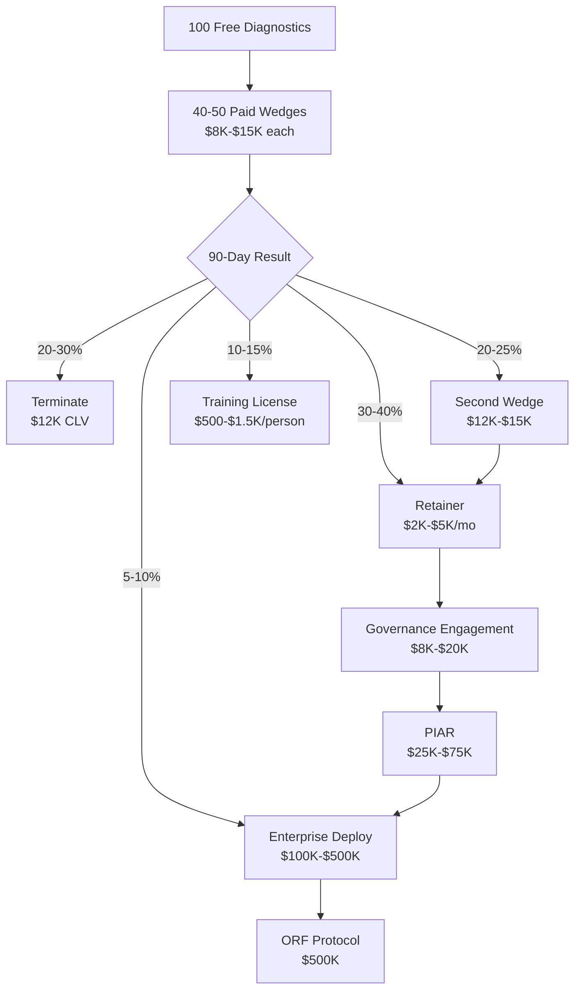

---

sidebar_position: 12
title: "Enterprise Wedge Strategy"
description: "Corporate Wedge Generator — 90-day proof engine for mid-market enterprise, anti-positioning, sales process, and expansion architecture."
tags: [product, financial, strategic]
custom_status: active
custom_owner: Andrew Leo
custom_last_review: 2026-03-01
custom_next_review: 2026-06-01
---

# Enterprise Wedge Strategy

The Enterprise Wedge is a **90-day proof engine** designed to penetrate mid-market enterprises through measurable operational impact rather than sales presentations. It answers the buyer's core question: "Does this actually work?" — with live evidence from inside their own organization.

## The Pitch

> **"We deploy a 3-person AI execution cell for 90 days. They solve one bottleneck. You measure. If it works, scale. If not, stop."**

This is the entire pitch. No slide decks. No multi-month discovery phases. No "digital transformation roadmap." One bottleneck. Measurable outcome. 90 days.

## Product Overview

| Attribute | Detail |
|-----------|--------|
| **Category** | Enterprise Entry / Proof-of-Value Engagement |
| **Price Point** | $8,000-$15,000 per 90-day engagement |
| **Target Market** | Mid-market enterprises ($50M-$500M revenue, 200-2,000 employees) |
| **Core Value** | Measurable operational improvement on a single bottleneck within 90 days |
| **Delivery Model** | 3-person Venture Cell embedded for 90 days |
| **Gross Margin** | 55% |
| **Phase Activation** | Phase 2 |
| **Confidence Score** | 75% |
| **Strategic Role** | Enterprise entry → proof of value → expansion trigger |

## Target Buyer

| Attribute | Detail |
|-----------|--------|
| **Primary Title** | COO (Chief Operating Officer) |
| **Secondary Title** | CFO (Chief Financial Officer) |
| **Company Size** | $50M-$500M revenue, 200-2,000 employees |
| **Industry** | Manufacturing, logistics, professional services, insurance, healthcare, construction |
| **Budget Authority** | $15K-$50K discretionary (COO); $50K+ with executive committee |
| **Purchase Psychology** | Skeptical of consultants, tired of "innovation theater," wants proof before commitment |
| **Decision Timeline** | 2-4 weeks for sub-$15K engagement |
| **Success Metric** | Measurable improvement in the specific bottleneck targeted |

### Buyer Pain Profile

| Pain | Manifestation | Enterprise Wedge Response |
|------|-------------|--------------------------|
| "Consultants produce decks, not results" | $500K spent on strategy decks that gather dust | We produce measurable outcomes, not deliverables |
| "Digital transformation never delivers ROI" | Multi-year programs with ambiguous results | 90 days, one bottleneck, measurable impact |
| "We cannot get budget for big initiatives" | Procurement process kills momentum | Sub-$15K fits discretionary budget |
| "Our team is too busy to support another project" | Initiative fatigue from concurrent programs | Our cell operates independently — minimal client team burden |
| "We have tried AI and it did not work" | Failed AI pilots with no governance | Governance-backed execution with kill criteria |

## Pricing

| Tier | Price | Scope | Best For |
|------|-------|-------|---------|
| **Entry** | $8,000 | Single bottleneck, 3-person cell, 90 days, standard reporting | First engagement / budget-constrained |
| **Standard** | $12,000 | Single bottleneck, 3-person cell, 90 days, weekly exec reporting, governance telemetry | Typical mid-market engagement |
| **Premium** | $15,000 | Single bottleneck + adjacent process, 3-person cell, 90 days, C-suite reporting, full PIAR | Enterprise accounts, expansion-oriented |

### Pricing Rationale

| Factor | Detail |
|--------|--------|
| **Below discretionary threshold** | $8K-$15K sits below most COO/CFO discretionary limits — no procurement needed |
| **Low enough to say yes** | Equivalent to 1-2 weeks of a management consultant — much lower risk |
| **High enough to signal quality** | Not free, not cheap — signals professional execution capability |
| **Margin-positive** | 55% gross margin even at $8K entry level |
| **Expansion-designed** | Low entry price makes expansion to $100K+ feel incremental, not drastic |

## Sales Cycle

### Week-by-Week Process

| Week | Phase | Activities | Owner | Deliverable |
|------|-------|-----------|-------|------------|
| **1** | **Diagnostic (Free)** | Initial conversation, bottleneck identification, data review | Sales Lead | Bottleneck brief (1-2 pages) |
| **2** | **Diagnostic (Free)** | Stakeholder interview (30 min), metric baseline, scope confirmation | Sales Lead + Specialist | Scope document with success metrics |
| **3** | **Proposal** | Proposal delivery, pricing discussion, timeline alignment | Sales Lead | Signed engagement letter |
| **4** | **Close** | Contract execution, cell assignment, kickoff scheduling | Sales Lead + Cell Lead | Executed contract, kickoff date |
| **5-12** | **Execute** | Cell embedded, bottleneck resolution, weekly metrics, governance telemetry | Venture Cell | Weekly progress reports |
| **13** | **Review** | Final metrics presentation, ROI calculation, expansion recommendation | Cell Lead + Sales Lead | Final report + expansion proposal |
| **13+** | **Expand or Terminate** | Client decides: expand scope, convert to retainer, or end | Client | Expansion contract or clean exit |

### Free Diagnostic (Week 1-2)

The free diagnostic is the critical conversion mechanism. It does three things:

| Function | Purpose | Output |
|---------|---------|--------|
| **Bottleneck Identification** | Find the specific, measurable pain point | Named bottleneck with baseline metrics |
| **Relationship Building** | Establish trust with the operational champion | Direct relationship with COO/CFO |
| **Scope Framing** | Define exactly what 90 days will solve | Written scope with success criteria |

**Cost of Free Diagnostic**: 4-8 hours of sales lead time ($400-$800 loaded cost)
**Conversion Rate Target**: 40-50% of diagnostics convert to paid engagement

## Anti-Positioning

The Enterprise Wedge is defined as much by what it is NOT as by what it is:

| We Are NOT | Why This Matters | What We Are Instead |
|-----------|-----------------|-------------------|
| **Digital transformation** | DT is a $500K multi-year commitment with vague outcomes | A 90-day sprint on one specific bottleneck |
| **Upskilling program** | Upskilling is about capability building, not operational impact | A deployed execution cell that produces results immediately |
| **Innovation consulting** | Innovation consulting produces ideas, not implementations | An embedded team that implements and measures |
| **AI vendor** | AI vendors sell technology; buyers are tired of shelfware | We sell outcomes; AI is the method, not the product |
| **Outsourcing** | Outsourcing replaces teams; creates dependency and resentment | We augment operations temporarily — the client learns and decides |
| **Staff augmentation** | Staff aug fills seats; we fill capability gaps with execution | We own the outcome, not just the hours |

### Positioning Statement

> We are not consultants. We do not sell transformation. We deploy a small team to fix one bottleneck in 90 days. You measure the result. If it works, we do more. If not, we stop. That is it.

## 90-Day Execution Model

### Cell Composition

| Role | Responsibility | Time Allocation | Reporting |
|------|---------------|----------------|-----------|
| **Cell Lead** | Client relationship, project management, quality assurance | 50% (shared with other cells) | To Sales Lead and Client Champion |
| **Execution Specialist** | Technical implementation, process optimization, AI deployment | 100% dedicated | To Cell Lead |
| **Governance Operator** | Documentation, metrics tracking, compliance, governance telemetry | 100% dedicated | To Cell Lead |

### Execution Timeline

| Week | Focus | Key Activities | Milestone |
|------|-------|---------------|-----------|
| 5-6 | **Assessment & Setup** | Deep-dive into bottleneck, data access, tool setup, team integration | Baseline metrics documented |
| 7-8 | **First Iteration** | Initial solution deployed, first metrics collected | First measurable improvement |
| 9-10 | **Optimization** | Feedback integration, solution refinement, scale testing | Consistent improvement demonstrated |
| 11-12 | **Stabilization** | Solution hardened, documentation complete, handoff preparation | Stable operational improvement |
| 13 | **Handoff & Report** | Final metrics, ROI calculation, recommendation, expansion proposal | Client decision point |

### Governance Telemetry (Built-In)

Every Enterprise Wedge engagement includes governance instrumentation at no extra cost:

| Telemetry Point | Data Captured | Client Benefit |
|----------------|--------------|---------------|
| Decision log | Every decision made, by whom, with rationale | Accountability trail |
| Metric tracking | Weekly KPIs against baseline | Objective progress measurement |
| Risk register | Identified risks, mitigation actions, status | Risk visibility |
| Kill criteria monitoring | Pre-defined failure conditions checked weekly | Automatic protection against bad outcomes |
| Cost tracking | Hours, tools, expenses against budget | Financial transparency |

## Expansion Architecture

### Post-90-Day Options

| Option | Description | Price | Likelihood |
|--------|-----------|-------|-----------|
| **Terminate** | Clean exit, all documentation transferred, no further obligation | $0 | 20-30% |
| **Retainer** | Monthly retainer for ongoing optimization and support | $2K-$5K/mo | 30-40% |
| **Second Wedge** | New 90-day engagement targeting next bottleneck | $12K-$15K | 20-25% |
| **Training License** | License the approach internally through Operator Training | $500-$1,500/person | 10-15% |
| **Enterprise Deployment** | Full organizational deployment with governance infrastructure | $100K-$500K | 5-10% |
| **Embedded Operations** | Permanent Venture Cell serving the client on retainer | $8K-$15K/mo | 5-10% |

### Expansion Revenue Model

| Path | Year 1 Revenue | Year 2 Revenue | 3-Year CLV |
|------|---------------|---------------|------------|
| **Terminate** | $12K (wedge only) | $0 | $12K |
| **Retainer** | $12K + $24K-$60K | $24K-$60K | $60K-$132K |
| **Second Wedge + Retainer** | $12K + $12K + $24K | $60K | $108K-$168K |
| **Training License** | $12K + $5K-$15K | $5K-$15K | $22K-$42K |
| **Enterprise Deployment** | $12K + $100K-$500K | $50K-$200K (retainer) | $162K-$712K |
| **Embedded Operations** | $12K + $96K-$180K | $96K-$180K | $204K-$372K |
| **Weighted Average** | **$65K** | **$55K** | **$175K** |

### Expansion Funnel

## Financial Projections

### Enterprise Wedge Unit Economics

| Metric | Entry ($8K) | Standard ($12K) | Premium ($15K) |
|--------|------------|-----------------|----------------|
| Revenue | $8,000 | $12,000 | $15,000 |
| Cell Lead (50% allocated) | $1,500 | $1,500 | $1,500 |
| Execution Specialist | $2,000 | $2,000 | $2,500 |
| Governance Operator | $1,500 | $1,500 | $1,500 |
| Tools & Infrastructure | $500 | $500 | $750 |
| **Total Cost** | **$5,500** | **$5,500** | **$6,250** |
| **Gross Margin ($)** | **$2,500** | **$6,500** | **$8,750** |
| **Gross Margin (%)** | **31%** | **54%** | **58%** |

:::note
Entry tier margin (31%) is below the standard 40% kill criterion. Entry pricing is strategically acceptable only for the first 2-3 enterprise accounts in a new vertical, where case study value justifies lower margin. Standard ($12K) is the default pricing for all accounts.
:::

### First-Year Enterprise Wedge Revenue

| Quarter | Wedges Delivered | Avg. Revenue | Quarterly Revenue | Expansion Revenue | Total |
|---------|-----------------|-------------|------------------|------------------|-------|
| Q1 | 2 | $10,000 | $20,000 | $0 | $20,000 |
| Q2 | 3 | $12,000 | $36,000 | $8,000 (retainers) | $44,000 |
| Q3 | 4 | $12,000 | $48,000 | $25,000 (retainers + wedge 2) | $73,000 |
| Q4 | 5 | $13,000 | $65,000 | $45,000 (retainers + governance) | $110,000 |
| **Year 1** | **14** | **$12,000** | **$169,000** | **$78,000** | **$247,000** |

## Competitive Differentiation

| Dimension | Management Consulting | System Integrators | AINEFF Enterprise Wedge |
|-----------|---------------------|-------------------|------------------------|
| **Entry Price** | $100K-$500K | $250K-$2M | $8K-$15K |
| **Time to Value** | 6-18 months | 12-24 months | 90 days |
| **Team Size** | 5-20 consultants | 10-50 implementers | 3 people |
| **Risk to Buyer** | High (large upfront commitment) | Very High (multi-year lock-in) | Minimal ($8K-$15K, 90-day limit) |
| **Deliverable** | Strategy deck | Implemented system | Measurable operational improvement |
| **Exit Clause** | Complex disengagement | Massive switching cost | Clean exit at Day 90 |
| **Governance** | None built-in | Vendor-driven | PIAR + kill criteria + telemetry |
| **Expansion Path** | More consulting | More implementation | Modular products + licensing |
