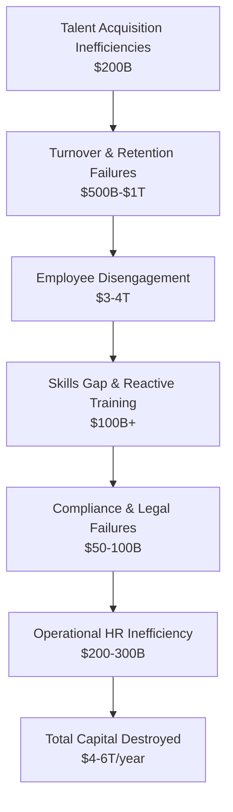

# HR Industry Gaps & Capital Destruction

The HR system does not just "waste money" -- it actively erodes organizational value and market competitiveness. This document analyzes the systemic gaps and quantifies the capital destruction they cause.

---

## 1. Talent Acquisition Inefficiencies

**Gap:**
- Traditional recruitment focuses heavily on resumes, credentials, and interviews rather than predictive performance metrics
- Hiring processes are slow, costly, and biased, leading to frequent mismatches

**Impact on Capital:**
- High turnover costs: Training + recruitment + lost productivity
- Mis-hires can cost 30-50% of a first-year salary per employee
- Companies spend billions annually on suboptimal talent matching

---

## 2. Lack of Workforce Analytics

**Gap:**
- HR often operates without real-time data on productivity, engagement, and skills gaps
- Decisions rely on intuition rather than predictive insights

**Impact on Capital:**
- Poor resource allocation: Teams overstaffed in low-impact areas and understaffed in high-impact roles
- Missed revenue opportunities due to untapped employee potential
- Reactive rather than proactive workforce management increases operational risk

---

## 3. Employee Engagement & Retention Failures

**Gap:**
- Engagement programs are generic, not personalized to employee motivations
- Career development paths are unclear or misaligned with business objectives

**Impact on Capital:**
- Talent flight: Knowledge and expertise leave, along with the associated replacement costs
- Productivity drops, morale declines, and projects get delayed
- Hidden costs: Disengaged employees can reduce organizational efficiency by 20-30%

---

## 4. HR Technology Fragmentation

**Gap:**
- Multiple disconnected HR systems (payroll, performance, learning) lead to inefficiencies
- Lack of automation and integration wastes HR bandwidth

**Impact on Capital:**
- Operational inefficiency: HR teams spend 40-60% of their time on administrative work rather than strategic initiatives
- Increased errors in payroll, compliance, and reporting, leading to fines or employee dissatisfaction

---

## 5. Skill Obsolescence & Future-Readiness Gap

**Gap:**
- Organizations fail to anticipate technological and market shifts
- Continuous upskilling programs are inadequate or poorly targeted

**Impact on Capital:**
- Skills gaps cause missed market opportunities and innovation delays
- Retraining costs are high when gaps are addressed reactively
- Loss of competitive advantage reduces long-term enterprise valuation

---

## 6. Bias & Diversity Failures

**Gap:**
- Recruitment, promotion, and compensation systems often harbor unconscious biases
- HR lacks effective mechanisms to measure and correct systemic inequality

**Impact on Capital:**
- Reduced access to top talent from diverse pools
- Potential legal liabilities and reputational damage
- Homogeneous teams lead to lower innovation and decision-making quality

---

## 7. Compliance & Risk Management Gaps

**Gap:**
- HR struggles to keep up with constantly evolving labor laws, data privacy regulations, and workplace safety standards

**Impact on Capital:**
- Legal penalties, fines, and settlements drain financial resources
- Non-compliance damages brand value and reduces investor confidence

---

## 8. Strategic Disconnect

**Gap:**
- HR is often treated as an administrative function, not a strategic driver
- Misalignment between workforce strategy and business goals persists

**Impact on Capital:**
- Underutilized human capital reduces ROI on hiring and training
- Growth initiatives stall due to lack of skilled resources aligned to business priorities

---

## Capital Destruction Quantification

### Detailed Breakdown

#### Mis-hires / Talent Acquisition Inefficiencies

- Average cost of a bad hire: ~30-50% of first-year salary
- Assume a company hires 100 employees/year, avg salary $50,000, with 10-20 bad hires/year
- Capital destroyed per company: ~$200,000/year
- **Global scale (10M medium-large companies): ~$200B annually**

#### Turnover & Retention Failures

- Voluntary turnover cost: 1.5-2x annual salary per employee
- Average turnover rate: 15% per year
- For a company with 1,000 employees, avg salary $50K: $11.25M/year
- **Global cost across industries: $500B-$1T annually**

#### Productivity Loss Due to Disengagement

- Gallup reports ~20% drop in productivity for disengaged employees
- Assume 70% of workforce is engaged, 30% disengaged
- For a $1B revenue company: $60M/year lost
- **Globally: $3-4T annually lost due to disengagement**

#### Training & Skill Gaps

- Cost of reactive reskilling per employee: $3,000-$5,000/year
- **Multiply by millions of employees in large organizations: $100B+ annually wasted**

#### Compliance Failures / Legal Penalties

- Average penalties per compliance incident: $50K-$5M depending on region & law
- **For large companies globally: $50-100B annually**

#### HR Operational Inefficiency

- 40-60% of HR time spent on admin instead of strategic value
- For a $10M HR department: $4-6M/year lost in opportunity cost
- **Global HR operational inefficiency: $200-300B annually**

### Total Estimated Capital Destruction

| Source | Estimated Annual Loss |
|--------|----------------------|
| Mis-hires | $200B |
| Turnover | $500B-$1T |
| Disengagement | $3-4T |
| Training & Skill gaps | $100B+ |
| Compliance failures | $50-100B |
| HR operational inefficiency | $200-300B |
| **Total** | **$4-6T annually** |

---

## Capital Destruction Funnel

The HR Capital Destruction Funnel shows how each gap sequentially drains value:

### Layer Details

| Layer | Loss | Color Code | Description |
|-------|------|------------|-------------|
| Mis-hires | $200B | Light Red | Misaligned hires leading to training, recruitment, productivity loss |
| Turnover | $500B-$1T | Red | Voluntary exits causing lost knowledge, rehiring, project delays |
| Disengagement | $3-4T | Dark Red | Reduced productivity, innovation, team efficiency (largest loss) |
| Skills gap | $100B+ | Orange | Missed opportunities, slow adoption of tech/market trends |
| Compliance | $50-100B | Yellow | Penalties, litigation, reputational damage |
| HR inefficiency | $200-300B | Light Orange | Admin-heavy processes preventing strategic workforce planning |

---

## Recovery Potential

Engagement, predictive hiring, automation, and continuous upskilling could recover **50-70%** of this lost capital.

### Key Recovery Levers

| Lever | Impact Area | Recovery Potential |
|-------|------------|-------------------|
| Predictive hiring | Mis-hires | Reduce bad hires by 60-70% |
| Engagement systems | Disengagement | Recover 30-40% of productivity loss |
| HR automation | Operational inefficiency | Free 40-50% of HR time for strategy |
| Continuous upskilling | Skills gap | Prevent 50-60% of reactive reskilling costs |
| Compliance automation | Compliance failures | Reduce incidents by 40-50% |
| Retention analytics | Turnover | Reduce voluntary turnover by 20-30% |

---

## Strategic Implications

### For UniVenture

The systemic HR gaps represent a massive market opportunity. The approach is not to sell "HR software" but to sell **capital recovery infrastructure**:

1. **Talent acquisition** becomes predictive performance matching
2. **Engagement** becomes cognitive capital optimization
3. **Training** becomes production-integrated skill deployment
4. **Compliance** becomes automated governance
5. **HR operations** becomes AI-native workforce infrastructure

### The Axle to Rip Off

The load-bearing weakness in the HR industry is the assumption that HR is an administrative function. Reframe it as **capital infrastructure** and the entire legacy model collapses.

### Market Entry

The strongest wedges align with the Corporate Wedge Generator framework:

| Wedge | Complaint | Metric | Target |
|-------|-----------|--------|--------|
| Hiring efficiency | "We keep hiring the wrong people" | Mis-hire rate | -50% |
| Retention | "Our best people keep leaving" | Voluntary turnover | -25% |
| Productivity | "Training does not translate to output" | Output per employee | +15% |
| Compliance | "We keep getting fined" | Compliance incidents | -40% |

Each is executable in 90 days with measurable ROI and defined kill conditions.
