# Products, Revenue & Markets

The AINEFF Ecosystem generates revenue through **25+ distinct streams**, organized by phase activation timing, capital requirements, and confidence scores. Revenue flows through a deliberate waterfall architecture — each stream unlocks subsequent streams, creating compounding returns as the ecosystem matures.

## Revenue Architecture Overview

The revenue architecture is designed around three core principles:

1. **Phase-Gated Activation** — Revenue streams activate only when prerequisite infrastructure, market validation, and operational capacity are in place.
2. **Confidence-Scored Prioritization** — Each stream carries a confidence score (0-100) reflecting market validation, team readiness, and execution certainty.
3. **Strategic Leverage Compounding** — Early streams generate data, relationships, and proof points that reduce the cost-of-sale for later, higher-value streams.

## Revenue Stream Summary by Phase

| Phase | Timeline | Revenue Streams | Target Revenue | Confidence |
|-------|----------|----------------|----------------|------------|
| **Phase 0 — Foundation** | Months 1-3 | DocuFlow SaaS, Chokepoint Diagnostic, Governance Gap Analyzer | $50K-$100K | 85-95% |
| **Phase 1 — Validation** | Months 3-6 | Billing Leakage Scanner, Operator Training (Track 1-2), Insurance Claims Sprint | $100K-$250K | 75-90% |
| **Phase 2 — Expansion** | Months 6-12 | Operator Track (3-5), Enterprise Wedge, Governance License, Retainers | $250K-$750K | 65-80% |
| **Phase 3 — Scale** | Months 12-24 | ORF Protocol Licensing, IP Licensing, Platform Fees, Data Products | $750K-$2M | 50-70% |
| **Phase 4 — Dominance** | Months 24-48 | Enterprise SaaS, White-Label Licensing, Franchise Models, JV Revenue | $2M-$10M | 35-55% |

## Revenue Waterfall Diagram

```mermaid
graph TD
    A["Phase 0: Foundation<br/>$50K-$100K"] --> B["Phase 1: Validation<br/>$100K-$250K"]
    B --> C["Phase 2: Expansion<br/>$250K-$750K"]
    C --> D["Phase 3: Scale<br/>$750K-$2M"]
    D --> E["Phase 4: Dominance<br/>$2M-$10M"]

    A1["DocuFlow SaaS<br/>$19-$49/mo"] --> A
    A2["Chokepoint Diagnostic<br/>$5K-$15K"] --> A
    A3["Governance Gap Analyzer<br/>Free → Upsell"] --> A

    B1["Billing Leakage Scanner<br/>$25K"] --> B
    B2["Operator Training<br/>$500-$1,500"] --> B
    B3["Insurance Claims Sprint<br/>$7.5K-$12K"] --> B

    C1["Enterprise Wedge<br/>$8K-$15K"] --> C
    C2["Governance License<br/>$200K"] --> C
    C3["Monthly Retainers<br/>$2K-$5K/mo"] --> C

    D1["ORF Protocol<br/>$500K"] --> D
    D2["IP Licensing<br/>Variable"] --> D
    D3["Platform Fees<br/>% of GMV"] --> D

    E1["Enterprise SaaS<br/>$50K-$500K ARR"] --> E
    E2["Franchise Models<br/>$100K+"] --> E
    E3["White-Label<br/>$250K+"] --> E

    style A fill:#2d5a3d,stroke:#4ade80
    style B fill:#2d4a5a,stroke:#60a5fa
    style C fill:#4a3d5a,stroke:#a78bfa
    style D fill:#5a4a2d,stroke:#fbbf24
    style E fill:#5a2d2d,stroke:#f87171
```

## Revenue Stream Classification

Revenue streams are classified across four dimensions:

| Dimension | Categories | Description |
|-----------|-----------|-------------|
| **Recurrence** | One-time, Recurring, Usage-based | How often the buyer pays |
| **Delivery Model** | Product, Service, License, Platform | How value is delivered |
| **Capital Intensity** | Low ($0-$5K), Medium ($5K-$25K), High ($25K+) | Upfront investment to activate |
| **Margin Profile** | Ultra-High (&gt;80%), High (60-80%), Medium (40-60%), Low (&lt;40%) | Gross margin after direct costs |

## Client Lifetime Value Model

The revenue architecture is designed to maximize Client Lifetime Value (CLV) through a deliberate upsell ladder:

| Stage | Offering | Price Point | Cumulative CLV |
|-------|---------|-------------|----------------|
| 1 | Governance Gap Analyzer (free) | $0 | $0 |
| 2 | Chokepoint Diagnostic | $5K-$15K | $5K-$15K |
| 3 | Implementation Sprint | $15K | $20K-$30K |
| 4 | Monthly Retainer | $2K-$5K/mo | $44K-$90K (12mo) |
| 5 | Governance License | $8K-$20K | $52K-$110K |
| 6 | PIAR Engagement | $25K-$75K | $77K-$185K |
| 7 | Enterprise Deployment | $100K-$500K | $177K-$685K |
| **Total 18-Month CLV** | | | **$200K+ per client** |

## Key Metrics

| Metric | Target | Phase |
|--------|--------|-------|
| Monthly Recurring Revenue (MRR) | $25K by Month 6 | Phase 1 |
| Annual Contract Value (ACV) | $50K average by Month 12 | Phase 2 |
| Gross Margin | &gt;52% blended | All Phases |
| Customer Acquisition Cost (CAC) | &lt;$2,500 | Phase 0-1 |
| CAC Payback Period | &lt;4 months | Phase 0-1 |
| Net Revenue Retention | &gt;120% | Phase 2+ |
| Logo Churn | &lt;10% annually | Phase 2+ |

## Navigation

- **[Revenue Streams](./revenue-streams.md)** — Complete catalog of 25+ revenue streams with pricing, margins, and confidence scores
- **[6 Market Wedges](./market-wedges.md)** — Target verticals and market entry strategies
- **[Insurance Vertical Deep Dive](./insurance-vertical.md)** — Primary market wedge analysis
- **[Pricing Architecture](./pricing-architecture.md)** — Cross-product pricing strategy and upsell mechanics
- **[Unit Economics](./unit-economics.md)** — Venture Cell economics and financial modeling
- **[Enterprise Wedge Strategy](./enterprise-wedge.md)** — 90-day corporate proof engine
- **[Monetization Boundaries](./monetization-boundaries.md)** — Constitutional monetization rules and enforcement

### Product Offerings

- **[DocuFlow Agent](./offerings/docuflow.md)** — Compliance & documentation automation micro-SaaS
- **[Billing Leakage Scanner](./offerings/billing-leakage.md)** — Invoice analysis and undercharge detection
- **[Governance Gap Analyzer](./offerings/governance-gap.md)** — 5-question governance maturity assessment
- **[Chokepoint Intelligence Map](./offerings/chokepoint-intelligence.md)** — Workflow visualization and bottleneck costing
- **[Pre-Incident Accountability Review (PIAR)](./offerings/piar.md)** — Mandatory governance entry point
- **[Operator Training & Certification](./offerings/operator-track.md)** — Track 1-5 bootcamp and certification paths
- **[Insurance Claims Automation](./offerings/insurance-claims.md)** — AI claims automation sprint
- **[IP Licensing](./offerings/ip-licensing.md)** — 6-category intellectual property licensing framework
