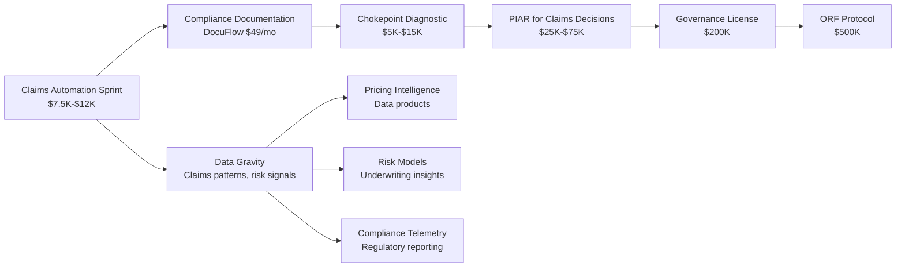

# Insurance Vertical Deep Dive

Insurance is the **primary market wedge** for the AINEFF Ecosystem. The vertical combines high operational waste, regulatory complexity, measurable ROI, and strategic data gravity — making it the ideal proving ground for governance-backed AI automation.

## Why Insurance First

| Selection Criterion | Score (1-10) | Rationale |
|-------------------|-------------|-----------|
| **Operational Waste** | 9 | Claims processing averages 15-20 manual touchpoints per claim |
| **Measurable ROI** | 10 | Time savings directly translatable to dollar savings per claim |
| **Regulatory Demand** | 9 | State DOI, NAIC, federal compliance creates governance hunger |
| **Buyer Accessibility** | 8 | Claims Managers and VP Ops have budget authority and felt pain |
| **Data Gravity Potential** | 9 | Claims data compounds into pricing intelligence, risk models |
| **Competitive Gap** | 8 | Incumbents focus on underwriting, not claims operations governance |
| **Expansion Surface** | 9 | Claims → compliance → underwriting → full platform |
| **Total Weighted Score** | **8.9/10** | Highest-scoring vertical across all dimensions |

## Primary Market Wedge Selection

### Target Segment

| Attribute | Detail |
|-----------|--------|
| **Segment** | Mid-market insurance brokers and MGAs (Managing General Agents) |
| **Company Size** | 50-500 employees, $10M-$250M premium volume |
| **Geography** | US-focused (initially), state-regulated markets |
| **Lines of Business** | Property & Casualty, Workers Comp, General Liability, Professional Liability |

### Why Brokers and MGAs (Not Carriers)

| Factor | Carriers | Brokers/MGAs |
|--------|---------|-------------|
| **Decision Speed** | 6-18 months | 2-8 weeks |
| **Budget Authority** | Distributed/committee | Concentrated (1-2 decision makers) |
| **Technology Flexibility** | Legacy lock-in | Greenfield / best-of-breed |
| **Pain Acuteness** | Buffered by scale | Directly felt by operators |
| **Champion Access** | Layers of procurement | Direct to Claims Manager |
| **Proof-of-Value Timeline** | Quarters | Weeks |

## Claims Processing Automation — Entry Product

### Current State (Industry Average)

| Metric | Value |
|--------|-------|
| Claims processed per adjuster per day | 8-12 |
| Average touchpoints per claim | 15-20 |
| Manual data entry per claim | 25-40 minutes |
| Average claims cycle time | 14-30 days |
| Denial/reopening rate | 12-18% |
| Cost per claim (fully loaded) | $150-$350 |

### Target State (With AI Claims Automation)

| Metric | Current | Target | Improvement |
|--------|---------|--------|-------------|
| Claims per adjuster per day | 8-12 | 18-25 | 100-150% increase |
| Touchpoints per claim | 15-20 | 5-8 | 60% reduction |
| Manual data entry per claim | 25-40 min | 5-10 min | 75% reduction |
| Claims cycle time | 14-30 days | 5-12 days | 60% reduction |
| Denial/reopening rate | 12-18% | 5-8% | 55% reduction |
| Cost per claim | $150-$350 | $60-$120 | 60% reduction |

## Target Buyer Profile

| Attribute | Detail |
|-----------|--------|
| **Title** | Operations Manager / Claims Manager at insurance broker or MGA |
| **Reports To** | VP of Operations or COO |
| **Budget Authority** | $10K-$50K discretionary; $50K-$250K with VP approval |
| **Key Metrics** | Claims turnaround time, cost per claim, adjuster productivity, compliance audit outcomes |
| **Daily Pain** | Drowning in manual claim intake, data entry, document chasing, compliance documentation |
| **Technology Comfort** | Moderate — uses agency management systems (AMS), willing to adopt point solutions |
| **Decision Timeline** | 2-4 weeks for sub-$15K engagements |
| **Champion Motivation** | Looks like an innovator, reduces their team's pain, measurable career-boosting results |

## Sprint Model: 60-90 Day AI Claims Automation Sprint

### Sprint Structure

| Phase | Duration | Activities | Deliverables |
|-------|----------|-----------|-------------|
| **Discovery** | Week 1-2 | Claims workflow mapping, data audit, stakeholder interviews | Chokepoint map, data readiness assessment |
| **Configuration** | Week 3-4 | AI model configuration, integration setup, test data processing | Configured automation pipeline, integration plan |
| **Pilot** | Week 5-8 | Live claims processing (subset), adjuster training, feedback loops | Pilot results report, ROI validation |
| **Optimization** | Week 9-12 | Model tuning, workflow refinement, scale preparation | Optimized system, expansion recommendation |
| **Handoff** | Week 12-13 | Documentation, training, support transition | Operational playbook, 30-day support window |

### Sprint Pricing

| Tier | Price | Inclusions | Target Client |
|------|-------|-----------|---------------|
| **Founding Client** | $7,500 | Full 90-day sprint, priority support, case study participation | First 5 clients (limited) |
| **Standard** | $12,000 | Full 90-day sprint, standard support | General market |
| **Premium** | $18,000 | 90-day sprint + 3-month retainer + governance setup | Clients wanting ongoing relationship |

### Founding Client Terms

- **Price**: $7,500 (37.5% discount from standard)
- **Commitment**: Participate in 1 case study, provide testimonial if satisfied
- **Availability**: First 5 clients only — creates urgency and exclusivity
- **Guarantee**: If no measurable improvement after 60 days, remaining sprint is free
- **Expansion Right**: Lock in $12,000 rate for second sprint (vs. standard escalation)

## ROI Model

### Base Case Calculation

| Variable | Value | Source |
|----------|-------|--------|
| Claims processed per month | 300 | Mid-market broker average |
| Hours saved per claim | 2 hours | Conservative estimate (25-40 min data entry + 60-90 min processing) |
| Total hours saved per month | 600 hours | 300 claims x 2 hours |
| Loaded hourly cost | $25/hour | Claims adjuster fully-loaded cost (salary + benefits + overhead) |
| **Monthly savings** | **$15,000** | 600 hours x $25/hour |
| **Annual savings** | **$180,000** | $15,000 x 12 months |

### Conservative Realization Scenarios

| Scenario | Realization Rate | Monthly Savings | Annual Savings | Sprint ROI (vs. $7,500) | Sprint ROI (vs. $12,000) |
|----------|-----------------|----------------|---------------|----------------------|------------------------|
| **Pessimistic** | 20% | $3,000 | $36,000 | 380% | 200% |
| **Conservative** | 30% | $4,500 | $54,000 | 620% | 350% |
| **Expected** | 50% | $7,500 | $90,000 | 1,100% | 650% |
| **Optimistic** | 70% | $10,500 | $126,000 | 1,580% | 950% |

**Even at 30% realization, monthly savings ($4,500) exceed the founding client sprint cost ($7,500) within two months.**

### Payback Period

| Scenario | Founding Client ($7,500) | Standard ($12,000) |
|----------|------------------------|-------------------|
| 20% realization | 2.5 months | 4.0 months |
| 30% realization | 1.7 months | 2.7 months |
| 50% realization | 1.0 months | 1.6 months |
| 70% realization | 0.7 months | 1.1 months |

## Insurance Fintech Landscape (2026)

### Market Trends

| Trend | Impact on AINEFF | Strategic Response |
|-------|-----------------|-------------------|
| **AI-Native Underwriting** | Raises bar for automation expectations | Position as claims-side complement |
| **Embedded Insurance** | New distribution channels, more claims volume | Claims automation scales with volume |
| **Regulatory Technology** | Growing demand for compliance automation | Governance License becomes essential |
| **Climate Risk** | Increasing claims complexity and volume | AI processing handles surge capacity |
| **Cyber Insurance Growth** | New lines of business, new claims types | Specialized claims automation modules |

### Key Companies in Insurance Innovation

| Company | Focus | Valuation/Stage | AINEFF Positioning |
|---------|-------|----------------|-------------------|
| **At-Bay** | Cyber insurance, AI underwriting | $3.5B+ | Complement — they underwrite, we govern claims |
| **Coalition** | Cyber insurance platform | $5B+ | Complement — their policyholders need claims automation |
| **Lemonade** | AI-native P&C insurance | Public ($1.5B) | Study — their claims AI is consumer-focused, not broker ops |
| **Root** | Telematics auto insurance | Public ($900M) | Study — data-driven approach applicable to claims governance |
| **Hippo** | Homeowners insurance | Public ($600M) | Complement — smart home data increases claims complexity |
| **Newfront** | Commercial insurance brokerage | $2.2B | Direct prospect — broker with tech DNA, ideal champion |
| **CoverGenius** | Embedded insurance | $2B+ | Partnership — their distribution creates claims volume |

### Competitive Differentiation

| Dimension | Traditional Claims Software | AI Claims Startups | AINEFF Claims Automation |
|-----------|---------------------------|-------------------|------------------------|
| **Core Value** | Workflow management | Speed/efficiency | Governance + efficiency |
| **Accountability** | None — just processes | None — black box AI | Full PIAR + audit trail |
| **Compliance** | Manual / bolt-on | Minimal | Built-in governance layer |
| **Pricing** | $50K-$500K annual license | $20K-$100K annual | $7,500-$18K sprint entry |
| **Time to Value** | 6-18 months | 3-6 months | 60-90 days |
| **Lock-in Mechanism** | Data migration cost | Proprietary models | Governance dependency |

## Compliance Governance as Differentiator

The insurance industry faces an escalating compliance burden that creates natural demand for governance infrastructure:

| Compliance Domain | Requirement | AINEFF Solution |
|-------------------|-------------|----------------|
| **State DOI Reporting** | Quarterly/annual filings, market conduct exams | DocuFlow + Governance License |
| **NAIC Model Laws** | Unfair claims practices, data security | PIAR + Claims Automation |
| **HIPAA (Health Claims)** | Patient data protection in health insurance claims | Governance License |
| **Anti-Fraud** | SIU documentation, fraud indicator tracking | Chokepoint Intelligence + AI detection |
| **E&O Liability** | Professional liability documentation | PIAR (pre-incident accountability) |
| **Fiduciary Duty** | Best interest documentation (where applicable) | PIAR + DocuFlow |

### The Governance Wedge

## Strategic Positioning for Data Gravity

### Data Accumulation Model

Every claims automation engagement generates proprietary data that compounds in value:

| Data Type | Source | Strategic Value | Monetization Path |
|-----------|--------|----------------|-------------------|
| **Claims Processing Patterns** | Sprint engagements | Benchmark database | Data products ($5K-$100K/yr) |
| **Denial Root Causes** | Claims analysis | Prevention intelligence | Premium feature (DocuFlow) |
| **Cycle Time Benchmarks** | Operational metrics | Industry standards | Reports, consulting |
| **Compliance Gaps** | Governance assessments | Risk scoring models | Insurance pricing inputs |
| **Workflow Bottlenecks** | Chokepoint diagnostics | Best practice library | Consulting, training |

### Data Gravity Flywheel

| Stage | Data Input | Value Created | Strategic Effect |
|-------|-----------|--------------|-----------------|
| **Sprint 1-5** | 1,500+ claims processed | Initial benchmarks | Case studies drive next sales |
| **Sprint 6-20** | 10,000+ claims processed | Statistical significance | Predictive models emerge |
| **Sprint 21-50** | 50,000+ claims processed | Industry benchmarks | Thought leadership positioning |
| **Sprint 50+** | 250,000+ claims processed | Pricing intelligence | Data products, underwriting insights |

### 18-Month Insurance Revenue Projection

| Month | Activity | Revenue | Cumulative |
|-------|---------|---------|------------|
| 1-3 | 3 founding clients ($7,500 each) | $22,500 | $22,500 |
| 4-6 | 4 standard clients ($12,000 each) + 2 retainers ($3K/mo) | $66,000 | $88,500 |
| 7-9 | 5 clients + 5 retainers + 1 Diagnostic ($10K) | $115,000 | $203,500 |
| 10-12 | 6 clients + 8 retainers + 2 Diagnostics + 1 PIAR ($35K) | $182,000 | $385,500 |
| 13-15 | 7 clients + 10 retainers + 1 Governance License ($200K) | $334,000 | $719,500 |
| 16-18 | Scale operations + expand product suite | $350,000+ | $1,069,500+ |

**Target: $1M+ cumulative revenue from insurance vertical within 18 months.**
