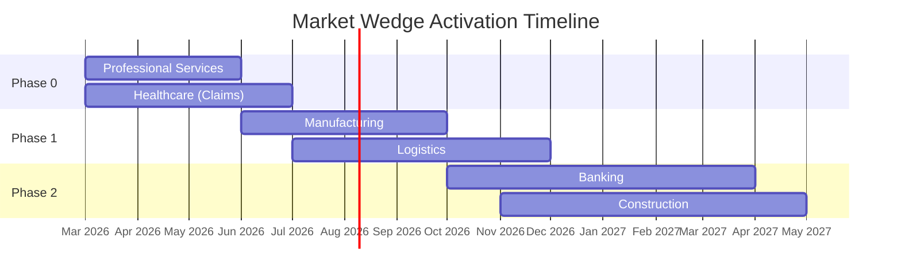

---

sidebar_position: 3
title: "6 Market Wedges"
description: "Detailed analysis of 6 target verticals — Manufacturing, Logistics, Professional Services, Banking, Construction, and Healthcare — with market sizing, entry products, and expansion paths."
tags: [product, financial, strategic]
custom_status: active
custom_owner: Andrew Leo
custom_last_review: 2026-03-01
custom_next_review: 2026-06-01
---

# 6 Market Wedges

The AINEFF Ecosystem targets **six primary verticals** selected for their combination of high operational complexity, regulatory burden, measurable waste, and willingness to pay for governance-backed automation. Each wedge follows the same playbook: enter with a narrow, quantifiable pain point; expand through operational dependency; lock in through governance infrastructure.

## Wedge Selection Criteria

Every target vertical was evaluated against five criteria:

| Criterion | Weight | Description |
|-----------|--------|-------------|
| **Operational Complexity** | 25% | Number of handoffs, approvals, and decision points in core workflows |
| **Regulatory Burden** | 25% | Compliance requirements creating demand for governance tooling |
| **Measurable Waste** | 20% | Quantifiable cost of inefficiency (hours, dollars, error rates) |
| **Willingness to Pay** | 20% | Budget availability and purchasing authority accessibility |
| **Data Gravity Potential** | 10% | Ability to accumulate proprietary data through service delivery |

---

## Wedge 1: Manufacturing

### Market Overview

| Attribute | Detail |
|-----------|--------|
| **Market Size** | $13.4T global manufacturing output; $2.1B governance/compliance software TAM |
| **Pain Point** | Quality control failures, regulatory non-compliance fines, factory floor coordination breakdowns |
| **Entry Product** | Chokepoint Diagnostic ($5K-$15K) — map production line bottlenecks and approval delays |
| **Buyer Persona** | VP of Operations / Plant Manager — measured on throughput, defect rates, compliance audit results |
| **Sales Cycle** | 3-6 weeks (diagnostic), 2-4 months (implementation) |
| **Expansion Path** | Diagnostic → Billing Leakage Scanner (vendor invoice analysis) → Governance License (ISO/regulatory) → ORF Protocol (factory orchestration) |

### Key Opportunities

- **Quality Control Automation** — AI-driven defect detection reducing manual inspection labor by 40-60%
- **Regulatory Compliance** — Automated documentation for ISO 9001, ISO 14001, OSHA reporting
- **Factory Orchestration** — Multi-shift coordination with approval chain optimization
- **Vendor Governance** — Supply chain compliance verification and audit trail generation

### Competitive Landscape

| Competitor Type | Examples | AINEFF Differentiator |
|----------------|---------|----------------------|
| MES Vendors | Siemens Opcenter, Rockwell Plex | Governance-first vs. production-first |
| Quality Software | InfinityQS, Minitab | Chokepoint economics vs. statistical tooling |
| ERP Modules | SAP QM, Oracle Quality | Lightweight entry vs. multi-year implementation |

---

## Wedge 2: Logistics

### Market Overview

| Attribute | Detail |
|-----------|--------|
| **Market Size** | $9.7T global logistics; $1.8B supply chain optimization software TAM |
| **Pain Point** | Supply chain opacity, procurement authorization delays, carrier compliance gaps |
| **Entry Product** | Chokepoint Diagnostic ($5K-$15K) — map procurement-to-delivery approval chains |
| **Buyer Persona** | VP Supply Chain / Head of Procurement — measured on cost-per-shipment, on-time delivery, compliance |
| **Sales Cycle** | 2-4 weeks (diagnostic), 3-6 months (platform) |
| **Expansion Path** | Diagnostic → Billing Leakage (freight audit) → PIAR (carrier risk) → Governance License (regulatory) → Enterprise SaaS |

### Key Opportunities

- **Supply Chain Optimization** — Approval chain compression reducing procurement cycle time by 30-50%
- **Procurement Authorization** — Automated multi-level spend approval with governance audit trails
- **Freight Billing Leakage** — Industry average 3-5% overbilling on freight invoices ($2.1M+ annual recovery potential)
- **Carrier Compliance** — Insurance verification, safety rating monitoring, regulatory document management

### Competitive Landscape

| Competitor Type | Examples | AINEFF Differentiator |
|----------------|---------|----------------------|
| TMS Providers | Oracle TMS, MercuryGate | Governance layer vs. routing engine |
| Freight Audit | CTSI-Global, Cass Information | Chokepoint context vs. line-item audit |
| Procurement | Coupa, Jaggaer | Accountability mapping vs. spend management |

---

## Wedge 3: Professional Services

### Market Overview

| Attribute | Detail |
|-----------|--------|
| **Market Size** | $6.2T global professional services; $890M compliance/governance software TAM |
| **Pain Point** | Documentation overhead consuming 20-40% of billable hours, compliance liability, knowledge loss |
| **Entry Product** | DocuFlow ($19-$49/mo) — automated compliance documentation for client deliverables |
| **Buyer Persona** | Managing Partner / Compliance Director — measured on utilization rate, compliance audit outcomes |
| **Sales Cycle** | Self-serve (DocuFlow), 2-4 weeks (diagnostic), 1-3 months (governance) |
| **Expansion Path** | DocuFlow → Chokepoint Diagnostic → Governance License → PIAR → Operator Training (staff) |

### Key Opportunities

- **Compliance Documentation** — Automated regulatory filing, audit preparation, client reporting
- **Knowledge Governance** — Institutional knowledge capture, SOPs, decision documentation
- **Partner Accountability** — PIAR-based decision review for high-stakes client engagements
- **Certification Programs** — Operator certification for governance-trained consultants

### Sub-Verticals

| Sub-Vertical | Entry Product | Avg Deal Size | Key Pain |
|-------------|--------------|---------------|----------|
| Legal | DocuFlow Pro | $49/mo → $15K implementation | Document automation, compliance filing |
| Accounting | DocuFlow Pro | $49/mo → $12K implementation | Audit prep, regulatory documentation |
| Management Consulting | Chokepoint Diagnostic | $10K → $25K retainer | Client deliverable quality, IP capture |
| Real Estate | DocuFlow Basic | $19/mo → $8K implementation | Transaction documentation, compliance |
| Coaching/Training | DocuFlow Basic | $19/mo → $5K | Program documentation, certification |

---

## Wedge 4: Banking

### Market Overview

| Attribute | Detail |
|-----------|--------|
| **Market Size** | $6.5T global banking revenue; $3.2B regulatory technology (RegTech) TAM |
| **Pain Point** | Cash flow management opacity, regulatory compliance cost ($10B+ industry-wide), operational risk exposure |
| **Entry Product** | Billing Leakage Scanner ($25K) — fee schedule audit and revenue recovery |
| **Buyer Persona** | Chief Risk Officer / VP Compliance — measured on regulatory exam outcomes, operational loss ratio |
| **Sales Cycle** | 4-8 weeks (scanner), 3-6 months (governance), 6-12 months (enterprise) |
| **Expansion Path** | Billing Leakage → Chokepoint Diagnostic → PIAR (loan decisions) → Governance License → ORF Protocol |

### Key Opportunities

- **Cash Flow Governance** — Real-time visibility into fund flows with accountability mapping
- **Regulatory Compliance** — Automated reporting for OCC, FDIC, CFPB, BSA/AML
- **Risk Management** — Pre-incident review for lending decisions, investment authorizations
- **Fee Recovery** — Systematic identification of uncollected fees, rate misapplication, and billing errors

### Regulatory Drivers

| Regulation | Impact | AINEFF Solution |
|-----------|--------|-----------------|
| Basel III/IV | Capital adequacy documentation | Governance License + PIAR |
| Dodd-Frank | Stress testing, risk reporting | ORF Protocol |
| BSA/AML | Transaction monitoring documentation | DocuFlow + Governance |
| SOX | Internal controls attestation | PIAR + Audit Trail |
| CFPB Requirements | Consumer complaint governance | Chokepoint Diagnostic |

---

## Wedge 5: Construction

### Market Overview

| Attribute | Detail |
|-----------|--------|
| **Market Size** | $12.7T global construction; $1.4B construction compliance/safety software TAM |
| **Pain Point** | Safety incident liability, regulatory compliance burden, project governance failures causing 30%+ cost overruns |
| **Entry Product** | Chokepoint Diagnostic ($5K-$15K) — map approval-to-execution delays in project workflows |
| **Buyer Persona** | VP of Operations / Safety Director / Project Controls Manager — measured on incident rate, project margin, compliance |
| **Sales Cycle** | 2-4 weeks (diagnostic), 2-4 months (implementation) |
| **Expansion Path** | Diagnostic → PIAR (safety decisions) → Governance License → Operator Training → Enterprise Deployment |

### Key Opportunities

- **Safety Compliance** — OSHA documentation automation, incident reporting, pre-incident accountability reviews
- **Project Governance** — Change order approval chains, subcontractor compliance, schedule authorization
- **Billing Leakage** — Subcontractor invoice audit, material cost verification, change order reconciliation
- **Insurance Optimization** — Safety governance documentation reducing insurance premiums

### Construction-Specific Value Metrics

| Metric | Industry Average | With AINEFF Governance | Improvement |
|--------|-----------------|----------------------|-------------|
| Project Cost Overrun | 30% | 12-18% | 40-60% reduction |
| Change Order Processing | 14 days | 3-5 days | 64-78% faster |
| Safety Incident Rate | 3.0 per 100 workers | 1.8 per 100 workers | 40% reduction |
| Compliance Audit Prep | 120 hours/quarter | 30 hours/quarter | 75% reduction |
| Subcontractor Invoice Errors | 5-8% | 1-2% | 75% reduction |

---

## Wedge 6: Healthcare

### Market Overview

| Attribute | Detail |
|-----------|--------|
| **Market Size** | $8.5T global healthcare; $4.1B healthcare compliance/governance software TAM |
| **Pain Point** | Claims processing inefficiency, compliance burden (HIPAA, CMS), patient data governance gaps |
| **Entry Product** | Insurance Claims Automation Sprint ($7,500-$12,000) — AI-driven claims processing optimization |
| **Buyer Persona** | VP of Revenue Cycle / Claims Director / Compliance Officer — measured on claims turnaround, denial rate, compliance |
| **Sales Cycle** | 2-4 weeks (sprint), 3-6 months (governance), 6-12 months (enterprise) |
| **Expansion Path** | Claims Sprint → Billing Leakage Scanner → PIAR (clinical decisions) → Governance License → ORF Protocol |

### Key Opportunities

- **Claims Automation** — AI-driven claims intake, adjudication support, and denial management
- **Compliance Governance** — HIPAA, CMS, state regulatory documentation and audit preparation
- **Patient Data Governance** — Consent management, data access audit trails, breach response protocols
- **Revenue Cycle Optimization** — Denial prevention, underpayment identification, A/R management

### Healthcare Compliance Framework

| Regulation | Documentation Burden | AINEFF Product | Annual Cost Savings |
|-----------|---------------------|----------------|-------------------|
| HIPAA | High — privacy, security, breach notification | Governance License | $150K-$500K |
| CMS Conditions of Participation | High — quality, safety, patient rights | PIAR + DocuFlow | $200K-$750K |
| State Licensure | Medium — facility, provider, program | DocuFlow Pro | $50K-$150K |
| Joint Commission | Very High — standards, accreditation | Governance License + PIAR | $300K-$1M |
| OSHA (Healthcare) | Medium — workplace safety, bloodborne pathogen | Chokepoint Diagnostic | $75K-$200K |

---

## Cross-Vertical Comparison

| Dimension | Manufacturing | Logistics | Prof. Services | Banking | Construction | Healthcare |
|-----------|--------------|-----------|---------------|---------|-------------|------------|
| **Market Size** | $13.4T | $9.7T | $6.2T | $6.5T | $12.7T | $8.5T |
| **Entry Product** | Chokepoint Dx | Chokepoint Dx | DocuFlow | Billing Scanner | Chokepoint Dx | Claims Sprint |
| **Entry Price** | $5K-$15K | $5K-$15K | $19-$49/mo | $25K | $5K-$15K | $7.5K-$12K |
| **Expansion ACV** | $50K-$200K | $50K-$200K | $25K-$100K | $100K-$500K | $50K-$200K | $75K-$250K |
| **Sales Cycle** | 3-6 weeks | 2-4 weeks | Self-serve/2wk | 4-8 weeks | 2-4 weeks | 2-4 weeks |
| **Regulatory Intensity** | High | Medium | Medium | Very High | High | Very High |
| **Data Gravity** | High | High | Medium | Very High | Medium | Very High |
| **Priority Rank** | 3 | 4 | 2 | 5 | 6 | 1 |
| **Phase Activation** | Phase 1 | Phase 1-2 | Phase 0 | Phase 2 | Phase 2 | Phase 0-1 |

## Market Entry Sequencing

