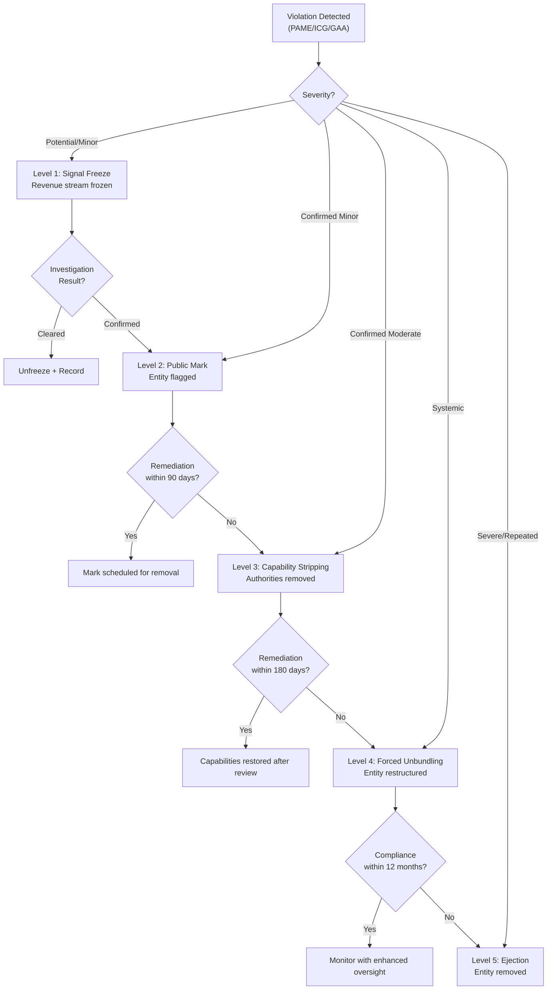

---

sidebar_position: 10
title: "Monetization Boundaries & Rules"
description: "Constitutional monetization rules — layer-by-layer monetization permissions, 8 illegal patterns, leakage detection systems, and enforcement response ladder."
tags: [product, financial, governance]
custom_status: active
custom_owner: Andrew Leo
custom_last_review: 2026-03-01
custom_next_review: 2026-06-01
---

# Monetization Boundaries & Rules

The AINEFF Ecosystem enforces **constitutional monetization boundaries** — structural rules that determine what can and cannot be monetized at each layer of the ecosystem. These boundaries exist to prevent the concentration of coordination authority and revenue generation in the same entity, which is the root cause of systemic corruption in traditional organizational architectures.

## Core Law

> **Money must never sit at the same layer as coordination authority.**

This is the foundational principle from which all monetization rules derive. Any entity that holds coordination authority (the power to set rules, approve actions, or govern behavior) must not directly generate revenue from the activities it coordinates. Violation of this principle is treated as a constitutional breach.

## Layer-by-Layer Monetization Rules

### AINEFF — Ecosystem Coordination Layer

| Activity | Allowed | Prohibited | Rationale |
|---------|---------|-----------|-----------|
| **Licensing the ORF Protocol** | Yes | — | IP licensing is value delivery, not coordination toll |
| **Conducting governance audits** | Yes | — | Quality assurance serves ecosystem health |
| **Collecting audit fees** | Yes | — | Fee-for-service, not coordination rent |
| **Charging revenue share on entity transactions** | — | Yes | Would make AINEFF a toll collector on activity it governs |
| **Collecting transaction tolls** | — | Yes | Coordination layer cannot tax passage |
| **Taking equity in entities it governs** | — | Yes | Creates conflict between governance and ownership |

**Summary**: Licensing and audits allowed. Revenue share and tolls banned.

### AINEF — Entity Formation Layer

| Activity | Allowed | Prohibited | Rationale |
|---------|---------|-----------|-----------|
| **Charging entity creation fees** | Yes | — | One-time service fee for formation assistance |
| **Selling entity templates** | Yes | — | IP licensing for structural designs |
| **Collecting template licensing fees** | Yes | — | Value delivery at point of creation |
| **Charging ongoing operational revenue from entities** | — | Yes | Formation layer cannot extract ongoing rent |
| **Taking revenue share from operating entities** | — | Yes | Would create misaligned incentive to form unnecessary entities |
| **Mandating paid services post-formation** | — | Yes | No lock-in to formation layer services |

**Summary**: Creation and template fees allowed. Ongoing operations revenue banned.

### AINE — Market Entity Layer

| Activity | Allowed | Prohibited | Rationale |
|---------|---------|-----------|-----------|
| **Full market operations** | Yes | — | Market entities exist to generate revenue |
| **Competitive pricing** | Yes | — | Market discipline drives efficiency |
| **Product development and sales** | Yes | — | Core purpose of market entities |
| **IP creation and licensing** | Yes | — | Value creation and distribution |
| **Using governance authority for market advantage** | — | Yes | Governance abuse — structural corruption |
| **Price-fixing with other AINE entities** | — | Yes | Anti-competitive, destroys market discipline |
| **Extracting rent from governed entities** | — | Yes (if holding governance role) | Same-layer governance-revenue coupling |

**Summary**: Full market freedom. Governance abuse banned.

### AINEOU — Operations Utility Layer

| Activity | Allowed | Prohibited | Rationale |
|---------|---------|-----------|-----------|
| **Internal resource allocation** | Yes | — | Core operational function |
| **Cost recovery from served entities** | Yes | — | Prevents freeloading on shared services |
| **Efficiency optimization** | Yes | — | Drives operational improvement |
| **Internal transfer pricing** | Yes | — | Standard inter-entity accounting |
| **External billing for operations services** | — | Yes | Utilities serve the ecosystem, not external markets |
| **Competing with AINE entities** | — | Yes | Would undercut market entities using shared infrastructure |
| **Charging premium above cost recovery** | — | Yes | Utilities are cost-center, not profit-center |

**Summary**: Internal allocation allowed. External billing banned.

### AINEG — Governance Subtypes

| AINEG Subtype | Allowed Monetization | Prohibited Monetization |
|--------------|---------------------|----------------------|
| **AINEG-Compliance** | Compliance audit fees, certification fees | Revenue share from compliant entities |
| **AINEG-Quality** | Quality assessment fees, improvement consulting | Mandatory paid remediation from own subsidiary |
| **AINEG-Risk** | Risk assessment fees, insurance facilitation | Direct insurance underwriting (conflict) |
| **AINEG-Standards** | Standards publication fees, training fees | Mandatory paid standards adoption |
| **AINEG-Dispute** | Arbitration fees, mediation fees | Contingency fees or outcome-based compensation |

## 8 Illegal Monetization Patterns (Kill List)

These patterns are categorically prohibited. Detection triggers immediate enforcement.

### Pattern 1: Coordination Toll

| Attribute | Detail |
|-----------|--------|
| **Definition** | Charging a fee for passage through a coordination checkpoint that the charging entity controls |
| **Example** | AINEFF charging 2% on every transaction between AINE entities it governs |
| **Why Illegal** | Converts governance authority into a revenue extraction mechanism |
| **Detection** | Any fee attached to a governance approval or coordination function |
| **Penalty** | Immediate fee removal + public mark + capability review |

### Pattern 2: Governance Rent

| Attribute | Detail |
|-----------|--------|
| **Definition** | Extracting ongoing payments from entities for the privilege of being governed |
| **Example** | AINEG-Compliance charging monthly "compliance membership" fees to entities it audits |
| **Why Illegal** | Governance is a structural function, not a subscription service |
| **Detection** | Recurring fees from governance entity to governed entity without corresponding service delivery |
| **Penalty** | Fee structure unwound + public mark + governance authority review |

### Pattern 3: Formation Lock-In

| Attribute | Detail |
|-----------|--------|
| **Definition** | Requiring newly formed entities to purchase ongoing services from the formation layer |
| **Example** | AINEF mandating that all formed entities use AINEF's operational software at $500/month |
| **Why Illegal** | Creates post-formation dependency that distorts entity independence |
| **Detection** | Mandatory service contracts attached to entity formation |
| **Penalty** | Contract voided + formation process review + public mark |

### Pattern 4: Data Ransom

| Attribute | Detail |
|-----------|--------|
| **Definition** | Withholding an entity's own operational data unless they pay for access |
| **Example** | AINEOU holding entity performance data behind a premium analytics paywall |
| **Why Illegal** | Entities own their data; withholding it for payment is extraction |
| **Detection** | Data access restrictions tied to payment status |
| **Penalty** | Immediate data release + capability stripping from data steward |

### Pattern 5: Standard Capture

| Attribute | Detail |
|-----------|--------|
| **Definition** | Setting a standard and then selling the only approved compliance pathway |
| **Example** | AINEG-Standards requiring a specific (self-owned) certification tool to meet its own standard |
| **Why Illegal** | Converts standard-setting authority into monopoly sales channel |
| **Detection** | Standard that can only be met through a paid product from the standard-setting entity |
| **Penalty** | Standard revision required + market opened to alternative compliance tools |

### Pattern 6: Audit Extortion

| Attribute | Detail |
|-----------|--------|
| **Definition** | Using audit findings to drive sales of remediation services from the auditing entity |
| **Example** | AINEG-Quality finding deficiencies and then requiring purchase of its own consulting to fix them |
| **Why Illegal** | Creates perverse incentive to find problems that generate revenue |
| **Detection** | Correlation between audit finding severity and remediation service sales |
| **Penalty** | Audit authority suspended + external audit of the auditor + public mark |

### Pattern 7: Utility Markup

| Attribute | Detail |
|-----------|--------|
| **Definition** | Charging above cost-recovery for shared infrastructure services |
| **Example** | AINEOU charging 150% of actual cloud computing costs as a "platform fee" |
| **Why Illegal** | Utilities exist to reduce cost, not generate profit |
| **Detection** | Service pricing comparison against actual cost + reasonable overhead |
| **Penalty** | Fee reduction to cost + refund of excess + financial audit |

### Pattern 8: Cross-Layer Revenue Stacking

| Attribute | Detail |
|-----------|--------|
| **Definition** | An entity operating at multiple layers simultaneously and stacking revenue from each |
| **Example** | A single entity that governs compliance (AINEG), sells compliance tools (AINE), and manages compliance infrastructure (AINEOU) |
| **Why Illegal** | Destroys separation of powers; creates self-serving revenue loops |
| **Detection** | Entity appearing in revenue records across 2+ ecosystem layers |
| **Penalty** | Forced unbundling into separate entities + governance review of all affected transactions |

## Kill List Summary

| # | Pattern | Core Violation | Detection Signal | Maximum Penalty |
|---|---------|---------------|-----------------|----------------|
| 1 | Coordination Toll | Governance = revenue | Fee on governance checkpoint | Capability stripping |
| 2 | Governance Rent | Governance = subscription | Recurring fee without service | Authority removal |
| 3 | Formation Lock-In | Formation = dependency | Mandatory post-formation contract | Contract void |
| 4 | Data Ransom | Data custody = payment gate | Data access tied to payment | Forced data release |
| 5 | Standard Capture | Standard = sales funnel | Single-source compliance | Standard revision |
| 6 | Audit Extortion | Audit = lead generation | Audit-to-sales correlation | Authority suspension |
| 7 | Utility Markup | Utility = profit center | Price vs. cost divergence | Fee refund |
| 8 | Cross-Layer Stacking | Layer separation = fiction | Multi-layer revenue records | Forced unbundling |

## Monetization Leakage Detection Systems

Three automated detection systems continuously monitor for monetization boundary violations:

### PAME — Protocol for Automated Monetization Enforcement

| Attribute | Detail |
|-----------|--------|
| **Function** | Real-time transaction monitoring across all ecosystem entities |
| **Detection Method** | Pattern matching against the 8 illegal patterns + anomaly detection |
| **Data Sources** | Entity financial records, inter-entity transaction logs, governance approval records |
| **Alert Threshold** | Any single-transaction match triggers review; pattern match triggers investigation |
| **Response Time** | Automated alert within 24 hours; human review within 72 hours |

### ICG — Inter-entity Cash-flow Governance

| Attribute | Detail |
|-----------|--------|
| **Function** | Monitors cash flow between ecosystem layers for boundary violations |
| **Detection Method** | Layer-tagged transaction analysis — flags any cash flow that crosses layer boundaries inappropriately |
| **Data Sources** | Banking records, payment processor data, inter-entity invoicing |
| **Alert Threshold** | Any upward cash flow (lower layer to higher layer without corresponding service) |
| **Response Time** | Weekly batch analysis; real-time alerts for large transactions (>$10K) |

### GAA/FAA — Governance Audit Authority / Financial Audit Authority

| Attribute | Detail |
|-----------|--------|
| **Function** | Scheduled and triggered audits of entity monetization practices |
| **Detection Method** | Comprehensive financial review + governance structure review |
| **Audit Frequency** | Annual (scheduled) + triggered (by PAME/ICG alerts or whistleblower) |
| **Scope** | All revenue streams, all inter-entity transactions, all governance decisions with financial implications |
| **Output** | Audit report with findings, severity ratings, and recommended enforcement actions |

## Enforcement Response Ladder

When a monetization boundary violation is detected, enforcement follows a **progressive response ladder**:

| Level | Response | Trigger | Action | Reversibility |
|-------|---------|---------|--------|--------------|
| **1** | **Signal Freeze** | First detection of potential violation | Freeze the specific revenue stream pending investigation | Fully reversible — unfreezes if cleared |
| **2** | **Public Mark** | Confirmed violation (minor) | Public notation on entity record visible to all ecosystem participants | Removable after 12 months of compliance |
| **3** | **Capability Stripping** | Confirmed violation (moderate) or repeated minor | Remove specific capabilities (e.g., audit authority, formation rights) | Restorable after remediation + review |
| **4** | **Forced Unbundling** | Cross-layer stacking or systemic violation | Mandatory separation of entity into layer-appropriate components | Permanent structural change |
| **5** | **Ejection** | Severe or repeated violations after escalation | Complete removal from ecosystem with data portability | Permanent — reapplication after 24 months |

### Response Ladder Flow

### Due Process Guarantees

| Right | Description |
|-------|-------------|
| **Notice** | Entity receives written notice of violation with evidence within 48 hours |
| **Response** | Entity has 14 days to respond with explanation or counter-evidence |
| **Hearing** | Entity may request a hearing before AINEG-Dispute |
| **Appeal** | Any enforcement action may be appealed within 30 days |
| **Representation** | Entity may designate a representative for all proceedings |
| **Data Access** | Entity retains access to all evidence used in enforcement decision |
| **Proportionality** | Enforcement must be proportional to violation severity |
