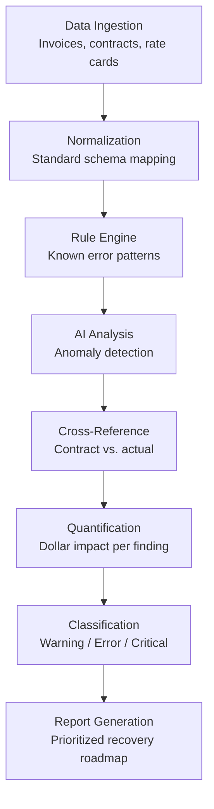

---

sidebar_position: 2
title: "Billing Leakage Scanner"
description: "Invoice analysis and undercharge detection tool — identifies $2.1M average annual loss through systematic billing error identification."
tags: [product, financial, aine, frankmax]
custom_status: active
custom_owner: Andrew Leo
custom_last_review: 2026-03-01
custom_next_review: 2026-06-01
---

# Billing Leakage Scanner

The Billing Leakage Scanner is a **revenue recovery tool** that systematically analyzes invoices, fee schedules, and billing records to identify undercharges, misapplied rates, unbilled services, and billing errors. The average mid-market company loses **$2.1M annually** to billing leakage — money that is earned but never collected.

## Product Overview

| Attribute | Detail |
|-----------|--------|
| **Category** | Revenue Recovery / Billing Intelligence |
| **Price Point** | $25,000 per engagement |
| **Target Market** | Mid-market companies ($10M-$500M revenue) with complex billing |
| **Core Value** | Identify and quantify billing leakage with actionable recovery plan |
| **Delivery Model** | 2-4 week engagement with final report and recovery roadmap |
| **Gross Margin** | 75% |
| **Phase Activation** | Phase 1 |
| **Confidence Score** | 82% |

## The $2.1M Problem

### Industry Billing Leakage Statistics

| Metric | Value | Source |
|--------|-------|--------|
| Average billing error rate | 3-5% of revenue | Industry benchmarks |
| Median revenue for target client | $50M-$75M | Mid-market focus |
| **Average annual leakage** | **$2.1M** | 3.5% of $60M median |
| Detection rate (manual audit) | 15-25% | Internal accounting teams |
| Detection rate (Billing Leakage Scanner) | 70-85% | AI-powered analysis |
| Typical recovery rate | 40-60% of identified leakage | Collection efforts post-identification |

### Leakage Categories

| Category | Description | Typical % of Total Leakage | Detection Difficulty |
|----------|------------|---------------------------|---------------------|
| **Rate Misapplication** | Wrong rate applied to service/product | 30% | Medium |
| **Unbilled Services** | Work performed but never invoiced | 25% | High |
| **Undercharges** | Correct line item, wrong amount | 20% | Low |
| **Contract Drift** | Pricing not updated after contract amendment | 12% | High |
| **Volume Discounts Misapplied** | Threshold discounts applied incorrectly | 8% | Medium |
| **Duplicate Credits** | Credits issued multiple times for same event | 5% | Low |

## How It Works

### Analysis Pipeline

### Detection Categories

| Severity | Definition | Action Required | Typical Count per Engagement |
|----------|-----------|----------------|----------------------------|
| **Critical** | &gt;$10K per incident, systemic pattern | Immediate billing system correction | 3-8 findings |
| **Error** | $1K-$10K per incident, recurring | Process update within 30 days | 15-30 findings |
| **Warning** | &lt;$1K per incident, sporadic | Monitor and batch-correct quarterly | 50-100+ findings |

## Interactive Demo: Invoice Line-Item Analysis

The following table demonstrates how the Billing Leakage Scanner analyzes individual invoice line items against contract terms:

### Sample Analysis Output

| Line # | Invoice Date | Description | Billed Amount | Contract Rate | Expected Amount | Variance | Severity | Finding |
|--------|-------------|-------------|--------------|--------------|----------------|----------|----------|---------|
| 1 | 2026-01-15 | Consulting — Senior (40 hrs) | $8,000 | $225/hr | $9,000 | -$1,000 | **Error** | Rate undercharged ($200 vs. $225 contract rate) |
| 2 | 2026-01-15 | Consulting — Junior (60 hrs) | $7,200 | $120/hr | $7,200 | $0 | OK | Correctly billed |
| 3 | 2026-01-22 | Software License (Annual) | $12,000 | $15,000/yr | $15,000 | -$3,000 | **Critical** | Legacy rate applied — contract renewed at $15K |
| 4 | 2026-01-22 | Support Hours (20 hrs) | $0 | $150/hr | $3,000 | -$3,000 | **Critical** | Unbilled — support hours performed but not invoiced |
| 5 | 2026-02-01 | Travel Expenses | $2,400 | Passthrough + 10% | $2,640 | -$240 | **Warning** | Markup not applied to travel expenses |
| 6 | 2026-02-01 | Data Processing (50K records) | $5,000 | $0.08/record | $4,000 | +$1,000 | **Warning** | Overbilled — client overpaying (flag for correction) |
| 7 | 2026-02-10 | Emergency Support (8 hrs) | $1,200 | $200/hr (1.5x) | $2,400 | -$1,200 | **Error** | Emergency rate not applied — billed at standard |
| 8 | 2026-02-10 | Monthly Retainer | $5,000 | $5,000/mo | $5,000 | $0 | OK | Correctly billed |
| 9 | 2026-02-15 | Project Milestone 3 | $0 | $25,000 | $25,000 | -$25,000 | **Critical** | Milestone completed but invoice not generated |
| 10 | 2026-02-15 | Volume Discount | -$3,000 | 5% over $50K | -$2,500 | -$500 | **Warning** | Discount calculated on wrong base amount |

### Sample Analysis Summary

| Metric | Value |
|--------|-------|
| **Total Invoices Analyzed** | 10 line items (sample) |
| **Total Billed** | $37,800 |
| **Total Expected** | $70,740 |
| **Total Leakage Identified** | $32,940 |
| **Critical Findings** | 3 ($31,000) |
| **Error Findings** | 2 ($2,200) |
| **Warning Findings** | 3 ($1,740 net) |
| **Overbilling Identified** | 1 ($1,000 — flag for client credit) |

## Engagement Structure

### Delivery Timeline

| Phase | Duration | Activities | Deliverables |
|-------|----------|-----------|-------------|
| **Kickoff** | Day 1-2 | Data requirements, access setup, scope confirmation | Data collection checklist |
| **Data Ingestion** | Day 3-5 | Invoice import, contract digitization, rate card mapping | Normalized dataset |
| **Analysis** | Day 6-10 | Rule engine scan, AI anomaly detection, cross-referencing | Raw findings database |
| **Validation** | Day 11-13 | Client review of findings, false positive elimination | Validated findings |
| **Report** | Day 14-15 | Executive summary, detailed findings, recovery roadmap | Final report package |

### Deliverables Package

| Deliverable | Format | Description |
|------------|--------|-------------|
| **Executive Summary** | PDF (3-5 pages) | Total leakage identified, top findings, recommended actions |
| **Detailed Findings Report** | Spreadsheet + PDF | Every finding with severity, dollar impact, evidence, remediation |
| **Recovery Roadmap** | PDF + project plan | Prioritized actions with expected recovery amounts and timelines |
| **Billing System Recommendations** | PDF | Process changes to prevent future leakage |
| **ROI Summary** | One-pager | Engagement cost vs. expected recovery |

## ROI Model

| Scenario | Leakage Found | Recovery Rate | Recovered | ROI on $25K Engagement |
|----------|--------------|---------------|-----------|----------------------|
| **Conservative** | $500K | 40% | $200K | 700% |
| **Expected** | $2.1M | 50% | $1.05M | 4,100% |
| **Optimistic** | $4M | 60% | $2.4M | 9,500% |

## Upsell Pathway

| Finding | Upsell Trigger | Next Product | Price Point |
|---------|---------------|-------------|-------------|
| Systemic rate misapplication | Billing process is broken | Chokepoint Diagnostic | $5K-$15K |
| Contract management gaps | No version control on contracts | DocuFlow Pro | $49/mo |
| Approval chain failures | Invoices approved without verification | PIAR | $25K-$75K |
| Recurring leakage patterns | Need ongoing monitoring | Monthly Retainer | $2K-$5K/mo |
| Enterprise-wide billing issues | Governance failure | Governance License | $200K |

## Competitive Positioning

| Dimension | Traditional Audit Firms | Billing Software | AINEFF Scanner |
|-----------|----------------------|-----------------|---------------|
| **Cost** | $50K-$200K | $20K-$100K/yr | $25K one-time |
| **Timeline** | 3-6 months | 3-6 month implementation | 2-3 weeks |
| **Detection Rate** | 30-50% | 40-60% | 70-85% |
| **AI-Powered** | No | Partial | Yes — full AI pipeline |
| **Governance Integration** | None | None | Full AINEFF ecosystem |
| **Upsell Path** | Annual audit retainer | Software subscription | Diagnostic → Governance → ORF |
