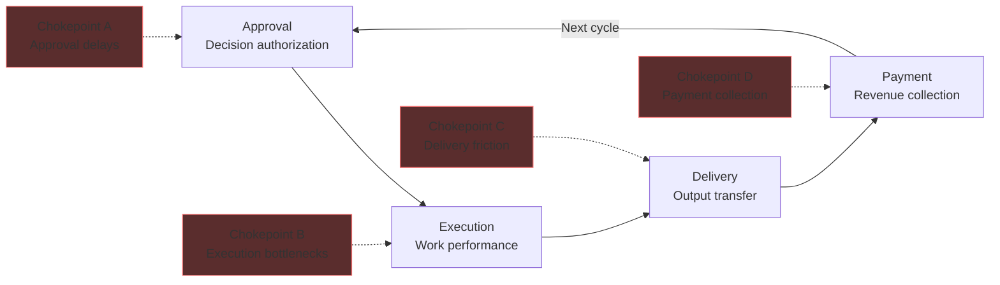

# Chokepoint Intelligence Map

The Chokepoint Intelligence Map is a **workflow visualization and bottleneck costing tool** that maps the complete approval-to-payment cycle, identifies delays, quantifies their annual cost, and provides a prioritized elimination roadmap. The companion **Revenue Chokepoint Diagnostic** is a high-margin consulting engagement that delivers this analysis as a service.

## Product Overview

| Attribute | Detail |
|-----------|--------|
| **Category** | Workflow Intelligence / Operational Diagnostic |
| **Product Form** | Interactive visualization tool + consulting service |
| **Price Point** | $5,000-$15,000 (diagnostic service) |
| **Delivery** | 5-10 business days |
| **Gross Margin** | 100% (labor-only delivery) |
| **Target Market** | Mid-market companies with 50+ employees and complex workflows |
| **Phase Activation** | Phase 0 |
| **Confidence Score** | 92% |
| **Strategic Role** | Primary diagnostic → identifies pain → drives all downstream upsells |

## The Four-Stage Workflow Cycle

Every revenue-generating process follows the same four-stage cycle. Chokepoints occur at transitions between stages.



### Stage Definitions

| Stage | Definition | Common Chokepoints | Typical Cost |
|-------|-----------|-------------------|-------------|
| **Approval** | Decision authorization — who signs off, under what criteria, with what documentation | Multi-level approvals, missing information, unclear authority | 15-30% of total cycle time |
| **Execution** | Work performance — the actual delivery of value | Resource bottlenecks, skill gaps, tool limitations, handoff failures | 20-40% of total cycle time |
| **Delivery** | Output transfer — getting the completed work to the recipient | Quality review delays, format conversions, compliance checks | 10-20% of total cycle time |
| **Payment** | Revenue collection — invoicing, collection, and cash receipt | Late invoicing, dispute resolution, payment term misalignment | 10-25% of total cycle time |

## Current Throughput Metrics

The Chokepoint Intelligence Map measures current-state performance across standardized metrics:

### Throughput Dashboard

| Metric | Definition | Industry Average | Top Quartile | Your Baseline |
|--------|-----------|-----------------|-------------|---------------|
| **Cycle Time** | End-to-end duration from approval to payment | 45-90 days | 15-30 days | _Measured_ |
| **Approval Velocity** | Average time from request to authorization | 5-14 days | 1-3 days | _Measured_ |
| **Execution Efficiency** | Productive hours / total hours on engagement | 55-65% | 80-90% | _Measured_ |
| **Delivery Latency** | Time from completion to client receipt | 3-7 days | Same day | _Measured_ |
| **Payment Velocity** | Time from delivery to cash receipt | 30-60 days | 7-15 days | _Measured_ |
| **Rework Rate** | Percentage of deliverables requiring revision | 15-25% | 3-5% | _Measured_ |
| **Handoff Loss** | Information degradation at each handoff point | 10-20% per handoff | &lt;5% per handoff | _Measured_ |

### Delay Identification Matrix

| Delay Type | Where It Occurs | Root Cause | Detection Method | Typical Annual Cost |
|-----------|----------------|-----------|-----------------|-------------------|
| **Authority Delay** | Approval stage | Unclear decision authority, missing approver | Calendar analysis + interview | $50K-$200K |
| **Information Delay** | Approval/Execution | Missing data, incomplete documentation | Process trace + error log review | $30K-$150K |
| **Resource Delay** | Execution stage | Insufficient capacity, skill misalignment | Utilization analysis + queue metrics | $75K-$300K |
| **Handoff Delay** | All stage transitions | Poor communication, format mismatches | Transition time measurement | $40K-$175K |
| **Quality Delay** | Delivery stage | Rework cycles, unclear quality standards | Rework rate + revision tracking | $60K-$250K |
| **Invoice Delay** | Payment stage | Late invoice generation, missing backup | AR aging analysis | $25K-$100K |
| **Collection Delay** | Payment stage | Disputes, unclear terms, process friction | DSO analysis + dispute tracking | $50K-$200K |
| **Compliance Delay** | All stages | Regulatory documentation, audit preparation | Compliance task tracking | $30K-$125K |

## Annual Cost Calculation

### Chokepoint Cost Formula

The annual cost of a chokepoint is calculated as:

```
Annual Chokepoint Cost = Frequency × Delay Duration × Cost Per Day × Impact Multiplier
```

| Variable | Definition | How Measured |
|---------|-----------|-------------|
| **Frequency** | How often the chokepoint occurs (per year) | Process trace count |
| **Delay Duration** | Average delay per occurrence (in days) | Timestamp analysis |
| **Cost Per Day** | Direct cost of the delay (labor + opportunity) | Loaded labor rate + revenue delay cost |
| **Impact Multiplier** | Downstream effects (1.0-3.0x) | Cascade analysis |

### Sample Chokepoint Cost Analysis

| Chokepoint | Frequency | Avg. Delay | Cost/Day | Multiplier | **Annual Cost** |
|-----------|-----------|-----------|---------|-----------|----------------|
| VP approval for proposals &gt;$50K | 120/year | 4.5 days | $1,200 | 1.5x | **$972,000** |
| Missing SOW documentation | 200/year | 2 days | $800 | 1.2x | **$384,000** |
| Resource scheduling conflicts | 150/year | 3 days | $1,000 | 1.3x | **$585,000** |
| Quality review rework cycle | 180/year | 1.5 days | $900 | 1.0x | **$243,000** |
| Invoice generation delay | 240/year | 5 days | $500 | 1.4x | **$840,000** |
| Client dispute resolution | 60/year | 10 days | $750 | 1.8x | **$810,000** |
| Compliance documentation | 100/year | 2.5 days | $600 | 1.1x | **$165,000** |
| **Total Annual Chokepoint Cost** | | | | | **$3,999,000** |

## Revenue Chokepoint Diagnostic — Service Offering

### Engagement Overview

| Attribute | Detail |
|-----------|--------|
| **Price** | $5,000-$15,000 (based on complexity) |
| **Delivery** | 5-10 business days |
| **Gross Margin** | 100% (labor only — no tooling cost, no subcontractors) |
| **Team** | 1 diagnostic specialist (10-20 hours) |
| **Output** | Chokepoint Intelligence Map + prioritized elimination roadmap |

### Pricing Tiers

| Tier | Price | Scope | Delivery | Best For |
|------|-------|-------|----------|---------|
| **Focused** | $5,000 | Single process / department, up to 5 interviews | 5 days | Small teams, specific bottleneck |
| **Standard** | $10,000 | 2-3 processes / cross-department, up to 10 interviews | 7 days | Mid-size companies, multiple pain points |
| **Comprehensive** | $15,000 | Full organization, up to 15 interviews, executive presentation | 10 days | Complex organizations, board-level reporting |

### Diagnostic Process

| Day | Activity | Output |
|-----|---------|--------|
| 1 | Kickoff call, process identification, data request | Scope document, data checklist |
| 2-3 | Stakeholder interviews (3-5 per day) | Interview transcripts, pain point map |
| 4-5 | Process mapping, timestamp analysis, chokepoint identification | Draft Chokepoint Intelligence Map |
| 6-7 | Cost quantification, root cause analysis | Costed chokepoint register |
| 8-9 | Elimination roadmap, priority ranking, ROI projections | Prioritized action plan |
| 10 | Final presentation, Q&A, next steps | Final report + executive presentation |

### Deliverables

| Deliverable | Format | Description |
|------------|--------|-------------|
| **Chokepoint Intelligence Map** | Interactive visual (Mermaid/D3) + PDF | Full workflow visualization with identified chokepoints |
| **Cost Register** | Spreadsheet | Every chokepoint with frequency, cost, and priority score |
| **Elimination Roadmap** | PDF + timeline | Prioritized actions with expected ROI and timeline |
| **Executive Summary** | PDF (2-3 pages) | Board-ready summary of findings and recommendations |
| **Quick Wins List** | One-pager | 3-5 changes implementable within 2 weeks |

## Upsell Pathway

The Chokepoint Diagnostic is the **highest-conversion upsell trigger** in the AINEFF product suite:

| Diagnostic Finding | Natural Upsell | Price | Conversion Rate |
|-------------------|---------------|-------|----------------|
| Billing/invoicing chokepoints | Billing Leakage Scanner | $25,000 | 25-35% |
| Governance/compliance delays | PIAR Engagement | $25K-$75K | 15-25% |
| Documentation bottlenecks | DocuFlow Pro | $49/mo | 30-40% |
| Operational inefficiency | Enterprise Wedge (90-day) | $8K-$15K | 20-30% |
| Systemic governance failure | Governance License | $200,000 | 5-10% |
| Staff capability gaps | Operator Training | $500-$1,500 | 15-20% |
| Ongoing optimization need | Monthly Retainer | $2K-$5K/mo | 30-40% |

### Average Downstream Revenue per Diagnostic

| Metric | Value |
|--------|-------|
| Average diagnostic fee | $8,500 |
| Average upsell within 90 days | $18,000 |
| Average upsell within 12 months | $45,000 |
| Average total client value (18 months) | $85,000 |
| Upsell conversion rate (any product) | 65% |
| Upsell conversion rate (retainer) | 35% |

## Competitive Positioning

| Dimension | Management Consulting | Process Mining Software | AINEFF Chokepoint Diagnostic |
|-----------|---------------------|----------------------|----------------------------|
| **Cost** | $50K-$500K | $30K-$100K/yr license | $5K-$15K |
| **Delivery Time** | 2-6 months | 2-4 months implementation | 5-10 days |
| **Team Required** | 3-10 consultants | IT team + vendor support | 1 specialist |
| **Output** | PowerPoint deck | Dashboard (requires ongoing license) | Map + roadmap + quick wins |
| **Actionability** | Recommendations (no execution) | Data (no interpretation) | Prioritized actions with ROI |
| **Margin** | 40-60% | 70-80% | 100% |
| **Follow-On** | Another engagement | Software renewal | Full AINEFF product suite |
