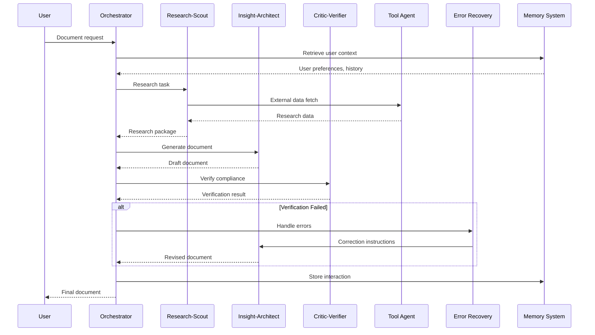

---

sidebar_position: 1
title: "DocuFlow Agent"
description: "Compliance & Documentation Automation micro-SaaS — multi-agent AI system for consultants, legal, coaching, accounting, real estate, and agencies."
tags: [product, financial, frankmax]
custom_status: active
custom_owner: Andrew Leo
custom_last_review: 2026-03-01
custom_next_review: 2026-06-01
---

# DocuFlow Agent

**DocuFlow** is a compliance and documentation automation micro-SaaS built on a multi-agent AI architecture. It serves as the **primary ecosystem gateway** — the lowest-friction entry point into the AINEFF product suite.

## Product Overview

| Attribute | Detail |
|-----------|--------|
| **Category** | Micro-SaaS / AI-Powered Documentation Platform |
| **Target Market** | Solo consultants, freelancers, small firms, agencies |
| **Core Value** | Eliminate 60-80% of compliance and documentation labor |
| **Deployment** | Cloud-hosted (primary) / Self-hosted (enterprise) |
| **Status** | Phase 0 — Priority Build |
| **Strategic Role** | Gateway product → ecosystem entry → upsell funnel |

## Pricing

| Tier | Price | Inclusions | Target User |
|------|-------|-----------|-------------|
| **Basic** | $19/month | 50 documents/month, 3 templates, standard AI models, email support | Solo consultants, freelancers |
| **Pay-As-You-Go** | $2/document | No monthly commitment, all features, standard AI models | Occasional users, seasonal businesses |
| **Pro** | $49/month | Unlimited documents, custom templates, premium AI models, priority support, API access, team collaboration (up to 5 users) | Agencies, mid-size firms, power users |
| **Enterprise** | Custom | Unlimited everything, self-hosted option, SSO, audit logs, dedicated support, SLA | Firms with compliance requirements |

### Pricing Strategy Rationale

| Decision | Rationale |
|---------|-----------|
| $19 entry point | Below "ask permission" threshold — individual contributors can expense without approval |
| $2/doc option | Removes commitment anxiety, captures seasonal/occasional users |
| $49 Pro ceiling | Sweet spot for small teams — cheaper than one hour of consultant time per month |
| No free tier | Signals professional tool, avoids support burden from non-serious users |
| Enterprise custom | Opens door to Governance License upsell at $200K |

## Target Verticals

| Vertical | Use Case | Monthly Volume | Avg. Tier |
|---------|---------|---------------|-----------|
| **Consultants** | Client deliverables, SOW documentation, project reports | 20-50 docs | Basic → Pro |
| **Legal** | Compliance filings, contract summaries, regulatory documentation | 50-200 docs | Pro |
| **Coaching** | Program documentation, certification records, client progress reports | 10-30 docs | Basic |
| **Accounting** | Audit preparation, tax documentation, compliance reporting | 30-100 docs | Pro |
| **Real Estate** | Transaction documentation, disclosure generation, compliance filing | 15-40 docs | Basic → Pro |
| **Agencies** | Client reports, campaign documentation, compliance records | 40-150 docs | Pro |

## Multi-Agent System Architecture

DocuFlow operates on a **7-agent cooperative architecture** where each agent has a specialized role, clear boundaries, and defined handoff protocols.

### Agent Roster

| Agent | Role | Responsibility | Input | Output |
|-------|------|---------------|-------|--------|
| **Orchestrator** | Coordinator | Routes tasks, manages workflow state, enforces sequence | User request + context | Task assignments, workflow state |
| **Research-Scout** | Intelligence | Gathers relevant data, regulations, templates, precedents | Topic + domain + jurisdiction | Structured research package |
| **Insight-Architect** | Synthesizer | Transforms research into document structure and content | Research package + template | Draft document sections |
| **Critic-Verifier** | Quality Gate | Reviews output for accuracy, compliance, completeness | Draft sections + requirements | Verified output + correction flags |
| **Tool Agent** | Integration | Executes external API calls, file operations, database queries | Tool requests from other agents | Tool execution results |
| **Error Recovery** | Resilience | Handles failures, retries, graceful degradation, fallback paths | Error signals from any agent | Recovery actions, fallback output |
| **Memory System** | Persistence | Manages context across sessions, user preferences, learned patterns | Interaction data, user feedback | Contextual memory, personalization |

### Agent Interaction Flow

## Technology Stack

### Core Infrastructure

| Layer | Technology | Rationale |
|-------|-----------|-----------|
| **Backend API** | FastAPI (Python) / Node.js (TypeScript) | FastAPI for ML pipeline, Node.js for real-time features |
| **AI Inference** | Ollama (local) / API fallback (cloud) | Local-first for cost control, cloud fallback for burst capacity |
| **Containerization** | Docker + Docker Compose | Reproducible deployment, easy self-hosting |
| **Vector Database** | ChromaDB (development) / LanceDB (production) | Lightweight embedding storage for RAG |
| **Frontend** | React / Next.js / SvelteKit | React for dashboards, SvelteKit for lightweight client portal |
| **Database** | SQLite (single-node) / PostgreSQL (scale) | SQLite for simplicity, PostgreSQL for multi-tenant |
| **Queue** | Redis / BullMQ | Async document processing pipeline |
| **Storage** | S3-compatible (MinIO local, AWS S3 production) | Document storage and versioning |

### AI Model Selection

| Task | Model | Size | VRAM Required | Quantization |
|------|-------|------|--------------|-------------|
| **Document Generation** | Mistral 7B | 7B params | 4GB | Q4_K_M |
| **Research/RAG** | Llama3 3B | 3B params | 2GB | Q4_K_M |
| **Classification/Routing** | Phi3-mini | 3.8B params | 2GB | Q4_K_M |
| **Embedding** | nomic-embed-text | 137M params | &lt;1GB | FP16 |
| **Summarization** | Llama3 3B | 3B params | 2GB | Q4_K_M |
| **Code/Template** | Phi3-mini | 3.8B params | 2GB | Q4_K_M |

## GPU-Aware Architecture

DocuFlow is designed to run on **consumer-grade hardware** with as little as 4GB VRAM, enabling cost-effective self-hosting and edge deployment.

### Hardware Requirements

| Tier | GPU | VRAM | Capability | Monthly Infra Cost |
|------|-----|------|-----------|-------------------|
| **Minimum** | NVIDIA GTX 1650 | 4GB | Single model, sequential processing | $0 (existing hardware) |
| **Recommended** | NVIDIA RTX 3060 | 12GB | Multi-model, parallel processing | $0 (existing hardware) |
| **Production** | NVIDIA RTX 4090 | 24GB | All models loaded, low latency | $50-$100/mo (cloud GPU) |
| **Cloud Fallback** | API-based | N/A | Unlimited scale, higher per-call cost | $0.01-$0.05/document |

### VRAM Management Strategy

| Strategy | Description | Impact |
|----------|------------|--------|
| **Model Rotation** | Load/unload models based on task queue | Fits 7B model in 4GB VRAM |
| **Quantization** | Q4_K_M quantization for all local models | 50-75% VRAM reduction |
| **Batch Processing** | Group similar tasks for same-model execution | Reduces model swap overhead |
| **Hybrid Routing** | Simple tasks local, complex tasks cloud API | Balances cost vs. capability |
| **Memory Mapping** | Use system RAM as VRAM overflow | Slower but prevents OOM errors |

### Device Class Compatibility

| Device Class | Rung | Example Hardware | DocuFlow Capability |
|-------------|------|-----------------|-------------------|
| **Rung 0** | Minimal | Raspberry Pi, old laptop | API-only mode, no local inference |
| **Rung 1** | Basic | Desktop with integrated GPU | Phi3-mini only, limited throughput |
| **Rung 2** | Standard | GTX 1650 / RTX 3050 (4GB) | Single model rotation, standard throughput |
| **Rung 3** | Professional | RTX 3060/4060 (8-12GB) | Multi-model, parallel processing |
| **Rung 4** | Enterprise | RTX 4090 / A100 (24GB+) | Full model suite, maximum throughput |

## 4-Week Implementation Plan

### Week 1: Foundation

| Day | Task | Deliverable | Owner |
|-----|------|------------|-------|
| 1 | Project setup, Docker environment, CI/CD pipeline | Running dev environment | Lead Engineer |
| 2 | FastAPI skeleton, authentication, database schema | API scaffold with auth | Backend |
| 3 | Ollama integration, model download, inference wrapper | Working AI inference | ML Engineer |
| 4 | ChromaDB setup, embedding pipeline, RAG scaffold | Vector search working | ML Engineer |
| 5 | Frontend scaffold (SvelteKit), component library | UI shell with routing | Frontend |

### Week 2: Core Agents

| Day | Task | Deliverable | Owner |
|-----|------|------------|-------|
| 6-7 | Orchestrator agent, task routing, state management | Working orchestration | Backend |
| 8 | Research-Scout agent, web scraping, data gathering | Research pipeline | ML Engineer |
| 9 | Insight-Architect agent, document generation | Draft document output | ML Engineer |
| 10 | Critic-Verifier agent, quality checks, compliance rules | Verification pipeline | Backend |

### Week 3: Integration & Polish

| Day | Task | Deliverable | Owner |
|-----|------|------------|-------|
| 11 | Tool Agent, Error Recovery, Memory System | Full agent roster | Backend |
| 12-13 | Frontend integration, document editor, template system | Working UI with AI | Frontend |
| 14 | Payment integration (Stripe), usage tracking | Billing system | Backend |
| 15 | Template library (10 starter templates per vertical) | Content library | Content |

### Week 4: Launch Preparation

| Day | Task | Deliverable | Owner |
|-----|------|------------|-------|
| 16-17 | End-to-end testing, load testing, security audit | Test reports | QA |
| 18 | Landing page, documentation, onboarding flow | Marketing assets | Marketing |
| 19 | Beta deployment, founding user onboarding (10 users) | Live beta environment | DevOps |
| 20 | Monitoring, alerting, feedback collection system | Production-ready system | DevOps |

## Key Metrics

| Metric | Target (Month 1) | Target (Month 3) | Target (Month 6) |
|--------|-----------------|-----------------|-----------------|
| Active Users | 25 | 100 | 500 |
| Documents Generated | 500 | 5,000 | 30,000 |
| MRR | $500 | $3,000 | $15,000 |
| Churn Rate | &lt;15% | &lt;10% | &lt;7% |
| NPS | &gt;30 | &gt;40 | &gt;50 |
| Avg. Docs per User | 20/mo | 25/mo | 30/mo |
| Cost per Document | $0.15 | $0.08 | $0.04 |
| Pro Conversion Rate | 10% | 15% | 20% |

## Upsell Pathways

| Trigger | Upsell Offer | Expected Conversion |
|---------|-------------|-------------------|
| User hits 50 doc/month limit | Pro tier ($49/mo) | 15-20% |
| User generates compliance docs | Governance Gap Analyzer (free) | 40-60% |
| Governance Gap score &lt; 3/5 | Chokepoint Diagnostic ($5K-$15K) | 10-15% |
| 3+ months on Pro tier | Retainer conversation | 5-8% |
| Enterprise inquiry | Governance License discussion | 3-5% |
