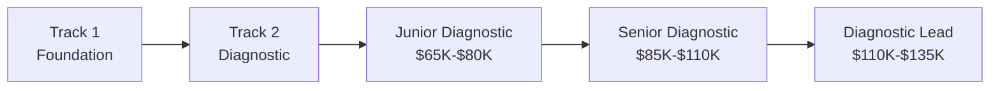
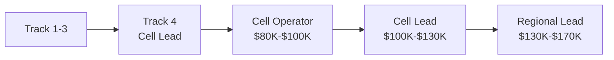
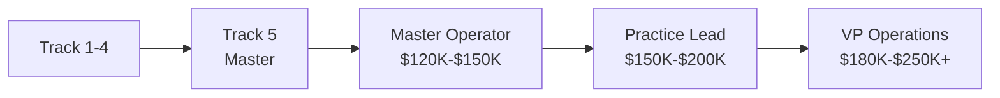
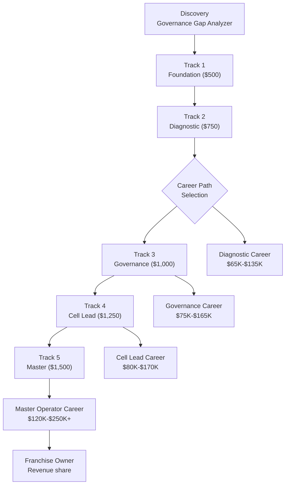

# Operator Training & Certification

The Operator Training Program is a **5-track progressive certification system** that develops governance-literate operators capable of deploying, managing, and scaling AINEFF Ecosystem infrastructure. Operators are the human execution layer — the people who run Venture Cells, deliver diagnostics, manage governance engagements, and operate the ecosystem at scale.

## Program Overview

| Attribute | Detail |
|-----------|--------|
| **Category** | Professional Training & Certification |
| **Price Range** | $500-$1,500 per track |
| **Target Audience** | Career changers, junior operations professionals, consultants, IT professionals |
| **Delivery Model** | Cohort-based (online + optional in-person intensives) |
| **Cohort Size** | 10-25 participants per cohort |
| **Total Program Duration** | 20-30 weeks (all 5 tracks) |
| **Phase Activation** | Phase 1 (Track 1-2), Phase 2 (Track 3-5) |
| **Target Salary Outcome** | $127K average for certified operators |

## Track Overview

| Track | Title | Duration | Price | Prerequisites | Certification |
|-------|-------|----------|-------|--------------|--------------|
| **Track 1** | Operator Foundation | 4 weeks | $500 | None | Certified Operator — Foundation |
| **Track 2** | Diagnostic Specialist | 4 weeks | $750 | Track 1 | Certified Diagnostic Specialist |
| **Track 3** | Governance Practitioner | 4 weeks | $1,000 | Track 2 | Certified Governance Practitioner |
| **Track 4** | Cell Lead | 4 weeks | $1,250 | Track 3 | Certified Cell Lead |
| **Track 5** | Master Operator | 4 weeks | $1,500 | Track 4 + 6 months field experience | Certified Master Operator |
| **Full Program** | All 5 Tracks | 20 weeks | $4,500 (10% bundle discount) | None | All certifications |

## Track 1: Operator Foundation ($500)

### Curriculum

| Week | Module | Topics | Deliverable |
|------|--------|--------|------------|
| 1 | **Ecosystem Architecture** | AINEFF layer model, entity types, coordination principles, constitutional constraints | Architecture diagram annotation |
| 2 | **Operational Fundamentals** | Workflow mapping, process documentation, metric identification, tool proficiency | Process map of a sample workflow |
| 3 | **Governance Basics** | What governance is (and is not), accountability frameworks, documentation standards | Governance assessment of mock organization |
| 4 | **Capstone Project** | End-to-end diagnostic of a sample company with full documentation | Capstone report + peer review |

### Learning Outcomes

| Outcome | Assessment Method |
|---------|------------------|
| Explain the AINEFF Ecosystem architecture to a non-technical audience | Recorded presentation (3 min) |
| Map a basic workflow and identify 3+ chokepoints | Process map deliverable |
| Conduct a Governance Gap Analyzer assessment and interpret results | Live assessment exercise |
| Produce professional documentation meeting AINEFF standards | Capstone report quality score |

## Track 2: Diagnostic Specialist ($750)

### Curriculum

| Week | Module | Topics | Deliverable |
|------|--------|--------|------------|
| 1 | **Chokepoint Methodology** | Interview techniques, process tracing, timestamp analysis, cost quantification | Mock interview recordings |
| 2 | **Billing Intelligence** | Invoice analysis, rate comparison, leakage identification, recovery estimation | Billing analysis of sample dataset |
| 3 | **Client Management** | Engagement scoping, expectation setting, deliverable presentation, objection handling | Simulated client presentation |
| 4 | **Live Diagnostic** | Conduct actual Chokepoint Diagnostic on a real (or simulated real) organization | Complete diagnostic report |

### Learning Outcomes

| Outcome | Assessment Method |
|---------|------------------|
| Conduct a full Chokepoint Diagnostic independently | Live diagnostic evaluation |
| Identify and quantify billing leakage in sample invoice sets | Billing analysis accuracy score |
| Present findings to executive stakeholders persuasively | Recorded presentation + peer review |
| Scope and price a diagnostic engagement accurately | Proposal document evaluation |

## Track 3: Governance Practitioner ($1,000)

### Curriculum

| Week | Module | Topics | Deliverable |
|------|--------|--------|------------|
| 1 | **PIAR Methodology** | Authority mapping, kill criteria design, artifact production, forensic replay | PIAR template for mock decision |
| 2 | **Regulatory Frameworks** | Industry-specific compliance (insurance, banking, healthcare, manufacturing), regulatory mapping | Regulatory compliance map |
| 3 | **Governance Architecture** | ORF Protocol principles, monetization boundaries, constitutional constraints | Governance architecture proposal |
| 4 | **Governance Engagement** | Full PIAR delivery on simulated enterprise decision | Complete PIAR artifact set |

### Learning Outcomes

| Outcome | Assessment Method |
|---------|------------------|
| Deliver a complete PIAR for a complex organizational decision | PIAR artifact quality score |
| Map regulatory requirements to governance framework components | Regulatory map accuracy |
| Design kill criteria that are measurable, actionable, and enforceable | Kill criteria evaluation rubric |
| Explain ORF Protocol principles and monetization boundaries | Written examination |

## Track 4: Cell Lead ($1,250)

### Curriculum

| Week | Module | Topics | Deliverable |
|------|--------|--------|------------|
| 1 | **Venture Cell Operations** | Cell structure, role definitions, communication protocols, metric tracking | Cell operating plan |
| 2 | **Client Engagement Management** | Pipeline management, proposal development, pricing strategy, contract negotiation | Simulated deal cycle |
| 3 | **Team Leadership** | Operator development, performance management, conflict resolution, escalation | Leadership scenario exercises |
| 4 | **Cell Launch** | Launch a simulated Venture Cell — recruit team, acquire client, deliver engagement, measure results | Cell launch report + financial model |

### Learning Outcomes

| Outcome | Assessment Method |
|---------|------------------|
| Design and staff a Venture Cell for a specific market vertical | Cell operating plan evaluation |
| Manage a complete client engagement from proposal to delivery | Simulated engagement scorecard |
| Develop and maintain a pipeline generating $100K+ annual potential | Pipeline health assessment |
| Lead a team of 3-5 operators through a 90-day engagement cycle | 360-degree leadership review |

## Track 5: Master Operator ($1,500)

### Prerequisites

- Track 1-4 certification
- Minimum 6 months of field experience as an operator
- Minimum 3 completed client engagements
- Cell Lead recommendation

### Curriculum

| Week | Module | Topics | Deliverable |
|------|--------|--------|------------|
| 1 | **Strategic Operations** | Market analysis, vertical strategy, competitive positioning, partnership development | Market entry strategy document |
| 2 | **Scale Architecture** | Multi-cell coordination, franchise models, quality assurance at scale, knowledge management | Scale operating plan |
| 3 | **Governance Mastery** | Advanced PIAR, ORF Protocol implementation, regulatory negotiation, industry standards | Advanced governance framework |
| 4 | **Master Project** | Design and present a complete market entry plan for a new vertical, including Cell structure, product selection, pricing, and 12-month financial model | Master project + board presentation |

### Learning Outcomes

| Outcome | Assessment Method |
|---------|------------------|
| Design a market entry strategy for a new vertical with financial projections | Strategy document + financial model |
| Architect a multi-cell operation serving 10+ simultaneous clients | Scale operating plan evaluation |
| Implement ORF Protocol governance in a complex organizational context | Governance implementation assessment |
| Present a board-level strategic recommendation with supporting evidence | Live presentation + Q&A evaluation |

## Certification Scoring Rubric

### Assessment Dimensions

| Dimension | Weight | Description |
|-----------|--------|-------------|
| **Technical Competence** | 30% | Ability to perform core skills (diagnostics, governance, documentation) |
| **Client Engagement** | 25% | Communication, presentation, relationship management, objection handling |
| **Governance Literacy** | 20% | Understanding of AINEFF principles, ORF Protocol, monetization boundaries |
| **Deliverable Quality** | 15% | Professional quality of written and visual outputs |
| **Peer Contribution** | 10% | Cohort participation, peer mentoring, knowledge sharing |

### Scoring Scale

| Score | Grade | Certification Status | Description |
|-------|-------|---------------------|-------------|
| 90-100 | **A — Distinction** | Certified with Honors | Exceptional performance, ready for immediate deployment |
| 80-89 | **B — Proficient** | Certified | Strong performance, deployment-ready |
| 70-79 | **C — Competent** | Certified (Conditional) | Adequate performance, needs mentored deployment |
| 60-69 | **D — Developing** | Not Certified (Retake) | Below standard, must retake final project |
| &lt;60 | **F — Insufficient** | Not Certified | Must repeat track |

### Certification Validity

| Certification | Validity Period | Renewal Requirement | Renewal Fee |
|--------------|----------------|-------------------|-------------|
| Track 1 — Foundation | 2 years | Complete 8 CEU hours | $100 |
| Track 2 — Diagnostic | 2 years | Complete 12 CEU hours + 2 engagements | $150 |
| Track 3 — Governance | 2 years | Complete 16 CEU hours + 1 PIAR | $200 |
| Track 4 — Cell Lead | 1 year | Active Cell Lead + 20 CEU hours | $250 |
| Track 5 — Master | 1 year | Active operations + 24 CEU hours + peer review | $300 |

## 4 Progressive Career Pathways

### Pathway 1: Diagnostic Specialist

| Stage | Role | Salary Range | Key Responsibilities |
|-------|------|-------------|---------------------|
| Entry | Junior Diagnostic Specialist | $65,000-$80,000 | Support diagnostic engagements, conduct interviews, analyze data |
| Mid | Senior Diagnostic Specialist | $85,000-$110,000 | Lead diagnostics independently, present to executives, scope engagements |
| Senior | Diagnostic Lead | $110,000-$135,000 | Manage diagnostic team, develop methodology, train juniors |

### Pathway 2: Governance Specialist

| Stage | Role | Salary Range | Key Responsibilities |
|-------|------|-------------|---------------------|
| Entry | Governance Analyst | $75,000-$95,000 | Assist PIAR engagements, document governance artifacts, monitor compliance |
| Mid | Governance Consultant | $95,000-$125,000 | Lead PIAR engagements, design governance frameworks, advise executives |
| Senior | Governance Director | $130,000-$165,000 | Enterprise governance strategy, regulatory relationships, team leadership |

### Pathway 3: Cell Lead / Operations

| Stage | Role | Salary Range | Key Responsibilities |
|-------|------|-------------|---------------------|
| Entry | Cell Operator | $80,000-$100,000 | Execute engagements within a Venture Cell, manage client relationships |
| Mid | Cell Lead | $100,000-$130,000 | Run a Venture Cell — P&L, team, pipeline, delivery |
| Senior | Regional Lead | $130,000-$170,000 | Manage multiple Cells, market strategy, franchise development |

### Pathway 4: Master Operator / Executive

| Stage | Role | Salary Range | Key Responsibilities |
|-------|------|-------------|---------------------|
| Entry | Master Operator | $120,000-$150,000 | Strategic vertical leadership, multi-cell coordination, methodology development |
| Mid | Practice Lead | $150,000-$200,000 | Regional operations, partnership development, revenue ownership |
| Senior | VP Operations | $180,000-$250,000+ | Executive leadership, board reporting, ecosystem strategy |

## Average Salary Target: $127K

| Pathway | Weighted Average Salary | % of Graduates |
|---------|------------------------|----------------|
| Diagnostic Specialist | $92,000 | 30% |
| Governance Specialist | $115,000 | 25% |
| Cell Lead / Operations | $120,000 | 30% |
| Master Operator / Executive | $165,000 | 15% |
| **Weighted Average** | **$127,000** | **100%** |

## Program Economics

| Metric | Value |
|--------|-------|
| Average revenue per student (full program) | $4,500 |
| Cost per student (content + instruction + platform) | $1,200 |
| Gross margin per student | $3,300 (73%) |
| Target cohort size | 15 students |
| Revenue per cohort | $67,500 |
| Margin per cohort | $49,500 |
| Target cohorts per quarter | 4 |
| Annual training revenue (at scale) | $1,080,000 |
| Annual training margin | $792,000 |

## Operator Lifecycle

