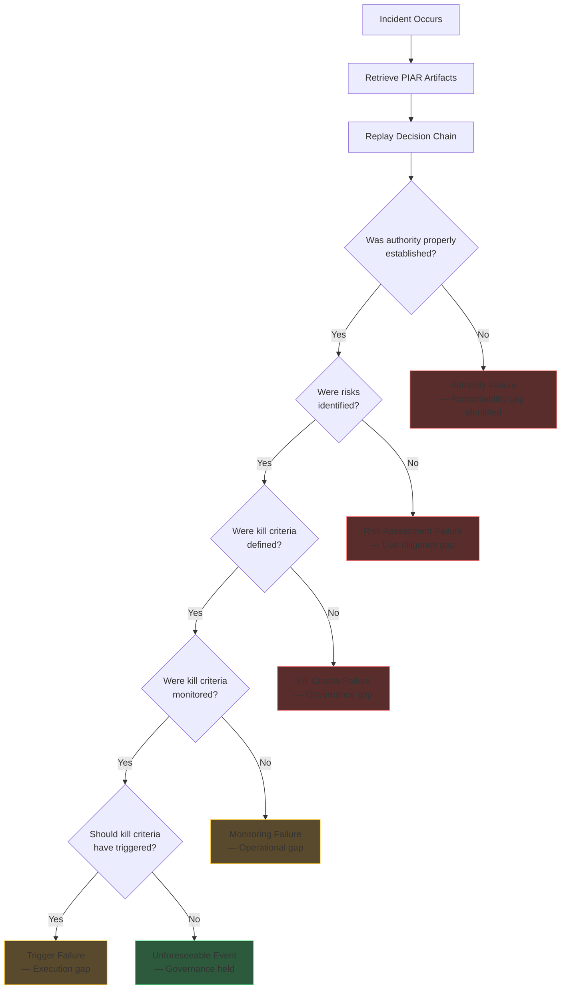

---

sidebar_position: 5
title: "Pre-Incident Accountability Review (PIAR)"
description: "Mandatory governance entry point — determines if a decision survives investigation BEFORE approval through authority mapping, kill criteria, and forensic replay architecture."
tags: [product, financial, orf, governance]
custom_status: active
custom_owner: Andrew Leo
custom_last_review: 2026-03-01
custom_next_review: 2026-06-01
---

# Pre-Incident Accountability Review (PIAR)

The PIAR is the **mandatory governance entry point** for high-stakes decisions in any AINEFF-governed organization. It answers one question: **"If this decision goes wrong, will it survive investigation?"** — and it answers that question BEFORE the decision is approved, not after.

## Core Principle

> Every significant decision must be reviewed for survivability before execution. If a decision cannot survive post-incident investigation, it must not be approved.

## Product Overview

| Attribute | Detail |
|-----------|--------|
| **Category** | Governance / Risk Management / Liability Architecture |
| **Price Point** | $25,000-$75,000 per engagement |
| **Target Market** | C-Suite, Board, General Counsel at mid-market to enterprise organizations |
| **Core Value** | Pre-incident liability protection — document and validate decisions before they create risk |
| **Delivery Model** | Structured engagement (2-6 weeks depending on scope) |
| **Gross Margin** | 78% |
| **Phase Activation** | Phase 2 |
| **Confidence Score** | 65% |
| **Strategic Role** | Governance anchor → creates dependency → drives Governance License and ORF Protocol adoption |

## Why PIAR Exists

### The Post-Incident Problem

| Scenario | Without PIAR | With PIAR |
|----------|-------------|-----------|
| AI system makes harmful decision | "Who approved this?" — nobody knows | Named accountable human with documented rationale |
| Regulatory investigation | Scramble to reconstruct decision chain | Complete governance artifact with timestamps |
| Lawsuit / liability claim | Discovery reveals no process | Pre-incident review demonstrates due diligence |
| Insurance claim for operational failure | Denied — no evidence of risk management | Approved — documented risk assessment on file |
| Board questions executive decision | "We thought it was a good idea" | "Here is the PIAR — reviewed, tested, approved" |

### The Cost of Not Having PIAR

| Risk Category | Average Cost Without PIAR | PIAR Engagement Cost | ROI |
|--------------|--------------------------|---------------------|-----|
| Regulatory fine (moderate) | $500K-$5M | $25K-$75K | 10-200x |
| Lawsuit settlement | $1M-$50M | $25K-$75K | 20-600x |
| Executive termination | $500K-$2M (severance + replacement) | $25K-$75K | 10-80x |
| Reputational damage | $2M-$20M (estimated brand impact) | $25K-$75K | 40-800x |
| Insurance premium increase | $100K-$500K/year | $25K-$75K | 2-20x |

## The Four Pillars of PIAR

### Pillar 1: Authority & Liability Mapping

Every decision under PIAR review must have explicit answers to:

| Question | Purpose | Output |
|---------|---------|--------|
| **Who has authority to approve this decision?** | Establishes legal decision-maker | Named individual with title and scope |
| **Who is accountable if this decision causes harm?** | Maps liability chain | Accountability matrix (person, role, scope) |
| **Who was consulted in making this decision?** | Documents input sources | Consultation log with timestamps |
| **Who was informed of this decision?** | Establishes notice chain | Notification record |
| **What is the delegation chain?** | Clarifies authority inheritance | Delegation document with limits |

#### Authority & Liability Matrix (Template)

| Decision Component | Authority Holder | Accountability Holder | Consulted | Informed |
|-------------------|-----------------|---------------------|-----------|----------|
| Strategic direction | CEO | CEO | Board, CTO | All staff |
| Technical implementation | CTO | CTO | Engineering Lead | CEO, COO |
| Budget authorization | CFO | CFO | CEO, Controller | Board |
| Risk acceptance | CRO / GC | CEO (ultimate) | Legal, Compliance | Board |
| Operational execution | COO | COO | Department heads | CEO |
| Compliance verification | CCO | CCO | Legal, External counsel | Board, CEO |

### Pillar 2: Kill Criteria Architecture

Every PIAR-reviewed decision must define the conditions under which it should be **terminated, reversed, or escalated** — BEFORE it is approved.

| Kill Criterion Type | Definition | Example |
|-------------------|-----------|---------|
| **Threshold Kill** | Quantitative trigger that automatically stops the decision | "If error rate exceeds 5%, halt deployment" |
| **Timeline Kill** | Decision expires if not producing results by deadline | "If no measurable ROI by 90 days, terminate" |
| **Escalation Kill** | Conditions under which decision must be escalated to higher authority | "If affected users exceed 1,000, escalate to Board" |
| **Ethical Kill** | Moral/ethical boundary that cannot be crossed | "If bias is detected in any protected class, immediate halt" |
| **Regulatory Kill** | Compliance trigger that forces termination | "If regulatory inquiry received, pause and review" |
| **Financial Kill** | Cost boundary that triggers review | "If cost exceeds 150% of budget, halt and reassess" |

#### Kill Criteria Template

| # | Kill Criterion | Type | Trigger Condition | Action | Owner | Monitoring Method |
|---|---------------|------|-------------------|--------|-------|------------------|
| 1 | Error rate threshold | Threshold | >5% error rate over 7-day rolling average | Halt deployment, investigate | CTO | Automated monitoring |
| 2 | Budget overrun | Financial | Costs exceed 150% of approved budget | Pause, CFO review | CFO | Monthly financial review |
| 3 | Timeline miss | Timeline | No measurable improvement by Day 90 | Terminate engagement | COO | Milestone tracking |
| 4 | Regulatory flag | Regulatory | Any regulatory inquiry or complaint | Pause, legal review | GC | Compliance monitoring |
| 5 | Bias detection | Ethical | Disparate impact on any protected class | Immediate halt, investigation | CCO | Bias audit system |
| 6 | User impact | Escalation | >1,000 users affected by adverse outcome | Escalate to Board | CEO | Incident tracking |

### Pillar 3: Governance Artifact Production

Every PIAR engagement produces a structured set of governance artifacts that serve as the permanent record of the decision review.

| Artifact | Contents | Purpose | Retention Period |
|---------|---------|---------|-----------------|
| **Decision Brief** | Problem statement, proposed action, alternatives considered | Documents the decision context | Permanent |
| **Authority Map** | Named decision-makers, accountability holders, delegation chain | Establishes liability structure | Permanent |
| **Risk Assessment** | Identified risks, probability, impact, mitigation plans | Documents due diligence | Permanent |
| **Kill Criteria Register** | All kill criteria with triggers, actions, and owners | Defines termination conditions | Permanent |
| **Consultation Log** | Who was consulted, what they said, how input was incorporated | Demonstrates thoroughness | Permanent |
| **Approval Record** | Formal sign-off with timestamp, conditions, and scope | Legal authorization evidence | Permanent |
| **Monitoring Plan** | How kill criteria will be tracked, reporting cadence | Ensures ongoing governance | Active lifecycle |
| **Review Schedule** | When the decision will be re-evaluated | Prevents governance decay | Active lifecycle |

### Pillar 4: Post-Incident Forensic Replay

The PIAR is designed to be **replayed** — if an incident occurs, the governance artifacts enable a complete reconstruction of the decision chain.

| Forensic Replay Question | Answered By | Artifact |
|-------------------------|------------|---------|
| What was the decision? | Decision Brief | PIAR-001 |
| Who made the decision? | Authority Map | PIAR-002 |
| What risks were identified? | Risk Assessment | PIAR-003 |
| Were there conditions for stopping? | Kill Criteria Register | PIAR-004 |
| Who was consulted? | Consultation Log | PIAR-005 |
| Was it formally approved? | Approval Record | PIAR-006 |
| Was it being monitored? | Monitoring Plan | PIAR-007 |
| Was it scheduled for review? | Review Schedule | PIAR-008 |

#### Forensic Replay Flow

## Engagement Structure

### Pricing

| Tier | Price | Scope | Duration | Best For |
|------|-------|-------|----------|---------|
| **Single Decision** | $25,000 | One high-stakes decision, full PIAR package | 2-3 weeks | Specific pending decision |
| **Department** | $50,000 | 3-5 decisions within one department | 3-4 weeks | Department-level governance buildout |
| **Enterprise** | $75,000 | Organization-wide governance framework + 5 PIARs | 4-6 weeks | Company-wide governance overhaul |

### Delivery Timeline

| Week | Activities | Deliverables |
|------|-----------|-------------|
| **Week 1** | Stakeholder interviews, decision identification, authority mapping | Draft Authority Map, Decision Brief |
| **Week 2** | Risk assessment, kill criteria development, consultation documentation | Risk Assessment, Kill Criteria Register |
| **Week 3** | Artifact assembly, forensic replay testing, monitoring plan design | Complete PIAR artifact set |
| **Week 4** (Enterprise only) | Additional PIARs, framework documentation, training | Enterprise governance framework |
| **Week 5-6** (Enterprise only) | Implementation support, team training, monitoring system setup | Operational governance system |

## Target Buyer

| Attribute | Detail |
|-----------|--------|
| **Title** | CEO, General Counsel, Chief Risk Officer, Board Member |
| **Budget Authority** | $25K-$75K discretionary; $75K+ with board approval |
| **Purchase Trigger** | Pending high-stakes decision, recent incident, regulatory pressure, insurance requirement |
| **Decision Timeline** | 1-3 weeks (urgency-driven) |
| **Champion Motivation** | Personal liability protection, regulatory compliance, board reporting requirement |

## Upsell Pathway

| PIAR Output | Natural Next Step | Price Point |
|-------------|------------------|-------------|
| Governance gaps identified in PIAR | Governance License | $200,000 |
| Operational chokepoints discovered | Chokepoint Diagnostic | $5K-$15K |
| Ongoing monitoring needed | Monthly Retainer | $2K-$5K/mo |
| Team lacks governance skills | Operator Training | $500-$1,500 |
| Organization needs constitutional governance | ORF Protocol | $500,000 |
| Documentation processes broken | DocuFlow Pro | $49/mo |
