---

sidebar_position: 9
title: "Pricing Architecture"
description: "Cross-product pricing strategy — upsell ladder from $5K diagnostics to $500K+ enterprise deployments, pricing by device class, and value-based pricing principles."
tags: [product, financial]
custom_status: active
custom_owner: Andrew Leo
custom_last_review: 2026-03-01
custom_next_review: 2026-06-01
---

# Pricing Architecture

The AINEFF pricing architecture is designed as a **deliberate upsell ladder** — each product at a lower price point creates the conditions, data, and trust for the next higher-priced offering. The architecture ensures no pricing decision is made in isolation; every price point considers its position in the client journey.

## Pricing Principles

| Principle | Description | Application |
|-----------|------------|-------------|
| **Value-Based** | Price reflects client ROI, not cost-plus | Billing Scanner at $25K recovers $200K-$2M+ |
| **Ladder-First** | Every price point enables the next step up | $5K Diagnostic opens door to $15K Implementation |
| **Commitment-Gated** | Higher prices require demonstrated commitment | Enterprise pricing requires completed Diagnostic |
| **Risk-Reversed** | Lower-tier pricing removes buyer risk | Founding client discounts, money-back on sprints |
| **Margin-Protected** | No product priced below 52% gross margin threshold | Even discounted products maintain profitability |
| **Segment-Aligned** | Pricing matches buyer authority and budget cycles | Sub-$15K = manager discretionary, $15K+ = VP approval |

## The Upsell Ladder

### Complete Client Journey: $5K to $500K+

```mermaid
graph TD
    A["Step 1: Diagnostic<br/>$5K-$15K<br/>100% margin"] --> B["Step 2: Implementation<br/>$15K<br/>68% margin"]
    B --> C["Step 3: Retainer<br/>$2K-$5K/mo<br/>65% margin"]
    C --> D["Step 4: Governance<br/>$8K-$20K<br/>72% margin"]
    D --> E["Step 5: PIAR<br/>$25K-$75K<br/>78% margin"]
    E --> F["Step 6: Enterprise<br/>$100K-$500K<br/>70% margin"]

    A1["Governance Gap Analyzer<br/>FREE"] --> A
    A2["DocuFlow<br/>$19-$49/mo"] --> A

    style A1 fill:#2d4a5a,stroke:#60a5fa
    style A fill:#2d5a3d,stroke:#4ade80
    style B fill:#2d5a3d,stroke:#4ade80
    style C fill:#4a3d5a,stroke:#a78bfa
    style D fill:#4a3d5a,stroke:#a78bfa
    style E fill:#5a4a2d,stroke:#fbbf24
    style F fill:#5a2d2d,stroke:#f87171
```

### Ladder Economics

| Step | Product | Price Point | Gross Margin | Cumulative Client Spend | Typical Timeline |
|------|---------|------------|-------------|------------------------|-----------------|
| 0 | Governance Gap Analyzer | Free | N/A (lead gen) | $0 | Day 0 |
| 0.5 | DocuFlow Basic/Pro | $19-$49/mo | 82-85% | $228-$588/yr | Month 1+ |
| 1 | Chokepoint Diagnostic | $5,000-$15,000 | 100% | $5,228-$15,588 | Month 1-2 |
| 2 | Implementation Sprint | $15,000 | 68% | $20,228-$30,588 | Month 2-4 |
| 3 | Monthly Retainer | $2,000-$5,000/mo | 65% | $44,228-$90,588 | Month 4-16 |
| 4 | Governance Engagement | $8,000-$20,000 | 72% | $52,228-$110,588 | Month 6-10 |
| 5 | PIAR | $25,000-$75,000 | 78% | $77,228-$185,588 | Month 8-14 |
| 6 | Enterprise Deployment | $100,000-$500,000 | 70% | $177,228-$685,588 | Month 12-18 |
| **Total 18-Month CLV** | | | **Blended: 72%** | **$200,000+ per client** | **18 months** |

### Step-to-Step Conversion Targets

| Transition | Conversion Rate Target | Key Conversion Trigger |
|-----------|----------------------|----------------------|
| Gap Analyzer → Diagnostic | 10-15% | Score < 16 (Developing or below) |
| Diagnostic → Implementation | 40-50% | Quantified chokepoint cost > $500K/year |
| Implementation → Retainer | 50-60% | Successful implementation with measurable ROI |
| Retainer → Governance | 25-35% | Compliance pressure or regulatory event |
| Governance → PIAR | 30-40% | High-stakes decision pending |
| PIAR → Enterprise | 15-25% | Organization-wide governance demand |

## Pricing by Product Category

### Self-Serve Products

| Product | Pricing Model | Price Points | Billing | Auth Required |
|---------|-------------|-------------|---------|--------------|
| DocuFlow Basic | Monthly subscription | $19/mo | Stripe auto-charge | Individual |
| DocuFlow Pay-As-You-Go | Usage-based | $2/document | Stripe per-use | Individual |
| DocuFlow Pro | Monthly subscription | $49/mo | Stripe auto-charge | Individual / team |
| Governance Gap Analyzer | Free | $0 | Email gate only | None |

### Consulting Engagements

| Product | Pricing Model | Price Range | Payment Terms | Auth Required |
|---------|-------------|-----------|--------------|--------------|
| Chokepoint Diagnostic | Project-based | $5,000-$15,000 | 100% upfront or 50/50 | Manager |
| Billing Leakage Scanner | Project-based | $25,000 | 50% upfront, 50% on delivery | VP/Director |
| Implementation Sprint | Project-based | $15,000 | 50% upfront, 50% on completion | VP/Director |
| Insurance Claims Sprint | Sprint-based | $7,500-$18,000 | 100% upfront or 50/50 | Manager/VP |

### Governance & Enterprise

| Product | Pricing Model | Price Range | Payment Terms | Auth Required |
|---------|-------------|-----------|--------------|--------------|
| PIAR Engagement | Engagement-based | $25,000-$75,000 | 33/33/33 milestones | C-Suite |
| Governance License | Annual license | $200,000 | Annual or quarterly | C-Suite/Board |
| ORF Protocol | Enterprise license | $500,000 | Custom negotiated | Board/CEO |
| Enterprise Deployment | Custom | $100,000-$500,000 | Milestone-based | C-Suite/Board |

### Training & Certification

| Product | Pricing Model | Price Point | Payment Terms | Auth Required |
|---------|-------------|-----------|--------------|--------------|
| Operator Track 1 | Cohort enrollment | $500 | 100% upfront | Individual |
| Operator Track 2 | Cohort enrollment | $750 | 100% upfront | Individual |
| Operator Track 3 | Cohort enrollment | $1,000 | 100% upfront | Individual |
| Operator Track 4 | Cohort enrollment | $1,250 | 100% upfront | Individual |
| Operator Track 5 | Cohort enrollment | $1,500 | 100% upfront | Individual |
| Full Program Bundle | Bundle | $4,500 (10% discount) | 100% or 3 installments | Individual |

### Recurring Revenue Products

| Product | Pricing Model | Price Range | Annual Value | Auth Required |
|---------|-------------|-----------|-------------|--------------|
| DocuFlow Basic | Monthly | $19/mo | $228/yr | Individual |
| DocuFlow Pro | Monthly | $49/mo | $588/yr | Individual/Team |
| Monthly Retainer | Monthly | $2,000-$5,000/mo | $24K-$60K/yr | VP/Director |
| Governance License | Annual | $200,000/yr | $200K/yr | C-Suite |

## Pricing by Device Class (Rungs 0-4)

The AINEFF pricing architecture accommodates clients across all device class rungs, adjusting delivery model and pricing to match infrastructure capabilities.

| Rung | Device Class | Example | Delivery Model | Pricing Adjustment |
|------|-------------|---------|---------------|-------------------|
| **Rung 0** | Minimal | Raspberry Pi, basic laptop | Cloud-only, API-based | Standard SaaS pricing, no self-host option |
| **Rung 1** | Basic | Desktop, integrated GPU | Hybrid (cloud + lite local) | Standard pricing + $5/mo cloud compute surcharge |
| **Rung 2** | Standard | GTX 1650 / 4GB VRAM | Full local + cloud fallback | Standard pricing (reference tier) |
| **Rung 3** | Professional | RTX 3060 / 12GB VRAM | Full local, multi-model | Standard pricing, faster processing included |
| **Rung 4** | Enterprise | RTX 4090 / A100 | Full local, all features, self-hosted | Enterprise pricing, premium support included |

### Rung-Specific Product Availability

| Product | Rung 0 | Rung 1 | Rung 2 | Rung 3 | Rung 4 |
|---------|--------|--------|--------|--------|--------|
| DocuFlow (cloud) | Yes | Yes | Yes | Yes | Yes |
| DocuFlow (local) | No | Limited | Yes | Yes | Yes |
| Billing Scanner | Cloud only | Cloud only | Hybrid | Local | Local |
| Governance Gap | Yes | Yes | Yes | Yes | Yes |
| Chokepoint Map | Yes | Yes | Yes | Yes | Yes |
| PIAR Tooling | Cloud only | Cloud only | Cloud only | Hybrid | Local |
| Governance License | Cloud | Cloud | Hybrid | Hybrid | Self-hosted |
| ORF Protocol | Cloud | Cloud | Cloud | Hybrid | Self-hosted |

## Discounting Policy

| Discount Type | Conditions | Max Discount | Approval Required |
|--------------|-----------|-------------|------------------|
| **Founding Client** | First 5 clients per product | 37.5% | CEO |
| **Bundle** | Purchase 3+ products simultaneously | 15% | Sales Lead |
| **Annual Commitment** | Pay annually vs. monthly | 10% | Automatic |
| **Referral** | Referred by existing client | 10% | Sales Lead |
| **Volume** | 3+ sprints or engagements | 10-15% | Sales Lead |
| **Non-Profit** | Verified 501(c)(3) | 25% | CEO |
| **Strategic** | Client provides case study + testimonial | 20% | CEO |

### Anti-Discounting Rules

| Rule | Rationale |
|------|-----------|
| Never discount below 40% gross margin | Margin protection — survival threshold |
| Never discount Governance License or ORF Protocol | These are premium governance products — discounting undermines positioning |
| No multi-discount stacking | Maximum one discount per engagement |
| All discounts expire after 30 days | Creates urgency, prevents indefinite negotiation |
| Founding client pricing is non-negotiable | Fixed price, fixed terms, fixed count |

## Competitive Pricing Positioning

| Product Category | AINEFF Price | Traditional Alternative | Competitor Price | AINEFF Advantage |
|-----------------|-------------|----------------------|-----------------|-----------------|
| Workflow Diagnostic | $5K-$15K | Management consulting engagement | $50K-$500K | 70-97% less expensive |
| Billing Audit | $25K | Big 4 audit engagement | $100K-$500K | 75-95% less expensive |
| Documentation Tool | $19-$49/mo | Enterprise document management | $50-$200/user/mo | 60-90% less expensive |
| Governance Framework | $200K | Custom governance buildout | $500K-$2M | 60-90% less expensive |
| Claims Automation | $7.5K-$18K | Claims software implementation | $50K-$500K | 85-97% less expensive |
| Executive Training | $500-$1,500 | MBA/executive education | $5K-$50K per course | 70-97% less expensive |

## Revenue Optimization Levers

| Lever | Current | Target | Impact |
|-------|---------|--------|--------|
| Increase average deal size | $8,500 | $12,000 | +41% revenue per deal |
| Improve step-to-step conversion | 25% avg | 35% avg | +40% CLV |
| Reduce sales cycle | 4 weeks | 2.5 weeks | +60% deal velocity |
| Add annual retainer conversion | 30% | 50% | +67% recurring revenue |
| Expand multi-product adoption | 1.5 products/client | 2.5 products/client | +67% share of wallet |
