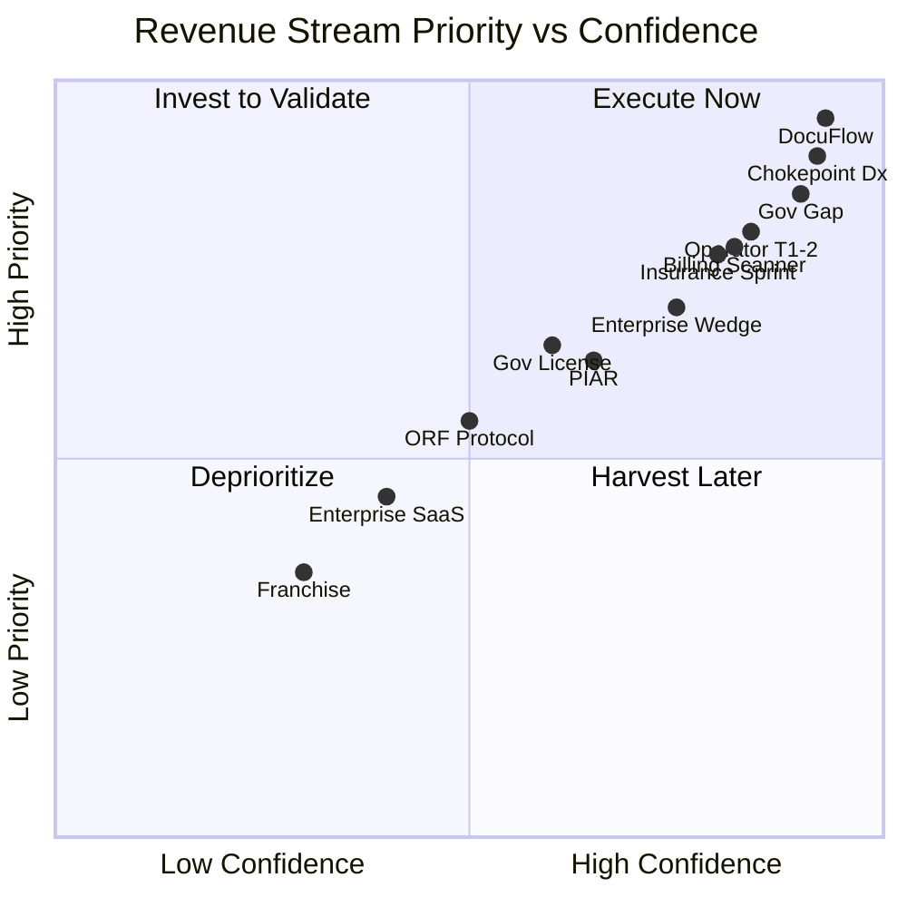

---

sidebar_position: 2
title: "Revenue Streams"
description: "Complete catalog of 25+ revenue streams with pricing, buyer personas, sales cycles, margins, confidence scores, and phase activation timelines."
tags: [product, financial]
custom_status: active
custom_owner: Andrew Leo
custom_last_review: 2026-03-01
custom_next_review: 2026-06-01
---

# Revenue Streams

The AINEFF Ecosystem operates **25+ distinct revenue streams** across products, services, licenses, and platform fees. Each stream is scored for confidence, ranked for priority, and gated by phase activation requirements.

## Primary Revenue Streams

| # | Stream | Price Point | Buyer Persona | Sales Cycle | Capital Required | Gross Margin | Strategic Leverage | Priority Rank | Confidence Score | Phase Activation |
|---|--------|------------|---------------|-------------|-----------------|-------------|-------------------|---------------|-----------------|-----------------|
| 1 | **DocuFlow Basic** | $19/mo | Solo consultants, freelancers | Self-serve (1-7 days) | $5K (dev + infra) | 85% | Gateway drug → ecosystem entry | 1 | 95% | Phase 0 |
| 2 | **DocuFlow Pay-As-You-Go** | $2/document | Small firms, occasional users | Self-serve (instant) | $0 (shared infra) | 90% | Usage data → upsell trigger | 2 | 93% | Phase 0 |
| 3 | **DocuFlow Pro** | $49/mo | Agencies, mid-size firms | Self-serve / demo (7-14 days) | $5K (dev + infra) | 82% | Feature lock-in → retention | 3 | 90% | Phase 0 |
| 4 | **Chokepoint Diagnostic** | $5,000-$15,000 | COO / VP Operations | Consultative (2-4 weeks) | $0 (labor only) | 100% | Identifies pain → drives all upsells | 4 | 92% | Phase 0 |
| 5 | **Governance Gap Analyzer** | Free → upsell | CEO / CTO / Compliance Officer | Self-serve (instant) | $2K (dev) | N/A (lead gen) | Qualification filter → pipeline | 5 | 90% | Phase 0 |
| 6 | **Billing Leakage Scanner** | $25,000 | CFO / Controller | Consultative (3-6 weeks) | $8K (dev + data) | 75% | Quantified savings → trust anchor | 6 | 82% | Phase 1 |
| 7 | **Insurance Claims Sprint** | $7,500-$12,000 | Claims Manager / VP Ops | Sprint-based (2-4 weeks) | $3K (tooling) | 70% | Vertical proof → data gravity | 7 | 80% | Phase 1 |
| 8 | **Operator Track 1** | $500 | Career changers, junior ops | Cohort enrollment (2-4 weeks) | $2K (content) | 80% | Talent pipeline → labor supply | 8 | 85% | Phase 1 |
| 9 | **Operator Track 2** | $750 | Track 1 graduates | Cohort enrollment (1-2 weeks) | $1K (content) | 82% | Skill deepening → deployment ready | 9 | 83% | Phase 1 |
| 10 | **Monthly Retainer** | $2,000-$5,000/mo | Established clients | Relationship (1-2 weeks) | $0 | 65% | Recurring base → predictable cash | 10 | 78% | Phase 1 |

## Expansion Revenue Streams

| # | Stream | Price Point | Buyer Persona | Sales Cycle | Capital Required | Gross Margin | Strategic Leverage | Priority Rank | Confidence Score | Phase Activation |
|---|--------|------------|---------------|-------------|-----------------|-------------|-------------------|---------------|-----------------|-----------------|
| 11 | **Enterprise Wedge (90-Day)** | $8,000-$15,000 | COO / CFO mid-market | Consultative (4-6 weeks) | $5K (cell setup) | 55% | Proof engine → expansion trigger | 11 | 75% | Phase 2 |
| 12 | **Operator Track 3** | $1,000 | Track 2 graduates | Cohort enrollment (1 week) | $1K (content) | 83% | Specialization → higher placement | 12 | 78% | Phase 2 |
| 13 | **Operator Track 4** | $1,250 | Track 3 graduates | Cohort enrollment (1 week) | $1K (content) | 84% | Leadership certification → premium | 13 | 75% | Phase 2 |
| 14 | **Operator Track 5** | $1,500 | Track 4 graduates | Cohort enrollment (1 week) | $1K (content) | 85% | Master operator → franchise ready | 14 | 72% | Phase 2 |
| 15 | **Implementation Sprint** | $15,000 | VP Ops / CTO | Project-based (4-8 weeks) | $3K (tooling) | 68% | Deployment depth → switching cost | 15 | 73% | Phase 2 |
| 16 | **Governance License** | $200,000 | Chief Compliance Officer / GC | Enterprise sales (3-6 months) | $25K (legal + dev) | 72% | Regulatory moat → annual renewal | 16 | 60% | Phase 2 |
| 17 | **PIAR Engagement** | $25,000-$75,000 | Board / C-Suite | Executive sales (2-3 months) | $10K (methodology) | 78% | Pre-incident liability → must-have | 17 | 65% | Phase 2 |

## Scale Revenue Streams

| # | Stream | Price Point | Buyer Persona | Sales Cycle | Capital Required | Gross Margin | Strategic Leverage | Priority Rank | Confidence Score | Phase Activation |
|---|--------|------------|---------------|-------------|-----------------|-------------|-------------------|---------------|-----------------|-----------------|
| 18 | **ORF Protocol License** | $500,000 | Enterprise / Government | Strategic sales (6-12 months) | $50K (legal + tech) | 80% | Constitutional framework → standard | 18 | 50% | Phase 3 |
| 19 | **IP Licensing — System IP** | $50K-$250K | Platform companies | Strategic (3-6 months) | $15K (legal) | 85% | Architecture replication → scale | 19 | 55% | Phase 3 |
| 20 | **IP Licensing — Process IP** | $10K-$50K | Consulting firms | Consultative (2-4 weeks) | $5K (packaging) | 90% | SOP distribution → influence | 20 | 60% | Phase 3 |
| 21 | **Data Products** | $5K-$100K/yr | Analysts, funds, insurers | Self-serve / sales (2-8 weeks) | $20K (pipeline) | 75% | Data gravity → competitive moat | 21 | 45% | Phase 3 |
| 22 | **Platform Transaction Fees** | 2-5% of GMV | Marketplace participants | Organic (ongoing) | $30K (platform) | 60% | Network effects → winner-take-most | 22 | 40% | Phase 3 |

## Dominance Revenue Streams

| # | Stream | Price Point | Buyer Persona | Sales Cycle | Capital Required | Gross Margin | Strategic Leverage | Priority Rank | Confidence Score | Phase Activation |
|---|--------|------------|---------------|-------------|-----------------|-------------|-------------------|---------------|-----------------|-----------------|
| 23 | **Enterprise SaaS** | $50K-$500K ARR | CTO / CIO | Enterprise sales (6-12 months) | $100K (eng + sales) | 70% | Multi-year contracts → stability | 23 | 40% | Phase 4 |
| 24 | **White-Label Licensing** | $250K+ | ISVs, system integrators | Strategic (6-12 months) | $50K (packaging) | 82% | Distribution multiplication → reach | 24 | 35% | Phase 4 |
| 25 | **Franchise Models** | $100K+ setup + 8% royalty | Regional operators | Franchise sales (3-6 months) | $75K (ops manual) | 65% | Geographic expansion → coverage | 25 | 30% | Phase 4 |
| 26 | **Joint Venture Revenue** | Variable | Strategic partners | Negotiated (6-12 months) | $25K (legal) | 50% | Aligned incentives → co-creation | 26 | 25% | Phase 4 |
| 27 | **Certification Authority Fees** | $500-$2,000/cert | Professionals, firms | Self-serve / cohort | $10K (platform) | 88% | Credential monopoly → standard | 27 | 45% | Phase 3-4 |

## Revenue Stream Prioritization Matrix

## Revenue by Recurrence Model

| Model | Streams | % of Phase 0-1 Revenue | % of Phase 3-4 Revenue |
|-------|---------|----------------------|----------------------|
| **One-Time Projects** | Diagnostics, Sprints, Implementations | 60% | 15% |
| **Recurring Subscriptions** | DocuFlow, Retainers, Enterprise SaaS | 25% | 45% |
| **Usage-Based** | Pay-per-doc, Platform fees, API calls | 5% | 20% |
| **Licensing** | Governance, ORF, IP, White-Label | 10% | 20% |

## Revenue Activation Dependencies

Each stream has prerequisite conditions that must be satisfied before activation:

| Stream | Prerequisites |
|--------|--------------|
| DocuFlow | MVP built, landing page live, payment processing active |
| Chokepoint Diagnostic | Methodology documented, 1 case study complete |
| Billing Leakage Scanner | Detection algorithm validated, sample dataset processed |
| Operator Track | Curriculum designed, first cohort recruited (min 5) |
| Insurance Claims Sprint | 1 founding client signed, claims workflow mapped |
| Enterprise Wedge | 3 completed diagnostics, 1 retainer client, Venture Cell staffed |
| Governance License | PIAR methodology proven, legal review complete, compliance framework validated |
| ORF Protocol | Governance License adopted by 3+ enterprises, regulatory alignment confirmed |

## Revenue Concentration Risk

Target revenue distribution to mitigate concentration risk:

| Risk Metric | Threshold | Target |
|-------------|-----------|--------|
| Top client as % of revenue | Max 25% | &lt;15% |
| Top 3 clients as % of revenue | Max 50% | &lt;35% |
| Single stream as % of revenue | Max 40% | &lt;25% |
| Single vertical as % of revenue | Max 50% | &lt;35% |
| Recurring as % of total | Min 30% | &gt;50% by Phase 2 |
