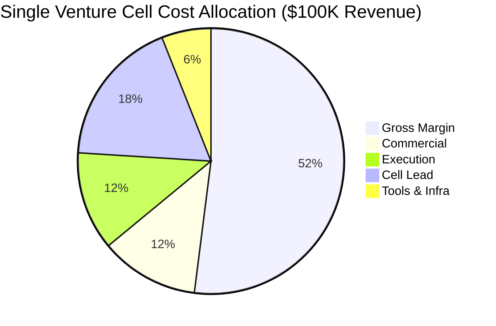
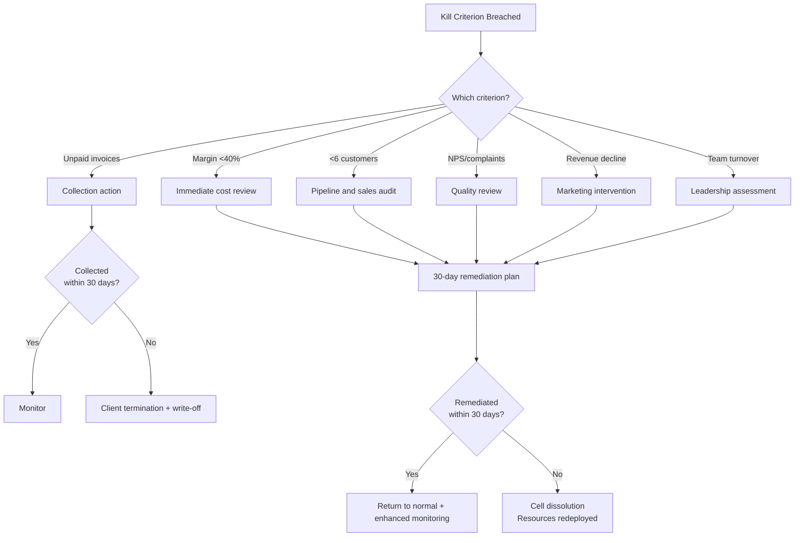

---

sidebar_position: 11
title: "Unit Economics"
description: "Single Venture Cell economics — revenue modeling, cost structure, margin analysis, 6-month financial model, portfolio projections, and kill criteria."
tags: [product, financial]
custom_status: active
custom_owner: Andrew Leo
custom_last_review: 2026-03-01
custom_next_review: 2026-06-01
---

# Unit Economics

The fundamental economic unit of the AINEFF Ecosystem is the **Venture Cell** — a 3-5 person execution team that delivers client engagements, generates revenue, and operates as a self-contained P&L center. All ecosystem economics roll up from this atomic unit.

## Single Venture Cell Economics

### Revenue Model

| Metric | Value | Notes |
|--------|-------|-------|
| **Annual Revenue Target** | $100,000 | Conservative baseline for a single cell |
| **Average Deal Size** | $12,000 | Blended across diagnostics, sprints, retainers |
| **Deals per Year** | 8-10 | ~1 deal per 5-6 weeks |
| **Revenue per Person** | $20,000-$33,000 | Based on 3-5 person cell |
| **Monthly Revenue Target** | $8,333 | $100K / 12 months |
| **Quarterly Revenue Target** | $25,000 | $100K / 4 quarters |

### Cost Structure

| Cost Category | Annual Cost | % of Revenue | Components |
|--------------|-----------|-------------|-----------|
| **Commercial (Sales & Marketing)** | $12,000 | 12% | Lead generation, CRM, proposal development, marketing collateral |
| **Execution (Delivery)** | $12,000 | 12% | Tooling, software licenses, client-facing materials, travel |
| **Lead (Cell Lead Compensation)** | $18,000 | 18% | Cell Lead salary allocation (partial — leads typically manage 2-3 cells) |
| **Tools & Infrastructure** | $6,000 | 6% | Cloud compute, SaaS subscriptions, communication tools, office/coworking |
| **Total Direct Costs** | **$48,000** | **48%** | |

### Margin Analysis

| Metric | Value |
|--------|-------|
| **Revenue** | $100,000 |
| **Total Direct Costs** | $48,000 |
| **Gross Margin ($)** | $52,000 |
| **Gross Margin (%)** | **52%** |
| **Contribution to Ecosystem Overhead** | $15,000 (15% of revenue) |
| **Net Cell Margin ($)** | $37,000 |
| **Net Cell Margin (%)** | **37%** |

### Cost Breakdown Visualization

## 6-Month Financial Model

### Assumptions

| Assumption | Value | Basis |
|-----------|-------|-------|
| Ramp period | 2 months (reduced revenue in Month 1-2) | New cell needs pipeline development |
| Target customers in 6 months | 6-9 | ~1-2 new customers per month after ramp |
| Average deal size | $12,000 | Weighted average across product mix |
| Monthly burn rate | $7,000 | Direct costs + allocated overhead |
| Working capital buffer | $15,000 | 2 months of burn as safety margin |

### Month-by-Month Projection

| Month | New Customers | Active Customers | Revenue | Costs | Monthly Surplus/(Deficit) | Cumulative |
|-------|--------------|-----------------|---------|-------|--------------------------|------------|
| 1 | 1 | 1 | $5,000 (partial) | $7,000 | ($2,000) | ($2,000) |
| 2 | 1 | 2 | $8,000 | $7,000 | $1,000 | ($1,000) |
| 3 | 1 | 3 | $12,000 | $7,000 | $5,000 | $4,000 |
| 4 | 2 | 4 | $18,000 | $7,500 | $10,500 | $14,500 |
| 5 | 1 | 5 | $20,000 | $7,500 | $12,500 | $27,000 |
| 6 | 1-2 | 6-7 | $22,000 | $8,000 | $14,000 | $41,000 |
| **6-Month Total** | **6-9** | | **~$85,000-$100,000** | **~$44,000-$48,000** | | **$41,000-$52,000** |

### Revenue Mix by Month

| Month | Diagnostics | Sprints/Implementations | Retainers | DocuFlow SaaS | Total |
|-------|------------|----------------------|-----------|--------------|-------|
| 1 | $5,000 | $0 | $0 | $0 | $5,000 |
| 2 | $5,000 | $0 | $2,000 | $1,000 | $8,000 |
| 3 | $5,000 | $5,000 | $2,000 | $0 | $12,000 |
| 4 | $5,000 | $7,500 | $4,000 | $1,500 | $18,000 |
| 5 | $5,000 | $7,500 | $6,000 | $1,500 | $20,000 |
| 6 | $5,000 | $7,500 | $8,000 | $1,500 | $22,000 |

### 6-Month Summary

| Metric | Conservative | Expected | Optimistic |
|--------|-------------|---------|-----------|
| **Total Customers** | 6 | 8 | 10 |
| **Average Deal Size** | $10,000 | $12,000 | $14,000 |
| **Total Revenue** | $85,000 | $100,000 | $120,000 |
| **Total Costs** | $44,000 | $46,000 | $48,000 |
| **Total Surplus** | $41,000 | $54,000 | $72,000 |
| **Margin** | 48% | 54% | 60% |
| **Monthly Burn** | $7,000 | $7,500 | $8,000 |
| **Breakeven Month** | Month 3 | Month 2 | Month 2 |

## Portfolio Economics: 10 Cells

### Scaling Model

| Metric | 1 Cell | 5 Cells | 10 Cells | 20 Cells |
|--------|--------|---------|----------|----------|
| **Team Size** | 3-5 | 15-25 | 30-50 | 60-100 |
| **Annual Revenue** | $100K | $500K | $1M | $2M |
| **Direct Costs** | $48K | $230K | $440K | $840K |
| **Gross Margin** | $52K | $270K | $560K | $1.16M |
| **Gross Margin %** | 52% | 54% | 56% | 58% |
| **Ecosystem Overhead** | $15K | $60K | $100K | $175K |
| **Net Margin** | $37K | $210K | $460K | $985K |
| **Net Margin %** | 37% | 42% | 46% | 49% |

### Why Margins Improve with Scale

| Scale Benefit | Impact | Mechanism |
|--------------|--------|-----------|
| **Shared Cell Leads** | -3% cost at 5+ cells | One lead manages 2-3 cells |
| **Tool Cost Amortization** | -2% cost at 10+ cells | Bulk licensing, shared infrastructure |
| **Knowledge Reuse** | +3% revenue efficiency | Templates, playbooks, case studies from prior cells |
| **Cross-Sell Pipeline** | +5% revenue per cell | Existing clients referred between cells |
| **Brand Premium** | +2% pricing power | More case studies = justified premium |

### Portfolio Financial Model

| Metric | Year 1 (5 cells) | Year 2 (10 cells) | Year 3 (20 cells) |
|--------|-----------------|-------------------|-------------------|
| Revenue | $500K | $1.2M | $2.8M |
| Direct Costs | $230K | $528K | $1.12M |
| Gross Margin | $270K (54%) | $672K (56%) | $1.68M (60%) |
| Ecosystem Overhead | $60K | $120K | $200K |
| Net Income | $210K | $552K | $1.48M |
| Net Margin % | 42% | 46% | 53% |
| Headcount | 15-25 | 30-50 | 60-100 |
| Revenue per Person | $20K-$33K | $24K-$40K | $28K-$47K |

## Annualized Projection: $2M Target

### The $2M Benchmark

| Component | Value | Calculation |
|-----------|-------|------------|
| Cells required | 10 | $2M / $200K per cell (at scale) |
| People required | 30-50 | 10 cells x 3-5 people |
| Average cell revenue (at scale) | $200K | Improved from $100K baseline through upsells and efficiency |
| Total revenue | $2M | 10 x $200K |
| Total costs | $880K | 44% of revenue at scale |
| Total margin | $1.12M | 56% gross margin |
| Ecosystem overhead | $200K | 10% of revenue at scale |
| Net income | $920K | 46% net margin |

### Path to $200K per Cell (from $100K Baseline)

| Revenue Driver | Additional Revenue | Mechanism |
|---------------|-------------------|-----------|
| Higher average deal size ($12K → $16K) | +$32K | Upsell ladder maturity, brand premium |
| More deals per year (8 → 10) | +$20K | Improved pipeline, referrals, marketing |
| Retainer conversion (30% → 50% of clients) | +$24K | Relationship depth, ongoing value delivery |
| Cross-sell to other products | +$24K | DocuFlow, Training, Governance |
| **Total increase** | **+$100K** | **$100K → $200K per cell** |

## Kill Criteria

Venture Cells operate under strict kill criteria. If any threshold is breached, the cell enters a 30-day remediation period. If not remediated, the cell is dissolved and resources are redeployed.

### Cell-Level Kill Criteria

| # | Kill Criterion | Threshold | Measurement Period | Action if Breached |
|---|---------------|-----------|-------------------|-------------------|
| 1 | **Customer Acquisition** | &lt;6 customers in first 6 months | Rolling 6-month | 30-day remediation → dissolve |
| 2 | **Gross Margin** | &lt;40% blended margin | Rolling 3-month | Immediate cost review → remediation |
| 3 | **Unpaid Invoices** | Any unpaid invoices on balance sheet &gt;90 days | Continuous | Collection action → client termination → write-off |
| 4 | **Customer Satisfaction** | NPS &lt;20 or &gt;2 client complaints in 90 days | Rolling 90-day | Quality review → process correction |
| 5 | **Revenue Growth** | Flat or declining revenue for 3 consecutive months | Rolling 3-month | Pipeline review → marketing intervention |
| 6 | **Team Health** | &gt;50% team turnover in 6 months | Rolling 6-month | Leadership review → Cell Lead assessment |

### Portfolio-Level Kill Criteria

| # | Kill Criterion | Threshold | Measurement Period | Action if Breached |
|---|---------------|-----------|-------------------|-------------------|
| 1 | **Portfolio Margin** | &lt;45% blended across all cells | Rolling quarter | Underperforming cells identified for remediation |
| 2 | **Revenue Concentration** | Single client &gt;25% of portfolio revenue | Continuous | Diversification mandate |
| 3 | **Cell Failure Rate** | &gt;30% of cells in remediation simultaneously | Continuous | Pause new cell formation, focus on recovery |
| 4 | **Cash Reserve** | &lt;3 months of portfolio burn in reserve | Monthly | Hiring freeze, cost reduction |
| 5 | **Customer Churn** | &gt;20% annual logo churn across portfolio | Rolling 12-month | Product/service quality audit |

### Kill Criteria Decision Tree

## Unit Economics Benchmarks

### Industry Comparison

| Metric | AINEFF Venture Cell | Consulting Firm | SaaS Startup | Agency |
|--------|-------------------|----------------|-------------|--------|
| Revenue per person | $20K-$47K | $150K-$300K | $100K-$200K | $80K-$150K |
| Gross margin | 52-60% | 40-60% | 70-85% | 35-50% |
| Sales cycle | 2-6 weeks | 2-6 months | Self-serve to 3 months | 2-8 weeks |
| Customer acquisition cost | $1,500-$2,500 | $10K-$50K | $500-$5K | $2K-$10K |
| Annual churn | &lt;10% (target) | 15-25% | 5-15% | 20-40% |
| Time to breakeven | 2-3 months | 6-12 months | 12-24 months | 3-6 months |

:::note
Revenue per person appears low compared to consulting firms because Venture Cells are designed for **scale through multiplication** (more cells), not **scale through leverage** (more revenue per person). The 52-60% margin on $100K-$200K per cell compounds across 10-20 cells to produce $2M+ with 46%+ net margins.
:::
