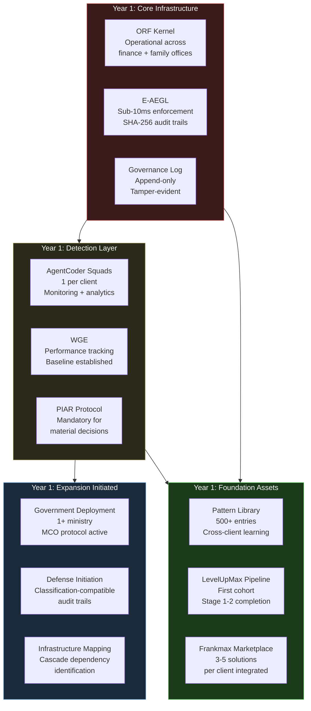
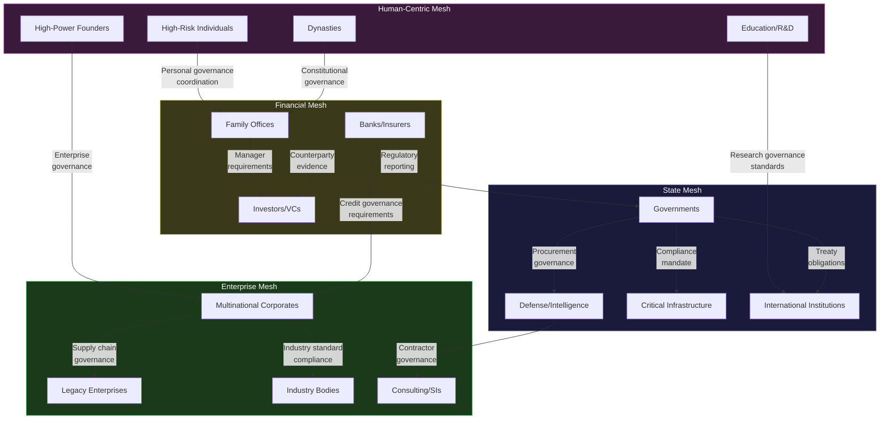
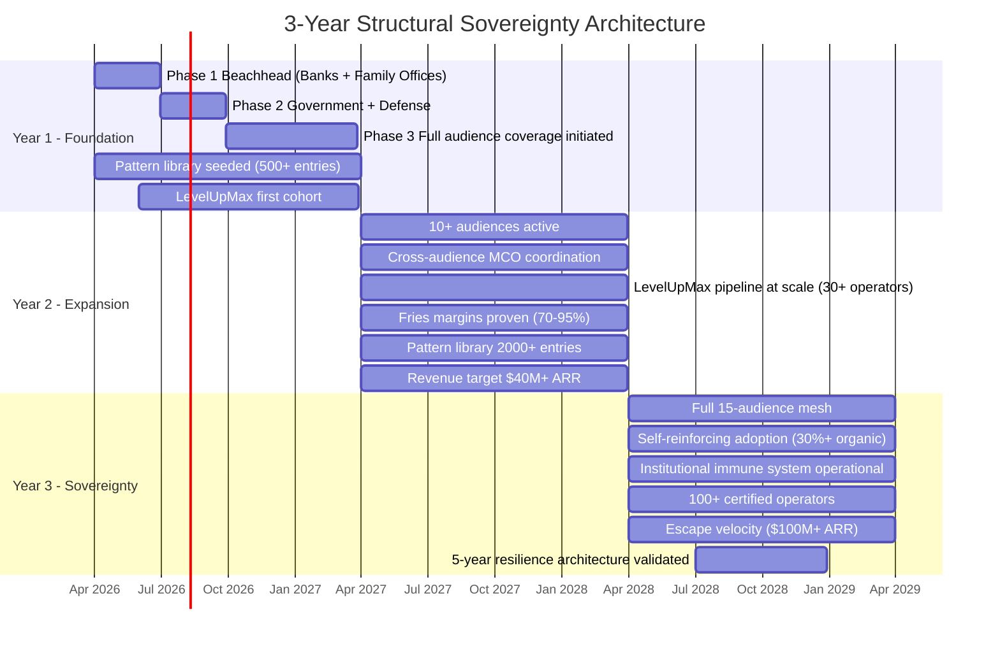

# 3-Year Structural Sovereignty Architecture

The 90-day roadmap proves AINEFF works. The deployment blueprint sequences it across audiences. This document answers the question that matters to anyone committing institutional resources to AINEFF: **what does this become over three years, and can it survive the things that kill every other governance initiative?**

Most governance programs die in Year 2. The energy of the launch fades, the executive sponsor moves to a new role, the organization's immune system rejects the foreign body, and the governance infrastructure quietly degrades into checkbox compliance. AINEFF is designed to resist this pattern — but design intent and operational reality are different things. This architecture specifies what must be true at the end of each year, what structural threats emerge at each stage, and what the system must survive to reach escape velocity.

---

## Year 1: Foundation

### Objective

Core infrastructure operational. Beachhead audiences (banks/insurers, family offices) generating measurable entropy reduction. Government and defense deployments initiated. Pattern library seeded with \> 500 validated entries. Revenue model validated.

### What Must Be True by Month 12

| Condition | Measurement | Failure Threshold |
|---|---|---|
| ORF kernel operational across all Phase 1 + 2 clients | 100% of irreversible actions bound to named liability bearers | Any client with \< 90% coverage |
| E-AEGL audit trails continuous | Zero unplanned gaps exceeding 1 hour across all deployments | Any deployment with \> 3 unplanned gaps in a quarter |
| Entropy reduction demonstrated | \> 15% net entropy reduction across Phase 1 clients | Any Phase 1 client showing entropy increase |
| Government deployment operational | \> 1 ministry with ORF kernel and MCO protocol active | Zero government deployments by Month 12 |
| Defense deployment initiated | Classification-compatible audit trails operational | Defense deployment not started by Month 9 |
| Pattern library seeded | \> 500 validated entropy pattern entries | \< 200 entries (insufficient data for compounding) |
| Revenue from Fries layer | \> $10M ARR from ongoing governance services | \< $5M ARR (economic model not validated) |
| Client retention | 100% of Phase 1 clients renewed | Any Phase 1 client lost |

### Structural Threats in Year 1

1. **Beachhead failure cascade** — If Phase 1 clients do not renew, Phase 2 loses its evidence base. Government clients will not adopt based on Frankmax's claims; they will adopt based on their banks' evidence. No bank evidence, no government adoption.
2. **Engineering underinvestment** — The temptation to divert engineering resources from infrastructure hardening to new client features. Year 1 infrastructure debt compounds into Year 2 operational failures.
3. **Governance architect bottleneck** — The number of qualified governance architects is the binding constraint on deployment velocity. If Year 1 does not begin producing governance operators through LevelUpMax, Year 2 cannot scale.

### Year 1 Architecture Stack

---

## Year 2: Expansion

### Objective

10+ audience classes active. Cross-audience coordination operational. LevelUpMax pipeline producing operators at scale. Revenue model proving Fries margins (70-95%). Pattern library compounding — each new deployment is faster than the last.

### What Must Be True by Month 24

| Condition | Measurement | Failure Threshold |
|---|---|---|
| Active audience classes | \> 10 of 15 audiences with at least 1 operational client | \< 8 audiences active |
| Cross-audience MCO coordination | MCO protocol handling \> 50 cross-audience decisions per quarter | \< 20 decisions per quarter (coordination layer not used) |
| LevelUpMax operator output | \> 30 governance operators certified through full 6-stage pipeline | \< 15 operators (scaling bottleneck persists) |
| Fries margin validation | Ongoing governance services generating 70-95% gross margins | \< 60% gross margins (pricing or cost structure wrong) |
| Pattern library depth | \> 2,000 validated entries with cross-audience pattern matching | \< 1,000 entries (compounding not occurring) |
| Client entropy reduction trajectory | Average \> 30% net entropy reduction across all Year 1 clients | Any Year 1 client showing entropy plateau or increase |
| Revenue | \> $40M ARR | \< $20M ARR (growth trajectory insufficient for sustainability) |
| Frankmax marketplace penetration | \> 100 governance-compatible AI solutions deployed to clients | \< 50 solutions (marketplace not creating value) |

### Structural Threats in Year 2

1. **Governance fatigue** — Year 1 clients are 12-18 months into AINEFF governance. The initial energy has faded. Executive sponsors may have rotated. Operational users may be experiencing the administrative burden without remembering the pre-AINEFF chaos. This is where most governance programs die.
2. **Political capture at government clients** — Government deployments are now 6-12 months old. The governance infrastructure is valuable enough that internal factions want to control it. If AINEFF's constitutional layer can be captured by a ministry or agency, it becomes a tool of political power rather than institutional governance.
3. **Competitor emergence** — By Year 2, AINEFF's market presence is visible enough to attract competitors. Large consulting firms and enterprise software vendors will announce "governance AI" products. The differentiation must be structural (the evidence chain, the ORF kernel, the pattern library) rather than feature-based.
4. **Scaling complexity** — Moving from 3-5 clients to 30+ clients changes every operational dimension: support, deployment, quality assurance, pattern library management, cross-client coordination. The governance framework that works at 5 clients may not survive at 50 without structural adaptation.

### Year 2 Expansion Architecture

The critical Year 2 capability is **cross-audience coordination**. Year 1 audiences operate in relative isolation. Year 2 is where the network effects begin — but only if the coordination layer works.

| Cross-Audience Interaction | Coordination Mechanism | Example |
|---|---|---|
| Bank \to Corporate client | Bank's AINEFF governance evidence creates compliance expectations for corporate banking clients | Bank requires AINEFF-compatible governance evidence from any corporate client seeking a credit facility \> $100M |
| Government \to Infrastructure operator | Government AINEFF deployment creates regulatory expectations for infrastructure governance | Ministry of Energy requires AINEFF-compatible audit trails from all licensed energy operators |
| Family office \to Investment manager | Family office AINEFF governance requires investment managers to provide compatible reporting | Family office requires AINEFF-formatted performance attribution and fee transparency from all managers |
| Defense \to Defense contractor | Defense AINEFF deployment requires classification-compatible governance from supply chain | Defense ministry requires AINEFF-compatible governance evidence from all Tier 1 defense contractors |
| Dynasty \to Family office | Dynasty-level governance creates constitutional framework that family offices must operate within | Royal house governance charter requires all family-controlled entities to operate under AINEFF ORF kernel |

### LevelUpMax Pipeline at Scale

Year 2 is where LevelUpMax transitions from a pilot program to a critical production system. The pipeline must convert:

- **Bank compliance officers** into AINEFF governance operators who can manage the system without Frankmax engineers on-site.
- **Family office next-generation members** into governance-literate principals who understand the constitutional framework they are inheriting.
- **Government civil servants** into institutional governance managers who maintain AINEFF across political leadership changes.
- **Corporate governance professionals** into cross-unit coordination operators who replace matrix meeting structures with MCO-mediated coordination.

Target: \> 30 certified operators by Month 24. Each operator reduces Frankmax's per-client support cost by 40-60% and increases client retention (the client has invested in building internal capability).

---

## Year 3: Sovereignty

### Objective

Full 15-audience mesh operational. The system is self-sustaining — cross-audience forcing functions drive new adoption without direct Frankmax sales. Institutional immune system operational: the governance infrastructure detects and neutralizes its own decay. Frankmax achieving escape velocity.

### What Must Be True by Month 36

| Condition | Measurement | Failure Threshold |
|---|---|---|
| Full audience coverage | All 15 audience classes with at least 1 operational client | \< 13 audiences (coverage gaps undermine network effects) |
| Self-reinforcing adoption | \> 30% of new clients acquired through cross-audience forcing functions (not direct Frankmax sales) | \< 15% (network effects not materializing) |
| Institutional immune system | Automated detection of governance decay across all clients with self-correcting intervention | Manual intervention required for \> 50% of governance decay incidents |
| Pattern library maturity | \> 5,000 entries with predictive capability: identifying entropy patterns in new clients based on established patterns | \< 3,000 entries or prediction accuracy \< 60% |
| LevelUpMax operator ecosystem | \> 100 certified operators across all audience classes | \< 60 operators (still dependent on Frankmax personnel) |
| Revenue and sustainability | \> $100M ARR with Fries margins \> 70% | \< $60M ARR or margins \< 60% |
| Cross-audience mesh density | \> 200 active cross-audience MCO coordination channels | \< 100 channels (mesh is sparse) |
| Escape velocity indicator | Year-over-year revenue growth \> 80% without proportional headcount growth | Revenue growth \< 40% or headcount growing faster than revenue |

### Structural Threats in Year 3

1. **Institutional immune system failure** — The immune system concept assumes that AINEFF can detect its own governance decay. But who governs the governor? If the immune system itself degrades (because the people operating it experience the same fatigue and capture dynamics as any other governance system), the self-correcting mechanism fails silently.
2. **Regulatory backlash** — By Year 3, AINEFF's governance evidence chains span multiple jurisdictions and audiences. Regulators may view this as an information concentration risk. Anti-trust scrutiny of a single governance framework operating across banks, governments, and infrastructure is plausible.
3. **Client dependency reversal** — Clients locked in by evidence chains may resent the lock-in. If competitors offer "evidence chain migration" services, the lock-in that drives Fries margins becomes a retention liability.
4. **Frankmax organizational entropy** — Frankmax itself is subject to the same entropy dynamics it helps clients metabolize. By Year 3, Frankmax has 100+ employees, 50+ clients, and operations across multiple jurisdictions. If Frankmax does not run AINEFF on itself, it risks becoming the governance equivalent of the cobbler's children with no shoes.

### The 15-Audience Sovereign Mesh

Year 3 is when the 15 audiences stop being independent deployments and become a mesh — a network where governance evidence flows between audiences, creating structural integrity that no single deployment could achieve alone.

---

## 5-Year Resilience Architecture

The 3-year plan builds the system. The 5-year question is whether the system survives the things that destroy every institutional governance framework ever built. The following tests are not theoretical — they are the specific failure modes that will be attempted against AINEFF by the combined forces of institutional inertia, political ambition, economic incentive, and adversarial intent.

### Test 1: Leadership Turnover

**Scenario:** Frankmax's founding team departs or is incapacitated. Simultaneously, 3 of 5 largest client executive sponsors rotate to new roles.

**Survivability requirement:** The system must operate for \> 6 months without any founding team member and without original executive sponsors, with zero degradation in governance log integrity, E-AEGL enforcement, or ORF kernel compliance.

**Structural defense:** LevelUpMax operator ecosystem (100+ certified operators) distributes operational knowledge. E-AEGL and ORF kernel operate automatically — they do not require human attention to enforce. The governance log is append-only and hash-chained — it cannot be degraded by personnel changes. Pattern library compounds independently of individual knowledge.

**Residual risk:** Strategic direction, not operational continuity, is the vulnerability. The system will continue enforcing governance, but the adaptation layer — the part that evolves governance in response to new entropy patterns — depends on human judgment that may not survive leadership turnover.

### Test 2: Political Capture

**Scenario:** A government ministry deploys AINEFF and a newly appointed minister attempts to use the governance infrastructure to suppress political opponents' access to information, to override accountability structures for politically convenient decisions, or to weaponize the audit trail for selective prosecution.

**Survivability requirement:** The constitutional layer must resist political capture. The ORF kernel must enforce accountability even against the minister. The audit trail must not be selectively accessible.

**Structural defense:** E-AEGL enforcement is automated and cannot be overridden without triggering an immediate Frankmax Integrity Halt. The audit trail is hash-chained — selective access creates a verifiable gap. The ORF kernel does not distinguish between a minister and a clerk — irreversible actions require bound liability bearers regardless of political rank.

**Residual risk:** The minister can defund the AINEFF deployment. Political capture does not need to compromise the system — it can simply remove it. The structural defense against this is the evidence chain lock-in: removing AINEFF means losing the governance evidence chain, which regulators and international partners depend on. The cost of removal exceeds the cost of tolerating the constraints.

### Test 3: Incentive Corruption

**Scenario:** Frankmax's revenue growth creates incentives to weaken governance constraints in exchange for faster client onboarding. The sales team pushes for "AINEFF-lite" deployments that skip PIAR requirements. The engineering team reduces E-AEGL enforcement strictness to lower infrastructure costs.

**Survivability requirement:** The framework must resist internal pressure to weaken its own constraints.

**Structural defense:** AINEFF runs on itself. Frankmax's own governance is subject to the same ORF kernel, E-AEGL enforcement, and PIAR requirements as any client. Weakening client constraints would require first weakening Frankmax's own constitutional framework — which requires a formal amendment process with supermajority ratification.

**Residual risk:** The amendment process itself can be captured. If Frankmax's board is composed of investors whose incentives align with growth over governance integrity, the supermajority ratification may not be a meaningful check.

### Test 4: Decision Latency Growth

**Scenario:** By Year 5, the MCO protocol is coordinating decisions across 200+ cross-audience channels. Each channel adds coordination overhead. The system designed to reduce decision latency begins to increase it because the coordination mesh is too dense.

**Survivability requirement:** Decision latency across the mesh must not exceed 2x the single-audience latency at any point. If it does, the coordination layer is producing more entropy than it absorbs.

**Structural defense:** MCO protocol includes automatic complexity circuit breakers. When coordination latency exceeds defined thresholds, the protocol automatically reduces the number of audiences that must ratify a decision — defaulting to bilateral coordination rather than mesh-wide coordination. Escalation to full mesh only for decisions that structurally require it.

**Residual risk:** Circuit breakers reduce coordination quality to maintain coordination speed. Some cross-audience effects may be missed because the circuit breaker excluded an affected audience from the coordination process.

### Test 5: Information Integrity Attack

**Scenario:** A sophisticated adversary (state actor, competitor, disgruntled insider) attempts to compromise the SHA-256 hash-chained audit trail. Not by breaking the cryptography — by compromising the inputs. If the governance events recorded in the log are themselves fabricated (false authorizations, backdated decisions, synthetic audit events), the hash chain faithfully records lies.

**Survivability requirement:** The system must detect fabricated governance events within 24 hours. The audit trail must be resistant to input manipulation, not just output tampering.

**Structural defense:** Cross-system reconciliation. Governance log events are correlated with operational system data (banking transactions, meeting calendars, communication logs). Fabricated governance events that do not correlate with operational reality are flagged automatically. AgentCoder analysis includes anomaly detection for governance event patterns that deviate from established baselines.

**Residual risk:** A sufficiently sophisticated attacker who can fabricate both governance events and the operational data they should correlate with can defeat the reconciliation system. This requires compromise of both AINEFF and the client's operational systems simultaneously — a high bar, but not impossible for a state-level adversary.

---

## Economic Sustainability

### When Does Frankmax Break Even?

| Milestone | Projected Timeline | Assumptions |
|---|---|---|
| Phase 1 revenue commencement | Month 4 | 2-3 beachhead clients paying Burger-rate engagement fees |
| Fries revenue initiation | Month 7 | Phase 1 clients transition from implementation to ongoing governance services |
| Monthly cash flow break-even | Month 18-24 | 10+ clients on Fries revenue, margins \> 70% |
| Cumulative break-even | Month 24-30 | Cumulative Fries revenue exceeds cumulative investment (Phase 1-3 deployment costs) |
| Self-funding growth | Month 30-36 | Fries revenue from existing clients funds new client acquisition without external capital |

### When Does the Ecosystem Become Self-Reinforcing?

The ecosystem becomes self-reinforcing when three conditions are simultaneously true:

1. **Cross-audience forcing functions exceed direct sales.** More than 30% of new clients adopt AINEFF because their counterparties, regulators, or partners require governance evidence compatibility — not because Frankmax sold them. Projected: Month 30-36.
2. **Pattern library compounding exceeds linear scaling.** Each new client deployment takes less time and cost than the previous one because the pattern library provides pre-validated entropy maps. Projected: Month 24-30 (requires \> 2,000 pattern library entries).
3. **LevelUpMax operator output exceeds Frankmax hiring.** The pipeline produces more governance operators than Frankmax needs to hire — meaning operators are entering the market and creating demand for AINEFF-compatible governance tools. Projected: Month 30-36.

### Revenue Trajectory

| Period | ARR Projection | Client Count | Gross Margin |
|---|---|---|---|
| Month 6 | $2M-$5M | 3-5 | 40-50% (Burger phase) |
| Month 12 | $10M-$20M | 10-15 | 55-65% (Burger-to-Fries transition) |
| Month 18 | $25M-$40M | 20-30 | 65-75% (Fries ramping) |
| Month 24 | $40M-$70M | 30-50 | 70-80% (Fries dominant) |
| Month 30 | $70M-$100M | 50-80 | 75-85% (Fries + Kitchen leverage) |
| Month 36 | $100M-$150M | 80-120 | 80-95% (Full Kitchen effect) |

:::info[Margin Expansion Mechanics]
Margins expand because the Kitchen layer amortizes across all clients. Each new client benefits from the pattern library, the deployment playbooks, and the LevelUpMax operator base — all of which were funded by previous clients. The marginal cost of deploying AINEFF to client #80 is 30-50% of the cost of deploying to client #5.
:::

---

## Adversarial Scenarios and Defensive Postures

### Scenario 1: Major Consulting Firm Launches "Governance AI"

**Threat profile:** Accenture, McKinsey, or Deloitte announces a governance AI platform with 50x Frankmax's sales force and existing relationships with every potential client.

**Defensive posture:** Frankmax's moat is not the technology — it is the ORF kernel, the evidence chain, and the pattern library. Consulting firms can build dashboards and analytics. They cannot replicate the constitutional layer because their revenue model (billable hours, engagement extensions) is structurally incompatible with a governance framework designed to make the client self-sufficient. The consulting firm's product will lack the ORF kernel because single-point accountability threatens the consulting model (who is the liability bearer for a McKinsey recommendation?).

**Action required:** Accelerate pattern library growth to create a data moat that cannot be replicated without 2+ years of deployment history.

### Scenario 2: Government Mandates Open Governance Standards

**Threat profile:** A G7 government mandates that all governance AI systems must comply with an open standard — effectively preventing proprietary lock-in.

**Defensive posture:** AINEFF's lock-in is not in the protocol — it is in the evidence chain. The SHA-256 hash-chained audit trail is mathematically standard. The governance log format can be open. The ORF kernel enforcement logic can be documented. What cannot be replicated is the institutional memory — years of governance events, accountability bindings, and entropy measurements stored in a client's governance log. Migration means starting the evidence chain from scratch.

**Action required:** Proactively publish AINEFF governance standards as open specifications. Make the protocol open while keeping the implementation and the pattern library proprietary.

### Scenario 3: Client Data Breach Exposes Governance Logs

**Threat profile:** A sophisticated breach at a major AINEFF client exposes governance log data, revealing decision-making patterns, accountability failures, and internal governance weaknesses to adversaries, regulators, and the public.

**Defensive posture:** Governance logs are encrypted at rest and in transit. Client data sovereignty means Frankmax does not hold copies. But the breach occurs at the client's infrastructure. The structural defense is that the governance log reveals process — not content. Decision metadata (who authorized what, when) is less damaging than the underlying operational data (the actual financial transaction, the classified intelligence, the personal information).

**Action required:** Implement governance log data classification tiers. The most sensitive governance metadata (identity of liability bearers for classified decisions, accountability chains in defense contexts) receives additional encryption layers that survive a general infrastructure breach.

### Scenario 4: Frankmax Itself Is Compromised

**Threat profile:** An insider or external attacker compromises Frankmax's infrastructure, gaining access to the anonymized pattern library, client deployment configurations, and the AINEFF codebase.

**Defensive posture:** The pattern library contains anonymized data — no client can be identified from pattern entries. Client deployment configurations are useful for understanding governance architectures but do not contain operational data. The AINEFF codebase, if leaked, reveals the enforcement logic but not the deployment-specific calibrations that make it effective for each client.

**Action required:** Implement Frankmax-internal AINEFF deployment with the same rigor as client deployments. If AINEFF cannot protect Frankmax, it cannot credibly protect anyone else. Regular adversarial penetration testing of Frankmax infrastructure on a quarterly cycle.

---

## 3-Year Timeline

---

## The Escape Velocity Test

Frankmax reaches escape velocity when the following statement is true: **removing AINEFF from the sovereign ecosystem would cause more damage than any single institution's failure.** At that point, the framework is not a vendor product — it is infrastructure. And infrastructure does not get replaced by competitors. It gets regulated, maintained, and defended by the institutions that depend on it.

This is not a 3-year aspiration. It is a structural engineering target with measurable milestones. Every deployment, every evidence chain, every pattern library entry, every LevelUpMax operator, and every cross-audience coordination channel is a step toward the point where AINEFF's removal is more expensive than its continuation — for every participant simultaneously.

:::danger[The Honest Assessment]
Reaching escape velocity requires everything in this document to go approximately right. The deployment sequence must hold. The beachhead must succeed. The government forcing function must activate. The pattern library must compound. LevelUpMax must produce operators. The economic model must validate. And the system must survive leadership turnover, political capture, incentive corruption, and adversarial attack — all within 36 months.

The probability of all of these succeeding is not high. But the alternative — sovereign institutions continuing to operate without constitutional governance infrastructure while entropy compounds annually — is not a better outcome. The question is not whether this is hard. The question is whether the alternative is acceptable.
:::

---

## Related Documents

- [AINEFF Deployment Blueprint](./deployment-blueprint) — Phase-by-phase deployment sequencing
- [90-Day Deployment Roadmap](./90-day-roadmap) — Week-by-week Phase 1 execution plan
- [Cross-Audience Stabilization Strategy](./cross-audience-analysis) — Interdependency analysis between audience classes
- [Sovereign Anti-Entropy Deployment Architecture](./) — Master framework for all sovereign deployments
- [AINEFF Constitutional Law Layer](/docs/entities/aineff) — The constitutional framework underlying all deployments
- [ORF Protocol](/docs/entities/orf-protocol) — Obligation binding specifications
