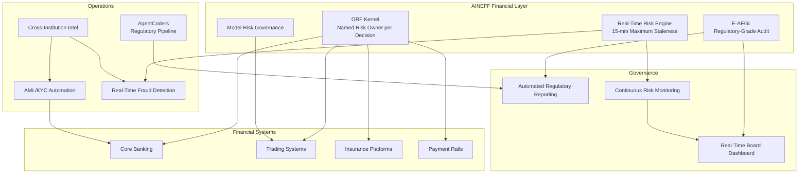
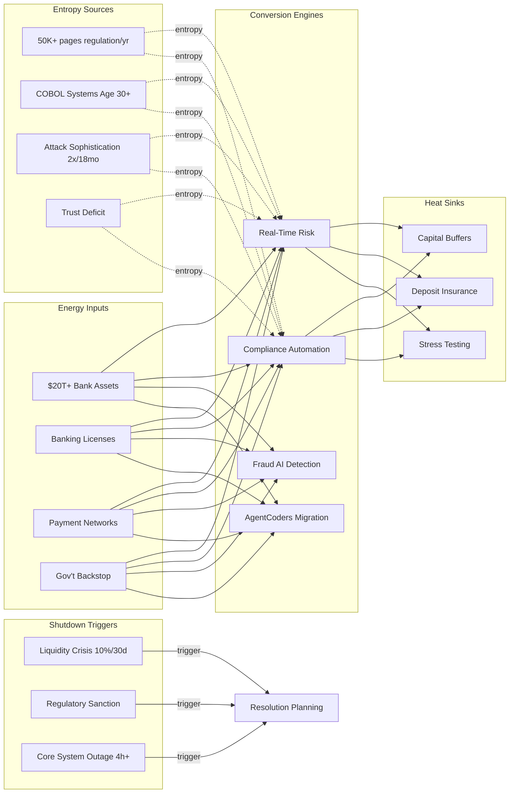

# Banks, Insurers & Financial Foundations

$270B+ annually in regulatory compliance costs. Core banking systems averaging 30+ years running COBOL. Fintech competitors capturing 10-15% of deposit relationships. Post-2008 trust deficit still measurable in customer behavior data. The financial services industry is the most heavily regulated sector on earth — and simultaneously the most dependent on legacy technology. AINEFF treats financial institutions as high-energy, high-entropy systems where regulatory compliance has become the dominant operational cost while actual risk management remains structurally inadequate.

:::danger Structural Reality
Silicon Valley Bank collapsed in 36 hours. Not because regulators were absent — because the risk model was structurally blind to interest rate duration mismatch in a rising rate environment. Compliance did not prevent failure. Governance did not prevent failure. The entropy was invisible until it was catastrophic. That is the pattern AINEFF must break.
:::

---

## 1. Entropy Vector Map

| Vector | Manifestation | Severity |
|--------|--------------|----------|
| **Strategy** | Strategic planning cycles of 3-5 years in an industry where fintech competitors pivot weekly. Strategy documents produced by consulting firms are obsolete before board approval. Digital banking strategy disconnected from core banking reality. M&A strategy driven by market positioning rather than operational integration capability. | **High** |
| **Operations** | Core banking systems processing 80-90% of transactions on 30-40 year old technology. $18.5M average breach cost (highest of any industry). 60-70% of operational staff performing manual compliance tasks that should be automated. Branch network optimization lagging demographic shifts by 5-10 years. | **Critical** |
| **Incentives** | Trader/banker compensation tied to short-term revenue generation, not risk-adjusted returns. Compliance officers incentivized by audit pass rates, not by actual risk reduction. Fintech partnerships stalled because internal teams perceive them as threats to headcount. | **Critical** |
| **Information** | Customer data fragmented across 50-200 systems per major bank. No real-time consolidated risk view — risk reporting is 24-48 hours stale. AML/KYC data duplicated across business lines with inconsistent quality. Threat intelligence siloed between fraud, cyber, and compliance teams. | **Critical** |
| **Culture** | Risk-averse culture prevents innovation adoption. "Move fast and break things" is existential threat in regulated finance. Compliance culture consuming innovation culture — every new initiative requires 6-12 months of compliance review. Talent culture losing to tech companies on compensation, flexibility, and perceived impact. | **High** |
| **Capital** | CET1 requirements locking 10-15% of capital in regulatory buffers. Compliance spend growing 15-20% annually while revenue grows 3-5%. Technology investment constrained by legacy maintenance burden (70%+ of IT budget). Insurance combined ratios under pressure from climate risk repricing. | **High** |
| **Governance** | Board risk committees reviewing 200-page risk reports quarterly — cognitive overload preventing actual risk oversight. Regulatory overlap (OCC, Fed, FDIC, SEC, CFPB in US alone) creating contradictory compliance requirements. Three lines of defense model creating accountability diffusion rather than clarity. | **High** |

---

## 2. Early Entropy Signals

1. **Compliance cost as percentage of revenue** exceeding 10% — regulatory burden consuming operational capacity
2. **Core system incident frequency** increasing quarter-over-quarter — legacy infrastructure degradation accelerating
3. **Digital channel adoption rate** plateauing below 60% — technology investment not translating to customer migration
4. **Fintech partnership failure rate** above 50% — institutional immune response rejecting innovation
5. **Cybersecurity detection time** above 100 days — threat landscape evolving faster than defensive capability
6. **Risk model exception frequency** increasing — models failing to predict actual risk events, requiring manual overrides
7. **Regulatory enforcement action frequency** increasing — compliance theater failing to achieve actual compliance

---

## 3. 3–5 Year Decay Model

| Dimension | Projection |
|-----------|-----------|
| **Financial cost of entropy** | $50-150B annually across global banking in compliance overhead, legacy system maintenance, fraud losses, and operational inefficiency. Each major system outage costs $50-200M in direct losses plus regulatory penalties. Core banking replacement programs averaging $500M-2B per major institution with 60% failure rate. |
| **Institutional trust erosion** | Post-SVB, regional bank trust deficit persists for 3-5 years. Each new bank failure or fintech fraud case reinforces public perception that financial system governance is inadequate. Trust erosion translates directly to deposit flight velocity — digitally-enabled customers can move funds in seconds. |
| **Competitive vulnerability** | Neobanks operating at 1/10th the cost-to-serve of traditional banks. Embedded finance removing bank intermediation from customer journey. CBDC development potentially disintermediating commercial bank deposit function. Insurance disintermediation through parametric and peer-to-peer models. |
| **Regulatory fragility** | Basel III endgame, DORA, AI regulation creating compliance requirements that legacy systems cannot automate. Compliance cost growth trajectory crosses revenue growth trajectory within 5-8 years for mid-tier institutions — compliance becomes structurally unaffordable. |

---

## 4. AINEFF Deployment Architecture

### Structural Constraints

- **ORF Kernel**: Every risk decision (lending, trading, underwriting) must have a named individual liability bearer — not a committee, not a model, not an algorithm. AI can inform; humans must be accountable
- **E-AEGL Audit Compliance**: All financial decisions logged with tamper-evident hash chains meeting regulatory evidence standards (SOX, MiFID II, DORA)
- **Real-Time Risk Visibility**: No risk metric may be more than 15 minutes stale. End of T+1 risk reporting is a governance breach
- **Model Risk Governance**: Every AI/ML model used in risk decisions must have documented failure modes, bias assessments, and human override mechanisms

### Governance Hardening

- Three lines of defense replaced with AINEFF's continuous governance model — risk monitoring is real-time, not periodic
- Board risk reporting automated from source data — eliminating the 200-page quarterly report in favor of real-time dashboards with anomaly alerts
- Regulatory reporting generated directly from operational data through E-AEGL — no manual preparation, no interpretation layer

### AI-Native Coordination

- AML/KYC automation through AI pattern detection with human review of flagged transactions (not human review of all transactions)
- Real-time fraud detection across all channels with sub-second response time
- AgentCoders squads maintaining regulatory reporting pipelines — automated adaptation to new regulatory requirements
- Cross-institution threat intelligence sharing through AINEFF coordination protocol

### Incentive Alignment

- Trader/banker compensation restructured: 50% base, 25% risk-adjusted annual, 25% 3-year deferred with clawback for risk events
- Compliance officer performance tied to risk reduction metrics, not audit findings
- Technology investment measured on operational resilience improvement, not project completion

### Information Integrity

- Unified customer data layer across all business lines — one customer, one record, one risk profile
- Real-time consolidated balance sheet accessible to all risk functions
- Threat intelligence integrated across fraud, cyber, and compliance — no more siloed detection

---

## 5. Accountability Design

| Role | Accountability |
|------|---------------|
| **Chief Risk Officer (Enhanced)** | Single-point accountability for enterprise risk posture. AINEFF provides real-time risk visibility that eliminates the excuse of "we didn't know." CRO is accountable for what AINEFF makes visible, not just what reports show. |
| **Business Line Risk Owner** | Named individual per business line (retail, corporate, investment, insurance) accountable for risk-adjusted returns. Cannot delegate risk decisions to models — must sign off on model-informed decisions. |
| **Technology Resilience Officer** | Accountable for core system uptime, cybersecurity posture, and legacy modernization progress. When system outages exceed SLA, this role escalates — not IT operations. |
| **Regulatory Interface Officer** | Accountable for accuracy of all regulatory submissions. E-AEGL audit trail means discrepancies between operational reality and regulatory reporting are automatically flagged. |

**Decision Rights:**
- Lending/underwriting under policy limits: Business line (automated within AINEFF constraints)
- Exceptions to risk policy: Named risk owner + CRO joint approval with E-AEGL documentation
- Core system changes: Technology Resilience Officer + operational impact assessment
- Regulatory response: Regulatory Interface Officer with CRO escalation for material issues

---

## 6. Entropy-Reduction Metrics

| KPI | Current Baseline | Target (Year 1) | Target (Year 3) |
|-----|-----------------|-----------------|-----------------|
| **Capital Efficiency** | CET1 buffer 200-300bps above minimum | Optimized to 100-150bps above (freeing capital) | Dynamic buffer management based on real-time risk |
| **Decision Latency** | 24-48 hour risk reporting cycle | 15-minute maximum staleness | Real-time continuous |
| **Compliance Cost Ratio** | 10-15% of revenue | 8% | 5% (automation-driven) |
| **Information Distortion** | 50-200 fragmented customer systems | 30% consolidated | 80% consolidated |
| **Fraud Detection Speed** | 48-72 hours average detection | 4 hours | Real-time (sub-second) |
| **Incentive Coherence** | 20% comp tied to risk-adjusted metrics | 40% | 75% |

---

## 7. Thermodynamic System Model

### Energy Inputs
- **Capital**: $20T+ in global bank assets, $7T+ in insurance assets, deposit flows, premium income
- **Talent**: 2.5M+ banking employees globally, quantitative analysts, risk managers, compliance officers
- **Legitimacy**: Banking licenses, insurance charters, regulatory approval, deposit insurance backing
- **Information**: Transaction data, credit histories, market data, actuarial tables, threat intelligence
- **Political Trust**: Implicit government backstop (too-big-to-fail), central bank liquidity support
- **Network Power**: Payment network participation (SWIFT, Fedwire, CHIPS), interbank relationships, reinsurance treaties

### Entropy Sources
- **Regulatory Accumulation**: 50,000+ pages of new regulation annually across G20 jurisdictions with no decommission mechanism
- **Legacy System Decay**: COBOL lines of code running core banking with shrinking developer pool (average COBOL developer age 55+)
- **Incentive Misalignment**: Short-term revenue targets driving risk accumulation that materializes on longer timescales
- **Cognitive Overload**: Risk committee members processing 200+ page reports with declining comprehension
- **Cyber Threat Evolution**: Attack sophistication doubling every 18 months while defensive capability lags by 6-12 months
- **Trust Deficit**: Each crisis (2008, SVB, crypto) depletes trust reserves that take 10+ years to rebuild

### Conversion Engines
- **Real-Time Risk Models**: AINEFF converting stale batch-processed risk into continuous monitoring
- **Compliance Automation**: E-AEGL converting manual compliance into policy-enforced automation
- **Fraud AI**: Pattern detection converting reactive investigation into proactive prevention
- **AgentCoders Modernization**: Automated migration of legacy COBOL to modern platforms
- **Cross-Institution Coordination**: Shared threat intelligence reducing systemic vulnerability

### Heat Sinks
- **Capital Buffers**: CET1 and liquidity reserves absorbing financial shocks (acceptable cost of 200-300bps capital drag)
- **Regulatory Friction**: Deliberate slowdown on complex financial products prevents another 2008-style derivative accumulation
- **Deposit Insurance**: Government backstop preventing retail depositor panic cascades
- **Stress Testing**: Regular scenario analysis identifying vulnerabilities before they materialize

### Shutdown Triggers
- **Liquidity Crisis**: Deposit outflow exceeding 10% in any 30-day period triggers emergency protocols
- **Regulatory Sanction**: Consent order or cease-and-desist restricting business operations
- **Core System Failure**: Complete core banking system outage exceeding 4 hours triggers business continuity activation
- **Cyber Breach**: Confirmed unauthorized access to customer data or transaction systems triggers mandatory disclosure and remediation
- **Capital Adequacy Breach**: CET1 falling below minimum regulatory requirement triggers resolution planning activation

---

## 8. Adversarial Red-Team Critique

**How AINEFF fails for financial institutions:**

1. **Regulatory Resistance**: Financial regulators are the most conservative institutional actors on earth. They will not approve AINEFF as governance infrastructure without 3-5 years of regulatory sandbox testing. During that period, competitors deploying AINEFF in less regulated jurisdictions gain structural advantage. The framework must achieve regulatory acceptance, not just technical validation.

2. **Core System Integration**: AINEFF must interface with COBOL-era core banking systems that predate modern APIs by 30 years. The integration layer is the hardest engineering challenge — not because of AINEFF's architecture, but because of the architectural absence in legacy systems. Expect 18-36 months of integration work per major institution.

3. **Too-Big-To-Fail Moral Hazard**: AINEFF's governance improvements may actually be counterproductive for systemically important banks. If improved governance makes the bank more profitable and larger, it increases systemic risk — which is the opposite of regulatory intent. AINEFF must demonstrate that it reduces systemic concentration, not just institutional efficiency.

4. **Audit Trail Liability**: E-AEGL's tamper-evident audit trail creates a permanent record that regulators, prosecutors, and plaintiffs' attorneys can subpoena. Institutions may resist AINEFF precisely because it makes governance failures provably visible — ignorance is currently a viable legal defense. AINEFF eliminates plausible deniability.

5. **Cross-Institution Data Sharing**: AINEFF's coordination protocol for threat intelligence sharing requires competing institutions to share sensitive data. Antitrust concerns, competitive intelligence risks, and data protection regulations (GDPR, CCPA) create legal barriers that no technology framework can overcome unilaterally.

:::danger Critical Question
Can AINEFF operate within the regulatory constraints that define financial services without becoming another compliance layer that adds cost without reducing risk? If regulators classify AINEFF as a "critical third party" under DORA, it becomes subject to regulatory oversight itself — potentially making it slower and more expensive than the systems it replaces.
:::
