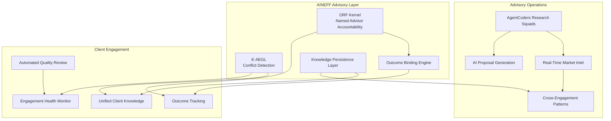
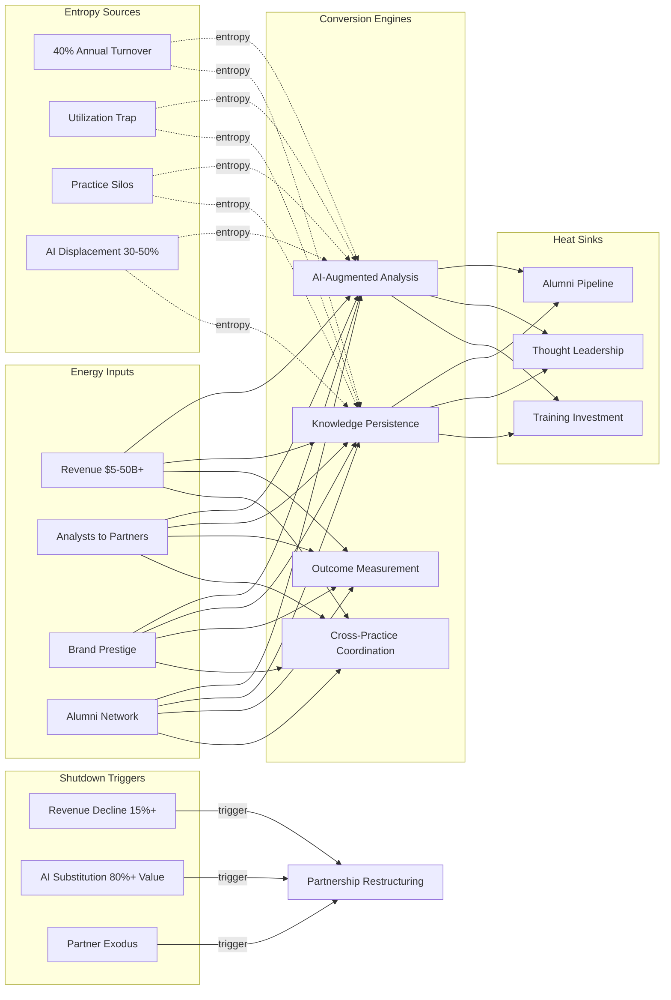

# Consulting Firms & System Integrators

The consulting industry is structurally incentivized to extend problems, not solve them. Billable hours reward duration, not outcomes. AI is about to automate 30-50% of the analytical work that justifies premium rates. Average consultant tenure of 2.5 years means client relationships and institutional knowledge walk out the door every 30 months. AINEFF treats consulting firms as knowledge coordination systems where the primary entropy vector is the structural misalignment between how value is billed and how value is delivered.

:::danger Structural Reality
McKinsey's advice to Purdue Pharma. Deloitte's audit of Wirecard. Accenture's Hertz website rebuild. The consulting industry's immunity to accountability for outcomes is not a feature — it is an entropy source. When advice has no consequences for the advisor, the quality of advice degrades toward the minimum acceptable to retain the engagement.
:::

---

## 1. Entropy Vector Map

| Vector | Manifestation | Severity |
|--------|--------------|----------|
| **Strategy** | Methodology-first approach: applying the same framework regardless of client context because the methodology is what the firm sells, not the solution. Strategic advice produced by 25-year-old analysts with 6 months of industry experience, validated by partners who haven't done analysis in 15 years. | **High** |
| **Operations** | Up-or-out model creating permanent capability gaps at senior associate/manager level. Knowledge management systems containing 10 million documents that no one searches. Utilization targets of 80%+ leaving no capacity for learning, innovation, or genuine thought. Proposal factories consuming 20-30% of senior partner time. | **High** |
| **Incentives** | Partners compensated on revenue generation, not client outcomes. Billable hour model incentivizes scope expansion, not scope completion. Junior staff incentivized to please managers, not to deliver truth to clients. Innovation budgets allocated but cannibalized by client work because billable hours take priority. | **Critical** |
| **Information** | Intellectual property walks out with every departing consultant. Client knowledge fragmented across personal laptops, email archives, and memory. Cross-practice intelligence sharing at 15-20% — the tax practice doesn't know what the strategy practice told the same client. Competitive intelligence based on partner relationships, not systematic analysis. | **Critical** |
| **Culture** | "Client service" culture masking deference to client comfort over client truth. Presentation culture valuing slide aesthetics over analytical rigor. Prestige hierarchy discouraging knowledge sharing between practices. Travel culture creating burnout that the industry markets as dedication. | **High** |
| **Capital** | Revenue per partner as the defining metric — driving behavior toward high-fee engagements regardless of strategic fit. Minimal capital investment in technology (consulting firms are among the lowest R&D spenders relative to revenue). Partnership model distributing profits rather than reinvesting for capability building. | **Medium** |
| **Governance** | Partnership governance requiring consensus among 200-2,000 partners for strategic decisions. Managing partner term limits creating 4-year strategic discontinuity. Practice silos operating as independent fiefdoms with nominal coordination. Risk management focused on engagement liability, not advisory quality. | **High** |

---

## 2. Early Entropy Signals

1. **AI utilization rate** among consultants below 30% — firm failing to adopt tools that clients are already using, creating credibility gap
2. **Client repeat engagement rate** declining below 60% — value proposition erosion making clients shop alternatives
3. **Senior associate attrition** exceeding 25% — the layer between analysis and decision-making is hollowing out
4. **Proposal win rate** declining below 30% — market signaling that the firm's positioning is weakening
5. **Revenue per partner growth** flattening while headcount grows — dilution of the partnership model's economic logic
6. **Client outcome measurement** remaining unmeasured — when you don't measure outcomes, you can't prove value
7. **AI-native competitor emergence** — when clients begin hiring AI-first firms for work previously given to traditional consultants, the disruption curve has begun

---

## 3. 3–5 Year Decay Model

| Dimension | Projection |
|-----------|-----------|
| **Financial cost of entropy** | $20-50B annually across major consulting firms in duplicated research, knowledge loss through attrition, underutilized IP, and proposal overhead. Revenue compression of 15-25% within 5 years as AI automates research, analysis, and reporting functions that currently justify 40-60% of engagement fees. |
| **Institutional trust erosion** | Post-scandal (McKinsey/opioids, KPMG/Carillion) trust in advisory independence declining 3-5% annually. Client willingness to pay premium rates for advice eroding as AI alternatives demonstrate comparable analytical capability at 1/10th the cost. |
| **Competitive vulnerability** | AI-native advisory firms (with 10-person teams delivering what previously required 50) entering market at 60-70% lower price points. In-house consulting teams growing as clients build internal capability. Freelance/fractional consulting platforms disaggregating the partnership model. |
| **Structural fragility** | Up-or-out model dependent on continuous growth — any revenue contraction triggers talent exodus. Partnership model requiring annual profit distribution prevents capital accumulation for transformation investment. Client concentration risk increasing as mid-market clients defect to AI alternatives. |

---

## 4. AINEFF Deployment Architecture

### Structural Constraints

- **ORF Kernel**: Every piece of client advice must have a named senior advisor (partner/director level) as accountability bearer. No hiding behind "the firm's view." If the advice fails, the advisor is identifiable and accountable
- **Outcome Binding**: AINEFF mandates measurable outcome targets for every engagement. Fees partially contingent on outcome achievement — ending pure time-and-materials billing
- **Knowledge Persistence**: All engagement insights captured in AINEFF knowledge layer. When a consultant departs, client knowledge remains institutional — not personal
- **Conflict Detection**: E-AEGL monitors for cross-client conflicts of interest in real-time — preventing the same firm from advising competitors on identical strategies

### Governance Hardening

- Practice coordination mandated through AINEFF — no more independent fiefdoms advising the same client differently
- Client relationship history visible to all engagement teams — ending the "who knows what about whom" information asymmetry
- Quality review automated through AINEFF analysis of deliverable substance, not just format compliance

### AI-Native Coordination

- AgentCoders squads handling research, data analysis, and initial report generation — freeing consultants for judgment and relationship work
- Real-time market intelligence replacing manual competitive analysis
- AI-assisted proposal generation reducing proposal overhead by 60-70%
- Cross-engagement pattern recognition identifying systemic issues across client base

### Incentive Alignment

- Partner compensation restructured: 40% base, 30% revenue, 30% client outcome metrics (3-year trailing)
- Junior staff advancement criteria including measurable client impact, not just utilization hours
- Knowledge contribution measured and rewarded — consultants who build reusable IP create more value than those who bill more hours

### Information Integrity

- Unified client knowledge base accessible across all practices serving the same client
- Engagement deliverables automatically indexed and searchable (not buried in file shares)
- Real-time engagement health monitoring — detecting scope creep, quality degradation, and client satisfaction decline before formal reviews

---

## 5. Accountability Design

| Role | Accountability |
|------|---------------|
| **Engagement Lead** | Named accountability for client outcome achievement. Not just "delivered on time and on budget" — accountable for the measurable impact of advice delivered. Compensation clawback if outcomes not achieved within agreed timeframe. |
| **Knowledge Steward** | Per-practice role accountable for knowledge capture, organization, and accessibility. When a departing consultant's knowledge is not captured, this role is liable for the institutional gap. |
| **Client Relationship Owner** | Accountable for cross-practice coordination on shared clients. When the strategy and technology practices give contradictory advice to the same client, this role is liable. |
| **Innovation Officer** | Accountable for AI adoption and capability evolution. When the firm falls behind AI-native competitors on delivery capability, this role triggers investment reallocation. |

---

## 6. Entropy-Reduction Metrics

| KPI | Current Baseline | Target (Year 1) | Target (Year 3) |
|-----|-----------------|-----------------|-----------------|
| **Capital Efficiency** | 60-65% of fees as personnel cost | 45% (AI-augmented delivery) | 35% |
| **Decision Latency** | 2-4 weeks for engagement staffing/approval | 3 days | Same day |
| **Knowledge Reuse** | 15-20% of deliverables leverage existing IP | 40% | 70% |
| **Client Outcome Achievement** | Unmeasured | 50% of engagements meeting outcome targets | 75% |
| **Information Retention** | 30% of knowledge lost per attrition event | 15% lost | 5% lost |
| **Incentive Coherence** | 0% comp tied to outcomes | 20% | 40% |
| **AI Utilization** | 15-20% of consultants using AI tools regularly | 60% | 90% |

---

## 7. Thermodynamic System Model

### Energy Inputs
- **Capital**: Revenue ($5-50B+ for major firms), partner capital contributions, client advance payments
- **Talent**: Analysts, consultants, managers, partners — the primary asset and primary cost
- **Legitimacy**: Brand prestige, alumni network, thought leadership publication record
- **Information**: Client engagement data, industry expertise, research databases, relationship intelligence
- **Political Trust**: Client willingness to share sensitive information for advisory purposes
- **Network Power**: Alumni in executive positions across industries, cross-industry pattern recognition capability

### Entropy Sources
- **Attrition Knowledge Loss**: Average 2.5-year tenure means 40% of the workforce turns over annually — each departure takes client context, methodology refinements, and relationship understanding
- **Billable Hour Distortion**: Utilization targets consuming all capacity for innovation, learning, and genuine thinking
- **Methodology Ossification**: Frameworks that were innovative when created becoming rigid templates applied without judgment
- **Practice Silos**: Strategy, technology, operations, tax practices operating as independent businesses sharing a brand but not sharing intelligence
- **AI Displacement Pressure**: 30-50% of analytical work automatable, threatening the talent pyramid's economic foundation
- **Accountability Vacuum**: No systematic measurement of advisory outcome quality across the industry

### Conversion Engines
- **AI-Augmented Analysis**: AgentCoders and AI tools converting research tasks from weeks to hours
- **Knowledge Systems**: AINEFF persistence layer converting individual expertise into institutional capability
- **Outcome Measurement**: Converting unmeasured advisory quality into tracked, improvable metrics
- **Cross-Practice Coordination**: AINEFF enabling holistic client service rather than siloed engagements

### Heat Sinks
- **Alumni Network**: Former consultants in executive positions creating enduring business development pipeline
- **Thought Leadership**: Published research maintaining brand relevance even during engagement downturns
- **Training Investment**: 100+ hours per consultant per year maintaining baseline capability
- **Diversified Client Base**: Portfolio across industries and geographies buffering sector-specific downturns

### Shutdown Triggers
- **Revenue Decline**: 15%+ year-over-year revenue decline triggers partner capital call or merger discussion
- **Talent Exodus**: Top 20% performer attrition exceeding 25% triggers capability collapse in 6-12 months
- **Client Outcome Scandal**: Major advisory failure with public consequences triggers reputational crisis
- **AI Substitution Threshold**: When clients demonstrate that AI tools deliver 80%+ of engagement value at 10% of cost, the traditional model collapses
- **Partnership Dissolution Cascade**: When senior partners begin departing with client relationships, the partnership model enters terminal decline

---

## 8. Adversarial Red-Team Critique

**How AINEFF fails for consulting firms:**

1. **Partnership Resistance**: AINEFF's outcome binding and accountability structures directly threaten the partnership model's core appeal — autonomy. Partners who earn $2-10M annually by controlling client relationships will not voluntarily accept a framework that makes their performance measurable and their relationships institutional.

2. **AINEFF as Competitor**: Frankmax/AINEFF's advisory capability is itself a consulting service. Deploying AINEFF inside a consulting firm means deploying a competitor's infrastructure. No consulting firm CEO will adopt a platform built by a company that competes for their clients — unless AINEFF makes a credible structural separation between platform and advisory.

3. **Billable Hour Withdrawal**: Transitioning from time-and-materials to outcome-based billing reduces revenue by 30-50% in the short term (because current billing captures value that outcomes-based models do not). The partnership model cannot absorb a multi-year revenue transition without partner capital calls that trigger departures.

4. **AI Capability Gap**: AINEFF assumes consulting firms can adopt AI at institutional scale. Most firms have invested minimally in technology infrastructure. The deployment cost and organizational change required to implement AINEFF may exceed the firm's annual technology budget.

5. **Knowledge Capture Resistance**: Consultants view their personal knowledge and client relationships as their primary career asset. AINEFF's knowledge persistence layer asks them to make that asset institutional. Without restructured incentives that reward knowledge sharing over knowledge hoarding, adoption will be superficial.

:::danger Critical Question
Can AINEFF align the interests of individual partners (who benefit from opacity, autonomy, and personal client control) with institutional interests (transparency, coordination, and knowledge persistence)? If the incentive redesign does not make individual partners materially better off under AINEFF, they will resist it until the firm is disrupted by someone who adopted it.
:::
