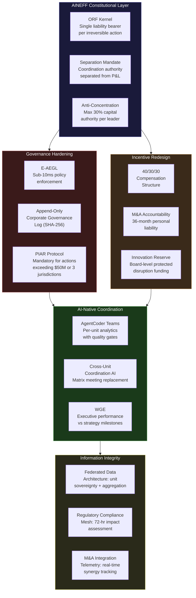
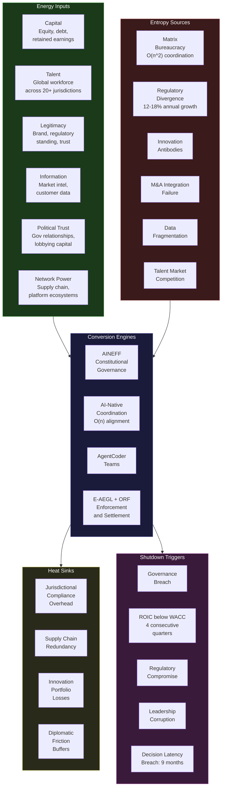

---

sidebar_position: 9
title: "Multinational Corporate Empires"
description: "Sovereign deployment architecture for multinational corporations — modeling organizational entropy across matrix structures, regulatory divergence, innovation antibodies, and competitive disruption using AINEFF as constitutional infrastructure for corporate survival."
tags: [sovereign, corporate, multinational, entropy]
custom_status: active
custom_owner: Andrew Leo
custom_last_review: 2026-03-01
custom_next_review: 2026-06-01

---

# Multinational Corporate Empires — Sovereign Deployment Architecture

Multinational corporations with 50,000+ employees, operations spanning 20+ jurisdictions, and revenue exceeding $10B operate at a scale where entropy is not a risk — it is a certainty. The average Fortune 500 company survives 21 years on the index, down from 61 years in 1958. The primary cause of death is not competitive disruption from the outside. It is governance entropy from the inside: matrix organizations that produce decision paralysis, regulatory compliance cost that scales faster than revenue, innovation antibodies that kill internal disruption, and M&A integrations that destroy more value than they create.

AINEFF treats the multinational corporation as a **federated sovereign entity** — one that must maintain constitutional coherence across jurisdictions, business units, and functional domains while metabolizing entropy at a rate sufficient to outpace organizational decay.

---

## 1. Entropy Vector Map

| Vector | Manifestation | Concrete Example | Severity |
|---|---|---|---|
| **Strategy** | Strategy-execution gap widens with organizational size. Board approves a strategy that requires 18-month execution cycles, but middle management's annual bonus cycles incentivize 90-day optimization. | Global pharmaceutical company approves $2B R&D pivot to AI-driven drug discovery. Regional P&L owners redirect budgets to near-term line extensions because AI R&D depresses their 12-month numbers. Three years later, the company has spent $800M with no coherent AI capability. | Critical |
| **Operations** | Matrix structure creates accountability diffusion. Every decision requires alignment across geography, function, and business unit — producing "shadow governance" where real decisions happen in hallways, not boardrooms. | Consumer goods company needs 14 approvals across 3 regions and 4 functions to launch a product variant. Time-to-market: 11 months. Competitor with flat structure launches in 6 weeks. | Critical |
| **Incentives** | Regional P&L accountability creates internal competition that destroys cross-unit value. Business units hoard data, talent, and customer relationships because sharing reduces their individual metrics. | Two business units of a technology conglomerate independently build competing CRM platforms because neither unit's P&L benefits from a shared investment. Total spend: $180M. Neither platform achieves feature parity with Salesforce. | High |
| **Information** | Data silos across ERP systems, regions, and business units. No single executive has a real-time view of the company's actual financial position, customer concentration, or risk exposure. | Global bank discovers during stress testing that its actual exposure to a single counterparty is 3.2x the reported figure because three regional systems tracked the relationship independently. | Critical |
| **Culture** | Innovation antibodies: middle management systematically kills initiatives that threaten existing business models, compensation structures, or power hierarchies. | Internal disruption team at an automotive company develops a viable EV platform 4 years ahead of Tesla. Product committee — staffed by ICE division executives — blocks funding three times. Company eventually buys a startup to acquire the same capability at 10x the cost. | Critical |
| **Capital** | M&A value destruction. 70-90% of acquisitions fail to achieve projected synergies. Integration costs are underestimated by 40-60%. Cultural integration is not modeled at all. | Media conglomerate acquires streaming platform for $15B. Integration destroys the startup's engineering culture. Key talent departs within 18 months. Platform loses market share from #3 to #7 in 24 months. Write-down: $9B. | High |
| **Governance** | Board oversight limited to quarterly presentations that are optimized for narrative management rather than truth. Audit committees lack technical competence to evaluate AI, cyber, and platform risks. | Board approves cloud migration strategy based on management presentation showing 30% cost savings. Actual implementation costs 2.3x projection. No board member had the technical competence to challenge the estimate. | High |

---

## 2. Early Entropy Signals

:::warning[Leading Indicators of Corporate Entropy Acceleration]
These signals are observable in operational data 12-24 months before they manifest as financial underperformance or strategic failure.
:::

1. **Decision-to-execution latency ratio** — Measure the elapsed time between strategic decision approval and first capital deployment. When this exceeds 6 months for decisions classified as "urgent," organizational entropy has exceeded productive friction. Track at the business unit level quarterly.
2. **Internal-to-external hiring ratio for senior roles** — When more than 60% of VP+ hires are external, institutional knowledge is being lost faster than it is created. Internal talent pipeline has collapsed.
3. **Shadow IT spend as percentage of total IT budget** — Business units spending more than 25% of IT budget outside central IT governance indicates that the official technology architecture has failed to serve operational needs. This is an information entropy accelerant.
4. **Cross-unit data request fulfillment time** — When a business unit requesting data from another business unit waits more than 15 business days for fulfillment, information silos have hardened into information walls.
5. **M&A integration milestone completion rate** — If fewer than 50% of planned integration milestones are achieved within 12 months of close, the acquisition is on a value-destruction trajectory. Measure against pre-close integration plan.
6. **Regulatory fine frequency and magnitude trend** — Year-over-year increase in regulatory fines across any jurisdiction signals compliance infrastructure decay. Track both count and total dollar amount.
7. **Employee engagement score delta between headquarters and field** — When HQ engagement scores exceed field scores by more than 15 points, the company is governing itself for the center's convenience, not the periphery's effectiveness.

---

## 3. 3-5 Year Decay Model

:::danger[Quantified Decay Trajectory for Multinationals Without Structural Intervention]
Based on observed entropy rates in Fortune 500 companies with 50,000+ employees operating across 20+ jurisdictions.
:::

### Financial Cost of Entropy

- **Matrix decision tax:** 15-25% of management time spent on internal alignment rather than value creation. For a company with $2B in total management compensation, this represents $300M-$500M annually in coordination waste.
- **Regulatory compliance cost escalation:** Growing at 12-18% annually across G20 jurisdictions versus revenue growth of 3-7%. Within 5 years, compliance cost consumes an additional 2-4% of revenue.
- **M&A value destruction:** Average large-cap acquisition destroys 20-40% of acquisition premium within 3 years. For a company making 2-3 acquisitions annually at $1B+ each, cumulative destruction reaches $1B-$3B over 5 years.
- **Technology platform redundancy:** Average multinational operates 3-7 redundant platforms per business function across regions. Consolidation cost: $200M-$800M. Annual waste from redundancy: $50M-$200M.

### Institutional Trust Erosion

- **Regulator trust:** Each regulatory failure increases scrutiny intensity by an estimated 30-50% for that jurisdiction for 3-5 years. Compounding across 20+ jurisdictions creates a permanent overhead.
- **Employee trust:** Each failed transformation initiative reduces employee engagement in subsequent initiatives by 15-20%. After 3 failed initiatives, engagement with change programs drops below 30%.
- **Investor trust:** ESG and governance score deterioration drives passive fund exclusion. A 10-point governance score decline can trigger $500M-$2B in passive outflows over 12 months.

### Competitive Vulnerability

- **Digital-native competitor advantage:** Companies born after 2010 operate with 30-50% lower coordination costs per employee. This structural advantage compounds annually.
- **AI adoption gap:** Companies that fail to achieve AI integration across core operations by 2028 will face 15-25% cost disadvantages versus AI-native competitors within 3 years.
- **Talent market loss:** Top-quartile engineering and AI talent increasingly rejects large corporate environments. Offer acceptance rates for senior technical talent at Fortune 500 companies have declined from 65% to 38% since 2020.

### Political and Security Fragility

- **Geopolitical exposure:** Operations spanning adversarial jurisdictions (US/EU vs. China/Russia) face increasing pressure to choose sides, potentially losing 10-30% of global revenue.
- **Cyber risk accumulation:** Attack surface grows with organizational complexity. Average large multinational faces 3-5 material cyber incidents annually, with average cost of $15M-$45M per incident.

---

## 4. AINEFF Deployment Architecture

### Structural Constraints Imposed by AINEFF

- **ORF kernel enforcement:** Every irreversible decision — M&A closing, market exit, platform decommission, regulatory commitment — requires a single identifiable human liability bearer bound at execution time. Matrix accountability is constitutionally prohibited for irreversible actions.
- **Anti-concentration clause:** No single business unit, regional head, or functional leader may accumulate decision authority over more than 30% of corporate capital allocation without triggering mandatory board-level review.
- **Mandatory separation of coordination and execution authority:** The entity that coordinates cross-unit activity (analogous to AINEG) cannot also hold P&L authority. Strategy coordination and revenue generation are structurally separated.

### Governance Hardening Mechanisms

- **E-AEGL policy enforcement** across all financial systems: sub-10ms validation of authorization rules before any capital commitment, vendor contract, or regulatory filing executes. SHA-256 hash-chained audit trails for every material decision.
- **Append-only corporate governance log:** Every board decision, executive authorization, regulatory commitment, and M&A milestone recorded in a tamper-evident log. Replaces PowerPoint-based board reporting with evidence-based governance.
- **Mandatory PIAR** before any irreversible action exceeding $50M or affecting more than 3 jurisdictions simultaneously.

### AI-Native Coordination Layers

- **AgentCoder teams** deployed per business unit for operational analytics, regulatory compliance monitoring, and cross-unit data integration. Each team operates with quality gates — no AI-generated analysis reaches executives without Reviewer and Tester validation.
- **WGE** manages executive performance tracking against strategy execution milestones, not just financial targets. Compensation alignment verification runs quarterly.
- **Cross-unit coordination AI:** Replaces the matrix meeting structure with an AI-mediated coordination layer that identifies conflicts, proposes resolutions, and tracks execution — reducing alignment overhead by 40-60%.

### Incentive Alignment Redesign

- **Executive compensation restructured:** 40% tied to unit P&L, 30% tied to cross-unit value creation metrics, 30% tied to 3-year strategic milestones. Eliminates the incentive to hoard resources.
- **M&A accountability:** Acquiring executive personally liable for integration milestones for 36 months post-close. Compensation clawback triggered by synergy shortfall exceeding 30%.
- **Innovation protection:** Internal disruption initiatives funded from a board-level innovation reserve that is constitutionally protected from business unit P&L optimization.

### Information Integrity Systems

- **Federated data architecture:** Each business unit maintains operational data sovereignty, but a canonical data layer provides real-time aggregation for cross-unit analytics and risk monitoring.
- **Regulatory compliance mesh:** AI-monitored regulatory change tracking across all operating jurisdictions. Automated impact assessment within 72 hours of any regulatory change.
- **M&A integration telemetry:** Real-time tracking of integration milestones, talent retention, customer impact, and synergy capture against pre-close projections.

---

## 5. Accountability Design

### Single-Point Accountability Roles

| Role | Accountability | Authority Ceiling |
|---|---|---|
| **Chief Governance Officer** | Constitutional compliance of all corporate decisions. Owns the governance log. Reports to board, not CEO. | Cannot authorize investments or operational decisions. Governance integrity only. |
| **Business Unit Sovereign** | Full P&L accountability for their unit. Personally liable for regulatory compliance within their jurisdictions. | Cannot override cross-unit coordination decisions. Cannot block board-mandated strategic initiatives. |
| **Chief Integration Officer** | M&A integration execution and synergy capture. Personally liable for 36-month integration outcomes. | Cannot modify deal terms post-close. Cannot override business unit operational decisions outside integration scope. |
| **Cross-Unit Coordination Director** | Efficiency and effectiveness of cross-unit resource allocation. Zero P&L authority — pure coordination. | Cannot allocate capital. Cannot hire or terminate. Can only recommend and track. |
| **Regulatory Compliance Sovereign** | Per-jurisdiction regulatory standing. Personally named in regulatory filings. | Cannot override business decisions but holds constitutional veto over actions that violate regulatory commitments. |

### Decision Rights Clarity

- **Operational decisions within a single unit:** Business Unit Sovereign authority, logged.
- **Cross-unit resource allocation:** Cross-Unit Coordination Director recommends, affected BU Sovereigns ratify, CGO validates governance compliance.
- **M&A execution:** Chief Integration Officer accountable, CEO ratifies, board approves, PIAR mandatory.
- **Market entry/exit (new jurisdiction):** BU Sovereign recommends, Regulatory Compliance Sovereign validates, CEO ratifies, board informed, PIAR mandatory.
- **Platform/technology decisions affecting 3+ units:** CTO recommends, affected BU Sovereigns ratify, CGO validates, board informed if expenditure \> $100M.

### Escalation Protocols

1. **Operational conflict between units** — Cross-Unit Coordination Director mediates. Resolution within 14 days or escalates.
2. **Strategy-execution misalignment** — CGO flags to CEO with evidence from governance log. CEO resolves within 30 days.
3. **Regulatory compliance conflict** — Regulatory Compliance Sovereign holds constitutional veto. Override requires board supermajority (75%).
4. **Governance breach** — CGO triggers immediate investigation. Affected executive suspended from irreversible decisions pending resolution.

### Ratification Layers

- **Tier 1 (Unit-level, \< $10M):** BU Sovereign executes, E-AEGL validates, logged.
- **Tier 2 (Cross-unit or $10M-$100M):** BU Sovereign + CGO ratification + PIAR.
- **Tier 3 (Corporate-level or \> $100M):** CEO + board approval + PIAR + independent validation.
- **Tier 4 (Irreversible structural: M&A, market exit, platform decommission):** Full board + PIAR + 30-day cooling period + external advisory validation.

---

## 6. Entropy-Reduction Metrics

| Metric | Current State (Typical F500) | AINEFF Target | Measurement Method |
|---|---|---|---|
| **Capital efficiency** (ROIC vs WACC spread) | 1-3% spread | 5-8% spread | Quarterly ROIC calculation per business unit and consolidated |
| **Decision latency** (strategic decision to first capital deployment) | 4-9 months | 3-6 weeks | Timestamp tracking from board approval to first expenditure |
| **Complexity-to-value ratio** (legal entities per $1B revenue) | 25-60 entities | 8-15 entities | Annual entity census vs revenue |
| **Information distortion reduction** (executive reporting accuracy) | 60-75% of board-reported metrics match audited actuals | \> 95% match rate | Quarterly variance analysis: board deck vs audited figures |
| **Incentive coherence** (executive comp alignment with 3-year strategy) | 25-40% of comp tied to strategic milestones | \> 60% tied to strategic milestones | Annual compensation audit against strategic plan |
| **Cross-unit coordination cost** (management hours on internal alignment) | 20-30% of management time | \< 10% of management time | Time allocation study, validated by calendar analysis |
| **M&A synergy capture rate** | 30-50% of projected synergies realized | \> 75% of projected synergies realized | 36-month post-close synergy tracking vs pre-close model |
| **Regulatory incident frequency** | 8-15 material incidents per year across all jurisdictions | \< 3 per year | Annual regulatory incident log |

---

## 7. Thermodynamic System Model

### Energy Inputs

- **Capital:** Shareholder equity, debt capacity, retained earnings, capital markets access
- **Talent:** Engineering, management, domain expertise across 20+ jurisdictions
- **Legitimacy:** Brand equity, regulatory standing, customer trust, institutional investor confidence
- **Information:** Market intelligence, customer data, operational telemetry, competitive intelligence
- **Political trust:** Government relationships, regulatory goodwill, lobbying capital
- **Network power:** Supply chain relationships, platform ecosystems, standards body influence

### Entropy Sources

- **Matrix bureaucracy:** Coordination cost that scales as O(n^2) with organizational complexity
- **Regulatory divergence:** Compliance requirements increasing in volume, scope, and contradiction across jurisdictions
- **Innovation antibodies:** Middle management systematically killing initiatives that threaten existing power structures
- **M&A integration failure:** Acquisitions that destroy more value than they create while consuming management attention
- **Data fragmentation:** Information trapped in business unit silos, preventing enterprise-wide optimization
- **Talent market competition:** Best talent increasingly choosing smaller, faster organizations

### Conversion Engines

- **AINEFF governance framework:** Converts matrix ambiguity into constitutional clarity with single-point accountability
- **AI-native coordination layer:** Converts O(n^2) meeting coordination into O(n) automated alignment
- **AgentCoder teams:** Convert fragmented data into consolidated decision-grade intelligence
- **E-AEGL enforcement:** Converts governance policies into automatically enforced constraints
- **ORF protocol:** Converts complex inter-unit and cross-border obligations into auditable settlement flows
- **WGE performance tracking:** Converts narrative-based executive evaluation into evidence-based accountability

### Heat Sinks (Acceptable Inefficiency Zones)

- **Jurisdictional compliance overhead:** Some duplication of effort across jurisdictions is unavoidable and serves as a regulatory risk buffer
- **Strategic redundancy in supply chains:** Maintaining 2-3 suppliers per critical input even when consolidation would be cheaper
- **Innovation portfolio losses:** Expecting 60-70% failure rate in innovation portfolio. The failures fund organizational learning.
- **Diplomatic friction buffers:** Maintaining some process overhead for cross-unit decisions to preserve organizational cohesion
- **Government relationship investment:** Lobbying and regulatory engagement that produces no immediate ROI but maintains political optionality

### Shutdown Triggers

- **Governance breach:** Any executive executing an irreversible action without proper authorization triggers immediate suspension and investigation
- **Financial instability:** ROIC falling below WACC for 4 consecutive quarters triggers mandatory strategic review
- **Regulatory compromise:** Material regulatory violation in any jurisdiction triggers jurisdiction-wide operational review
- **Leadership corruption:** Evidence of personal financial interest influencing corporate decisions triggers immediate removal and forensic audit
- **Decision latency breach:** Strategic decisions pending \> 9 months triggers mandatory escalation to board with external advisory

---

## 8. Adversarial Red-Team Critique

:::danger[How AINEFF Could Fail for Multinational Corporations]
The following attack vectors represent structural weaknesses in deploying AINEFF within large, complex corporate environments.
:::

### Attack Vector 1: Middle Management Immune Response

**Threat:** AINEFF's single-point accountability model directly threatens the matrix structure that middle management relies on for career protection. In matrix organizations, diffuse accountability is a feature, not a bug — it protects individuals from blame. AINEFF removes this protection, triggering coordinated resistance from the organizational layer that controls implementation.

**Mitigation gap:** AINEFF can mandate accountability structures from above, but it cannot force genuine adoption by the organizational layer responsible for execution. Middle management controls the daily reality of how work gets done, and can sustain indefinite passive resistance against any governance framework.

### Attack Vector 2: Regulatory Weaponization

**Threat:** In jurisdictions where regulatory relationships are adversarial (vs. cooperative), AINEFF's tamper-evident governance logs become a liability. Every decision is documented, every accountability chain is explicit. Regulators conducting enforcement actions can use AINEFF's own governance infrastructure to build cases against the company.

**Mitigation gap:** AINEFF's design assumes that transparency is always net positive. In adversarial regulatory environments, radical transparency can increase regulatory risk. The framework lacks jurisdiction-specific calibration of governance visibility.

### Attack Vector 3: Competitive Speed Disadvantage

**Threat:** AINEFF's PIAR requirements, cooling periods, and multi-layer ratification slow decision-making. In industries where competitive advantage depends on speed (technology, media, consumer), the governance overhead may cause the company to systematically lose to faster competitors who accept higher governance risk in exchange for velocity.

**Mitigation gap:** AINEFF's governance intensity is calibrated for irreversibility, but the framework does not dynamically adjust governance overhead based on competitive clock speed. A pharmaceutical company and a social media company face different competitive tempo requirements, but AINEFF applies similar governance weight.

### Attack Vector 4: CEO Capture

**Threat:** A charismatic CEO positions AINEFF as their personal governance framework — the system enforces their vision rather than constitutional principles. The CGO reports to the CEO in practice (even if structurally independent), and the governance log becomes a tool for narrative management rather than truth.

**Mitigation gap:** AINEFF assumes the constitutional layer is genuinely independent of executive authority. In corporate environments where the CEO controls board composition, compensation, and promotions, true independence is difficult to achieve.

### Attack Vector 5: Integration Complexity Exceeds Framework Capacity

**Threat:** A multinational with 200+ legal entities, 30+ ERP systems, and 50+ jurisdictions may find that AINEFF's deployment complexity exceeds the organization's implementation capacity. The framework becomes a multi-year transformation program that itself becomes a source of entropy.

**Mitigation gap:** AINEFF does not specify a deployment model for organizations whose existing complexity exceeds the framework's implementation bandwidth. There is no "AINEFF-lite" or incremental deployment model for organizations that cannot absorb the full framework simultaneously.

### Attack Vector 6: Shareholder Short-Termism Override

**Threat:** Activist shareholders or short-term institutional investors pressure the board to dismantle AINEFF governance structures because the framework's cooling periods, accountability requirements, and innovation protection mechanisms reduce near-term EPS. The board caves to shareholder pressure because their own tenure depends on share price.

**Mitigation gap:** AINEFF's constitutional protections are only as strong as the board's willingness to defend them. In public markets where board members face annual election by shareholders motivated by quarterly returns, constitutional governance can be overridden by economic pressure.

---

## Related Documents

- [AINEFF Constitutional Law Layer](/docs/entities/aineff) — The constitutional framework underlying all corporate deployments
- [AINEG Federation Layer](/docs/entities/aineg) — The federation model for coordinating across business units
- [ORF Protocol](/docs/entities/orf-protocol) — Cross-border obligation settlement for multinational operations
